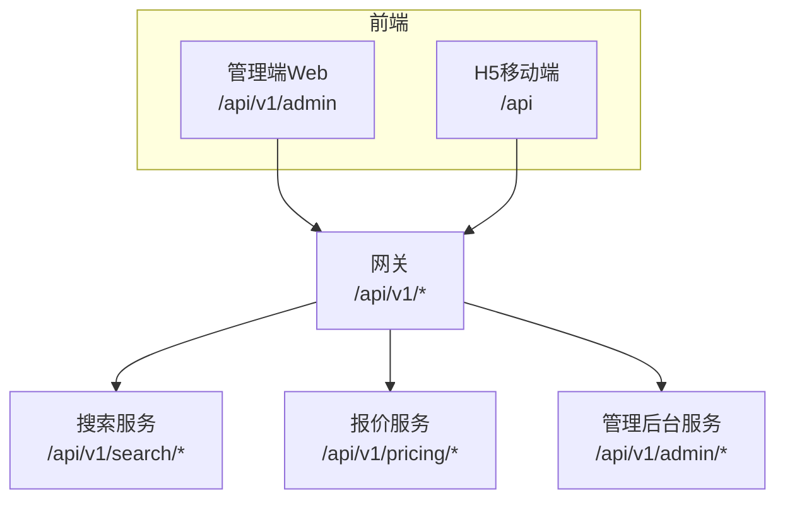
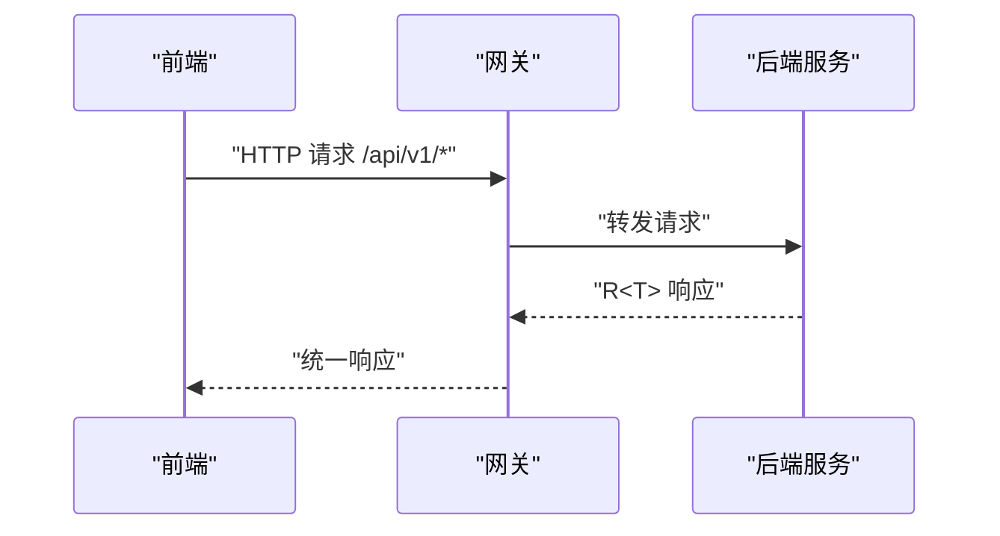
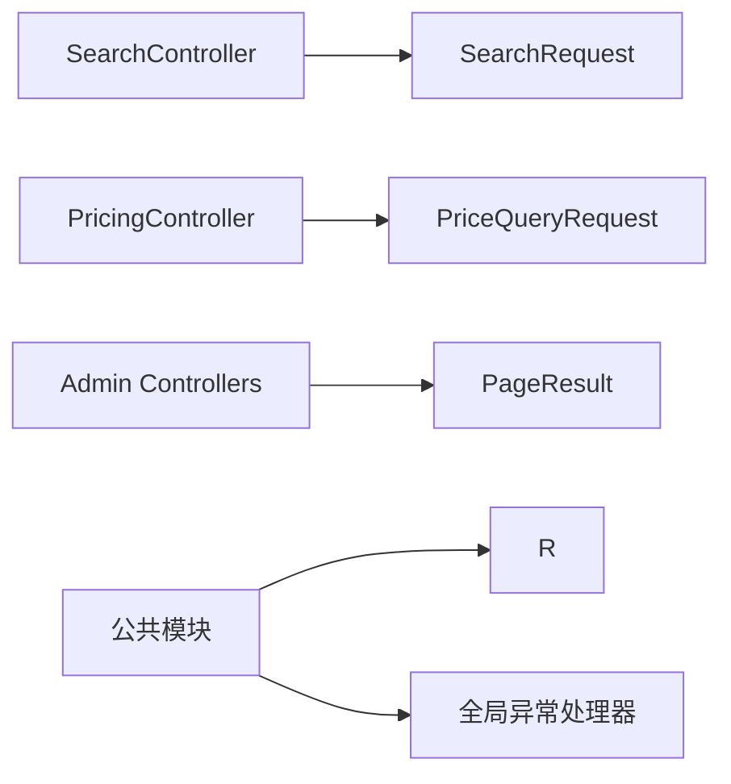

# API接口文档

<cite>
**本文引用的文件**
- [R.java](file://hotel-seller-backend/hotel-common/src/main/java/com/ceair/hotel/common/dto/R.java)
- [PageResult.java](file://hotel-seller-backend/hotel-common/src/main/java/com/ceair/hotel/common/dto/PageResult.java)
- [PageRequest.java](file://hotel-seller-backend/hotel-common/src/main/java/com/ceair/hotel/common/dto/PageRequest.java)
- [BizException.java](file://hotel-seller-backend/hotel-common/src/main/java/com/ceair/hotel/common/exception/BizException.java)
- [GlobalExceptionHandler.java](file://hotel-seller-backend/hotel-common/src/main/java/com/ceair/hotel/common/exception/GlobalExceptionHandler.java)
- [SupplierController.java](file://hotel-seller-backend/hotel-admin-service/src/main/java/com/ceair/hotel/admin/controller/SupplierController.java)
- [PriceStrategyController.java](file://hotel-seller-backend/hotel-admin-service/src/main/java/com/ceair/hotel/admin/controller/PriceStrategyController.java)
- [RecommendedHotelController.java](file://hotel-seller-backend/hotel-admin-service/src/main/java/com/ceair/hotel/admin/controller/RecommendedHotelController.java)
- [StatisticsController.java](file://hotel-seller-backend/hotel-admin-service/src/main/java/com/ceair/hotel/admin/controller/StatisticsController.java)
- [OperationLogController.java](file://hotel-seller-backend/hotel-admin-service/src/main/java/com/ceair/hotel/admin/controller/OperationLogController.java)
- [CacheStrategyController.java](file://hotel-seller-backend/hotel-admin-service/src/main/java/com/ceair/hotel/admin/controller/CacheStrategyController.java)
- [SearchController.java](file://hotel-seller-backend/hotel-search-service/src/main/java/com/ceair/hotel/search/controller/SearchController.java)
- [SearchRequest.java](file://hotel-seller-backend/hotel-search-service/src/main/java/com/ceair/hotel/search/dto/SearchRequest.java)
- [PricingController.java](file://hotel-seller-backend/hotel-pricing-service/src/main/java/com/ceair/hotel/pricing/controller/PricingController.java)
- [application.yml（网关）](file://hotel-seller-backend/hotel-gateway/src/main/resources/application.yml)
- [request.js（管理端前端）](file://hotel-admin-web/src/utils/request.js)
- [index.js（管理端API封装）](file://hotel-admin-web/src/api/index.js)
- [request.js（H5前端）](file://hotel-seller-h5/src/utils/request.js)
</cite>

## 目录
1. [简介](#简介)
2. [项目结构](#项目结构)
3. [核心组件](#核心组件)
4. [架构总览](#架构总览)
5. [详细组件分析](#详细组件分析)
6. [依赖分析](#依赖分析)
7. [性能与限流](#性能与限流)
8. [故障排查指南](#故障排查指南)
9. [结论](#结论)
10. [附录](#附录)

## 简介
本文件为酒店销售系统的完整API接口文档，覆盖供应商管理、酒店搜索、价格计算、管理后台等模块的RESTful接口。文档统一采用R<T>响应格式，定义了标准的请求头、参数校验规则、错误码与异常处理机制，并提供请求与响应示例路径，帮助前端与第三方集成快速对接。

## 项目结构
系统采用前后端分离与微服务架构：
- 网关层：统一入口，路由到各后端服务
- 后端服务：
  - 搜索服务：提供酒店搜索与建议
  - 报价服务：提供房型报价
  - 管理后台服务：供应商、价格策略、推荐酒店、缓存策略、操作日志、统计等
- 前端：
  - 管理端Web：基于Vue3 + Element Plus
  - H5移动端：基于Vant + Vite

图表来源
- [application.yml（网关）:17-48](file://hotel-seller-backend/hotel-gateway/src/main/resources/application.yml#L17-L48)

章节来源
- [application.yml（网关）:1-54](file://hotel-seller-backend/hotel-gateway/src/main/resources/application.yml#L1-L54)

## 核心组件
- 统一响应R<T>：所有接口返回统一结构，包含状态码、消息与数据体
- 分页模型：PageResult<T>用于分页查询结果
- 异常处理：全局异常处理器将业务异常与参数校验异常转换为统一响应
- 参数校验：使用注解约束请求参数合法性

章节来源
- [R.java:10-47](file://hotel-seller-backend/hotel-common/src/main/java/com/ceair/hotel/common/dto/R.java#L10-L47)
- [PageResult.java:10-25](file://hotel-seller-backend/hotel-common/src/main/java/com/ceair/hotel/common/dto/PageResult.java#L10-L25)
- [PageRequest.java:10-17](file://hotel-seller-backend/hotel-common/src/main/java/com/ceair/hotel/common/dto/PageRequest.java#L10-L17)
- [GlobalExceptionHandler.java:15-39](file://hotel-seller-backend/hotel-common/src/main/java/com/ceair/hotel/common/exception/GlobalExceptionHandler.java#L15-L39)

## 架构总览
- 版本管理：所有接口以/api/v1前缀进行版本化
- 认证授权：H5端通过Authorization头携带令牌；管理端Web默认未注入令牌，可按需扩展
- 请求头约定：
  - Content-Type: application/json
  - H5端自动附加：X-Channel、X-Session-Id
  - H5端可选：Authorization: Bearer <token>
- CORS：网关已配置跨域允许

图表来源
- [application.yml（网关）:17-48](file://hotel-seller-backend/hotel-gateway/src/main/resources/application.yml#L17-L48)
- [request.js（H5前端）:10-16](file://hotel-seller-h5/src/utils/request.js#L10-L16)
- [request.js（管理端前端）:4-7](file://hotel-admin-web/src/utils/request.js#L4-L7)

章节来源
- [request.js（H5前端）:1-47](file://hotel-seller-h5/src/utils/request.js#L1-L47)
- [request.js（管理端前端）:1-35](file://hotel-admin-web/src/utils/request.js#L1-L35)

## 详细组件分析

### 统一响应与错误码规范
- 响应结构
  - code: 状态码，200表示成功，其他为错误
  - message: 描述信息
  - data: 返回数据或空
- 错误码
  - 200：成功
  - 400：参数校验失败
  - 500：业务异常/系统异常
- 异常处理
  - 业务异常BizException：抛出后由全局异常处理器转为R.fail(code, message)
  - 参数校验异常：MethodArgumentNotValidException/BindException转为R.fail(400, message)
  - 其他异常：R.fail("系统异常，请稍后重试")

章节来源
- [R.java:10-47](file://hotel-seller-backend/hotel-common/src/main/java/com/ceair/hotel/common/dto/R.java#L10-L47)
- [BizException.java:9-22](file://hotel-seller-backend/hotel-common/src/main/java/com/ceair/hotel/common/exception/BizException.java#L9-L22)
- [GlobalExceptionHandler.java:17-39](file://hotel-seller-backend/hotel-common/src/main/java/com/ceair/hotel/common/exception/GlobalExceptionHandler.java#L17-L39)

### 供应商管理API
- 列表查询
  - 方法与路径：GET /api/v1/admin/suppliers
  - 查询参数：keyword（字符串，可选）、status（整数，可选）、pageNo（整数，默认1）、pageSize（整数，默认10）
  - 返回：R<PageResult<Supplier>>
- 详情查询
  - 方法与路径：GET /api/v1/admin/suppliers/{id}
  - 路径参数：id（长整型）
  - 返回：R<SupplierDetailVO>
- 新增供应商
  - 方法与路径：POST /api/v1/admin/suppliers
  - 请求体：SupplierSaveCmd（包含supplier、schedules、contact）
  - 返回：R<Long>（新增ID）
- 编辑供应商
  - 方法与路径：PUT /api/v1/admin/suppliers/{id}
  - 路径参数：id（长整型）
  - 请求体：SupplierSaveCmd
  - 返回：R<Void>
- 上下班线
  - 方法与路径：PUT /api/v1/admin/suppliers/{id}/status
  - 请求体：StatusCmd（status、operator）
  - 返回：R<Void>
- 工作时间查询
  - 方法与路径：GET /api/v1/admin/suppliers/{id}/schedules
  - 返回：R<List<SupplierWorkSchedule>>
- 联系人查询
  - 方法与路径：GET /api/v1/admin/suppliers/{id}/contact
  - 返回：R<SupplierContact>

章节来源
- [SupplierController.java:26-81](file://hotel-seller-backend/hotel-admin-service/src/main/java/com/ceair/hotel/admin/controller/SupplierController.java#L26-L81)

### 价格策略管理API
- 查询全局策略
  - 方法与路径：GET /api/v1/admin/suppliers/{supplierId}/global-strategy
  - 返回：R<PriceStrategyGlobal>
- 设置全局策略
  - 方法与路径：PUT /api/v1/admin/suppliers/{supplierId}/global-strategy
  - 请求体：PriceStrategyGlobal
  - 返回：R<Void>
- 查询特殊策略列表
  - 方法与路径：GET /api/v1/admin/suppliers/{supplierId}/price-strategies
  - 返回：R<List<PriceStrategySpecial>>
- 添加特殊策略
  - 方法与路径：POST /api/v1/admin/suppliers/{supplierId}/price-strategies
  - 请求体：PriceStrategySpecial
  - 返回：R<Long>
- 编辑特殊策略
  - 方法与路径：PUT /api/v1/admin/price-strategies/{strategyId}
  - 请求体：PriceStrategySpecial
  - 返回：R<Void>
- 删除特殊策略
  - 方法与路径：DELETE /api/v1/admin/price-strategies/{strategyId}
  - 返回：R<Void>

章节来源
- [PriceStrategyController.java:25-66](file://hotel-seller-backend/hotel-admin-service/src/main/java/com/ceair/hotel/admin/controller/PriceStrategyController.java#L25-L66)

### 推荐酒店管理API
- 分页查询
  - 方法与路径：GET /api/v1/admin/recommendations
  - 查询参数：destinationCode（字符串，可选）、pageNo（整数，默认1）、pageSize（整数，默认20）
  - 返回：R<PageResult<RecommendedHotel>>
- 添加推荐酒店
  - 方法与路径：POST /api/v1/admin/recommendations
  - 请求体：RecommendedHotel
  - 返回：R<Long>
- 批量删除
  - 方法与路径：DELETE /api/v1/admin/recommendations
  - 请求体：DeleteCmd.ids（长整型数组）
  - 返回：R<Void>
- 调整排序
  - 方法与路径：PUT /api/v1/admin/recommendations/sort
  - 请求体：List<RecommendedHotel>
  - 返回：R<Void>

章节来源
- [RecommendedHotelController.java:26-54](file://hotel-seller-backend/hotel-admin-service/src/main/java/com/ceair/hotel/admin/controller/RecommendedHotelController.java#L26-L54)

### 缓存策略管理API
- 查询缓存策略
  - 方法与路径：GET /api/v1/admin/suppliers/{supplierId}/cache-strategy
  - 返回：R<SupplierCacheStrategy>
- 设置缓存策略
  - 方法与路径：PUT /api/v1/admin/suppliers/{supplierId}/cache-strategy
  - 请求体：SupplierCacheStrategy
  - 返回：R<Void>

章节来源
- [CacheStrategyController.java:22-34](file://hotel-seller-backend/hotel-admin-service/src/main/java/com/ceair/hotel/admin/controller/CacheStrategyController.java#L22-L34)

### 操作日志API
- 查询供应商操作日志
  - 方法与路径：GET /api/v1/admin/suppliers/{supplierId}/logs
  - 查询参数：operateType（字符串，可选）、pageNo（整数，默认1）、pageSize（整数，默认20）
  - 返回：R<PageResult<SupplierOperationLog>>
- 查询全部操作日志
  - 方法与路径：GET /api/v1/admin/logs
  - 查询参数：operateType（字符串，可选）、pageNo（整数，默认1）、pageSize（整数，默认20）
  - 返回：R<PageResult<SupplierOperationLog>>

章节来源
- [OperationLogController.java:23-40](file://hotel-seller-backend/hotel-admin-service/src/main/java/com/ceair/hotel/admin/controller/OperationLogController.java#L23-L40)

### 数据统计API
- 首页统计概览
  - 方法与路径：GET /api/v1/admin/stats/overview
  - 返回：R<Map<String,Object>>
- 搜索趋势统计
  - 方法与路径：GET /api/v1/admin/stats/search-trend
  - 查询参数：days（整数，默认7）
  - 返回：R<List<TrendItem>>
- 供应商报价占比
  - 方法与路径：GET /api/v1/admin/stats/supplier-ratio
  - 返回：R<List<Map<String,Object>>>

章节来源
- [StatisticsController.java:20-67](file://hotel-seller-backend/hotel-admin-service/src/main/java/com/ceair/hotel/admin/controller/StatisticsController.java#L20-L67)

### 酒店搜索API
- 搜索酒店列表
  - 方法与路径：POST /api/v1/search/hotels
  - 请求体：SearchRequest
  - 返回：R<PageResult<HotelListItemDTO>>
- 搜索建议
  - 方法与路径：GET /api/v1/search/suggest
  - 查询参数：keyword（字符串，可选）、limit（整数，默认10）
  - 返回：R<List<SuggestItemDTO>>

请求体字段（SearchRequest）
- destinationCode：目的地编码（字符串，可选）
- destinationName：目的地名称（字符串，可选）
- keyword：关键词（字符串，可选）
- checkInDate：入住日期（日期，可选）
- checkOutDate：离店日期（日期，可选）
- roomCount：房间数（整数，默认1）
- adultCount：成人数（整数，默认2）
- childCount：儿童数（整数，默认0）
- childAges：儿童年龄列表（整数数组，可选）
- starLevels：星级筛选列表（字符串数组，可选）
- priceMin：价格范围最小值（整数，可选）
- priceMax：价格范围最大值（整数，可选）
- sortBy：排序方式（字符串，默认RECOMMEND）
- pageNo/pageSize：分页参数（整数）

章节来源
- [SearchController.java:29-41](file://hotel-seller-backend/hotel-search-service/src/main/java/com/ceair/hotel/search/controller/SearchController.java#L29-L41)
- [SearchRequest.java:11-54](file://hotel-seller-backend/hotel-search-service/src/main/java/com/ceair/hotel/search/dto/SearchRequest.java#L11-L54)

### 价格计算API
- 获取酒店房型报价列表
  - 方法与路径：POST /api/v1/pricing/hotel-quotes
  - 请求体：PriceQueryRequest
  - 返回：R<List<RoomQuoteDTO>>

章节来源
- [PricingController.java:25-29](file://hotel-seller-backend/hotel-pricing-service/src/main/java/com/ceair/hotel/pricing/controller/PricingController.java#L25-L29)

## 依赖分析
- 控制器依赖服务层，服务层依赖Mapper与领域实体
- 统一响应与异常处理在公共模块中集中实现，保证各服务一致性
- 管理端Web与H5前端分别封装请求，遵循统一响应结构

图表来源
- [SearchController.java:25-41](file://hotel-seller-backend/hotel-search-service/src/main/java/com/ceair/hotel/search/controller/SearchController.java#L25-L41)
- [PricingController.java:23-29](file://hotel-seller-backend/hotel-pricing-service/src/main/java/com/ceair/hotel/pricing/controller/PricingController.java#L23-L29)
- [PageResult.java:10-25](file://hotel-seller-backend/hotel-common/src/main/java/com/ceair/hotel/common/dto/PageResult.java#L10-L25)
- [R.java:10-47](file://hotel-seller-backend/hotel-common/src/main/java/com/ceair/hotel/common/dto/R.java#L10-L47)
- [GlobalExceptionHandler.java:15-39](file://hotel-seller-backend/hotel-common/src/main/java/com/ceair/hotel/common/exception/GlobalExceptionHandler.java#L15-L39)

## 性能与限流
- 网关层已启用CORS，便于跨域访问
- 建议在网关或服务侧增加限流策略（如令牌桶/滑动窗口），针对搜索与报价高频接口进行配额控制
- 前端请求设置了合理超时时间（管理端Web：15秒；H5：30秒），避免长时间占用连接

章节来源
- [application.yml（网关）:9-16](file://hotel-seller-backend/hotel-gateway/src/main/resources/application.yml#L9-L16)
- [request.js（管理端前端）:4-7](file://hotel-admin-web/src/utils/request.js#L4-L7)
- [request.js（H5前端）:4-8](file://hotel-seller-h5/src/utils/request.js#L4-L8)

## 故障排查指南
- 统一响应判断：仅当code为200时视为成功，其余均为失败
- 参数校验失败：返回400与具体提示信息
- 业务异常：由服务抛出BizException，统一转为fail(code,message)
- 网络异常：H5前端对超时、离线、服务器异常做了提示与拦截
- 日志定位：网关与服务端均输出日志，便于问题追踪

章节来源
- [GlobalExceptionHandler.java:17-39](file://hotel-seller-backend/hotel-common/src/main/java/com/ceair/hotel/common/exception/GlobalExceptionHandler.java#L17-L39)
- [request.js（H5前端）:18-35](file://hotel-seller-h5/src/utils/request.js#L18-L35)

## 结论
本API文档提供了从网关到各后端服务的完整接口清单，明确了统一响应格式、错误码与异常处理机制，并给出了请求头、参数校验与分页模型的规范。建议在生产环境中补充鉴权、限流与监控能力，确保系统稳定与安全。

## 附录

### 请求与响应示例（示例路径）
- 成功响应示例
  - GET /api/v1/admin/suppliers?pageSize=2
  - 示例响应：R.ok(PageResult.of(...))
  - 参考路径：[SupplierController.java:28-34](file://hotel-seller-backend/hotel-admin-service/src/main/java/com/ceair/hotel/admin/controller/SupplierController.java#L28-L34)
- 失败响应示例
  - POST /api/v1/search/hotels（缺少必填字段）
  - 示例响应：R.fail(400, "字段校验失败信息")
  - 参考路径：[GlobalExceptionHandler.java:23-33](file://hotel-seller-backend/hotel-common/src/main/java/com/ceair/hotel/common/exception/GlobalExceptionHandler.java#L23-L33)
- 业务异常示例
  - PUT /api/v1/admin/suppliers/{id}/status（业务逻辑不满足）
  - 示例响应：R.fail(自定义code, "业务异常信息")
  - 参考路径：[BizException.java:18-21](file://hotel-seller-backend/hotel-common/src/main/java/com/ceair/hotel/common/exception/BizException.java#L18-L21)

### 前端调用参考
- 管理端Web
  - 基础地址：/api/v1/admin
  - 统一拦截：非200时弹窗提示
  - 参考路径：[request.js（管理端前端）:4-35](file://hotel-admin-web/src/utils/request.js#L4-L35)，[index.js（管理端API封装）:1-124](file://hotel-admin-web/src/api/index.js#L1-L124)
- H5移动端
  - 基础地址：/api（可通过环境变量VITE_API_BASE_URL配置）
  - 自动头：Content-Type、X-Channel、X-Session-Id、Authorization（可选）
  - 参考路径：[request.js（H5前端）:4-47](file://hotel-seller-h5/src/utils/request.js#L4-L47)