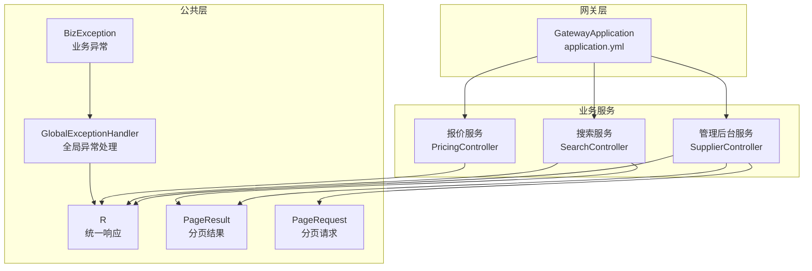
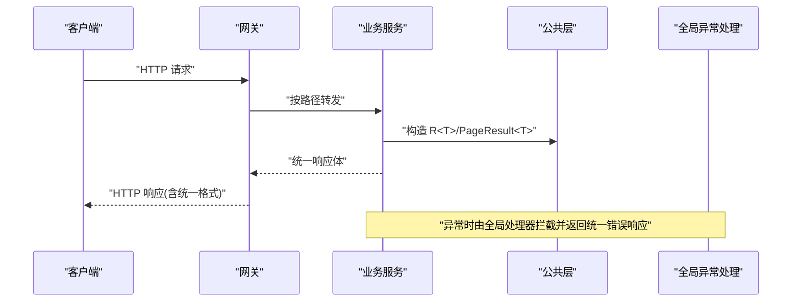
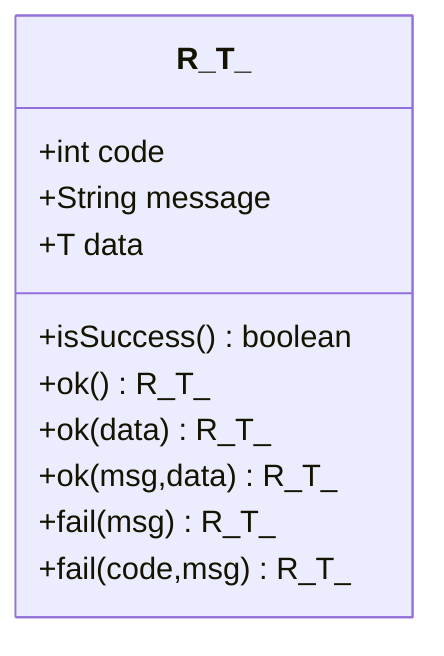
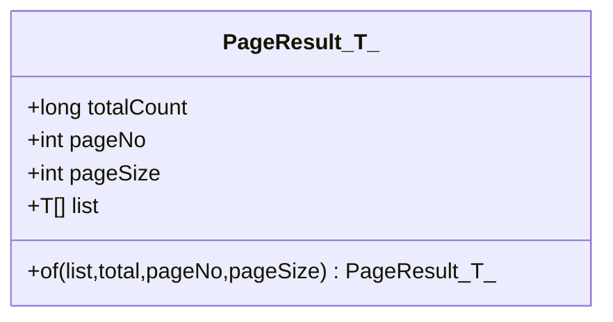
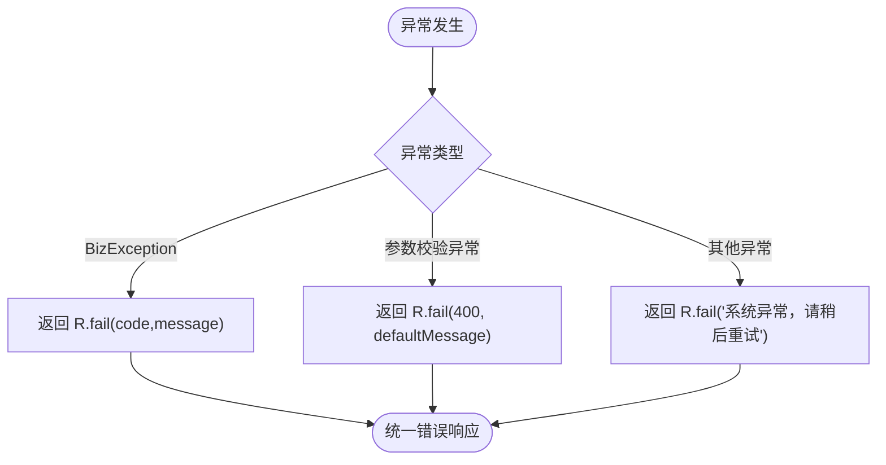
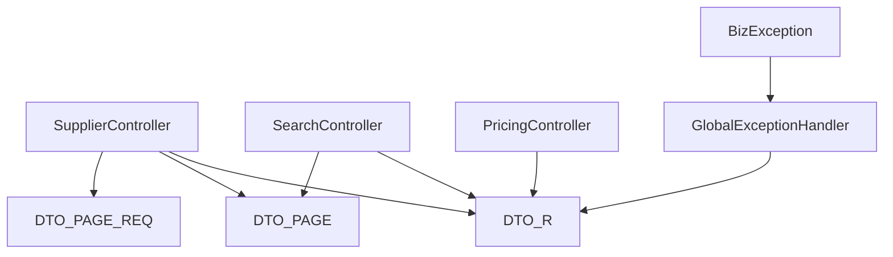

# API统一规范

<cite>
**本文引用的文件**
- [R.java](file://hotel-seller-backend/hotel-common/src/main/java/com/ceair/hotel/common/dto/R.java)
- [PageResult.java](file://hotel-seller-backend/hotel-common/src/main/java/com/ceair/hotel/common/dto/PageResult.java)
- [PageRequest.java](file://hotel-seller-backend/hotel-common/src/main/java/com/ceair/hotel/common/dto/PageRequest.java)
- [BizException.java](file://hotel-seller-backend/hotel-common/src/main/java/com/ceair/hotel/common/exception/BizException.java)
- [GlobalExceptionHandler.java](file://hotel-seller-backend/hotel-common/src/main/java/com/ceair/hotel/common/exception/GlobalExceptionHandler.java)
- [SupplierController.java](file://hotel-seller-backend/hotel-admin-service/src/main/java/com/ceair/hotel/admin/controller/SupplierController.java)
- [PricingController.java](file://hotel-seller-backend/hotel-pricing-service/src/main/java/com/ceair/hotel/pricing/controller/PricingController.java)
- [SearchController.java](file://hotel-seller-backend/hotel-search-service/src/main/java/com/ceair/hotel/search/controller/SearchController.java)
- [CorsConfig.java（管理后台）](file://hotel-seller-backend/hotel-admin-service/src/main/java/com/ceair/hotel/admin/config/CorsConfig.java)
- [CorsConfig.java（报价服务）](file://hotel-seller-backend/hotel-pricing-service/src/main/java/com/ceair/hotel/pricing/config/CorsConfig.java)
- [application.yml（网关）](file://hotel-seller-backend/hotel-gateway/src/main/resources/application.yml)
- [application.yml（管理后台）](file://hotel-seller-backend/hotel-admin-service/src/main/resources/application.yml)
- [application.yml（搜索服务）](file://hotel-seller-backend/hotel-search-service/src/main/resources/application.yml)
- [application.yml（报价服务）](file://hotel-seller-backend/hotel-pricing-service/src/main/resources/application.yml)
</cite>

## 目录
1. [简介](#简介)
2. [项目结构](#项目结构)
3. [核心组件](#核心组件)
4. [架构总览](#架构总览)
5. [详细组件分析](#详细组件分析)
6. [依赖分析](#依赖分析)
7. [性能考虑](#性能考虑)
8. [故障排查指南](#故障排查指南)
9. [结论](#结论)
10. [附录](#附录)

## 简介
本规范旨在为酒店销售系统的前后端协作提供统一的API设计与交互标准，覆盖统一响应格式、分页返回结构、错误码与错误信息、HTTP状态码使用、API版本管理、内容类型与跨域配置、请求头与认证授权、参数校验规则、调试与排障等，帮助开发者获得一致的API使用体验与最佳实践。

## 项目结构
系统采用多模块微服务架构，公共层提供统一响应、分页模型与异常处理；各业务服务（管理后台、搜索、报价）通过网关统一对外暴露REST接口，并在本地配置跨域支持。



**图表来源**
- [GatewayApplication.java:1-13](file://hotel-seller-backend/hotel-gateway/src/main/java/com/ceair/hotel/gateway/GatewayApplication.java#L1-L13)
- [application.yml（网关）:1-54](file://hotel-seller-backend/hotel-gateway/src/main/resources/application.yml#L1-L54)
- [SupplierController.java:1-105](file://hotel-seller-backend/hotel-admin-service/src/main/java/com/ceair/hotel/admin/controller/SupplierController.java#L1-L105)
- [SearchController.java:1-43](file://hotel-seller-backend/hotel-search-service/src/main/java/com/ceair/hotel/search/controller/SearchController.java#L1-L43)
- [PricingController.java:1-31](file://hotel-seller-backend/hotel-pricing-service/src/main/java/com/ceair/hotel/pricing/controller/PricingController.java#L1-L31)
- [R.java:1-48](file://hotel-seller-backend/hotel-common/src/main/java/com/ceair/hotel/common/dto/R.java#L1-L48)
- [PageResult.java:1-26](file://hotel-seller-backend/hotel-common/src/main/java/com/ceair/hotel/common/dto/PageResult.java#L1-L26)
- [PageRequest.java:1-18](file://hotel-seller-backend/hotel-common/src/main/java/com/ceair/hotel/common/dto/PageRequest.java#L1-L18)
- [BizException.java:1-23](file://hotel-seller-backend/hotel-common/src/main/java/com/ceair/hotel/common/exception/BizException.java#L1-L23)
- [GlobalExceptionHandler.java:1-41](file://hotel-seller-backend/hotel-common/src/main/java/com/ceair/hotel/common/exception/GlobalExceptionHandler.java#L1-L41)

**章节来源**
- [application.yml（网关）:1-54](file://hotel-seller-backend/hotel-gateway/src/main/resources/application.yml#L1-L54)
- [application.yml（管理后台）:1-44](file://hotel-seller-backend/hotel-admin-service/src/main/resources/application.yml#L1-L44)
- [application.yml（搜索服务）:1-37](file://hotel-seller-backend/hotel-search-service/src/main/resources/application.yml#L1-L37)
- [application.yml（报价服务）:1-37](file://hotel-seller-backend/hotel-pricing-service/src/main/resources/application.yml#L1-L37)

## 核心组件
- 统一响应格式 R<T>
  - 字段：code（整数）、message（字符串）、data（泛型）
  - 成功：code=200，message="success"，data为业务数据
  - 失败：默认code=500或自定义code，message为错误描述
  - 工具方法：ok()/ok(data)/ok(msg,data)/fail()/fail(code,msg)，以及isSuccess()
- 分页结果 PageResult<T>
  - 字段：totalCount（总数）、pageNo（页码）、pageSize（每页条数）、list（列表）
  - 构造：静态工厂of(list,total,pageNo,pageSize)
- 分页请求 PageRequest
  - 字段：pageNo（默认1，最小1）、pageSize（默认20，最小1）

**章节来源**
- [R.java:1-48](file://hotel-seller-backend/hotel-common/src/main/java/com/ceair/hotel/common/dto/R.java#L1-L48)
- [PageResult.java:1-26](file://hotel-seller-backend/hotel-common/src/main/java/com/ceair/hotel/common/dto/PageResult.java#L1-L26)
- [PageRequest.java:1-18](file://hotel-seller-backend/hotel-common/src/main/java/com/ceair/hotel/common/dto/PageRequest.java#L1-L18)

## 架构总览
API请求经由网关统一入口，按路径前缀路由到对应业务服务；服务内部通过统一响应包装返回，异常由全局处理器转换为统一错误响应；跨域在各服务本地开启，同时网关也进行全局跨域配置。



**图表来源**
- [application.yml（网关）:17-48](file://hotel-seller-backend/hotel-gateway/src/main/resources/application.yml#L17-L48)
- [SupplierController.java:26-34](file://hotel-seller-backend/hotel-admin-service/src/main/java/com/ceair/hotel/admin/controller/SupplierController.java#L26-L34)
- [SearchController.java:30-33](file://hotel-seller-backend/hotel-search-service/src/main/java/com/ceair/hotel/search/controller/SearchController.java#L30-L33)
- [PricingController.java:25-29](file://hotel-seller-backend/hotel-pricing-service/src/main/java/com/ceair/hotel/pricing/controller/PricingController.java#L25-L29)
- [GlobalExceptionHandler.java:17-39](file://hotel-seller-backend/hotel-common/src/main/java/com/ceair/hotel/common/exception/GlobalExceptionHandler.java#L17-L39)

## 详细组件分析

### 统一响应 R<T> 设计与使用规范
- 成功响应
  - 使用 ok() 或 ok(data) 返回标准成功响应
  - 可选：ok(message, data) 自定义成功消息
- 错误响应
  - 默认失败：fail(message) -> code=500
  - 自定义错误码：fail(code, message)
- 判定逻辑
  - isSuccess() 判断 code==200



**图表来源**
- [R.java:10-47](file://hotel-seller-backend/hotel-common/src/main/java/com/ceair/hotel/common/dto/R.java#L10-L47)

**章节来源**
- [R.java:24-46](file://hotel-seller-backend/hotel-common/src/main/java/com/ceair/hotel/common/dto/R.java#L24-L46)

### 分页结果 PageResult<T> 返回格式与参数说明
- 字段
  - totalCount：总记录数
  - pageNo：当前页码（从1开始）
  - pageSize：每页条数
  - list：当前页数据列表
- 构造方式
  - 使用静态工厂 of(list,total,pageNo,pageSize) 生成分页结果



**图表来源**
- [PageResult.java:10-24](file://hotel-seller-backend/hotel-common/src/main/java/com/ceair/hotel/common/dto/PageResult.java#L10-L24)

**章节来源**
- [PageResult.java:17-24](file://hotel-seller-backend/hotel-common/src/main/java/com/ceair/hotel/common/dto/PageResult.java#L17-L24)

### 分页请求 PageRequest 参数规范
- pageNo：默认1，最小值1
- pageSize：默认20，最小值1
- 建议：在控制器中直接接收 pageNo/pageSize，或组合为 PageRequest 对象以获得统一校验

**章节来源**
- [PageRequest.java:12-16](file://hotel-seller-backend/hotel-common/src/main/java/com/ceair/hotel/common/dto/PageRequest.java#L12-L16)

### HTTP 状态码使用规范
- 语义约定
  - 200：请求成功（响应体仍遵循 R<T> 统一格式）
  - 400：参数校验失败（由全局异常处理器返回统一错误）
  - 500：系统异常（由全局异常处理器返回统一错误）
- 控制器返回
  - 所有控制器均返回 R<T>，HTTP 状态码通常为200，具体错误码在响应体的 code 字段体现

**章节来源**
- [GlobalExceptionHandler.java:23-39](file://hotel-seller-backend/hotel-common/src/main/java/com/ceair/hotel/common/exception/GlobalExceptionHandler.java#L23-L39)

### 错误码定义与错误信息格式
- 错误码
  - 业务异常：BizException(code,message) -> 返回 code=自定义错误码
  - 参数校验异常：MethodArgumentNotValidException/BindException -> 返回 code=400
  - 其他系统异常：Exception -> 返回 code=500
- 错误信息
  - message 字段为可读性良好的错误提示
  - 建议：message 保持简洁明确，便于前端展示与国际化



**图表来源**
- [GlobalExceptionHandler.java:17-39](file://hotel-seller-backend/hotel-common/src/main/java/com/ceair/hotel/common/exception/GlobalExceptionHandler.java#L17-L39)
- [BizException.java:18-21](file://hotel-seller-backend/hotel-common/src/main/java/com/ceair/hotel/common/exception/BizException.java#L18-L21)

**章节来源**
- [BizException.java:11-21](file://hotel-seller-backend/hotel-common/src/main/java/com/ceair/hotel/common/exception/BizException.java#L11-L21)
- [GlobalExceptionHandler.java:17-39](file://hotel-seller-backend/hotel-common/src/main/java/com/ceair/hotel/common/exception/GlobalExceptionHandler.java#L17-L39)

### API 版本管理策略
- 版本前缀
  - 管理后台：/api/v1/admin/**
  - 搜索服务：/api/v1/search/**
  - 报价服务：/api/v1/pricing/**
- 建议
  - 新增接口优先在 v1 下扩展，避免破坏既有契约
  - 同步更新网关路由与跨域配置，确保路径一致

**章节来源**
- [SupplierController.java:20-20](file://hotel-seller-backend/hotel-admin-service/src/main/java/com/ceair/hotel/admin/controller/SupplierController.java#L20-L20)
- [SearchController.java:22-22](file://hotel-seller-backend/hotel-search-service/src/main/java/com/ceair/hotel/search/controller/SearchController.java#L22-L22)
- [PricingController.java:19-19](file://hotel-seller-backend/hotel-pricing-service/src/main/java/com/ceair/hotel/pricing/controller/PricingController.java#L19-L19)
- [application.yml（网关）:17-48](file://hotel-seller-backend/hotel-gateway/src/main/resources/application.yml#L17-L48)

### Content-Type 设置与跨域配置
- Content-Type
  - 推荐：application/json；请求体为JSON时设置 Content-Type: application/json
  - 响应：服务端返回 JSON，Accept 可为 application/json
- 跨域
  - 服务本地：允许所有来源、方法、头，支持凭据，预检缓存1小时
  - 网关：全局跨域配置与服务本地一致，确保路径前缀匹配

```mermaid
graph LR
C["客户端"] -- "application/json" --> S["服务端"]
S --> |"CORS 允许:*" + "凭据:是" + "预检缓存:3600s"| C
```

**图表来源**
- [CorsConfig.java（管理后台）:17-22](file://hotel-seller-backend/hotel-admin-service/src/main/java/com/ceair/hotel/admin/config/CorsConfig.java#L17-L22)
- [CorsConfig.java（报价服务）:14-19](file://hotel-seller-backend/hotel-pricing-service/src/main/java/com/ceair/hotel/pricing/config/CorsConfig.java#L14-L19)
- [application.yml（网关）:9-16](file://hotel-seller-backend/hotel-gateway/src/main/resources/application.yml#L9-L16)

**章节来源**
- [CorsConfig.java（管理后台）:15-27](file://hotel-seller-backend/hotel-admin-service/src/main/java/com/ceair/hotel/admin/config/CorsConfig.java#L15-L27)
- [CorsConfig.java（报价服务）:12-24](file://hotel-seller-backend/hotel-pricing-service/src/main/java/com/ceair/hotel/pricing/config/CorsConfig.java#L12-L24)
- [application.yml（网关）:9-16](file://hotel-seller-backend/hotel-gateway/src/main/resources/application.yml#L9-L16)

### 请求头规范、认证授权与参数验证
- 请求头
  - Content-Type: application/json（当请求体为JSON）
  - Accept: application/json
  - 认证：如需鉴权，建议在 Authorization 中携带令牌（Bearer Token），具体由后端安全策略决定
- 参数验证
  - 分页参数：pageNo/pageSize 使用 PageRequest 的最小值约束
  - Bean 校验：控制器参数可结合 JSR-303 注解进行校验，异常由全局处理器统一捕获
- 控制器示例
  - 管理后台：分页查询供应商列表、新增/编辑/上下线供应商等
  - 搜索服务：酒店列表搜索、搜索建议
  - 报价服务：酒店房型报价查询

**章节来源**
- [PageRequest.java:12-16](file://hotel-seller-backend/hotel-common/src/main/java/com/ceair/hotel/common/dto/PageRequest.java#L12-L16)
- [SupplierController.java:26-34](file://hotel-seller-backend/hotel-admin-service/src/main/java/com/ceair/hotel/admin/controller/SupplierController.java#L26-L34)
- [SearchController.java:30-41](file://hotel-seller-backend/hotel-search-service/src/main/java/com/ceair/hotel/search/controller/SearchController.java#L30-L41)
- [PricingController.java:25-29](file://hotel-seller-backend/hotel-pricing-service/src/main/java/com/ceair/hotel/pricing/controller/PricingController.java#L25-L29)
- [GlobalExceptionHandler.java:23-33](file://hotel-seller-backend/hotel-common/src/main/java/com/ceair/hotel/common/exception/GlobalExceptionHandler.java#L23-L33)

### API 调试工具使用指南
- 在线文档
  - knife4j 文档启用，语言为简体中文，便于本地联调与接口探索
- 网关调试
  - 确认网关路由正确，路径前缀与服务端一致
  - 如需本地联调，可在 application.yml 中调整服务端口与路由URI
- 前端联调建议
  - 统一使用 application/json，确保 Content-Type 正确
  - 对分页接口传入 pageNo/pageSize，避免默认值不符合预期

**章节来源**
- [application.yml（管理后台）:36-39](file://hotel-seller-backend/hotel-admin-service/src/main/resources/application.yml#L36-L39)
- [application.yml（搜索服务）:29-32](file://hotel-seller-backend/hotel-search-service/src/main/resources/application.yml#L29-L32)
- [application.yml（报价服务）:29-32](file://hotel-seller-backend/hotel-pricing-service/src/main/resources/application.yml#L29-L32)
- [application.yml（网关）:17-48](file://hotel-seller-backend/hotel-gateway/src/main/resources/application.yml#L17-L48)

## 依赖分析
- 控制器对公共层的依赖
  - 控制器统一返回 R<T>，部分接口返回 PageResult<T>
  - 异常统一由 GlobalExceptionHandler 捕获并转换为 R<T> 错误响应
- 路由与跨域
  - 网关集中配置跨域与路由，服务本地保留跨域配置作为兜底



**图表来源**
- [SupplierController.java:28-34](file://hotel-seller-backend/hotel-admin-service/src/main/java/com/ceair/hotel/admin/controller/SupplierController.java#L28-L34)
- [SearchController.java:31-33](file://hotel-seller-backend/hotel-search-service/src/main/java/com/ceair/hotel/search/controller/SearchController.java#L31-L33)
- [PricingController.java:27-29](file://hotel-seller-backend/hotel-pricing-service/src/main/java/com/ceair/hotel/pricing/controller/PricingController.java#L27-L29)
- [PageResult.java:17-24](file://hotel-seller-backend/hotel-common/src/main/java/com/ceair/hotel/common/dto/PageResult.java#L17-L24)
- [PageRequest.java:12-16](file://hotel-seller-backend/hotel-common/src/main/java/com/ceair/hotel/common/dto/PageRequest.java#L12-L16)
- [GlobalExceptionHandler.java:17-39](file://hotel-seller-backend/hotel-common/src/main/java/com/ceair/hotel/common/exception/GlobalExceptionHandler.java#L17-L39)
- [BizException.java:18-21](file://hotel-seller-backend/hotel-common/src/main/java/com/ceair/hotel/common/exception/BizException.java#L18-L21)

**章节来源**
- [SupplierController.java:1-105](file://hotel-seller-backend/hotel-admin-service/src/main/java/com/ceair/hotel/admin/controller/SupplierController.java#L1-L105)
- [SearchController.java:1-43](file://hotel-seller-backend/hotel-search-service/src/main/java/com/ceair/hotel/search/controller/SearchController.java#L1-L43)
- [PricingController.java:1-31](file://hotel-seller-backend/hotel-pricing-service/src/main/java/com/ceair/hotel/pricing/controller/PricingController.java#L1-L31)
- [GlobalExceptionHandler.java:1-41](file://hotel-seller-backend/hotel-common/src/main/java/com/ceair/hotel/common/exception/GlobalExceptionHandler.java#L1-L41)

## 性能考虑
- 统一响应与异常处理
  - 通过全局异常处理器减少重复判断与错误封装代码，降低出错概率
- 分页参数
  - 合理设置 pageSize，避免过大导致内存压力；建议在服务端限制最大页大小
- 跨域与网关
  - 预检缓存时间较长，有利于减少重复OPTIONS请求，提升联调效率

[本节为通用建议，不直接分析具体文件]

## 故障排查指南
- 常见问题
  - 400错误：参数校验失败，检查请求体与参数注解是否匹配
  - 500错误：系统异常，查看服务日志定位异常堆栈
  - 跨域失败：确认请求头与服务端跨域配置一致，Origin 是否被允许
- 定位步骤
  - 查看网关日志与服务端日志
  - 使用 knife4j 文档在线测试接口
  - 核对 Content-Type 与路由前缀

**章节来源**
- [GlobalExceptionHandler.java:23-39](file://hotel-seller-backend/hotel-common/src/main/java/com/ceair/hotel/common/exception/GlobalExceptionHandler.java#L23-L39)
- [application.yml（网关）:50-54](file://hotel-seller-backend/hotel-gateway/src/main/resources/application.yml#L50-L54)

## 结论
通过统一响应格式、分页模型与异常处理机制，系统实现了前后端一致的交互体验。配合清晰的版本前缀、跨域与网关路由策略，以及参数校验与文档工具，开发者可以快速、稳定地完成接口集成与联调。

## 附录
- 统一响应字段说明
  - code：业务状态码，200表示成功，其他为错误码
  - message：人类可读的提示信息
  - data：业务数据，可能为空（如成功但无数据）
- 分页返回字段说明
  - totalCount：满足条件的总记录数
  - pageNo：当前页码（从1开始）
  - pageSize：每页条数
  - list：当前页数据列表

**章节来源**
- [R.java:12-14](file://hotel-seller-backend/hotel-common/src/main/java/com/ceair/hotel/common/dto/R.java#L12-L14)
- [PageResult.java:12-15](file://hotel-seller-backend/hotel-common/src/main/java/com/ceair/hotel/common/dto/PageResult.java#L12-L15)