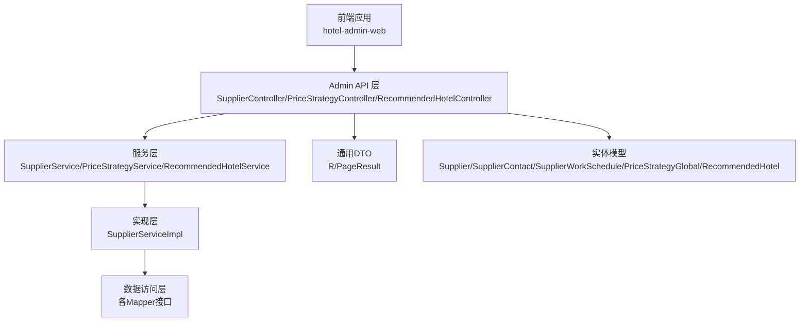
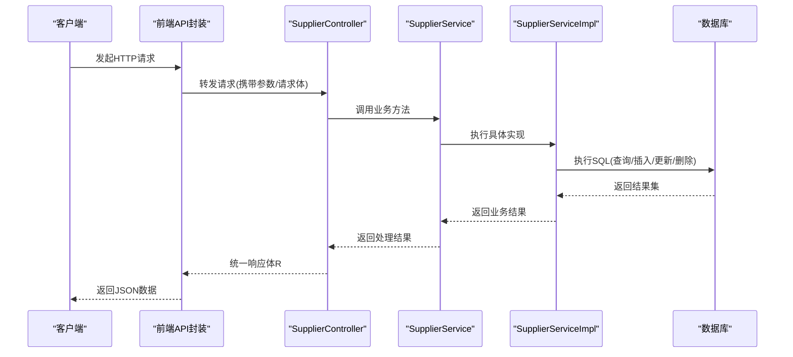
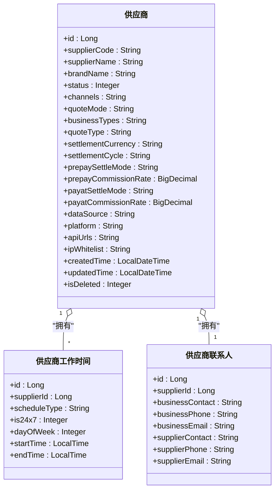
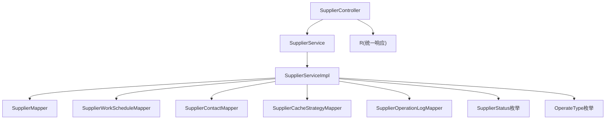

# 供应商管理API

<cite>
**本文档引用的文件**
- [SupplierController.java](file://hotel-seller-backend/hotel-admin-service/src/main/java/com/ceair/hotel/admin/controller/SupplierController.java)
- [SupplierService.java](file://hotel-seller-backend/hotel-admin-service/src/main/java/com/ceair/hotel/admin/service/SupplierService.java)
- [SupplierServiceImpl.java](file://hotel-seller-backend/hotel-admin-service/src/main/java/com/ceair/hotel/admin/service/impl/SupplierServiceImpl.java)
- [Supplier.java](file://hotel-seller-backend/hotel-common/src/main/java/com/ceair/hotel/common/entity/Supplier.java)
- [SupplierContact.java](file://hotel-seller-backend/hotel-common/src/main/java/com/ceair/hotel/common/entity/SupplierContact.java)
- [SupplierWorkSchedule.java](file://hotel-seller-backend/hotel-common/src/main/java/com/ceair/hotel/common/entity/SupplierWorkSchedule.java)
- [PriceStrategyController.java](file://hotel-seller-backend/hotel-admin-service/src/main/java/com/ceair/hotel/admin/controller/PriceStrategyController.java)
- [PriceStrategyGlobal.java](file://hotel-seller-backend/hotel-common/src/main/java/com/ceair/hotel/common/entity/PriceStrategyGlobal.java)
- [RecommendedHotelController.java](file://hotel-seller-backend/hotel-admin-service/src/main/java/com/ceair/hotel/admin/controller/RecommendedHotelController.java)
- [RecommendedHotel.java](file://hotel-seller-backend/hotel-common/src/main/java/com/ceair/hotel/common/entity/RecommendedHotel.java)
- [R.java](file://hotel-seller-backend/hotel-common/src/main/java/com/ceair/hotel/common/dto/R.java)
- [SupplierStatus.java](file://hotel-seller-backend/hotel-common/src/main/java/com/ceair/hotel/common/enums/SupplierStatus.java)
- [OperateType.java](file://hotel-seller-backend/hotel-common/src/main/java/com/ceair/hotel/common/enums/OperateType.java)
- [index.js](file://hotel-admin-web/src/api/index.js)
- [request.js](file://hotel-admin-web/src/utils/request.js)
- [SupplierList.vue](file://hotel-admin-web/src/views/supplier/SupplierList.vue)
- [SupplierDetail.vue](file://hotel-admin-web/src/views/supplier/SupplierDetail.vue)
</cite>

## 目录
1. [简介](#简介)
2. [项目结构](#项目结构)
3. [核心组件](#核心组件)
4. [架构总览](#架构总览)
5. [详细组件分析](#详细组件分析)
6. [依赖关系分析](#依赖关系分析)
7. [性能考虑](#性能考虑)
8. [故障排除指南](#故障排除指南)
9. [结论](#结论)
10. [附录](#附录)

## 简介
本文件为供应商管理模块的详细API接口文档，覆盖供应商列表查询、详情获取、新增编辑、状态变更等核心接口，并扩展到供应商工作时间管理、联系人管理、价格策略配置以及推荐酒店设置等管理接口。文档提供每个接口的HTTP方法、URL路径、请求参数与响应格式，给出请求与响应示例（涵盖成功与失败场景），解释权限要求、参数验证规则与业务约束条件，帮助开发者快速集成。

## 项目结构
供应商管理API位于后端服务的管理员服务模块中，采用Spring Boot REST风格设计，统一响应体封装在通用DTO中，前端通过Axios进行HTTP调用。

图表来源
- [SupplierController.java:18-22](file://hotel-seller-backend/hotel-admin-service/src/main/java/com/ceair/hotel/admin/controller/SupplierController.java#L18-L22)
- [SupplierService.java:10-32](file://hotel-seller-backend/hotel-admin-service/src/main/java/com/ceair/hotel/admin/service/SupplierService.java#L10-L32)
- [SupplierServiceImpl.java:23-29](file://hotel-seller-backend/hotel-admin-service/src/main/java/com/ceair/hotel/admin/service/impl/SupplierServiceImpl.java#L23-L29)
- [R.java:10-14](file://hotel-seller-backend/hotel-common/src/main/java/com/ceair/hotel/common/dto/R.java#L10-L14)

章节来源
- [SupplierController.java:18-22](file://hotel-seller-backend/hotel-admin-service/src/main/java/com/ceair/hotel/admin/controller/SupplierController.java#L18-L22)
- [index.js:1-124](file://hotel-admin-web/src/api/index.js#L1-L124)
- [request.js:4-7](file://hotel-admin-web/src/utils/request.js#L4-L7)

## 核心组件
- 控制器层：提供REST接口，负责接收请求、组装命令对象、调用服务层并返回统一响应。
- 服务层：定义业务契约，封装事务与业务逻辑。
- 实现层：具体执行数据库操作，维护多表关联（供应商、工作时间、联系人、缓存策略、操作日志）。
- 实体与DTO：描述数据结构，统一响应体R封装标准返回格式。
- 前端API封装：对后端接口进行二次封装，便于Vue组件调用。

章节来源
- [SupplierController.java:22-104](file://hotel-seller-backend/hotel-admin-service/src/main/java/com/ceair/hotel/admin/controller/SupplierController.java#L22-L104)
- [SupplierService.java:10-32](file://hotel-seller-backend/hotel-admin-service/src/main/java/com/ceair/hotel/admin/service/SupplierService.java#L10-L32)
- [SupplierServiceImpl.java:23-161](file://hotel-seller-backend/hotel-admin-service/src/main/java/com/ceair/hotel/admin/service/impl/SupplierServiceImpl.java#L23-L161)
- [R.java:10-47](file://hotel-seller-backend/hotel-common/src/main/java/com/ceair/hotel/common/dto/R.java#L10-L47)

## 架构总览
供应商管理API遵循分层架构，前端通过统一网关或直接访问后端Admin服务，后端控制器将请求转换为领域对象，服务层执行业务规则与事务控制，实现层通过MyBatis-Plus访问数据库。

图表来源
- [SupplierController.java:26-68](file://hotel-seller-backend/hotel-admin-service/src/main/java/com/ceair/hotel/admin/controller/SupplierController.java#L26-L68)
- [SupplierServiceImpl.java:31-161](file://hotel-seller-backend/hotel-admin-service/src/main/java/com/ceair/hotel/admin/service/impl/SupplierServiceImpl.java#L31-L161)
- [R.java:24-34](file://hotel-seller-backend/hotel-common/src/main/java/com/ceair/hotel/common/dto/R.java#L24-L34)

## 详细组件分析

### 供应商管理接口

#### 1) 分页查询供应商列表
- 方法与路径
  - GET /api/v1/admin/suppliers
- 请求参数
  - keyword: 关键词（可选）
  - status: 状态（0/1，可选）
  - pageNo: 页码，默认1
  - pageSize: 每页条数，默认10
- 响应数据
  - code: 状态码
  - message: 提示信息
  - data: 分页结果对象
    - records: 供应商列表
    - total: 总条数
    - pageNo: 当前页
    - pageSize: 每页大小
- 成功示例
  - 响应体示例路径：[R.java:28-34](file://hotel-seller-backend/hotel-common/src/main/java/com/ceair/hotel/common/dto/R.java#L28-L34)
- 失败示例
  - 响应体示例路径：[R.java:36-42](file://hotel-seller-backend/hotel-common/src/main/java/com/ceair/hotel/common/dto/R.java#L36-L42)
- 权限要求
  - 需具备“供应商列表查询”权限
- 参数验证规则
  - status仅允许0或1；pageNo/pageSize需为正整数
- 业务约束
  - 支持按名称或编号模糊匹配；按更新时间倒序

章节来源
- [SupplierController.java:26-34](file://hotel-seller-backend/hotel-admin-service/src/main/java/com/ceair/hotel/admin/controller/SupplierController.java#L26-L34)
- [SupplierServiceImpl.java:31-47](file://hotel-seller-backend/hotel-admin-service/src/main/java/com/ceair/hotel/admin/service/impl/SupplierServiceImpl.java#L31-L47)
- [R.java:24-34](file://hotel-seller-backend/hotel-common/src/main/java/com/ceair/hotel/common/dto/R.java#L24-L34)

#### 2) 查询供应商详情
- 方法与路径
  - GET /api/v1/admin/suppliers/{id}
- 路径参数
  - id: 供应商ID（必填）
- 响应数据
  - data: 详情聚合对象
    - supplier: 供应商基础信息
    - schedules: 工作时间列表
    - contact: 联系人信息
- 成功示例
  - 响应体示例路径：[R.java:28-34](file://hotel-seller-backend/hotel-common/src/main/java/com/ceair/hotel/common/dto/R.java#L28-L34)
- 失败示例
  - 供应商不存在：[BizException抛出位置:52-55](file://hotel-seller-backend/hotel-admin-service/src/main/java/com/ceair/hotel/admin/service/impl/SupplierServiceImpl.java#L52-L55)

章节来源
- [SupplierController.java:36-48](file://hotel-seller-backend/hotel-admin-service/src/main/java/com/ceair/hotel/admin/controller/SupplierController.java#L36-L48)
- [SupplierServiceImpl.java:49-56](file://hotel-seller-backend/hotel-admin-service/src/main/java/com/ceair/hotel/admin/service/impl/SupplierServiceImpl.java#L49-L56)

#### 3) 新增供应商
- 方法与路径
  - POST /api/v1/admin/suppliers
- 请求体
  - supplier: 供应商基础信息
  - schedules: 工作时间列表
  - contact: 联系人信息
- 响应数据
  - data: 新增成功后的供应商ID
- 成功示例
  - 响应体示例路径：[R.java:32-34](file://hotel-seller-backend/hotel-common/src/main/java/com/ceair/hotel/common/dto/R.java#L32-L34)
- 失败示例
  - 供应商编号重复：[重复校验与异常抛出:61-66](file://hotel-seller-backend/hotel-admin-service/src/main/java/com/ceair/hotel/admin/service/impl/SupplierServiceImpl.java#L61-L66)
- 权限要求
  - 需具备“供应商新增”权限
- 参数验证规则
  - supplierCode必须唯一；工作时间与联系人可为空但格式需正确
- 业务约束
  - 新增后自动初始化默认缓存策略；记录创建日志

章节来源
- [SupplierController.java:50-55](file://hotel-seller-backend/hotel-admin-service/src/main/java/com/ceair/hotel/admin/controller/SupplierController.java#L50-L55)
- [SupplierServiceImpl.java:58-97](file://hotel-seller-backend/hotel-admin-service/src/main/java/com/ceair/hotel/admin/service/impl/SupplierServiceImpl.java#L58-L97)

#### 4) 编辑供应商
- 方法与路径
  - PUT /api/v1/admin/suppliers/{id}
- 路径参数
  - id: 供应商ID（必填）
- 请求体
  - supplier: 供应商基础信息
  - schedules: 工作时间列表
  - contact: 联系人信息
- 响应数据
  - data: null
- 成功示例
  - 响应体示例路径：[R.java:28-34](file://hotel-seller-backend/hotel-common/src/main/java/com/ceair/hotel/common/dto/R.java#L28-L34)
- 失败示例
  - 供应商不存在：[异常抛出位置:52-55](file://hotel-seller-backend/hotel-admin-service/src/main/java/com/ceair/hotel/admin/service/impl/SupplierServiceImpl.java#L52-L55)
- 权限要求
  - 需具备“供应商编辑”权限
- 参数验证规则
  - schedules与contact可为空；若提供需符合实体字段约束
- 业务约束
  - 工作时间采用“先删后插”策略；联系人同样先删后插；记录编辑日志

章节来源
- [SupplierController.java:57-62](file://hotel-seller-backend/hotel-admin-service/src/main/java/com/ceair/hotel/admin/controller/SupplierController.java#L57-L62)
- [SupplierServiceImpl.java:99-125](file://hotel-seller-backend/hotel-admin-service/src/main/java/com/ceair/hotel/admin/service/impl/SupplierServiceImpl.java#L99-L125)

#### 5) 上下班线供应商
- 方法与路径
  - PUT /api/v1/admin/suppliers/{id}/status
- 路径参数
  - id: 供应商ID（必填）
- 请求体
  - status: 状态（0/1）
  - operator: 操作人
- 响应数据
  - data: null
- 成功示例
  - 响应体示例路径：[R.java:28-34](file://hotel-seller-backend/hotel-common/src/main/java/com/ceair/hotel/common/dto/R.java#L28-L34)
- 失败示例
  - 供应商不存在：[异常抛出位置:52-55](file://hotel-seller-backend/hotel-admin-service/src/main/java/com/ceair/hotel/admin/service/impl/SupplierServiceImpl.java#L52-L55)
- 权限要求
  - 需具备“供应商状态变更”权限
- 参数验证规则
  - status仅允许0或1；operator必填
- 业务约束
  - 记录上线/下线日志；状态枚举定义见枚举类

章节来源
- [SupplierController.java:64-69](file://hotel-seller-backend/hotel-admin-service/src/main/java/com/ceair/hotel/admin/controller/SupplierController.java#L64-L69)
- [SupplierServiceImpl.java:127-136](file://hotel-seller-backend/hotel-admin-service/src/main/java/com/ceair/hotel/admin/service/impl/SupplierServiceImpl.java#L127-L136)
- [SupplierStatus.java:11-24](file://hotel-seller-backend/hotel-common/src/main/java/com/ceair/hotel/common/enums/SupplierStatus.java#L11-L24)

#### 6) 查询供应商工作时间
- 方法与路径
  - GET /api/v1/admin/suppliers/{id}/schedules
- 路径参数
  - id: 供应商ID（必填）
- 响应数据
  - data: 工作时间列表
- 成功示例
  - 响应体示例路径：[R.java:28-34](file://hotel-seller-backend/hotel-common/src/main/java/com/ceair/hotel/common/dto/R.java#L28-L34)

章节来源
- [SupplierController.java:71-75](file://hotel-seller-backend/hotel-admin-service/src/main/java/com/ceair/hotel/admin/controller/SupplierController.java#L71-L75)
- [SupplierServiceImpl.java:138-142](file://hotel-seller-backend/hotel-admin-service/src/main/java/com/ceair/hotel/admin/service/impl/SupplierServiceImpl.java#L138-L142)

#### 7) 查询供应商联系人
- 方法与路径
  - GET /api/v1/admin/suppliers/{id}/contact
- 路径参数
  - id: 供应商ID（必填）
- 响应数据
  - data: 联系人信息
- 成功示例
  - 响应体示例路径：[R.java:28-34](file://hotel-seller-backend/hotel-common/src/main/java/com/ceair/hotel/common/dto/R.java#L28-L34)

章节来源
- [SupplierController.java:77-81](file://hotel-seller-backend/hotel-admin-service/src/main/java/com/ceair/hotel/admin/controller/SupplierController.java#L77-L81)
- [SupplierServiceImpl.java:144-148](file://hotel-seller-backend/hotel-admin-service/src/main/java/com/ceair/hotel/admin/service/impl/SupplierServiceImpl.java#L144-L148)

### 供应商工作时间与联系人数据模型

图表来源
- [Supplier.java:13-80](file://hotel-seller-backend/hotel-common/src/main/java/com/ceair/hotel/common/entity/Supplier.java#L13-L80)
- [SupplierWorkSchedule.java:13-32](file://hotel-seller-backend/hotel-common/src/main/java/com/ceair/hotel/common/entity/SupplierWorkSchedule.java#L13-L32)
- [SupplierContact.java:12-28](file://hotel-seller-backend/hotel-common/src/main/java/com/ceair/hotel/common/entity/SupplierContact.java#L12-L28)

### 价格策略管理接口

#### 1) 查询全局价格策略
- 方法与路径
  - GET /api/v1/admin/suppliers/{supplierId}/global-strategy
- 路径参数
  - supplierId: 供应商ID（必填）
- 响应数据
  - data: 全局价格策略对象
    - markupRate: 加价比例(%)
    - markupAmount: 加价金额(元/间夜)
    - createdTime/updatedTime: 创建与更新时间

章节来源
- [PriceStrategyController.java:25-29](file://hotel-seller-backend/hotel-admin-service/src/main/java/com/ceair/hotel/admin/controller/PriceStrategyController.java#L25-L29)
- [PriceStrategyGlobal.java:14-32](file://hotel-seller-backend/hotel-common/src/main/java/com/ceair/hotel/common/entity/PriceStrategyGlobal.java#L14-L32)

#### 2) 设置全局价格策略
- 方法与路径
  - PUT /api/v1/admin/suppliers/{supplierId}/global-strategy
- 路径参数
  - supplierId: 供应商ID（必填）
- 请求体
  - markupRate: 加价比例(%)
  - markupAmount: 加价金额(元/间夜)
- 响应数据
  - data: null

章节来源
- [PriceStrategyController.java:31-37](file://hotel-seller-backend/hotel-admin-service/src/main/java/com/ceair/hotel/admin/controller/PriceStrategyController.java#L31-L37)

#### 3) 查询特殊价格策略列表
- 方法与路径
  - GET /api/v1/admin/suppliers/{supplierId}/price-strategies
- 路径参数
  - supplierId: 供应商ID（必填）
- 响应数据
  - data: 特殊价格策略列表

章节来源
- [PriceStrategyController.java:39-43](file://hotel-seller-backend/hotel-admin-service/src/main/java/com/ceair/hotel/admin/controller/PriceStrategyController.java#L39-L43)

#### 4) 添加特殊价格策略
- 方法与路径
  - POST /api/v1/admin/suppliers/{supplierId}/price-strategies
- 路径参数
  - supplierId: 供应商ID（必填）
- 请求体
  - 特殊策略字段（由实体定义）
- 响应数据
  - data: 新增ID

章节来源
- [PriceStrategyController.java:45-51](file://hotel-seller-backend/hotel-admin-service/src/main/java/com/ceair/hotel/admin/controller/PriceStrategyController.java#L45-L51)

#### 5) 编辑特殊价格策略
- 方法与路径
  - PUT /api/v1/admin/price-strategies/{strategyId}
- 路径参数
  - strategyId: 策略ID（必填）
- 请求体
  - 特殊策略字段（由实体定义）
- 响应数据
  - data: null

章节来源
- [PriceStrategyController.java:53-59](file://hotel-seller-backend/hotel-admin-service/src/main/java/com/ceair/hotel/admin/controller/PriceStrategyController.java#L53-L59)

#### 6) 删除特殊价格策略
- 方法与路径
  - DELETE /api/v1/admin/price-strategies/{strategyId}
- 路径参数
  - strategyId: 策略ID（必填）
- 响应数据
  - data: null

章节来源
- [PriceStrategyController.java:61-66](file://hotel-seller-backend/hotel-admin-service/src/main/java/com/ceair/hotel/admin/controller/PriceStrategyController.java#L61-L66)

### 推荐酒店管理接口

#### 1) 分页查询推荐酒店
- 方法与路径
  - GET /api/v1/admin/recommendations
- 请求参数
  - destinationCode: 目的地编码（可选）
  - pageNo: 页码，默认1
  - pageSize: 每页条数，默认20
- 响应数据
  - data: 分页结果对象

章节来源
- [RecommendedHotelController.java:26-33](file://hotel-seller-backend/hotel-admin-service/src/main/java/com/ceair/hotel/admin/controller/RecommendedHotelController.java#L26-L33)

#### 2) 添加推荐酒店
- 方法与路径
  - POST /api/v1/admin/recommendations
- 请求体
  - destinationCode/destinationName/destinationType
  - hotelId/hotelName
  - sortOrder: 排序序号（越小越靠前）
- 响应数据
  - data: 新增ID

章节来源
- [RecommendedHotelController.java:35-40](file://hotel-seller-backend/hotel-admin-service/src/main/java/com/ceair/hotel/admin/controller/RecommendedHotelController.java#L35-L40)

#### 3) 批量删除推荐酒店
- 方法与路径
  - DELETE /api/v1/admin/recommendations
- 请求体
  - ids: 待删除ID数组
- 响应数据
  - data: null

章节来源
- [RecommendedHotelController.java:42-47](file://hotel-seller-backend/hotel-admin-service/src/main/java/com/ceair/hotel/admin/controller/RecommendedHotelController.java#L42-L47)

#### 4) 调整推荐排序
- 方法与路径
  - PUT /api/v1/admin/recommendations/sort
- 请求体
  - 推荐酒店列表（包含排序字段）
- 响应数据
  - data: null

章节来源
- [RecommendedHotelController.java:49-54](file://hotel-seller-backend/hotel-admin-service/src/main/java/com/ceair/hotel/admin/controller/RecommendedHotelController.java#L49-L54)

### 统一响应与错误处理
- 统一响应体R
  - code: 200表示成功，非200表示失败
  - message: 提示信息
  - data: 返回的数据对象
- 错误处理
  - 后端通过BizException抛出业务异常
  - 前端Axios拦截器对非200状态进行提示

章节来源
- [R.java:10-47](file://hotel-seller-backend/hotel-common/src/main/java/com/ceair/hotel/common/dto/R.java#L10-L47)
- [SupplierServiceImpl.java:52-55](file://hotel-seller-backend/hotel-admin-service/src/main/java/com/ceair/hotel/admin/service/impl/SupplierServiceImpl.java#L52-L55)
- [request.js:19-32](file://hotel-admin-web/src/utils/request.js#L19-L32)

## 依赖关系分析

图表来源
- [SupplierController.java:24-25](file://hotel-seller-backend/hotel-admin-service/src/main/java/com/ceair/hotel/admin/controller/SupplierController.java#L24-L25)
- [SupplierService.java:10-32](file://hotel-seller-backend/hotel-admin-service/src/main/java/com/ceair/hotel/admin/service/SupplierService.java#L10-L32)
- [SupplierServiceImpl.java:25-29](file://hotel-seller-backend/hotel-admin-service/src/main/java/com/ceair/hotel/admin/service/impl/SupplierServiceImpl.java#L25-L29)
- [SupplierStatus.java:11-24](file://hotel-seller-backend/hotel-common/src/main/java/com/ceair/hotel/common/enums/SupplierStatus.java#L11-L24)
- [OperateType.java:8-16](file://hotel-seller-backend/hotel-common/src/main/java/com/ceair/hotel/common/enums/OperateType.java#L8-L16)

章节来源
- [SupplierController.java:24-25](file://hotel-seller-backend/hotel-admin-service/src/main/java/com/ceair/hotel/admin/controller/SupplierController.java#L24-L25)
- [SupplierServiceImpl.java:25-29](file://hotel-seller-backend/hotel-admin-service/src/main/java/com/ceair/hotel/admin/service/impl/SupplierServiceImpl.java#L25-L29)

## 性能考虑
- 分页查询使用MyBatis-Plus分页插件，建议合理设置pageSize并避免超大范围查询。
- 新增/编辑供应商时涉及多表写入，使用事务保证一致性。
- 前端请求拦截器统一处理错误，减少重复错误处理逻辑。
- 对于高频查询可结合索引优化（如按状态、更新时间排序）。

## 故障排除指南
- 常见错误
  - 供应商不存在：检查ID是否正确，或是否存在软删除。
  - 供应商编号重复：确保编号唯一性。
  - 参数非法：status仅支持0/1；分页参数需为正整数。
- 日志定位
  - 服务层记录操作日志，便于追踪上线/下线与编辑行为。
- 前端提示
  - Axios拦截器统一提示错误消息，便于用户感知。

章节来源
- [SupplierServiceImpl.java:52-55](file://hotel-seller-backend/hotel-admin-service/src/main/java/com/ceair/hotel/admin/service/impl/SupplierServiceImpl.java#L52-L55)
- [SupplierServiceImpl.java:61-66](file://hotel-seller-backend/hotel-admin-service/src/main/java/com/ceair/hotel/admin/service/impl/SupplierServiceImpl.java#L61-L66)
- [request.js:19-32](file://hotel-admin-web/src/utils/request.js#L19-L32)

## 结论
本文档提供了供应商管理模块的完整API接口说明，涵盖供应商全生命周期管理、工作时间与联系人管理、价格策略配置以及推荐酒店设置。通过统一响应体与严格的参数校验，确保接口稳定可靠。建议在集成时严格遵循参数规范与权限要求，并结合日志与错误处理机制进行问题排查。

## 附录

### 前端调用示例（基于封装函数）
- 列表查询：[listSuppliers:5-8](file://hotel-admin-web/src/api/index.js#L5-L8)
- 详情查询：[getSupplierDetail:10-13](file://hotel-admin-web/src/api/index.js#L10-L13)
- 新增供应商：[addSupplier:15-18](file://hotel-admin-web/src/api/index.js#L15-L18)
- 编辑供应商：[updateSupplier:20-23](file://hotel-admin-web/src/api/index.js#L20-L23)
- 上下班线：[updateSupplierStatus:25-28](file://hotel-admin-web/src/api/index.js#L25-L28)
- 全局价格策略：[getGlobalStrategy/saveGlobalStrategy:32-40](file://hotel-admin-web/src/api/index.js#L32-L40)
- 特殊价格策略：[list/add/update/delete:42-60](file://hotel-admin-web/src/api/index.js#L42-L60)
- 推荐酒店：[list/add/delete/sort:76-94](file://hotel-admin-web/src/api/index.js#L76-L94)

章节来源
- [index.js:5-124](file://hotel-admin-web/src/api/index.js#L5-L124)

### 前端页面组件（用于理解调用场景）
- 供应商列表页：[SupplierList.vue:116-166](file://hotel-admin-web/src/views/supplier/SupplierList.vue#L116-L166)
- 供应商详情页：[SupplierDetail.vue:150-182](file://hotel-admin-web/src/views/supplier/SupplierDetail.vue#L150-L182)
- 请求封装：[request.js:4-7](file://hotel-admin-web/src/utils/request.js#L4-L7)

章节来源
- [SupplierList.vue:116-166](file://hotel-admin-web/src/views/supplier/SupplierList.vue#L116-L166)
- [SupplierDetail.vue:150-182](file://hotel-admin-web/src/views/supplier/SupplierDetail.vue#L150-L182)
- [request.js:4-7](file://hotel-admin-web/src/utils/request.js#L4-L7)