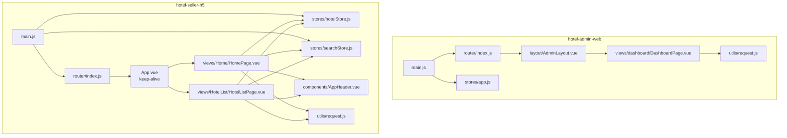
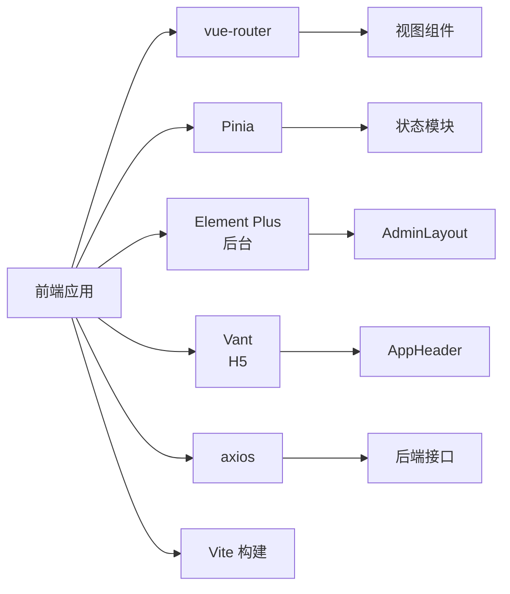
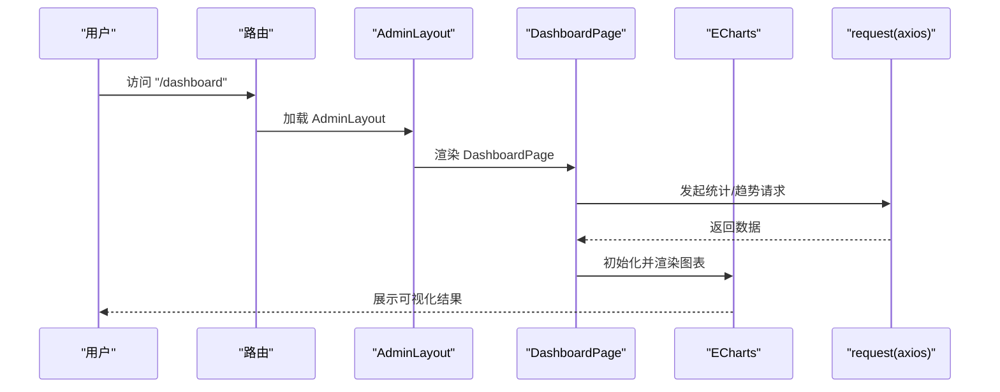
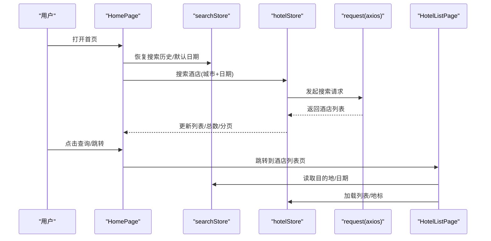
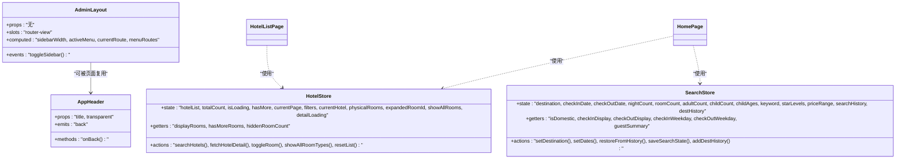
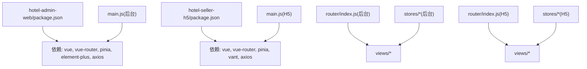

# 前端架构

<cite>
**本文引用的文件**
- [hotel-admin-web/package.json](file://hotel-admin-web/package.json)
- [hotel-seller-h5/package.json](file://hotel-seller-h5/package.json)
- [hotel-admin-web/src/main.js](file://hotel-admin-web/src/main.js)
- [hotel-seller-h5/src/main.js](file://hotel-seller-h5/src/main.js)
- [hotel-admin-web/src/App.vue](file://hotel-admin-web/src/App.vue)
- [hotel-seller-h5/src/App.vue](file://hotel-seller-h5/src/App.vue)
- [hotel-admin-web/src/router/index.js](file://hotel-admin-web/src/router/index.js)
- [hotel-seller-h5/src/router/index.js](file://hotel-seller-h5/src/router/index.js)
- [hotel-admin-web/src/stores/app.js](file://hotel-admin-web/src/stores/app.js)
- [hotel-seller-h5/src/stores/hotelStore.js](file://hotel-seller-h5/src/stores/hotelStore.js)
- [hotel-seller-h5/src/stores/searchStore.js](file://hotel-seller-h5/src/stores/searchStore.js)
- [hotel-admin-web/src/utils/request.js](file://hotel-admin-web/src/utils/request.js)
- [hotel-seller-h5/src/utils/request.js](file://hotel-seller-h5/src/utils/request.js)
- [hotel-admin-web/src/layout/AdminLayout.vue](file://hotel-admin-web/src/layout/AdminLayout.vue)
- [hotel-seller-h5/src/components/AppHeader.vue](file://hotel-seller-h5/src/components/AppHeader.vue)
- [hotel-seller-h5/src/views/Home/HomePage.vue](file://hotel-seller-h5/src/views/Home/HomePage.vue)
- [hotel-seller-h5/src/views/HotelList/HotelListPage.vue](file://hotel-seller-h5/src/views/HotelList/HotelListPage.vue)
- [hotel-admin-web/src/views/dashboard/DashboardPage.vue](file://hotel-admin-web/src/views/dashboard/DashboardPage.vue)
</cite>

## 目录
1. [引言](#引言)
2. [项目结构](#项目结构)
3. [核心组件](#核心组件)
4. [架构总览](#架构总览)
5. [详细组件分析](#详细组件分析)
6. [依赖关系分析](#依赖关系分析)
7. [性能考量](#性能考量)
8. [故障排查指南](#故障排查指南)
9. [结论](#结论)
10. [附录](#附录)

## 引言
本文件面向酒店销售系统的前端架构，聚焦于 Vue 3 Composition API 的使用、组件化与状态管理模式，以及管理后台前端（hotel-admin-web）与移动端 H5 前端（hotel-seller-h5）的架构差异与共同点。文档还解释了目录结构设计原则、组件通信机制、路由管理策略、技术栈选择理由（如 Vue 3、Element Plus、Vant UI），并给出组件设计模式、状态管理最佳实践与性能优化策略，以及前后端分离与 API 交互模式。

## 项目结构
- 采用“多包/多应用”结构：分别在 hotel-admin-web 与 hotel-seller-h5 下构建独立的前端应用，共享仓库但隔离开发与部署。
- 通用层：公共样式、工具函数、API 封装与状态管理在各自应用内按模块组织，避免跨应用耦合。
- 架构分层：
  - 入口层：main.js 初始化应用、注册插件与全局样式。
  - 视图层：views 下按页面维度组织，每个页面以单文件组件形式存在。
  - 组合层：components 提供可复用的业务/通用组件；composables 提供组合式逻辑（H5 中存在该目录）。
  - 状态层：stores 使用 Pinia 进行状态管理，按领域拆分（如 hotel、search、booking）。
  - 工具层：utils 提供请求封装、日期处理、本地存储等工具。
  - 路由层：router/index.js 定义路由表与导航守卫。
  - 布局层：AdminLayout.vue 提供后台统一布局；H5 通过 App.vue 包裹 keep-alive 实现页面缓存。

图表来源
- [hotel-admin-web/src/main.js:1-23](file://hotel-admin-web/src/main.js#L1-L23)
- [hotel-seller-h5/src/main.js:1-33](file://hotel-seller-h5/src/main.js#L1-L33)
- [hotel-admin-web/src/router/index.js:1-67](file://hotel-admin-web/src/router/index.js#L1-L67)
- [hotel-seller-h5/src/router/index.js:1-65](file://hotel-seller-h5/src/router/index.js#L1-L65)
- [hotel-admin-web/src/layout/AdminLayout.vue:1-194](file://hotel-admin-web/src/layout/AdminLayout.vue#L1-L194)
- [hotel-seller-h5/src/App.vue:1-21](file://hotel-seller-h5/src/App.vue#L1-L21)
- [hotel-seller-h5/src/stores/hotelStore.js:1-90](file://hotel-seller-h5/src/stores/hotelStore.js#L1-L90)
- [hotel-seller-h5/src/stores/searchStore.js:1-95](file://hotel-seller-h5/src/stores/searchStore.js#L1-L95)
- [hotel-admin-web/src/utils/request.js:1-35](file://hotel-admin-web/src/utils/request.js#L1-L35)
- [hotel-seller-h5/src/utils/request.js:1-47](file://hotel-seller-h5/src/utils/request.js#L1-L47)
- [hotel-seller-h5/src/views/Home/HomePage.vue:1-423](file://hotel-seller-h5/src/views/Home/HomePage.vue#L1-L423)
- [hotel-seller-h5/src/views/HotelList/HotelListPage.vue:1-372](file://hotel-seller-h5/src/views/HotelList/HotelListPage.vue#L1-L372)
- [hotel-seller-h5/src/components/AppHeader.vue:1-71](file://hotel-seller-h5/src/components/AppHeader.vue#L1-L71)

章节来源
- [hotel-admin-web/src/main.js:1-23](file://hotel-admin-web/src/main.js#L1-L23)
- [hotel-seller-h5/src/main.js:1-33](file://hotel-seller-h5/src/main.js#L1-L33)
- [hotel-admin-web/src/router/index.js:1-67](file://hotel-admin-web/src/router/index.js#L1-L67)
- [hotel-seller-h5/src/router/index.js:1-65](file://hotel-seller-h5/src/router/index.js#L1-L65)

## 核心组件
- 应用入口与插件注册
  - 后台应用：初始化 Vue、Pinia、Element Plus、路由与全局样式，注册全部 Element Plus 图标组件。
  - H5 应用：初始化 Vue、Pinia、路由与全局样式，按需注册 Vant 组件。
- 路由与导航
  - 后台：采用嵌套路由，AdminLayout 作为根布局，子路由承载各功能页面。
  - H5：扁平路由表，带滚动行为与标题同步；通过 meta.keepAlive 控制页面缓存。
- 状态管理
  - 后台：Pinia 管理侧边栏折叠状态等应用级状态。
  - H5：Pinia 分域管理酒店列表、详情、搜索条件等，提供 getters 与 actions。
- 请求封装
  - 后台：基于 axios，统一 baseURL、请求/响应拦截器与错误提示。
  - H5：基于 axios，统一 baseURL、鉴权头、渠道标识、会话 ID、错误提示与网络状态处理。

章节来源
- [hotel-admin-web/src/main.js:1-23](file://hotel-admin-web/src/main.js#L1-L23)
- [hotel-seller-h5/src/main.js:1-33](file://hotel-seller-h5/src/main.js#L1-L33)
- [hotel-admin-web/src/router/index.js:1-67](file://hotel-admin-web/src/router/index.js#L1-L67)
- [hotel-seller-h5/src/router/index.js:1-65](file://hotel-seller-h5/src/router/index.js#L1-L65)
- [hotel-admin-web/src/stores/app.js:1-13](file://hotel-admin-web/src/stores/app.js#L1-L13)
- [hotel-seller-h5/src/stores/hotelStore.js:1-90](file://hotel-seller-h5/src/stores/hotelStore.js#L1-L90)
- [hotel-seller-h5/src/stores/searchStore.js:1-95](file://hotel-seller-h5/src/stores/searchStore.js#L1-L95)
- [hotel-admin-web/src/utils/request.js:1-35](file://hotel-admin-web/src/utils/request.js#L1-L35)
- [hotel-seller-h5/src/utils/request.js:1-47](file://hotel-seller-h5/src/utils/request.js#L1-L47)

## 架构总览
- 技术栈
  - Vue 3 + Composition API：提供响应式与组合式能力，提升逻辑复用与可维护性。
  - 路由：vue-router@4，支持 History 模式与导航守卫。
  - 状态：Pinia，替代 Vuex，提供更简洁的 API 与 TypeScript 支持。
  - UI 框架：
    - 后台：Element Plus，提供桌面端丰富组件与主题体系。
    - H5：Vant，专注移动端交互体验与轻量体积。
  - 网络：axios，统一拦截器与错误处理。
  - 构建：Vite，提供快速冷启动与热更新。
- 设计原则
  - 单一职责：路由、状态、请求、UI 组件按职责分层。
  - 可复用性：组件与组合式逻辑（composables）抽象，减少重复代码。
  - 可测试性：清晰的输入输出与副作用边界（请求、路由）。
  - 可扩展性：插件化注册（Element Plus/Vant）、按需引入与懒加载路由。

图表来源
- [hotel-admin-web/src/main.js:1-23](file://hotel-admin-web/src/main.js#L1-L23)
- [hotel-seller-h5/src/main.js:1-33](file://hotel-seller-h5/src/main.js#L1-L33)
- [hotel-admin-web/src/router/index.js:1-67](file://hotel-admin-web/src/router/index.js#L1-L67)
- [hotel-seller-h5/src/router/index.js:1-65](file://hotel-seller-h5/src/router/index.js#L1-L65)
- [hotel-admin-web/src/layout/AdminLayout.vue:1-194](file://hotel-admin-web/src/layout/AdminLayout.vue#L1-L194)
- [hotel-seller-h5/src/components/AppHeader.vue:1-71](file://hotel-seller-h5/src/components/AppHeader.vue#L1-L71)
- [hotel-admin-web/src/utils/request.js:1-35](file://hotel-admin-web/src/utils/request.js#L1-L35)
- [hotel-seller-h5/src/utils/request.js:1-47](file://hotel-seller-h5/src/utils/request.js#L1-L47)

## 详细组件分析

### 后台应用（hotel-admin-web）
- 布局与菜单
  - AdminLayout 提供侧边栏、面包屑、头部用户信息与主内容区，菜单项来源于路由元信息，支持折叠切换。
- 页面示例：Dashboard
  - 使用 ECharts 展示搜索趋势与供应商报价占比，演示 Composition API 的生命周期与 DOM 操作。
- 状态与请求
  - app.js 管理侧边栏折叠；request.js 统一拦截器与错误提示。

图表来源
- [hotel-admin-web/src/router/index.js:1-67](file://hotel-admin-web/src/router/index.js#L1-L67)
- [hotel-admin-web/src/layout/AdminLayout.vue:1-194](file://hotel-admin-web/src/layout/AdminLayout.vue#L1-L194)
- [hotel-admin-web/src/views/dashboard/DashboardPage.vue:1-233](file://hotel-admin-web/src/views/dashboard/DashboardPage.vue#L1-L233)
- [hotel-admin-web/src/utils/request.js:1-35](file://hotel-admin-web/src/utils/request.js#L1-L35)

章节来源
- [hotel-admin-web/src/layout/AdminLayout.vue:1-194](file://hotel-admin-web/src/layout/AdminLayout.vue#L1-L194)
- [hotel-admin-web/src/views/dashboard/DashboardPage.vue:1-233](file://hotel-admin-web/src/views/dashboard/DashboardPage.vue#L1-L233)
- [hotel-admin-web/src/stores/app.js:1-13](file://hotel-admin-web/src/stores/app.js#L1-L13)
- [hotel-admin-web/src/utils/request.js:1-35](file://hotel-admin-web/src/utils/request.js#L1-L35)

### H5 应用（hotel-seller-h5）
- 页面缓存与标题
  - App.vue 通过 keep-alive 动态收集 meta.keepAlive 的路由名称进行缓存；路由 beforeEach 设置 document.title。
- 页面与组件
  - HomePage：聚合搜索、城市切换、酒店网格展示；调用 hotelStore 与 searchStore。
  - HotelListPage：列表页筛选、排序、地标推荐与加载态；调用 hotelStore 与 searchStore。
  - AppHeader：通用头部组件，支持透明与返回事件。
- 状态与请求
  - hotelStore：管理酒店列表、详情、加载状态与筛选；提供分页与展开/收起逻辑。
  - searchStore：管理目的地、入住/离店日期、住客人数、关键词与历史记录；提供格式化 getter。
  - request.js：统一鉴权头、渠道标识、会话 ID、错误提示与网络状态处理。

图表来源
- [hotel-seller-h5/src/App.vue:1-21](file://hotel-seller-h5/src/App.vue#L1-L21)
- [hotel-seller-h5/src/router/index.js:1-65](file://hotel-seller-h5/src/router/index.js#L1-L65)
- [hotel-seller-h5/src/views/Home/HomePage.vue:1-423](file://hotel-seller-h5/src/views/Home/HomePage.vue#L1-L423)
- [hotel-seller-h5/src/views/HotelList/HotelListPage.vue:1-372](file://hotel-seller-h5/src/views/HotelList/HotelListPage.vue#L1-L372)
- [hotel-seller-h5/src/stores/searchStore.js:1-95](file://hotel-seller-h5/src/stores/searchStore.js#L1-L95)
- [hotel-seller-h5/src/stores/hotelStore.js:1-90](file://hotel-seller-h5/src/stores/hotelStore.js#L1-L90)
- [hotel-seller-h5/src/utils/request.js:1-47](file://hotel-seller-h5/src/utils/request.js#L1-L47)

章节来源
- [hotel-seller-h5/src/App.vue:1-21](file://hotel-seller-h5/src/App.vue#L1-L21)
- [hotel-seller-h5/src/router/index.js:1-65](file://hotel-seller-h5/src/router/index.js#L1-L65)
- [hotel-seller-h5/src/views/Home/HomePage.vue:1-423](file://hotel-seller-h5/src/views/Home/HomePage.vue#L1-L423)
- [hotel-seller-h5/src/views/HotelList/HotelListPage.vue:1-372](file://hotel-seller-h5/src/views/HotelList/HotelListPage.vue#L1-L372)
- [hotel-seller-h5/src/stores/searchStore.js:1-95](file://hotel-seller-h5/src/stores/searchStore.js#L1-L95)
- [hotel-seller-h5/src/stores/hotelStore.js:1-90](file://hotel-seller-h5/src/stores/hotelStore.js#L1-L90)
- [hotel-seller-h5/src/utils/request.js:1-47](file://hotel-seller-h5/src/utils/request.js#L1-L47)

### 组件类图（代码级）

图表来源
- [hotel-admin-web/src/layout/AdminLayout.vue:1-194](file://hotel-admin-web/src/layout/AdminLayout.vue#L1-L194)
- [hotel-seller-h5/src/components/AppHeader.vue:1-71](file://hotel-seller-h5/src/components/AppHeader.vue#L1-L71)
- [hotel-seller-h5/src/stores/hotelStore.js:1-90](file://hotel-seller-h5/src/stores/hotelStore.js#L1-L90)
- [hotel-seller-h5/src/stores/searchStore.js:1-95](file://hotel-seller-h5/src/stores/searchStore.js#L1-L95)

## 依赖关系分析
- 依赖注入与模块化
  - main.js 作为应用入口，集中注册插件与全局资源，降低模块间耦合。
  - 路由与状态通过插件注入，组件通过 Composables 或 Pinia Store 访问。
- UI 框架差异
  - Element Plus 适合后台管理场景，组件丰富、主题完善。
  - Vant 专注移动端，组件体积小、交互友好。
- 请求层一致性
  - 两者均基于 axios，统一拦截器与错误处理，便于迁移与维护。

图表来源
- [hotel-admin-web/package.json:1-29](file://hotel-admin-web/package.json#L1-L29)
- [hotel-seller-h5/package.json:1-30](file://hotel-seller-h5/package.json#L1-L30)
- [hotel-admin-web/src/main.js:1-23](file://hotel-admin-web/src/main.js#L1-L23)
- [hotel-seller-h5/src/main.js:1-33](file://hotel-seller-h5/src/main.js#L1-L33)
- [hotel-admin-web/src/router/index.js:1-67](file://hotel-admin-web/src/router/index.js#L1-L67)
- [hotel-seller-h5/src/router/index.js:1-65](file://hotel-seller-h5/src/router/index.js#L1-L65)

章节来源
- [hotel-admin-web/package.json:1-29](file://hotel-admin-web/package.json#L1-L29)
- [hotel-seller-h5/package.json:1-30](file://hotel-seller-h5/package.json#L1-L30)

## 性能考量
- 路由与组件
  - 后台：路由懒加载与菜单动态生成，减少首屏体积。
  - H5：App.vue 使用 keep-alive 缓存可缓存页面，避免重复渲染；路由 scrollBehavior 回到顶部，改善滚动体验。
- 状态管理
  - Pinia 仅在必要时触发响应，避免过度渲染；getter 用于派生数据，减少重复计算。
- 网络请求
  - 统一拦截器处理错误与超时，避免重复错误提示；H5 在无网或超时时提供明确反馈。
- UI 与构建
  - 后台按需注册 Element Plus 图标；H5 按需注册 Vant 组件，减少打包体积。
  - Vite 提供快速冷启动与按需编译，生产构建开启压缩与 Tree Shaking。

## 故障排查指南
- 请求失败与网络异常
  - 后台：响应拦截器对非 200 结果弹出消息并 reject；网络错误统一提示。
  - H5：根据错误类型区分超时、离线与服务异常，提供 toast 提示；自动注入 Authorization、X-Channel、X-Session-Id。
- 页面缓存问题
  - H5：确认路由 meta.keepAlive 与 App.vue keep-alive include 列表一致；避免不必要缓存导致状态陈旧。
- 路由标题与滚动
  - H5：beforeEach 设置 document.title；scrollBehavior 处理返回位置；若标题未更新，检查 meta.title 是否正确配置。
- 日期与历史
  - H5：searchStore.restoreFromHistory 对过期历史恢复默认日期；若日期异常，检查本地存储与默认值逻辑。

章节来源
- [hotel-admin-web/src/utils/request.js:1-35](file://hotel-admin-web/src/utils/request.js#L1-L35)
- [hotel-seller-h5/src/utils/request.js:1-47](file://hotel-seller-h5/src/utils/request.js#L1-L47)
- [hotel-seller-h5/src/App.vue:1-21](file://hotel-seller-h5/src/App.vue#L1-L21)
- [hotel-seller-h5/src/router/index.js:1-65](file://hotel-seller-h5/src/router/index.js#L1-L65)
- [hotel-seller-h5/src/stores/searchStore.js:1-95](file://hotel-seller-h5/src/stores/searchStore.js#L1-L95)

## 结论
本项目采用 Vue 3 + Composition API 的现代化前端架构，结合 Pinia 与 vue-router，形成清晰的分层与职责划分。后台与 H5 在 UI 框架与交互体验上各有侧重，但在路由、状态与请求层面保持一致的设计理念。通过 keep-alive、懒加载、拦截器与组合式逻辑，系统具备良好的可维护性与扩展性。

## 附录
- 目录结构设计原则
  - views：按页面组织，职责单一；组件按功能拆分至 components。
  - stores：按领域拆分，避免跨模块耦合；通过 getters 派生数据。
  - utils：纯函数与工具方法，避免副作用；请求封装集中在 utils/request.js。
  - router：后台采用嵌套布局，H5 采用扁平路由与缓存策略。
- 组件通信机制
  - 父子：props/emits；兄弟：通过公共 store；跨层级：store 或事件总线（本项目主要使用 store）。
- 路由管理策略
  - 后台：AdminLayout + 子路由，菜单与路由元信息联动；H5：meta.keepAlive 控制缓存，beforeEach 设置标题。
- 技术栈选择理由
  - Vue 3：Composition API 提升可维护性；响应式系统更高效。
  - Element Plus：后台管理组件丰富、国际化完善。
  - Vant：移动端组件轻量、生态完善。
  - Pinia：API 简洁、TypeScript 友好、易于调试。
  - axios：拦截器统一、错误处理一致。
  - Vite：构建速度快、生态成熟。