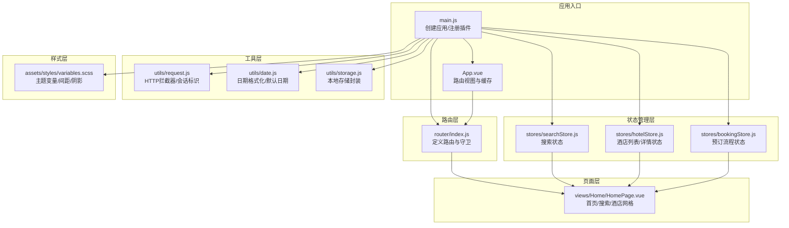
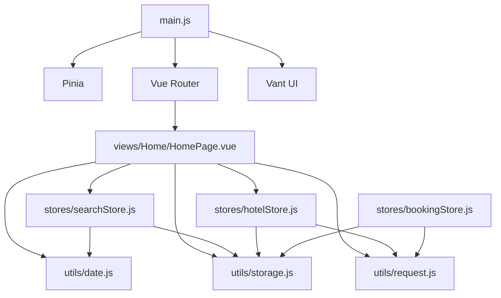
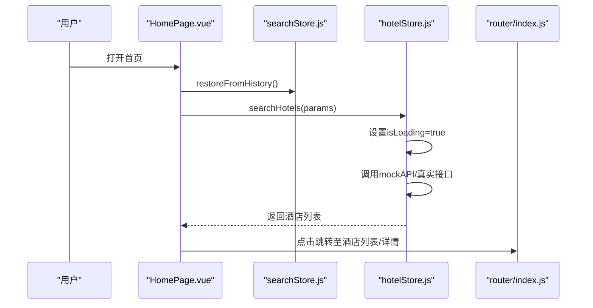
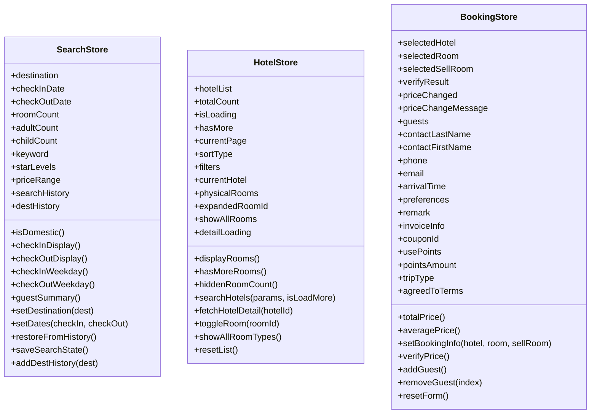
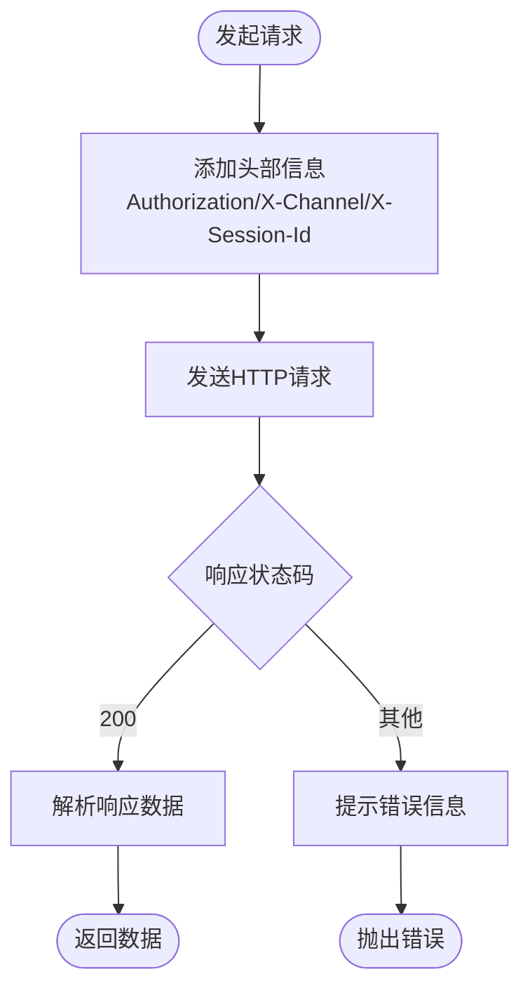
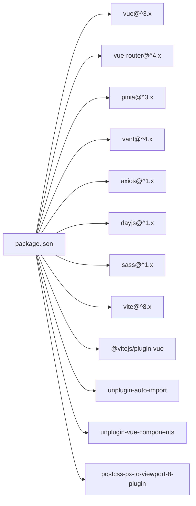

# 移动端H5前端架构

<cite>
**本文档引用的文件**
- [package.json](file://hotel-seller-h5/package.json)
- [main.js](file://hotel-seller-h5/src/main.js)
- [App.vue](file://hotel-seller-h5/src/App.vue)
- [vite.config.js](file://hotel-seller-h5/vite.config.js)
- [router/index.js](file://hotel-seller-h5/src/router/index.js)
- [stores/hotelStore.js](file://hotel-seller-h5/src/stores/hotelStore.js)
- [stores/searchStore.js](file://hotel-seller-h5/src/stores/searchStore.js)
- [stores/bookingStore.js](file://hotel-seller-h5/src/stores/bookingStore.js)
- [utils/request.js](file://hotel-seller-h5/src/utils/request.js)
- [utils/date.js](file://hotel-seller-h5/src/utils/date.js)
- [utils/storage.js](file://hotel-seller-h5/src/utils/storage.js)
- [assets/styles/variables.scss](file://hotel-seller-h5/src/assets/styles/variables.scss)
- [views/Home/HomePage.vue](file://hotel-seller-h5/src/views/Home/HomePage.vue)
</cite>

## 目录
1. [引言](#引言)
2. [项目结构](#项目结构)
3. [核心组件](#核心组件)
4. [架构总览](#架构总览)
5. [详细组件分析](#详细组件分析)
6. [依赖关系分析](#依赖关系分析)
7. [性能考虑](#性能考虑)
8. [故障排除指南](#故障排除指南)
9. [结论](#结论)
10. [附录](#附录)

## 引言
本文件为酒店销售系统移动端H5前端（hotel-seller-h5）的架构文档，面向Vue 3 + Vant UI的移动端应用。文档从系统架构、组件关系、数据流与处理逻辑、集成点与错误处理、性能特性等方面进行深入解析，并结合移动端特性给出响应式设计、触摸交互优化、调试技巧、组件设计模式、状态管理最佳实践以及用户体验优化策略。

## 项目结构
该H5前端采用Vite构建，基于Vue 3 Composition API与Pinia状态管理，配合Vant 4 UI组件库实现移动端界面。项目遵循按功能域划分的目录组织方式：api、components、composables、router、stores、utils、views等模块清晰分离职责。

**图表来源**
- [main.js:1-33](file://hotel-seller-h5/src/main.js#L1-L33)
- [App.vue:1-21](file://hotel-seller-h5/src/App.vue#L1-L21)
- [router/index.js:1-65](file://hotel-seller-h5/src/router/index.js#L1-L65)
- [stores/searchStore.js:1-95](file://hotel-seller-h5/src/stores/searchStore.js#L1-L95)
- [stores/hotelStore.js:1-90](file://hotel-seller-h5/src/stores/hotelStore.js#L1-L90)
- [stores/bookingStore.js:1-86](file://hotel-seller-h5/src/stores/bookingStore.js#L1-L86)
- [utils/request.js:1-47](file://hotel-seller-h5/src/utils/request.js#L1-L47)
- [utils/date.js:1-41](file://hotel-seller-h5/src/utils/date.js#L1-L41)
- [utils/storage.js:1-23](file://hotel-seller-h5/src/utils/storage.js#L1-L23)
- [assets/styles/variables.scss:1-50](file://hotel-seller-h5/src/assets/styles/variables.scss#L1-L50)
- [views/Home/HomePage.vue:1-423](file://hotel-seller-h5/src/views/Home/HomePage.vue#L1-L423)

**章节来源**
- [package.json:1-30](file://hotel-seller-h5/package.json#L1-L30)
- [vite.config.js:1-48](file://hotel-seller-h5/vite.config.js#L1-L48)

## 核心组件
- 应用入口与插件注册：创建Vue应用、注册Pinia与Vue Router；全局引入Vant组件与样式；挂载应用。
- 路由系统：定义首页、目的地、日期选择、关键字搜索、酒店列表、酒店详情、预订等页面路由，配置滚动行为与标题设置。
- 状态管理：三个核心Pinia Store分别负责搜索条件、酒店列表/详情、预订流程的数据与业务动作。
- 工具库：HTTP请求封装（含拦截器）、日期工具、本地存储封装。
- 样式体系：统一的主题变量、间距、圆角、阴影与动画参数，配合PostCSS插件实现px到vw的自动转换。

**章节来源**
- [main.js:1-33](file://hotel-seller-h5/src/main.js#L1-L33)
- [router/index.js:1-65](file://hotel-seller-h5/src/router/index.js#L1-L65)
- [stores/searchStore.js:1-95](file://hotel-seller-h5/src/stores/searchStore.js#L1-L95)
- [stores/hotelStore.js:1-90](file://hotel-seller-h5/src/stores/hotelStore.js#L1-L90)
- [stores/bookingStore.js:1-86](file://hotel-seller-h5/src/stores/bookingStore.js#L1-L86)
- [utils/request.js:1-47](file://hotel-seller-h5/src/utils/request.js#L1-L47)
- [utils/date.js:1-41](file://hotel-seller-h5/src/utils/date.js#L1-L41)
- [utils/storage.js:1-23](file://hotel-seller-h5/src/utils/storage.js#L1-L23)
- [assets/styles/variables.scss:1-50](file://hotel-seller-h5/src/assets/styles/variables.scss#L1-L50)

## 架构总览
整体架构采用“入口应用 → 路由 → 页面组件 → Pinia Store → 工具库”的分层设计。页面通过组合式函数（Composition API）访问Store，Store中封装异步操作与派生状态，工具库提供网络请求、日期与存储能力。Vant组件库提供移动端UI基础能力，PostCSS插件保障多端适配。

**图表来源**
- [main.js:1-33](file://hotel-seller-h5/src/main.js#L1-L33)
- [router/index.js:1-65](file://hotel-seller-h5/src/router/index.js#L1-L65)
- [views/Home/HomePage.vue:1-423](file://hotel-seller-h5/src/views/Home/HomePage.vue#L1-L423)
- [stores/searchStore.js:1-95](file://hotel-seller-h5/src/stores/searchStore.js#L1-L95)
- [stores/hotelStore.js:1-90](file://hotel-seller-h5/src/stores/hotelStore.js#L1-L90)
- [stores/bookingStore.js:1-86](file://hotel-seller-h5/src/stores/bookingStore.js#L1-L86)
- [utils/request.js:1-47](file://hotel-seller-h5/src/utils/request.js#L1-L47)
- [utils/date.js:1-41](file://hotel-seller-h5/src/utils/date.js#L1-L41)
- [utils/storage.js:1-23](file://hotel-seller-h5/src/utils/storage.js#L1-L23)

## 详细组件分析

### 路由与页面导航
- 路由定义：首页、目的地、日期选择、关键字搜索、酒店列表、酒店详情、预订等页面均采用动态导入以实现代码分割。
- 导航守卫：在进入路由前设置页面标题，保证移动端浏览器标签页显示友好名称。
- 滚动行为：返回顶部或恢复上次滚动位置，提升用户浏览体验。
- 缓存策略：App.vue通过计算属性收集需要缓存的路由名称，配合keep-alive减少重复渲染开销。

**图表来源**
- [views/Home/HomePage.vue:147-175](file://hotel-seller-h5/src/views/Home/HomePage.vue#L147-L175)
- [stores/searchStore.js:66-88](file://hotel-seller-h5/src/stores/searchStore.js#L66-L88)
- [stores/hotelStore.js:37-72](file://hotel-seller-h5/src/stores/hotelStore.js#L37-L72)
- [router/index.js:57-62](file://hotel-seller-h5/src/router/index.js#L57-L62)

**章节来源**
- [router/index.js:1-65](file://hotel-seller-h5/src/router/index.js#L1-L65)
- [App.vue:9-19](file://hotel-seller-h5/src/App.vue#L9-L19)
- [views/Home/HomePage.vue:147-175](file://hotel-seller-h5/src/views/Home/HomePage.vue#L147-L175)

### Pinia状态管理（移动端应用）
- 搜索状态（searchStore）：维护目的地、入住/离店日期、房间/客人数量、关键字、星级与价格范围、搜索历史与目的地历史；提供日期格式化与摘要展示；支持从本地存储恢复上一次搜索。
- 酒店状态（hotelStore）：维护列表数据、分页与加载状态、筛选条件、详情页数据与房型展开状态；提供房间类型展示控制与派生状态。
- 预订状态（bookingStore）：维护选中的酒店/房型、价格校验结果、客人信息表单、支付与优惠信息；提供总价与均价的派生状态。

**图表来源**
- [stores/searchStore.js:1-95](file://hotel-seller-h5/src/stores/searchStore.js#L1-L95)
- [stores/hotelStore.js:1-90](file://hotel-seller-h5/src/stores/hotelStore.js#L1-L90)
- [stores/bookingStore.js:1-86](file://hotel-seller-h5/src/stores/bookingStore.js#L1-L86)

**章节来源**
- [stores/searchStore.js:1-95](file://hotel-seller-h5/src/stores/searchStore.js#L1-L95)
- [stores/hotelStore.js:1-90](file://hotel-seller-h5/src/stores/hotelStore.js#L1-L90)
- [stores/bookingStore.js:1-86](file://hotel-seller-h5/src/stores/bookingStore.js#L1-L86)

### API封装与网络请求处理
- 基础配置：基于Axios创建实例，设置基础URL、超时时间与默认头。
- 请求拦截：自动注入Authorization令牌、渠道标识与会话ID（SessionId），若不存在则生成随机值并缓存于会话存储。
- 响应拦截：统一校验业务状态码，非成功状态弹出提示并拒绝Promise；对超时、离线与服务异常进行分类提示。
- 会话管理：SessionId用于追踪移动端会话，避免重复生成。

**图表来源**
- [utils/request.js:4-47](file://hotel-seller-h5/src/utils/request.js#L4-L47)

**章节来源**
- [utils/request.js:1-47](file://hotel-seller-h5/src/utils/request.js#L1-L47)

### 组合式函数与页面逻辑
- 组合式函数（Composables）：当前仓库未发现独立的composables目录，但页面组件普遍使用setup语法与组合式API（如useSearchStore、useHotelStore）直接访问Store，体现了“页面即组合式函数”的轻量模式。
- 页面示例：首页（HomePage.vue）集中展示了搜索条件绑定、城市切换、酒店列表加载、路由跳转与组件复用（价格展示、评分、星标等）。

**章节来源**
- [views/Home/HomePage.vue:130-175](file://hotel-seller-h5/src/views/Home/HomePage.vue#L130-L175)

### 响应式设计与移动端适配
- 视口单位：PostCSS插件将px转换为vw，确保在不同宽度设备上保持一致的视觉比例。
- 安全区域：底部TabBar使用安全区域适配，避免刘海屏遮挡。
- 触摸反馈：卡片元素提供按下缩放的视觉反馈，增强触摸交互感知。
- 样式变量：统一的颜色、间距、圆角、阴影与动画参数，便于快速迭代与主题定制。

**章节来源**
- [vite.config.js:20-42](file://hotel-seller-h5/vite.config.js#L20-L42)
- [assets/styles/variables.scss:1-50](file://hotel-seller-h5/src/assets/styles/variables.scss#L1-L50)
- [views/Home/HomePage.vue:397-421](file://hotel-seller-h5/src/views/Home/HomePage.vue#L397-L421)

### 存储管理与离线支持
- 本地存储：封装localStorage读写，带前缀避免冲突；提供删除方法清理过期数据。
- 搜索历史：支持从本地恢复上一次搜索条件，提升连续使用的便捷性。
- 会话标识：SessionId存储于会话存储，跨页面共享且不持久化，降低隐私风险。

**章节来源**
- [utils/storage.js:1-23](file://hotel-seller-h5/src/utils/storage.js#L1-L23)
- [stores/searchStore.js:66-88](file://hotel-seller-h5/src/stores/searchStore.js#L66-L88)

## 依赖关系分析
- 运行时依赖：Vue 3、Vue Router、Pinia、Vant UI、Axios、Day.js、Sass。
- 开发依赖：Vite、Vue插件、自动导入Vant组件、PostCSS插件（px转vw）。
- 构建别名：@指向src目录，简化路径引用。

**图表来源**
- [package.json:11-28](file://hotel-seller-h5/package.json#L11-L28)

**章节来源**
- [package.json:1-30](file://hotel-seller-h5/package.json#L1-L30)
- [vite.config.js:1-48](file://hotel-seller-h5/vite.config.js#L1-L48)

## 性能考虑
- 代码分割：路由级懒加载减少首屏体积。
- Keep-Alive缓存：仅缓存需要的页面，降低重复渲染成本。
- 图片懒加载：启用Vant Lazyload，延迟加载非首屏图片。
- 网络请求节流：在高频交互场景下合并或去抖请求（建议在Store actions中扩展）。
- 样式体积：统一变量与最小化重复样式，避免深层嵌套导致的样式膨胀。
- 会话与缓存：合理利用本地存储与会话存储，减少重复请求。

## 故障排除指南
- 网络请求失败：检查基础URL配置、Token注入与会话ID生成逻辑；确认拦截器对错误状态的提示是否正确触发。
- 日期显示异常：核对日期格式化工具与默认日期生成逻辑，确保国际化与时区处理符合预期。
- 本地存储异常：捕获序列化/反序列化异常，必要时清理损坏条目。
- 样式不生效：确认Sass预处理器附加变量与Mixins是否正确注入，PostCSS插件是否匹配目标目录。

**章节来源**
- [utils/request.js:18-35](file://hotel-seller-h5/src/utils/request.js#L18-L35)
- [utils/date.js:29-40](file://hotel-seller-h5/src/utils/date.js#L29-L40)
- [utils/storage.js:3-18](file://hotel-seller-h5/src/utils/storage.js#L3-L18)
- [vite.config.js:20-42](file://hotel-seller-h5/vite.config.js#L20-L42)

## 结论
该移动端H5前端以Vue 3 + Vant为核心，结合Pinia实现清晰的状态分层与组合式函数模式，配合Axios拦截器与本地存储完善网络与数据持久化能力。通过PostCSS与样式变量体系实现良好的响应式与主题一致性。建议后续在组合式函数抽象、请求去抖与缓存策略、离线能力增强等方面持续演进，进一步提升性能与用户体验。

## 附录
- 移动端调试技巧：使用Chrome DevTools的设备模式、Network面板监控请求、Application面板检查Storage与缓存、Performance面板分析渲染瓶颈。
- 组件设计模式：优先使用可复用的展示组件（如价格、评分、星标），在页面中通过组合式函数注入状态与动作，保持组件职责单一。
- 用户体验优化：强化加载态与骨架屏、弱网降级提示、手势交互反馈、无障碍访问（ARIA）与可访问性测试。