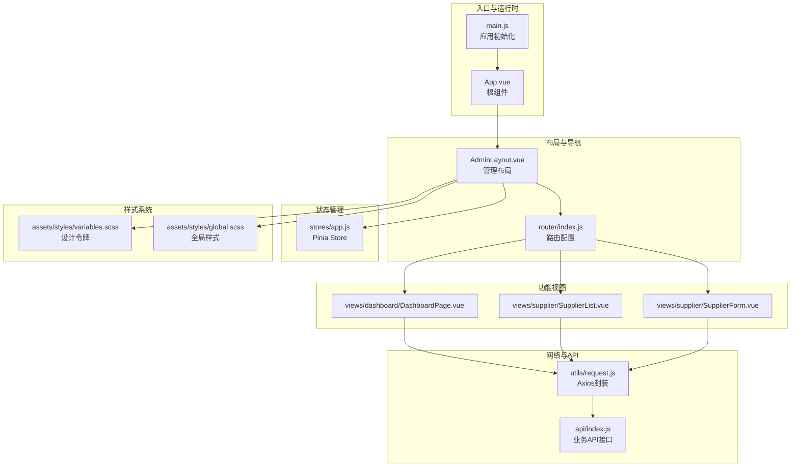
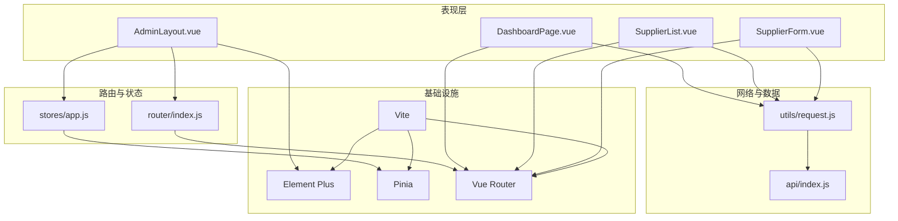
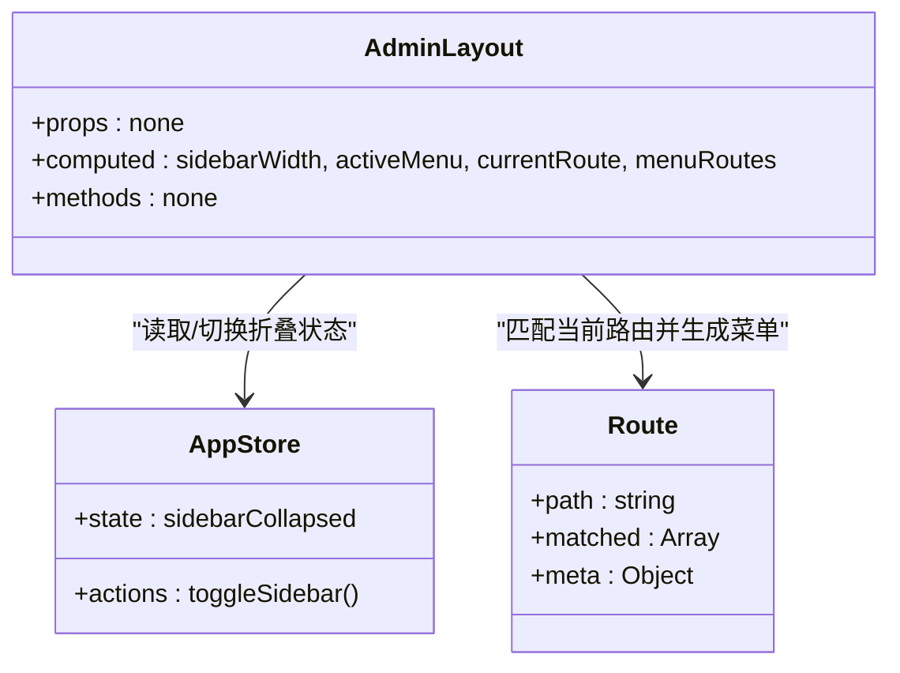
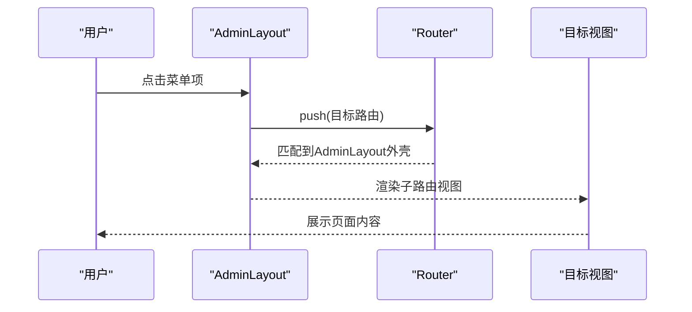
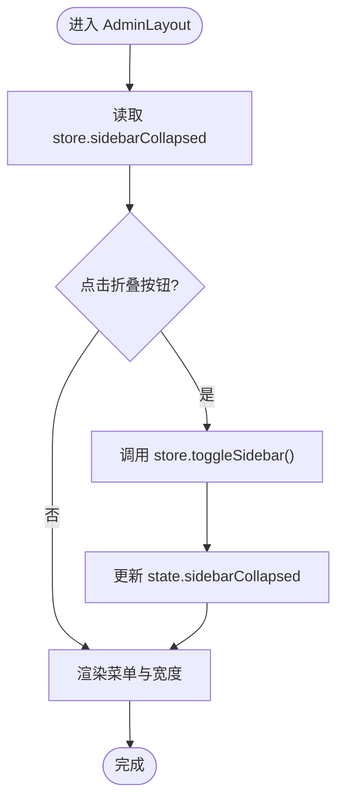
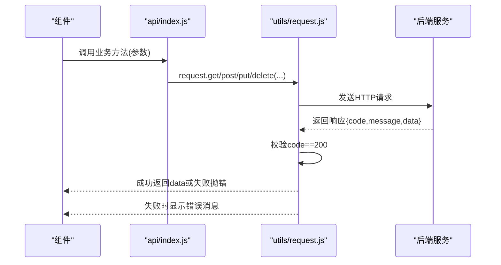
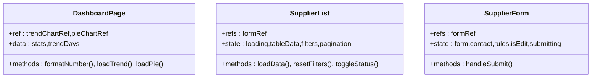
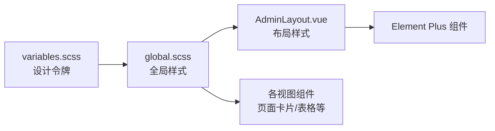
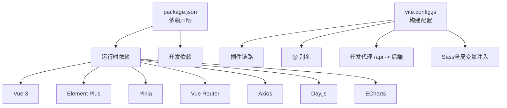

# 管理后台前端架构

<cite>
**本文档引用的文件**
- [package.json](file://hotel-admin-web/package.json)
- [vite.config.js](file://hotel-admin-web/vite.config.js)
- [main.js](file://hotel-admin-web/src/main.js)
- [App.vue](file://hotel-admin-web/src/App.vue)
- [AdminLayout.vue](file://hotel-admin-web/src/layout/AdminLayout.vue)
- [index.js](file://hotel-admin-web/src/router/index.js)
- [app.js](file://hotel-admin-web/src/stores/app.js)
- [request.js](file://hotel-admin-web/src/utils/request.js)
- [index.js](file://hotel-admin-web/src/api/index.js)
- [variables.scss](file://hotel-admin-web/src/assets/styles/variables.scss)
- [global.scss](file://hotel-admin-web/src/assets/styles/global.scss)
- [DashboardPage.vue](file://hotel-admin-web/src/views/dashboard/DashboardPage.vue)
- [SupplierList.vue](file://hotel-admin-web/src/views/supplier/SupplierList.vue)
- [SupplierForm.vue](file://hotel-admin-web/src/views/supplier/SupplierForm.vue)
- [README.md](file://hotel-admin-web/README.md)
</cite>

## 目录
1. [简介](#简介)
2. [项目结构](#项目结构)
3. [核心组件](#核心组件)
4. [架构总览](#架构总览)
5. [详细组件分析](#详细组件分析)
6. [依赖关系分析](#依赖关系分析)
7. [性能考虑](#性能考虑)
8. [故障排除指南](#故障排除指南)
9. [结论](#结论)
10. [附录](#附录)

## 简介
本文件为酒店销售系统管理后台前端（hotel-admin-web）的架构文档，面向Vue 3 + Element Plus的PC端管理界面。文档从系统架构、组件设计、状态管理、路由配置、API封装、样式体系、构建工具到开发与生产环境优化进行全链路解析，并提供组件通信机制、状态管理模式、数据流设计的最佳实践，以及与后端微服务的API交互与错误处理策略。

## 项目结构
该前端项目采用典型的Vue 3单页应用结构，围绕布局、路由、状态、API与视图模块组织代码，配合Vite构建工具与Element Plus组件库实现高可用的管理界面。

**图表来源**
- [main.js:1-23](file://hotel-admin-web/src/main.js#L1-L23)
- [App.vue:1-8](file://hotel-admin-web/src/App.vue#L1-L8)
- [AdminLayout.vue:1-194](file://hotel-admin-web/src/layout/AdminLayout.vue#L1-L194)
- [index.js:1-67](file://hotel-admin-web/src/router/index.js#L1-L67)
- [app.js:1-13](file://hotel-admin-web/src/stores/app.js#L1-L13)
- [variables.scss:1-52](file://hotel-admin-web/src/assets/styles/variables.scss#L1-L52)
- [global.scss:1-120](file://hotel-admin-web/src/assets/styles/global.scss#L1-L120)
- [DashboardPage.vue:1-233](file://hotel-admin-web/src/views/dashboard/DashboardPage.vue#L1-L233)
- [SupplierList.vue:1-167](file://hotel-admin-web/src/views/supplier/SupplierList.vue#L1-L167)
- [SupplierForm.vue:1-239](file://hotel-admin-web/src/views/supplier/SupplierForm.vue#L1-L239)
- [request.js:1-35](file://hotel-admin-web/src/utils/request.js#L1-L35)
- [index.js:1-124](file://hotel-admin-web/src/api/index.js#L1-L124)

**章节来源**
- [package.json:1-29](file://hotel-admin-web/package.json#L1-L29)
- [vite.config.js:1-41](file://hotel-admin-web/vite.config.js#L1-L41)
- [README.md:1-6](file://hotel-admin-web/README.md#L1-L6)

## 核心组件
- 应用入口与运行时：在入口中完成Element Plus国际化、图标注册、全局样式引入、Pinia与路由挂载。
- 布局组件：AdminLayout负责侧边菜单、面包屑、头部用户信息与主内容区渲染，结合Pinia控制侧边栏折叠状态。
- 路由系统：基于vue-router的history模式，采用嵌套路由与动态导入，meta字段驱动菜单生成。
- 状态管理：Pinia定义轻量store，集中管理UI状态（如侧边栏折叠）。
- API封装：Axios实例封装统一拦截器与响应校验，业务API按模块拆分。
- 样式体系：SCSS变量集中管理设计令牌，全局样式规范页面容器、卡片、表格等通用结构。

**章节来源**
- [main.js:1-23](file://hotel-admin-web/src/main.js#L1-L23)
- [AdminLayout.vue:1-194](file://hotel-admin-web/src/layout/AdminLayout.vue#L1-L194)
- [index.js:1-67](file://hotel-admin-web/src/router/index.js#L1-L67)
- [app.js:1-13](file://hotel-admin-web/src/stores/app.js#L1-L13)
- [request.js:1-35](file://hotel-admin-web/src/utils/request.js#L1-L35)
- [index.js:1-124](file://hotel-admin-web/src/api/index.js#L1-L124)
- [variables.scss:1-52](file://hotel-admin-web/src/assets/styles/variables.scss#L1-L52)
- [global.scss:1-120](file://hotel-admin-web/src/assets/styles/global.scss#L1-L120)

## 架构总览
整体采用“布局-路由-视图-状态-网络-样式”的分层架构，Element Plus提供UI基础能力，Vite提供开发与构建支持，Pinia与Axios分别承担状态与网络职责。

**图表来源**
- [AdminLayout.vue:1-194](file://hotel-admin-web/src/layout/AdminLayout.vue#L1-L194)
- [DashboardPage.vue:1-233](file://hotel-admin-web/src/views/dashboard/DashboardPage.vue#L1-L233)
- [SupplierList.vue:1-167](file://hotel-admin-web/src/views/supplier/SupplierList.vue#L1-L167)
- [SupplierForm.vue:1-239](file://hotel-admin-web/src/views/supplier/SupplierForm.vue#L1-L239)
- [index.js:1-67](file://hotel-admin-web/src/router/index.js#L1-L67)
- [app.js:1-13](file://hotel-admin-web/src/stores/app.js#L1-L13)
- [request.js:1-35](file://hotel-admin-web/src/utils/request.js#L1-L35)
- [index.js:1-124](file://hotel-admin-web/src/api/index.js#L1-L124)

## 详细组件分析

### AdminLayout 布局组件
- 设计模式：采用组合式API与计算属性，通过Pinia状态控制侧边栏宽度与折叠；利用路由元信息动态生成菜单项。
- 组件职责：侧边栏菜单、顶部面包屑、用户下拉、主内容区插槽。
- 样式管理：SCSS变量与深选择器覆盖Element Plus默认样式，确保主题一致性与可维护性。

**图表来源**
- [AdminLayout.vue:67-89](file://hotel-admin-web/src/layout/AdminLayout.vue#L67-L89)
- [app.js:1-13](file://hotel-admin-web/src/stores/app.js#L1-L13)
- [index.js:1-67](file://hotel-admin-web/src/router/index.js#L1-L67)

**章节来源**
- [AdminLayout.vue:1-194](file://hotel-admin-web/src/layout/AdminLayout.vue#L1-L194)
- [app.js:1-13](file://hotel-admin-web/src/stores/app.js#L1-L13)
- [index.js:1-67](file://hotel-admin-web/src/router/index.js#L1-L67)

### 路由与导航
- 路由结构：根路径使用AdminLayout作为外壳，子路由包含仪表盘、供应商管理、推荐酒店、操作日志等。
- 动态导入：视图组件懒加载，提升首屏性能。
- 菜单生成：根据路由meta中的标题与图标自动渲染菜单项，隐藏路由仅用于内部跳转。

**图表来源**
- [AdminLayout.vue:18-24](file://hotel-admin-web/src/layout/AdminLayout.vue#L18-L24)
- [index.js:3-58](file://hotel-admin-web/src/router/index.js#L3-L58)

**章节来源**
- [index.js:1-67](file://hotel-admin-web/src/router/index.js#L1-L67)
- [AdminLayout.vue:1-194](file://hotel-admin-web/src/layout/AdminLayout.vue#L1-L194)

### Pinia 状态管理
- Store设计：单一职责，仅管理UI相关状态（如侧边栏折叠），避免过度侵入业务数据。
- 使用方式：在布局组件中通过组合式API访问store，实现跨组件共享与响应式更新。

**图表来源**
- [app.js:7-11](file://hotel-admin-web/src/stores/app.js#L7-L11)
- [AdminLayout.vue:72-78](file://hotel-admin-web/src/layout/AdminLayout.vue#L72-L78)

**章节来源**
- [app.js:1-13](file://hotel-admin-web/src/stores/app.js#L1-L13)
- [AdminLayout.vue:1-194](file://hotel-admin-web/src/layout/AdminLayout.vue#L1-L194)

### API 封装与错误处理
- Axios实例：统一baseURL与超时，便于后续接入鉴权与多环境配置。
- 请求拦截：预留token注入位置，便于扩展认证。
- 响应拦截：统一校验code字段，非200时弹出错误提示并拒绝Promise，保证调用方无需重复判断。
- 业务API：按模块拆分（供应商、价格策略、缓存策略、推荐酒店、日志、统计），职责清晰，便于维护与测试。

**图表来源**
- [request.js:4-35](file://hotel-admin-web/src/utils/request.js#L4-L35)
- [index.js:1-124](file://hotel-admin-web/src/api/index.js#L1-L124)

**章节来源**
- [request.js:1-35](file://hotel-admin-web/src/utils/request.js#L1-L35)
- [index.js:1-124](file://hotel-admin-web/src/api/index.js#L1-L124)

### 视图组件与组件化开发
- DashboardPage：展示统计卡片、趋势图表与快捷操作，使用ECharts渲染，具备响应式尺寸调整。
- SupplierList：提供筛选、分页、状态切换、详情/编辑/价格策略跳转等完整供应商管理流程。
- SupplierForm：复杂表单场景，涵盖基础信息、结算信息、技术对接与联系人信息，内置表单校验与提交流程。

**图表来源**
- [DashboardPage.vue:112-233](file://hotel-admin-web/src/views/dashboard/DashboardPage.vue#L112-L233)
- [SupplierList.vue:93-167](file://hotel-admin-web/src/views/supplier/SupplierList.vue#L93-L167)
- [SupplierForm.vue:147-239](file://hotel-admin-web/src/views/supplier/SupplierForm.vue#L147-L239)

**章节来源**
- [DashboardPage.vue:1-233](file://hotel-admin-web/src/views/dashboard/DashboardPage.vue#L1-L233)
- [SupplierList.vue:1-167](file://hotel-admin-web/src/views/supplier/SupplierList.vue#L1-L167)
- [SupplierForm.vue:1-239](file://hotel-admin-web/src/views/supplier/SupplierForm.vue#L1-L239)

### 样式管理与主题设计
- 设计令牌：集中定义颜色、字体、间距、阴影、圆角与布局尺寸，保证视觉一致性。
- 全局样式：统一样式重置、页面容器、卡片、过滤条、表格操作、状态标签等通用结构。
- 组件样式：通过SCSS变量与深选择器覆盖Element Plus组件样式，保持主题风格统一。

**图表来源**
- [variables.scss:1-52](file://hotel-admin-web/src/assets/styles/variables.scss#L1-L52)
- [global.scss:1-120](file://hotel-admin-web/src/assets/styles/global.scss#L1-L120)
- [AdminLayout.vue:91-194](file://hotel-admin-web/src/layout/AdminLayout.vue#L91-L194)

**章节来源**
- [variables.scss:1-52](file://hotel-admin-web/src/assets/styles/variables.scss#L1-L52)
- [global.scss:1-120](file://hotel-admin-web/src/assets/styles/global.scss#L1-L120)
- [AdminLayout.vue:1-194](file://hotel-admin-web/src/layout/AdminLayout.vue#L1-L194)

## 依赖关系分析
- 运行时依赖：Vue 3、Element Plus、Pinia、Vue Router、Axios、Day.js、ECharts。
- 开发依赖：Vite、Vue插件、AutoImport与Components自动导入Element Plus组件、Sass编译与别名配置。
- 构建配置：插件链路、路径别名、开发服务器端口与代理、CSS预处理器注入变量。

**图表来源**
- [package.json:11-27](file://hotel-admin-web/package.json#L11-L27)
- [vite.config.js:8-40](file://hotel-admin-web/vite.config.js#L8-L40)

**章节来源**
- [package.json:1-29](file://hotel-admin-web/package.json#L1-L29)
- [vite.config.js:1-41](file://hotel-admin-web/vite.config.js#L1-L41)

## 性能考虑
- 代码分割：路由级懒加载减少首屏体积。
- 组件懒加载：Element Plus组件通过自动导入按需注册，降低打包体积。
- 图表性能：ECharts在挂载后初始化，窗口resize时仅触发必要重绘。
- 网络优化：Axios统一超时与拦截器，便于后续接入鉴权与缓存策略。
- 样式优化：SCSS变量复用与深选择器减少重复样式，提升维护效率。

## 故障排除指南
- 开发代理无效：检查Vite代理配置是否指向正确的后端地址与端口。
- 国际化与图标：确认Element Plus语言包与图标注册已在入口完成。
- 响应错误：Axios拦截器对非200状态统一提示，检查后端返回结构与message字段。
- 菜单不显示：确认路由meta字段包含title与icon，且未设置hidden为true。
- 样式冲突：优先使用深选择器覆盖Element Plus默认样式，避免全局污染。

**章节来源**
- [vite.config.js:24-32](file://hotel-admin-web/vite.config.js#L24-L32)
- [main.js:4-7](file://hotel-admin-web/src/main.js#L4-L7)
- [request.js:19-31](file://hotel-admin-web/src/utils/request.js#L19-L31)
- [AdminLayout.vue:18-24](file://hotel-admin-web/src/layout/AdminLayout.vue#L18-L24)
- [variables.scss:1-52](file://hotel-admin-web/src/assets/styles/variables.scss#L1-L52)

## 结论
该管理后台前端以Vue 3为核心，结合Element Plus与Pinia构建了清晰的布局、路由、状态与网络层，配合Vite实现高效的开发与构建体验。通过统一的API封装与样式体系，保障了组件化开发的一致性与可维护性。建议后续在鉴权、缓存与监控方面进一步完善，以适配更复杂的业务场景。

## 附录
- 开发环境：安装依赖后执行开发脚本启动本地服务，默认端口见构建配置。
- 生产构建：执行构建脚本生成静态资源，部署至Nginx或其他静态资源服务器。
- 后端对接：通过Vite代理将/api前缀转发至后端服务，确保跨域与域名一致。

**章节来源**
- [package.json:6-10](file://hotel-admin-web/package.json#L6-L10)
- [vite.config.js:24-32](file://hotel-admin-web/vite.config.js#L24-L32)
- [README.md:1-6](file://hotel-admin-web/README.md#L1-L6)