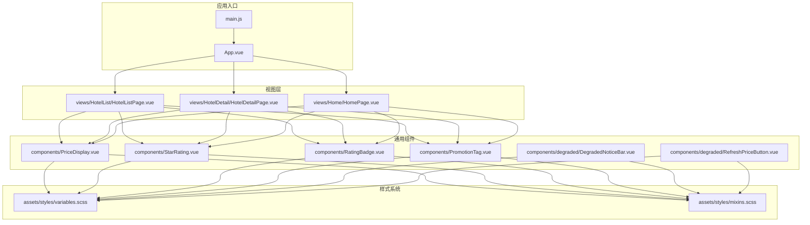
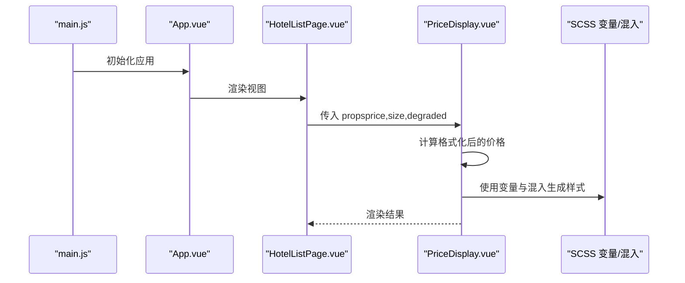
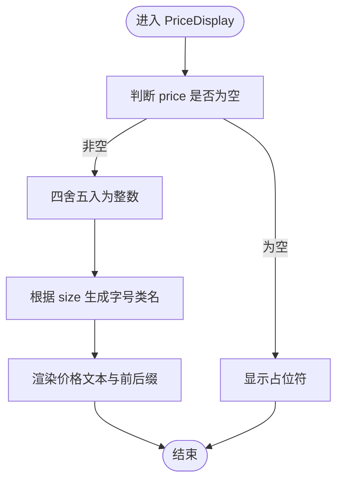
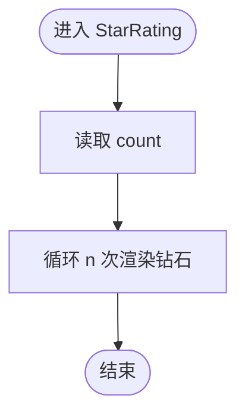
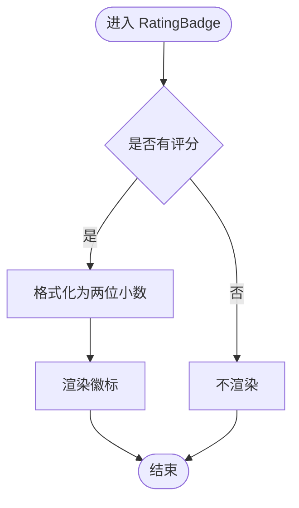
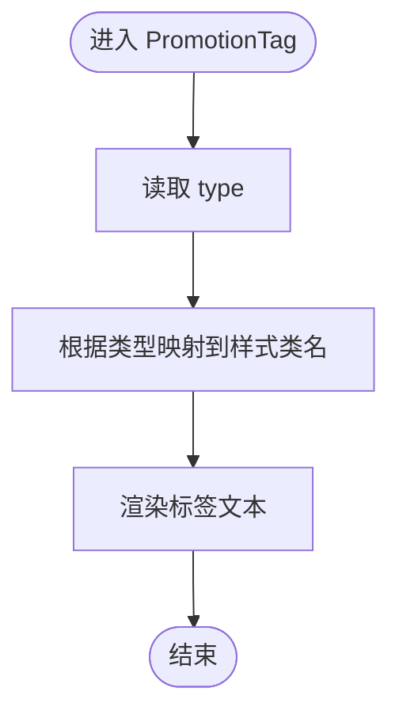
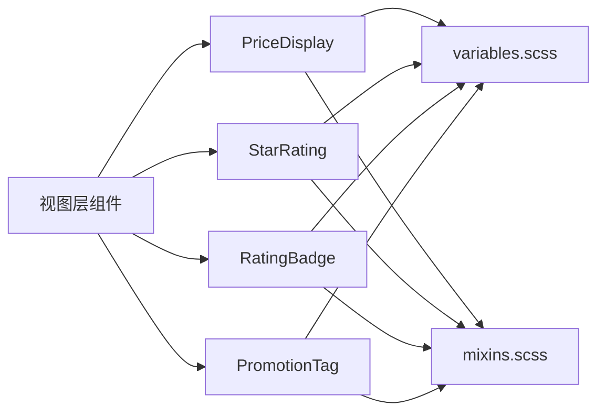

# 组件化架构设计

<cite>
**本文引用的文件**
- [DegradedNoticeBar.vue](file://hotel-seller-h5/src/components/degraded/DegradedNoticeBar.vue)
- [PriceDisplay.vue](file://hotel-seller-h5/src/components/PriceDisplay.vue)
- [StarRating.vue](file://hotel-seller-h5/src/components/StarRating.vue)
- [RatingBadge.vue](file://hotel-seller-h5/src/components/RatingBadge.vue)
- [PromotionTag.vue](file://hotel-seller-h5/src/components/PromotionTag.vue)
- [variables.scss](file://hotel-seller-h5/src/assets/styles/variables.scss)
- [mixins.scss](file://hotel-seller-h5/src/assets/styles/mixins.scss)
- [App.vue](file://hotel-seller-h5/src/App.vue)
- [main.js](file://hotel-seller-h5/src/main.js)
- [package.json](file://hotel-seller-h5/package.json)
- [vite.config.js](file://hotel-seller-h5/vite.config.js)
- [HotelListPage.vue](file://hotel-seller-h5/src/views/HotelList/HotelListPage.vue)
- [HotelDetailPage.vue](file://hotel-seller-h5/src/views/HotelDetail/HotelDetailPage.vue)
- [HomePage.vue](file://hotel-seller-h5/src/views/Home/HomePage.vue)
- [RefreshPriceButton.vue](file://hotel-seller-h5/src/components/degraded/RefreshPriceButton.vue)
</cite>

## 目录
1. [引言](#引言)
2. [项目结构](#项目结构)
3. [核心组件](#核心组件)
4. [架构总览](#架构总览)
5. [详细组件分析](#详细组件分析)
6. [依赖关系分析](#依赖关系分析)
7. [性能考虑](#性能考虑)
8. [故障排查指南](#故障排查指南)
9. [结论](#结论)
10. [附录](#附录)

## 引言
本设计文档面向酒店销售系统的前端组件化架构，聚焦 Vue 3 Composition API 的使用模式、组件设计原则与复用策略，系统性解析通用组件库的设计思路（如降级提示、价格显示、星级评分等），并阐述组件通信机制、props 传递策略、事件处理模式、样式管理与主题定制、响应式设计、测试策略、文档规范与版本管理最佳实践，以及如何通过解耦设计提升可维护性。

## 项目结构
酒店销售 H5 前端采用 Vite 构建，采用基于功能域的组织方式：views 展示页面、components 通用组件、assets 样式资源、stores/composables 业务状态与组合式逻辑、api/utils 工具层。核心组件集中在 hotel-seller-h5/src/components 下，配合样式变量与混入实现统一的主题与排版风格。

图表来源
- [main.js](file://hotel-seller-h5/src/main.js)
- [App.vue](file://hotel-seller-h5/src/App.vue)
- [HotelListPage.vue](file://hotel-seller-h5/src/views/HotelList/HotelListPage.vue)
- [HotelDetailPage.vue](file://hotel-seller-h5/src/views/HotelDetail/HotelDetailPage.vue)
- [HomePage.vue](file://hotel-seller-h5/src/views/Home/HomePage.vue)
- [PriceDisplay.vue](file://hotel-seller-h5/src/components/PriceDisplay.vue)
- [StarRating.vue](file://hotel-seller-h5/src/components/StarRating.vue)
- [RatingBadge.vue](file://hotel-seller-h5/src/components/RatingBadge.vue)
- [PromotionTag.vue](file://hotel-seller-h5/src/components/PromotionTag.vue)
- [DegradedNoticeBar.vue](file://hotel-seller-h5/src/components/degraded/DegradedNoticeBar.vue)
- [RefreshPriceButton.vue](file://hotel-seller-h5/src/components/degraded/RefreshPriceButton.vue)
- [variables.scss](file://hotel-seller-h5/src/assets/styles/variables.scss)
- [mixins.scss](file://hotel-seller-h5/src/assets/styles/mixins.scss)

章节来源
- [main.js](file://hotel-seller-h5/src/main.js)
- [App.vue](file://hotel-seller-h5/src/App.vue)
- [package.json](file://hotel-seller-h5/package.json)
- [vite.config.js](file://hotel-seller-h5/vite.config.js)

## 核心组件
本节从设计原则、数据流、样式与交互四个维度，系统梳理通用组件库的关键构件。

- 设计原则
  - 单一职责：每个组件聚焦一个展示或交互领域（如价格渲染、星级展示、促销标签）。
  - 可配置性：通过 props 暴露关键行为开关（如 size、showSuffix、degraded、displayMode）。
  - 可复用性：在不同页面（列表页、详情页、首页）中重复使用，减少重复代码。
  - 可扩展性：通过 SCSS 变量与混入，统一主题与排版，便于快速扩展新类型。

- 数据流与交互
  - 输入：通过 props 接收业务数据（价格、评分、促销类型等）。
  - 计算：使用 computed 对输入进行格式化与派生状态计算（如价格四舍五入、评分保留两位小数、标签类型映射）。
  - 输出：通过 emits 或内部交互触发刷新、点击等动作（如刷新价格按钮）。

- 样式与主题
  - 使用 variables.scss 定义主色、辅助色、中性色、圆角、间距、字体与阴影等基础变量。
  - 使用 mixins.scss 提供常用布局与视觉混入（如 ellipsis、hairline、flex-center、btn-primary 等）。
  - 组件内使用 scoped 样式隔离作用域，并通过类名组合实现尺寸、颜色、状态的灵活切换。

章节来源
- [PriceDisplay.vue](file://hotel-seller-h5/src/components/PriceDisplay.vue)
- [StarRating.vue](file://hotel-seller-h5/src/components/StarRating.vue)
- [RatingBadge.vue](file://hotel-seller-h5/src/components/RatingBadge.vue)
- [PromotionTag.vue](file://hotel-seller-h5/src/components/PromotionTag.vue)
- [DegradedNoticeBar.vue](file://hotel-seller-h5/src/components/degraded/DegradedNoticeBar.vue)
- [variables.scss](file://hotel-seller-h5/src/assets/styles/variables.scss)
- [mixins.scss](file://hotel-seller-h5/src/assets/styles/mixins.scss)

## 架构总览
下图展示了从应用入口到视图与组件的调用链路，以及组件与样式系统的依赖关系。

图表来源
- [main.js](file://hotel-seller-h5/src/main.js)
- [App.vue](file://hotel-seller-h5/src/App.vue)
- [HotelListPage.vue](file://hotel-seller-h5/src/views/HotelList/HotelListPage.vue)
- [PriceDisplay.vue](file://hotel-seller-h5/src/components/PriceDisplay.vue)
- [variables.scss](file://hotel-seller-h5/src/assets/styles/variables.scss)
- [mixins.scss](file://hotel-seller-h5/src/assets/styles/mixins.scss)

## 详细组件分析

### PriceDisplay 价格显示组件
- 职责：根据传入的价格与显示模式，渲染带货币符号、前缀、后缀与“参考价”标记的价格文本；支持尺寸控制与降级态显示策略。
- 关键点：
  - props：price、size、showSuffix、degraded、displayMode。
  - 计算：formattedPrice 将价格四舍五入为整数；sizeClass 依据 size 选择不同字号。
  - 条件渲染：当 degraded 为真且 displayMode 非 NO_PRICE 时才显示；否则显示占位符。
  - 样式：通过 scoped 类名与变量混入实现对齐、字号、颜色与字体族的统一控制。

图表来源
- [PriceDisplay.vue](file://hotel-seller-h5/src/components/PriceDisplay.vue)

章节来源
- [PriceDisplay.vue](file://hotel-seller-h5/src/components/PriceDisplay.vue)

### StarRating 星级评分组件
- 职责：以“钻石”图标渲染固定数量的星级，用于直观展示酒店星级。
- 关键点：
  - props：count 控制星级数量。
  - 渲染：使用 v-for 循环渲染 n 个“钻石”元素。
  - 样式：通过变量设置金色系颜色与紧凑间距，确保在小尺寸下清晰可读。

图表来源
- [StarRating.vue](file://hotel-seller-h5/src/components/StarRating.vue)

章节来源
- [StarRating.vue](file://hotel-seller-h5/src/components/StarRating.vue)

### RatingBadge 评分徽标组件
- 职责：以紧凑徽标形式展示评分数值，常用于卡片或列表中的评分标识。
- 关键点：
  - props：rating。
  - 计算：将评分格式化为两位小数字符串。
  - 条件渲染：仅在存在评分时显示徽标。

图表来源
- [RatingBadge.vue](file://hotel-seller-h5/src/components/RatingBadge.vue)

章节来源
- [RatingBadge.vue](file://hotel-seller-h5/src/components/RatingBadge.vue)

### PromotionTag 促销标签组件
- 职责：根据促销类型动态渲染不同颜色与样式的标签，用于突出展示折扣、返现、赠品等营销信息。
- 关键点：
  - props：type（默认 DISCOUNT）、tag（默认 减）。
  - 计算：typeClass 将类型映射为对应样式类名（红/橙/绿/灰）。
  - 样式：通过变量与混入实现背景、边框、文字颜色与圆角的一致性。

图表来源
- [PromotionTag.vue](file://hotel-seller-h5/src/components/PromotionTag.vue)

章节来源
- [PromotionTag.vue](file://hotel-seller-h5/src/components/PromotionTag.vue)

### DegradedNoticeBar 降级提示组件
- 职责：在服务降级或参考价场景下，向用户提示“当前价格为参考价，实际以预订时为准”的信息。
- 关键点：
  - 结构：左侧图标 + 文本提示。
  - 样式：使用变量定义浅色背景、边框与圆角，确保在列表与卡片中一致的视觉表现。

章节来源
- [DegradedNoticeBar.vue](file://hotel-seller-h5/src/components/degraded/DegradedNoticeBar.vue)

### RefreshPriceButton 刷新价格按钮
- 职责：在价格降级或需要重新拉取时，触发价格刷新操作。
- 关键点：
  - 交互：通过点击事件触发刷新流程。
  - 样式：与整体按钮风格保持一致，遵循混入与变量体系。

章节来源
- [RefreshPriceButton.vue](file://hotel-seller-h5/src/components/degraded/RefreshPriceButton.vue)

## 依赖关系分析
- 组件间依赖
  - 视图层（HotelListPage、HotelDetailPage、HomePage）依赖通用组件（PriceDisplay、StarRating、RatingBadge、PromotionTag）。
  - 通用组件依赖样式系统（variables.scss、mixins.scss）以实现主题与排版一致性。
- 外部依赖
  - 运行时依赖：Vue 3、Vant 图标（van-icon）。
  - 构建依赖：Vite、SCSS 编译器。

图表来源
- [HotelListPage.vue](file://hotel-seller-h5/src/views/HotelList/HotelListPage.vue)
- [HotelDetailPage.vue](file://hotel-seller-h5/src/views/HotelDetail/HotelDetailPage.vue)
- [HomePage.vue](file://hotel-seller-h5/src/views/Home/HomePage.vue)
- [PriceDisplay.vue](file://hotel-seller-h5/src/components/PriceDisplay.vue)
- [StarRating.vue](file://hotel-seller-h5/src/components/StarRating.vue)
- [RatingBadge.vue](file://hotel-seller-h5/src/components/RatingBadge.vue)
- [PromotionTag.vue](file://hotel-seller-h5/src/components/PromotionTag.vue)
- [variables.scss](file://hotel-seller-h5/src/assets/styles/variables.scss)
- [mixins.scss](file://hotel-seller-h5/src/assets/styles/mixins.scss)

章节来源
- [package.json](file://hotel-seller-h5/package.json)
- [vite.config.js](file://hotel-seller-h5/vite.config.js)

## 性能考虑
- 组件渲染优化
  - 使用 computed 缓存计算结果，避免重复计算（如价格格式化、评分格式化、标签类型映射）。
  - 条件渲染（如降级态与占位符）减少不必要的 DOM 更新。
- 样式优化
  - 通过 SCSS 变量与混入集中管理样式，降低重复定义与构建体积。
  - 使用 scoped 样式避免全局污染，同时保持样式局部化。
- 运行时优化
  - 合理拆分组件，避免单组件承担过多职责导致重渲染范围扩大。
  - 在高频列表中，优先使用轻量组件与简洁模板。

## 故障排查指南
- 常见问题
  - 价格显示异常：检查 price 是否为有效数字，确认 displayMode 与 degraded 的组合是否符合预期。
  - 星级显示不正确：确认 count 是否为正整数，避免负值或小数导致渲染异常。
  - 促销标签颜色不对：核对 type 是否在映射表中，若为新增类型需补充映射。
  - 样式不生效：确认 variables.scss 与 mixins.scss 是否被正确引入，scoped 样式是否覆盖到目标元素。
- 调试建议
  - 在组件入口添加日志输出 props 值与计算结果。
  - 使用浏览器开发者工具检查最终渲染的类名与样式来源。
  - 在视图层打印父组件传入的原始数据，定位数据流转问题。

## 结论
通过 Vue 3 Composition API 与组件化架构，酒店销售系统实现了高内聚、低耦合的通用组件库。以 props 为中心的数据传递、computed 的计算缓存、SCSS 变量与混入的样式体系，共同保障了组件的可配置性、可复用性与可维护性。结合视图层的模块化组织与构建工具的工程化能力，系统具备良好的扩展性与稳定性。

## 附录
- 组件通信机制
  - 父子通信：通过 props 传递数据，子组件通过 emits 派发事件（如刷新价格）。
  - 全局状态：可通过 pinia 状态管理（如 bookingStore、hotelStore、searchStore）在多组件间共享数据。
- props 传递策略
  - 明确默认值与类型约束，避免空值与类型错误。
  - 将展示相关参数（size、showSuffix、degraded、displayMode）集中暴露，便于统一控制。
- 事件处理模式
  - 子组件通过 emit('refresh') 等事件向上游通知，父组件在视图层处理具体逻辑。
- 样式管理与主题定制
  - 使用 variables.scss 定义品牌色与基础变量，mixins.scss 提供常用布局与视觉混入。
  - 组件内通过 scoped 样式与类名组合实现差异化展示，避免样式冲突。
- 响应式设计
  - 通过 SCSS 变量与混入实现统一的间距与圆角体系，组件在不同屏幕尺寸下保持一致的视觉节奏。
- 测试策略
  - 单元测试：针对计算属性与事件派发进行断言，覆盖边界条件（空值、负数、特殊类型）。
  - 集成测试：在视图层模拟父组件传参，验证组件渲染与交互。
- 文档编写规范
  - 组件文档包含：用途、props 列表（含默认值与类型）、事件列表、使用示例、注意事项。
- 版本管理最佳实践
  - 语义化版本：小改动（修复）+ 补丁版本，功能新增 + 次版本，破坏性变更 + 主版本。
  - 变更日志：记录每个版本的新增、修复与破坏性变更，便于回溯与升级。