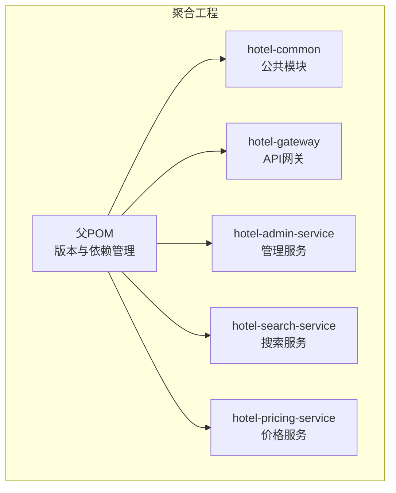
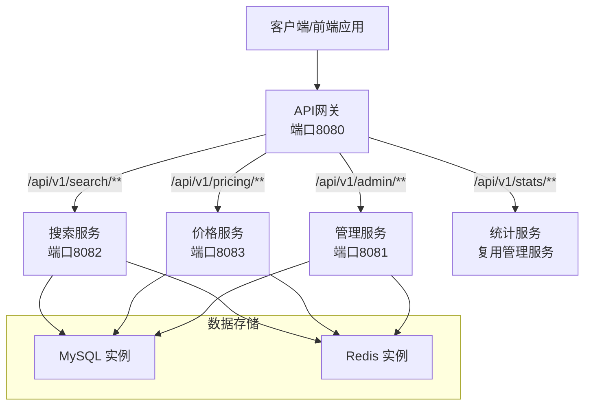
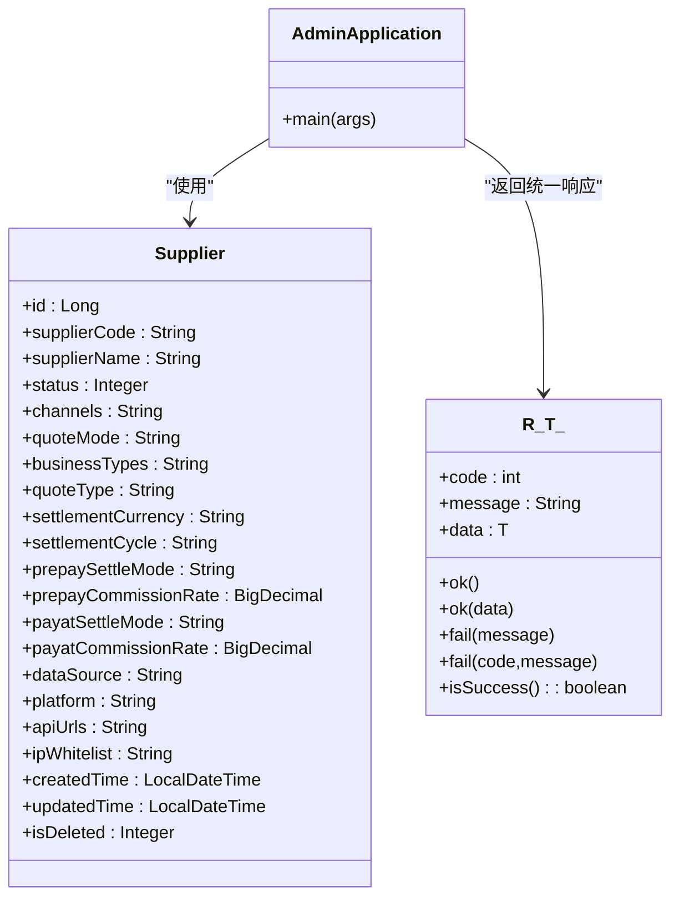
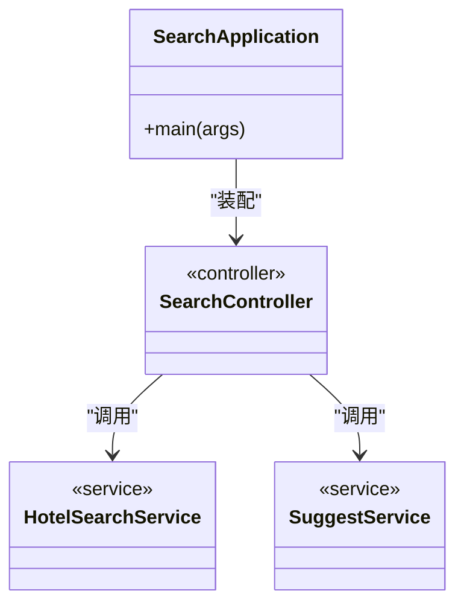
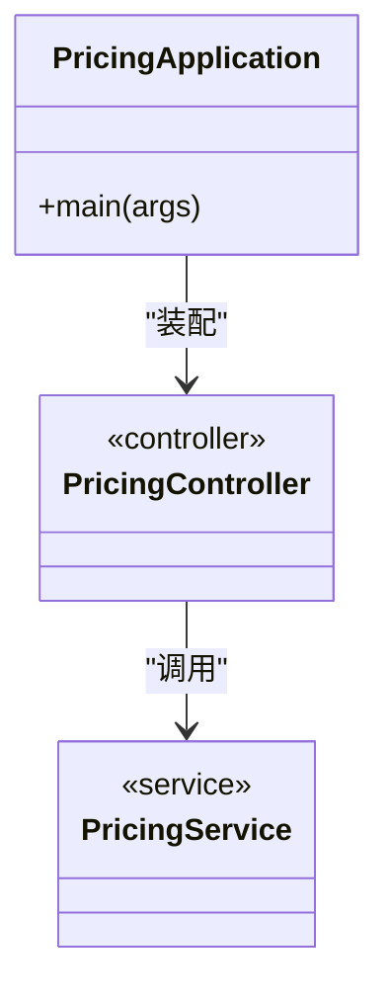
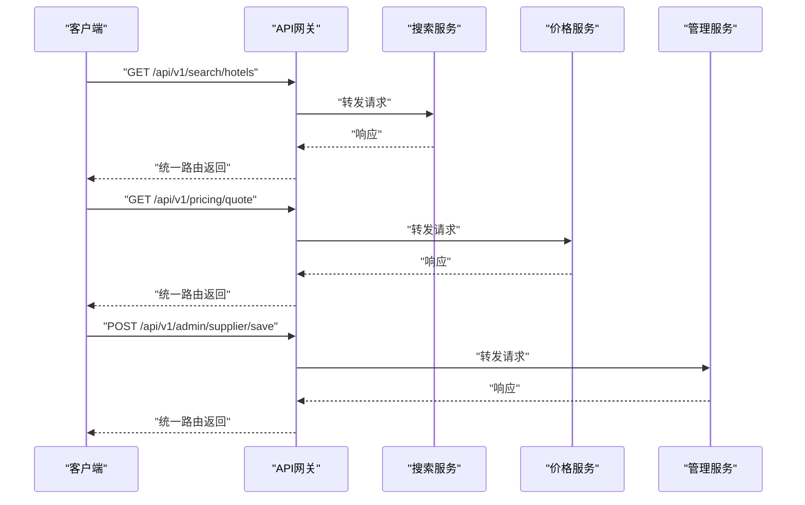
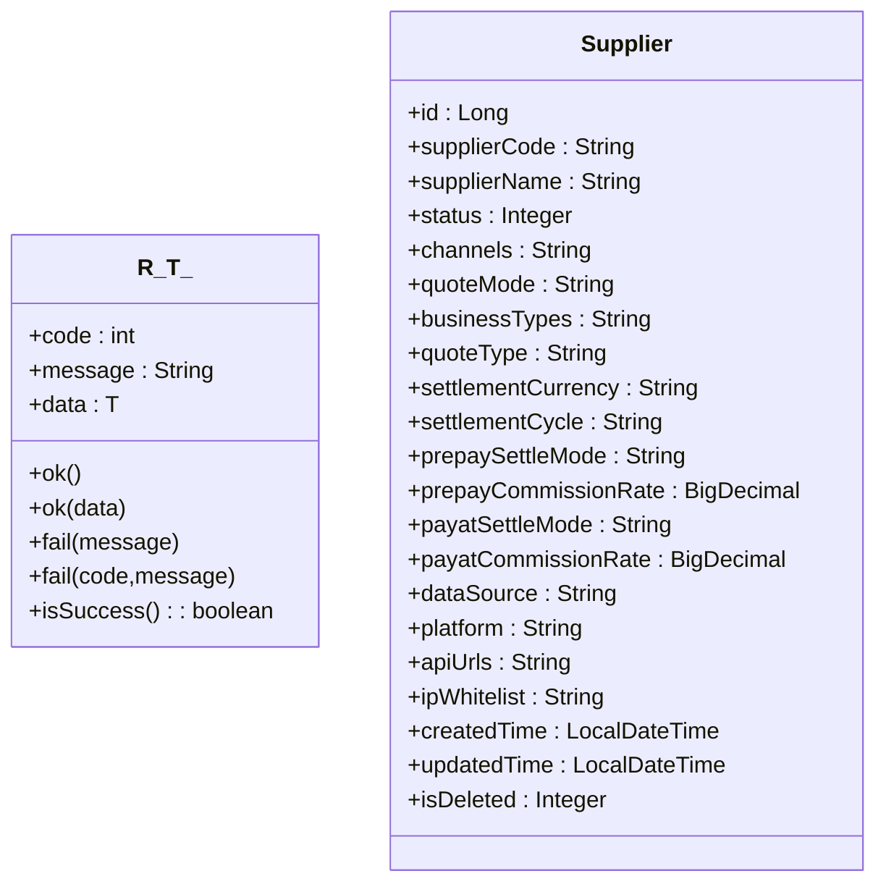
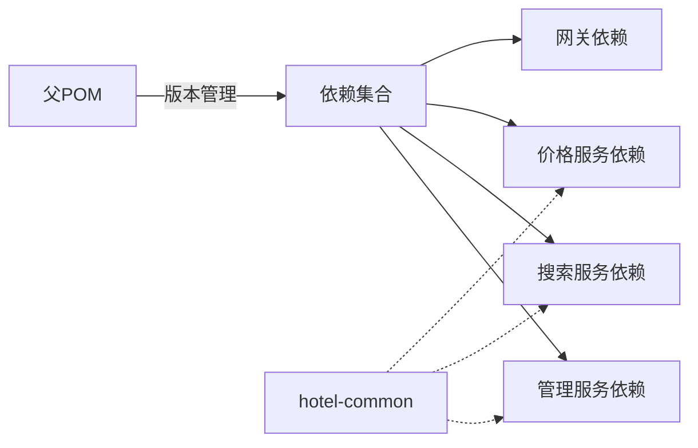

# 后端架构

<cite>
**本文引用的文件**
- [pom.xml](file://hotel-seller-backend/pom.xml)
- [hotel-admin-service/pom.xml](file://hotel-seller-backend/hotel-admin-service/pom.xml)
- [hotel-search-service/pom.xml](file://hotel-seller-backend/hotel-search-service/pom.xml)
- [hotel-pricing-service/pom.xml](file://hotel-seller-backend/hotel-pricing-service/pom.xml)
- [hotel-gateway/pom.xml](file://hotel-seller-backend/hotel-gateway/pom.xml)
- [application.yml（管理服务）](file://hotel-seller-backend/hotel-admin-service/src/main/resources/application.yml)
- [application.yml（搜索服务）](file://hotel-seller-backend/hotel-search-service/src/main/resources/application.yml)
- [application.yml（价格服务）](file://hotel-seller-backend/hotel-pricing-service/src/main/resources/application.yml)
- [application.yml（网关）](file://hotel-seller-backend/hotel-gateway/src/main/resources/application.yml)
- [AdminApplication.java](file://hotel-seller-backend/hotel-admin-service/src/main/java/com/ceair/hotel/admin/AdminApplication.java)
- [SearchApplication.java](file://hotel-seller-backend/hotel-search-service/src/main/java/com/ceair/hotel/search/SearchApplication.java)
- [PricingApplication.java](file://hotel-seller-backend/hotel-pricing-service/src/main/java/com/ceair/hotel/pricing/PricingApplication.java)
- [GatewayApplication.java](file://hotel-seller-backend/hotel-gateway/src/main/java/com/ceair/hotel/gateway/GatewayApplication.java)
- [Supplier.java](file://hotel-seller-backend/hotel-common/src/main/java/com/ceair/hotel/common/entity/Supplier.java)
- [R.java](file://hotel-seller-backend/hotel-common/src/main/java/com/ceair/hotel/common/dto/R.java)
</cite>

## 目录
1. [简介](#简介)
2. [项目结构](#项目结构)
3. [核心组件](#核心组件)
4. [架构总览](#架构总览)
5. [详细组件分析](#详细组件分析)
6. [依赖分析](#依赖分析)
7. [性能考虑](#性能考虑)
8. [故障排查指南](#故障排查指南)
9. [结论](#结论)
10. [附录](#附录)

## 简介
本项目为酒店销售系统的后端微服务架构，采用多模块Maven聚合工程组织，包含统一网关层与三个核心业务微服务：管理服务（酒店供应商、价格策略、推荐酒店、缓存策略管理）、搜索服务（关键词匹配、Suggest、排序与筛选）、价格服务（缓存报价、实时报价、加价处理、规则解析与快照降级）。系统通过API网关进行统一入口、鉴权、限流与路由转发，并结合Redis与MySQL实现高性能读写分离与缓存策略。

## 项目结构
- 聚合工程采用Maven多模块管理，父POM集中定义版本与依赖管理，子模块按功能域拆分。
- 核心模块：
  - hotel-common：公共实体、DTO、枚举、异常与工具类，供各服务复用。
  - hotel-gateway：Spring Cloud Gateway网关，负责跨域、路由、前缀剥离与日志。
  - hotel-admin-service：管理后台服务，提供供应商、价格策略、推荐酒店、缓存策略与运营统计相关接口。
  - hotel-search-service：搜索服务，提供酒店列表检索、Suggest建议与筛选能力。
  - hotel-pricing-service：价格服务，提供报价计算、缓存与降级策略。
- 运行端口分配：网关8080；搜索8082；价格8083；管理8081。

**图表来源**
- [pom.xml:21-27](file://hotel-seller-backend/pom.xml#L21-L27)

**章节来源**
- [pom.xml:1-122](file://hotel-seller-backend/pom.xml#L1-L122)

## 核心组件
- 管理服务（hotel-admin-service）
  - 职责：供应商管理、价格策略管理、推荐酒店管理、缓存策略管理、运营日志与统计。
  - 技术栈：Spring Boot + MyBatis-Plus + Druid + Redis + Knife4j。
  - 端口与数据源：端口8081；独立MySQL库；Redis数据库0。
- 搜索服务（hotel-search-service）
  - 职责：酒店列表检索、Suggest建议、排序与筛选。
  - 技术栈：Spring Boot + MyBatis-Plus + Redis + Knife4j。
  - 端口与数据源：端口8082；独立MySQL库；Redis数据库1。
- 价格服务（hotel-pricing-service）
  - 职责：缓存报价、实时报价、加价处理、规则解析、快照降级。
  - 技术栈：Spring Boot + MyBatis-Plus + Redis + Knife4j。
  - 端口与数据源：端口8083；独立MySQL库；Redis数据库2。
- 网关（hotel-gateway）
  - 职责：统一入口、跨域配置、路由转发（/api/v1/search、/api/v1/pricing、/api/v1/admin、/api/v1/stats）、前缀剥离、访问日志。
  - 技术栈：Spring Cloud Gateway + Reactive Redis。
- 公共模块（hotel-common）
  - 职责：统一响应体、分页请求/结果、通用实体与枚举、全局异常处理。
  - 示例实体：Supplier（供应商信息）；示例响应：R（统一封装）。

**章节来源**
- [hotel-admin-service/pom.xml:16-54](file://hotel-seller-backend/hotel-admin-service/pom.xml#L16-L54)
- [hotel-search-service/pom.xml:16-50](file://hotel-seller-backend/hotel-search-service/pom.xml#L16-L50)
- [hotel-pricing-service/pom.xml:16-50](file://hotel-seller-backend/hotel-pricing-service/pom.xml#L16-L50)
- [hotel-gateway/pom.xml:16-25](file://hotel-seller-backend/hotel-gateway/pom.xml#L16-L25)
- [application.yml（管理服务）:1-44](file://hotel-seller-backend/hotel-admin-service/src/main/resources/application.yml#L1-L44)
- [application.yml（搜索服务）:1-37](file://hotel-seller-backend/hotel-search-service/src/main/resources/application.yml#L1-L37)
- [application.yml（价格服务）:1-37](file://hotel-seller-backend/hotel-pricing-service/src/main/resources/application.yml#L1-L37)
- [application.yml（网关）:1-54](file://hotel-seller-backend/hotel-gateway/src/main/resources/application.yml#L1-L54)
- [Supplier.java:1-81](file://hotel-seller-backend/hotel-common/src/main/java/com/ceair/hotel/common/entity/Supplier.java#L1-L81)
- [R.java:1-48](file://hotel-seller-backend/hotel-common/src/main/java/com/ceair/hotel/common/dto/R.java#L1-L48)

## 架构总览
系统采用“网关 + 多微服务”的分布式架构。客户端通过网关访问各业务服务，网关根据路径前缀将请求路由到对应服务实例。各服务内部使用MyBatis-Plus访问MySQL，使用Redis进行缓存与会话存储。公共模块提供统一的数据模型与响应封装，确保跨服务一致性。

**图表来源**
- [application.yml（网关）:17-48](file://hotel-seller-backend/hotel-gateway/src/main/resources/application.yml#L17-L48)
- [application.yml（管理服务）:9-22](file://hotel-seller-backend/hotel-admin-service/src/main/resources/application.yml#L9-L22)
- [application.yml（搜索服务）:7-20](file://hotel-seller-backend/hotel-search-service/src/main/resources/application.yml#L7-L20)
- [application.yml（价格服务）:7-20](file://hotel-seller-backend/hotel-pricing-service/src/main/resources/application.yml#L7-L20)

## 详细组件分析

### 管理服务（hotel-admin-service）
- 应用入口：AdminApplication，启用扫描包与Mapper扫描。
- 配置要点：端口8081；MySQL连接与Druid连接池；Redis数据库0；MyBatis-Plus映射与驼峰配置；Knife4j启用。
- 控制器与服务：包含供应商、价格策略、推荐酒店、缓存策略、运营日志与统计等控制器与服务实现。
- 数据模型：使用公共模块中的Supplier等实体，统一响应使用R封装。

**图表来源**
- [AdminApplication.java:8-15](file://hotel-seller-backend/hotel-admin-service/src/main/java/com/ceair/hotel/admin/AdminApplication.java#L8-L15)
- [Supplier.java:1-81](file://hotel-seller-backend/hotel-common/src/main/java/com/ceair/hotel/common/entity/Supplier.java#L1-L81)
- [R.java:1-48](file://hotel-seller-backend/hotel-common/src/main/java/com/ceair/hotel/common/dto/R.java#L1-L48)

**章节来源**
- [AdminApplication.java:1-16](file://hotel-seller-backend/hotel-admin-service/src/main/java/com/ceair/hotel/admin/AdminApplication.java#L1-L16)
- [application.yml（管理服务）:1-44](file://hotel-seller-backend/hotel-admin-service/src/main/resources/application.yml#L1-L44)
- [Supplier.java:1-81](file://hotel-seller-backend/hotel-common/src/main/java/com/ceair/hotel/common/entity/Supplier.java#L1-L81)
- [R.java:1-48](file://hotel-seller-backend/hotel-common/src/main/java/com/ceair/hotel/common/dto/R.java#L1-L48)

### 搜索服务（hotel-search-service）
- 应用入口：SearchApplication，启用扫描包与Mapper扫描。
- 配置要点：端口8082；MySQL连接与Druid连接池；Redis数据库1；MyBatis-Plus映射与驼峰配置；Knife4j启用。
- 能力范围：酒店列表检索、Suggest建议、排序与筛选。

**图表来源**
- [SearchApplication.java:8-16](file://hotel-seller-backend/hotel-search-service/src/main/java/com/ceair/hotel/search/SearchApplication.java#L8-L16)

**章节来源**
- [SearchApplication.java:1-17](file://hotel-seller-backend/hotel-search-service/src/main/java/com/ceair/hotel/search/SearchApplication.java#L1-L17)
- [application.yml（搜索服务）:1-37](file://hotel-seller-backend/hotel-search-service/src/main/resources/application.yml#L1-L37)

### 价格服务（hotel-pricing-service）
- 应用入口：PricingApplication，启用扫描包与Mapper扫描。
- 配置要点：端口8083；MySQL连接与Druid连接池；Redis数据库2；MyBatis-Plus映射与驼峰配置；Knife4j启用。
- 能力范围：缓存报价、实时报价、加价处理、规则解析、快照降级。

**图表来源**
- [PricingApplication.java:8-16](file://hotel-seller-backend/hotel-pricing-service/src/main/java/com/ceair/hotel/pricing/PricingApplication.java#L8-L16)

**章节来源**
- [PricingApplication.java:1-17](file://hotel-seller-backend/hotel-pricing-service/src/main/java/com/ceair/hotel/pricing/PricingApplication.java#L1-L17)
- [application.yml（价格服务）:1-37](file://hotel-seller-backend/hotel-pricing-service/src/main/resources/application.yml#L1-L37)

### 网关（hotel-gateway）
- 应用入口：GatewayApplication。
- 配置要点：端口8080；全局CORS；路由规则：
  - /api/v1/search/** → 搜索服务（端口8082）
  - /api/v1/pricing/** → 价格服务（端口8083）
  - /api/v1/admin/** → 管理服务（端口8081）
  - /api/v1/stats/** → 管理服务（端口8081）
- 功能：跨域、路由、前缀剥离（StripPrefix=0），便于下游服务直接使用原始路径。

**图表来源**
- [application.yml（网关）:17-48](file://hotel-seller-backend/hotel-gateway/src/main/resources/application.yml#L17-L48)
- [GatewayApplication.java:6-12](file://hotel-seller-backend/hotel-gateway/src/main/java/com/ceair/hotel/gateway/GatewayApplication.java#L6-L12)

**章节来源**
- [GatewayApplication.java:1-13](file://hotel-seller-backend/hotel-gateway/src/main/java/com/ceair/hotel/gateway/GatewayApplication.java#L1-L13)
- [application.yml（网关）:1-54](file://hotel-seller-backend/hotel-gateway/src/main/resources/application.yml#L1-L54)

### 统一响应与公共实体
- 统一响应体R：提供成功/失败封装与便捷方法，保证接口一致性。
- 公共实体Supplier：标准化供应商字段，支持逻辑删除与自动时间填充。

**图表来源**
- [R.java:1-48](file://hotel-seller-backend/hotel-common/src/main/java/com/ceair/hotel/common/dto/R.java#L1-L48)
- [Supplier.java:1-81](file://hotel-seller-backend/hotel-common/src/main/java/com/ceair/hotel/common/entity/Supplier.java#L1-L81)

**章节来源**
- [R.java:1-48](file://hotel-seller-backend/hotel-common/src/main/java/com/ceair/hotel/common/dto/R.java#L1-L48)
- [Supplier.java:1-81](file://hotel-seller-backend/hotel-common/src/main/java/com/ceair/hotel/common/entity/Supplier.java#L1-L81)

## 依赖分析
- 版本与依赖管理
  - 父POM集中声明Spring Cloud版本、MyBatis-Plus、Druid、Hutool、Knife4j、PageHelper等依赖版本。
  - 子模块按需引入web、MyBatis-Plus、Redis、MySQL驱动、Knife4j与分页插件。
- 模块耦合
  - 各业务服务均依赖hotel-common，实现共享模型与统一响应。
  - 网关不直接依赖业务服务，仅通过路由转发，降低耦合度。
- 外部依赖
  - MySQL用于持久化；Redis用于缓存与会话；Spring Cloud Gateway提供路由与过滤能力。

**图表来源**
- [pom.xml:40-93](file://hotel-seller-backend/pom.xml#L40-L93)
- [hotel-admin-service/pom.xml:16-54](file://hotel-seller-backend/hotel-admin-service/pom.xml#L16-L54)
- [hotel-search-service/pom.xml:16-50](file://hotel-seller-backend/hotel-search-service/pom.xml#L16-L50)
- [hotel-pricing-service/pom.xml:16-50](file://hotel-seller-backend/hotel-pricing-service/pom.xml#L16-L50)
- [hotel-gateway/pom.xml:16-25](file://hotel-seller-backend/hotel-gateway/pom.xml#L16-L25)

**章节来源**
- [pom.xml:29-93](file://hotel-seller-backend/pom.xml#L29-L93)
- [hotel-admin-service/pom.xml:16-54](file://hotel-seller-backend/hotel-admin-service/pom.xml#L16-L54)
- [hotel-search-service/pom.xml:16-50](file://hotel-seller-backend/hotel-search-service/pom.xml#L16-L50)
- [hotel-pricing-service/pom.xml:16-50](file://hotel-seller-backend/hotel-pricing-service/pom.xml#L16-L50)
- [hotel-gateway/pom.xml:16-25](file://hotel-seller-backend/hotel-gateway/pom.xml#L16-L25)

## 性能考虑
- 缓存策略
  - 各服务独立使用Redis数据库（0/1/2），避免键冲突；建议在价格服务中对热点报价建立缓存失效策略与降级回退。
- 数据库连接池
  - 使用Druid连接池，合理设置初始大小、最小空闲与最大活跃数，结合慢查询监控优化。
- 分页与查询
  - 引入PageHelper进行分页，建议在搜索服务对高频查询建立索引与SQL优化。
- 网关限流与熔断
  - 可在网关层增加限流与熔断策略，防止流量洪峰冲击下游服务。
- 日志与可观测性
  - 启用Knife4j生成OpenAPI文档，结合访问日志与链路追踪完善监控体系。

## 故障排查指南
- 网关路由问题
  - 检查application.yml中的路由配置与StripPrefix设置，确认路径前缀是否正确。
- 服务启动失败
  - 核对端口占用与数据库连通性；检查数据源URL、用户名与密码。
- Redis连接异常
  - 确认Redis主机、端口与数据库选择；检查防火墙与网络策略。
- 统一响应异常
  - 使用R封装时注意code/message/data的正确设置，避免前端解析错误。
- 公共实体字段不一致
  - 确保各服务与公共模块的实体字段保持一致，避免序列化/反序列化问题。

**章节来源**
- [application.yml（网关）:17-48](file://hotel-seller-backend/hotel-gateway/src/main/resources/application.yml#L17-L48)
- [application.yml（管理服务）:9-22](file://hotel-seller-backend/hotel-admin-service/src/main/resources/application.yml#L9-L22)
- [application.yml（搜索服务）:7-20](file://hotel-seller-backend/hotel-search-service/src/main/resources/application.yml#L7-L20)
- [application.yml（价格服务）:7-20](file://hotel-seller-backend/hotel-pricing-service/src/main/resources/application.yml#L7-L20)
- [R.java:1-48](file://hotel-seller-backend/hotel-common/src/main/java/com/ceair/hotel/common/dto/R.java#L1-L48)

## 结论
本系统以Spring Boot与Spring Cloud为基础，采用清晰的微服务拆分与统一网关接入，实现了管理、搜索与价格三大核心能力的解耦与扩展。通过公共模块与统一响应体，提升了跨服务一致性与开发效率。建议后续在网关层增强限流熔断、引入链路追踪与指标监控，并持续优化数据库索引与缓存策略，以支撑高并发场景下的稳定运行。

## 附录
- 部署拓扑建议
  - 网关：单实例或双实例主备，前置Nginx/LB做健康检查与负载均衡。
  - 服务：每个服务至少2-3实例，结合注册中心与配置中心实现动态扩缩容。
  - 存储：MySQL主从复制+只读实例，Redis哨兵或集群模式，保障高可用。
- 运维关注点
  - 健康检查与自动恢复；灰度发布与回滚策略；日志采集与告警；备份与演练。