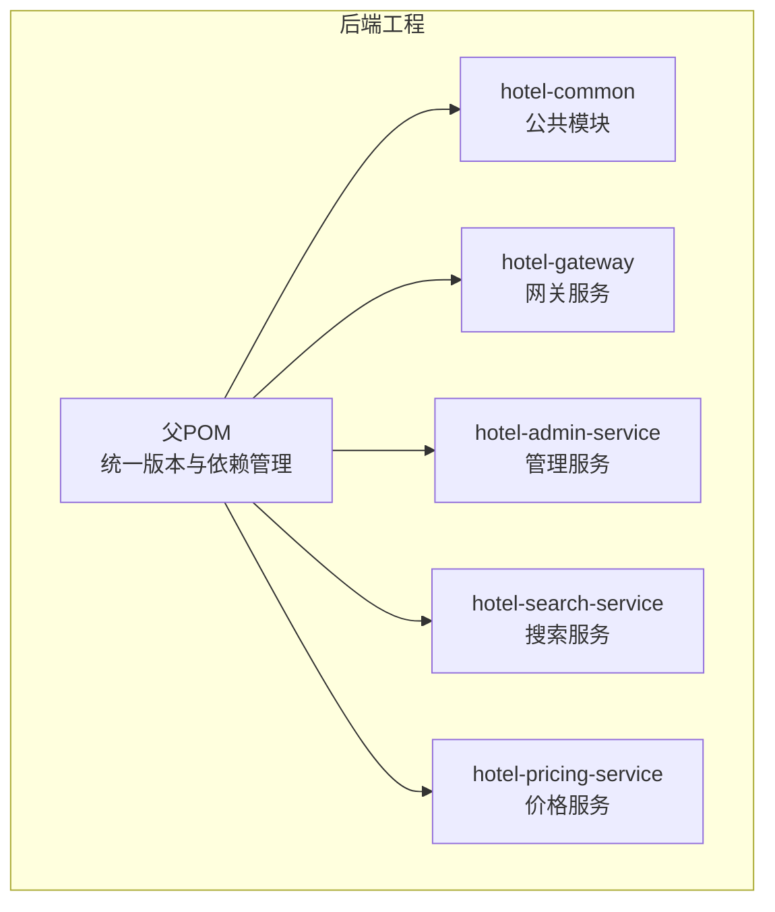
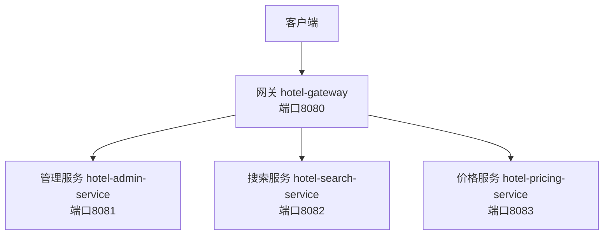
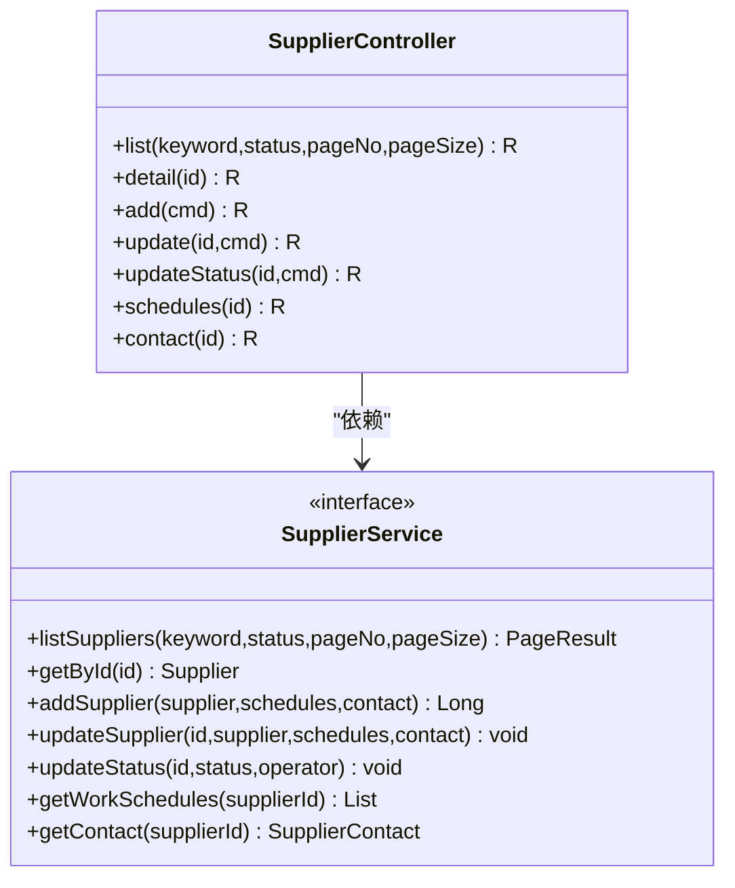
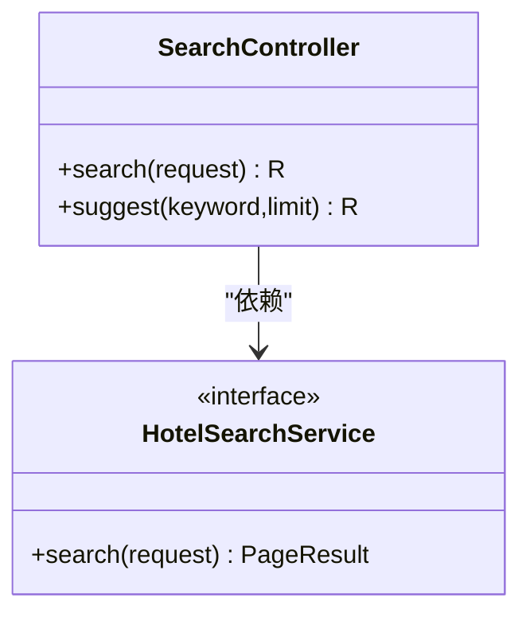
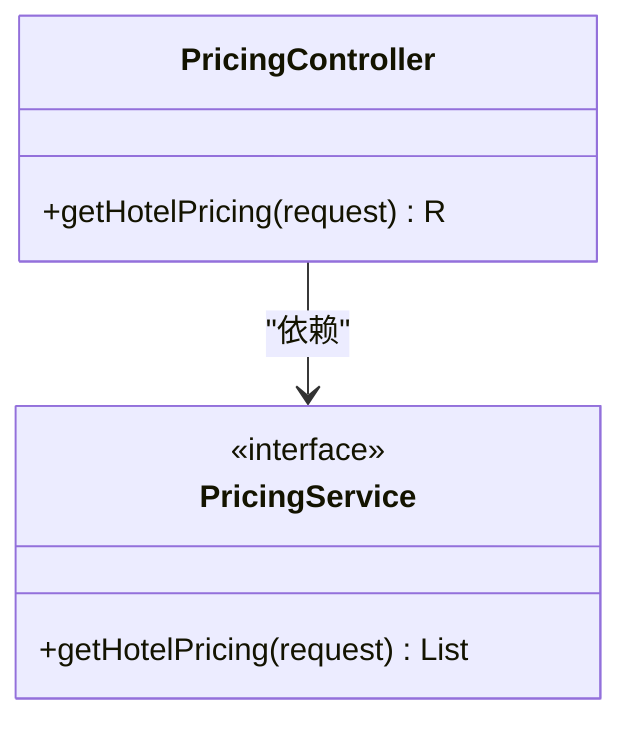
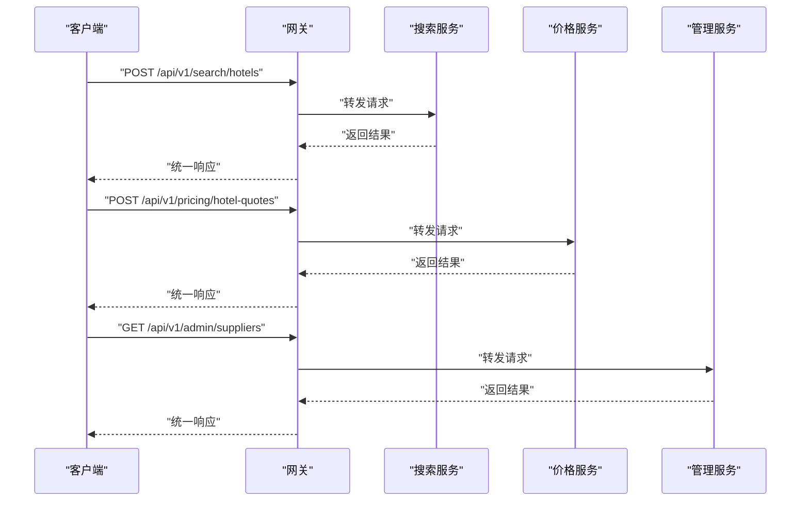
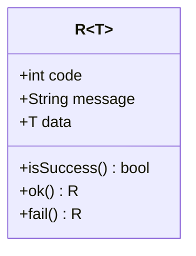
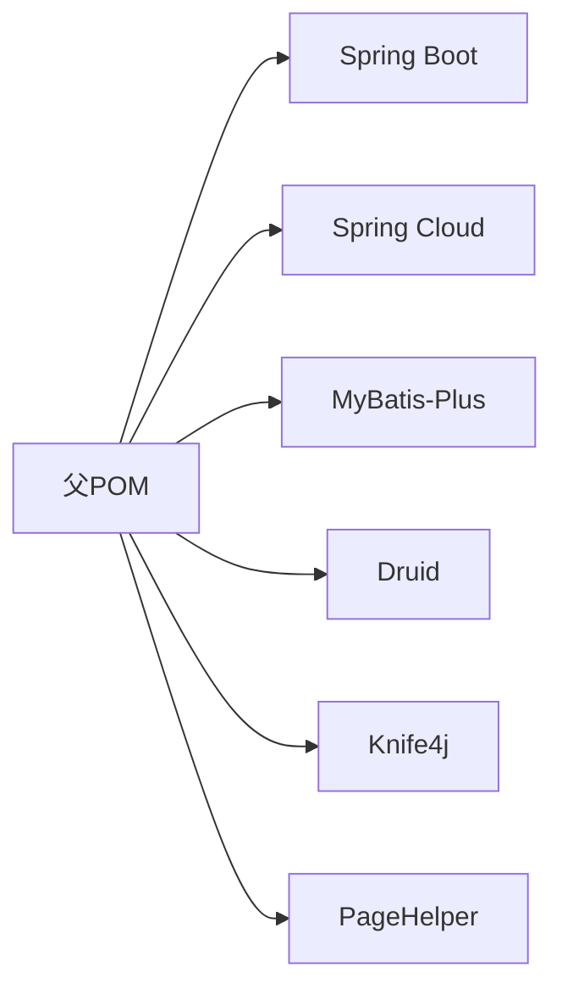
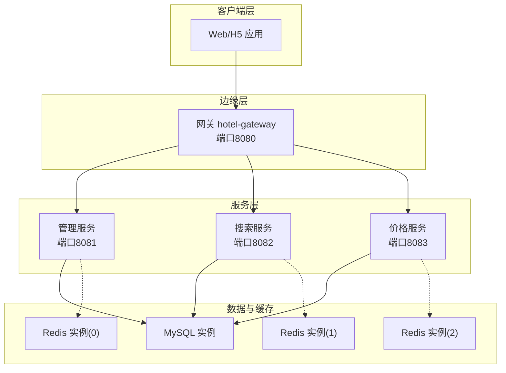

# 微服务架构设计

<cite>
**本文引用的文件**
- [pom.xml](file://hotel-seller-backend/pom.xml)
- [application.yml（网关）](file://hotel-seller-backend/hotel-gateway/src/main/resources/application.yml)
- [application.yml（管理服务）](file://hotel-seller-backend/hotel-admin-service/src/main/resources/application.yml)
- [application.yml（搜索服务）](file://hotel-seller-backend/hotel-search-service/src/main/resources/application.yml)
- [application.yml（价格服务）](file://hotel-seller-backend/hotel-pricing-service/src/main/resources/application.yml)
- [AdminApplication.java](file://hotel-seller-backend/hotel-admin-service/src/main/java/com/ceair/hotel/admin/AdminApplication.java)
- [SearchApplication.java](file://hotel-seller-backend/hotel-search-service/src/main/java/com/ceair/hotel/search/SearchApplication.java)
- [PricingApplication.java](file://hotel-seller-backend/hotel-pricing-service/src/main/java/com/ceair/hotel/pricing/PricingApplication.java)
- [GatewayApplication.java](file://hotel-seller-backend/hotel-gateway/src/main/java/com/ceair/hotel/gateway/GatewayApplication.java)
- [R.java（统一响应）](file://hotel-seller-backend/hotel-common/src/main/java/com/ceair/hotel/common/dto/R.java)
- [SupplierController.java](file://hotel-seller-backend/hotel-admin-service/src/main/java/com/ceair/hotel/admin/controller/SupplierController.java)
- [SearchController.java](file://hotel-seller-backend/hotel-search-service/src/main/java/com/ceair/hotel/search/controller/SearchController.java)
- [PricingController.java](file://hotel-seller-backend/hotel-pricing-service/src/main/java/com/ceair/hotel/pricing/controller/PricingController.java)
- [SupplierService.java](file://hotel-seller-backend/hotel-admin-service/src/main/java/com/ceair/hotel/admin/service/SupplierService.java)
- [HotelSearchService.java](file://hotel-seller-backend/hotel-search-service/src/main/java/com/ceair/hotel/search/service/HotelSearchService.java)
</cite>

## 目录
1. [引言](#引言)
2. [项目结构](#项目结构)
3. [核心组件](#核心组件)
4. [架构总览](#架构总览)
5. [详细组件分析](#详细组件分析)
6. [依赖分析](#依赖分析)
7. [性能考虑](#性能考虑)
8. [故障排查指南](#故障排查指南)
9. [结论](#结论)
10. [附录](#附录)

## 引言
本项目为酒店销售系统的后端微服务架构，采用多模块 Maven 工程组织，包含网关服务与三个业务微服务：管理服务（供应商管理、酒店信息维护）、搜索服务（酒店搜索、搜索建议）、价格服务（报价计算）。系统通过统一网关进行路由转发、跨域配置与请求过滤，结合独立的数据源与 Redis 实例，实现高内聚低耦合的服务边界划分。本文档从架构理念、服务拆分原则、职责边界、通信机制、容错与可观测性等方面进行系统化阐述，并提供部署拓扑与最佳实践建议。

## 项目结构
项目采用父子 POM 的多模块结构，父工程统一管理版本与依赖，子模块按领域拆分：
- hotel-common：公共模块，提供统一响应体、实体、枚举、异常处理等
- hotel-gateway：Spring Cloud Gateway 网关
- hotel-admin-service：管理服务（供应商、统计、缓存策略等）
- hotel-search-service：搜索服务（酒店搜索、搜索建议）
- hotel-pricing-service：价格服务（报价计算）

图表来源
- [pom.xml:1-122](file://hotel-seller-backend/pom.xml#L1-L122)

章节来源
- [pom.xml:1-122](file://hotel-seller-backend/pom.xml#L1-L122)

## 核心组件
- 统一响应体 R：所有服务对外统一返回格式，包含状态码、消息与数据体，便于前端与网关侧一致处理。
- 网关 hotel-gateway：集中路由到各业务服务，配置全局 CORS 与路径前缀剥离，简化客户端调用。
- 管理服务 hotel-admin-service：供应商管理、工作时间与联系人维护、缓存策略、统计等。
- 搜索服务 hotel-search-service：酒店搜索与搜索建议，支持分页与关键词筛选。
- 价格服务 hotel-pricing-service：根据查询条件返回房型报价列表。

章节来源
- [R.java（统一响应）:1-48](file://hotel-seller-backend/hotel-common/src/main/java/com/ceair/hotel/common/dto/R.java#L1-L48)
- [application.yml（网关）:1-54](file://hotel-seller-backend/hotel-gateway/src/main/resources/application.yml#L1-L54)
- [SupplierController.java:1-105](file://hotel-seller-backend/hotel-admin-service/src/main/java/com/ceair/hotel/admin/controller/SupplierController.java#L1-L105)
- [SearchController.java:1-43](file://hotel-seller-backend/hotel-search-service/src/main/java/com/ceair/hotel/search/controller/SearchController.java#L1-L43)
- [PricingController.java:1-31](file://hotel-seller-backend/hotel-pricing-service/src/main/java/com/ceair/hotel/pricing/controller/PricingController.java#L1-L31)

## 架构总览
系统采用“网关 + 多微服务”的分布式架构。客户端通过网关访问各业务服务，网关基于路径规则将请求转发至对应服务实例。每个服务拥有独立的数据库与 Redis，避免共享数据库带来的耦合风险。服务启动入口分别位于各模块 Application 类中，使用 MyBatis-Plus 扫描 Mapper 并启用公共包扫描。

图表来源
- [application.yml（网关）:17-48](file://hotel-seller-backend/hotel-gateway/src/main/resources/application.yml#L17-L48)
- [application.yml（管理服务）:1-44](file://hotel-seller-backend/hotel-admin-service/src/main/resources/application.yml#L1-L44)
- [application.yml（搜索服务）:1-37](file://hotel-seller-backend/hotel-search-service/src/main/resources/application.yml#L1-L37)
- [application.yml（价格服务）:1-37](file://hotel-seller-backend/hotel-pricing-service/src/main/resources/application.yml#L1-L37)

## 详细组件分析

### 管理服务（hotel-admin-service）
- 职责边界：供应商全生命周期管理（新增、编辑、上下线）、工作时间与联系人维护、缓存策略与统计接口。
- 控制器示例：供应商管理控制器提供分页查询、详情聚合、新增/编辑、状态变更等接口。
- 数据访问：MyBatis-Plus 配置、逻辑删除字段、Underscore 到 Camel 命名映射、Mapper XML 路径等。
- Redis：独立数据库实例，用于缓存策略与热点数据加速。

图表来源
- [SupplierController.java:1-105](file://hotel-seller-backend/hotel-admin-service/src/main/java/com/ceair/hotel/admin/controller/SupplierController.java#L1-L105)
- [SupplierService.java:1-33](file://hotel-seller-backend/hotel-admin-service/src/main/java/com/ceair/hotel/admin/service/SupplierService.java#L1-L33)

章节来源
- [SupplierController.java:1-105](file://hotel-seller-backend/hotel-admin-service/src/main/java/com/ceair/hotel/admin/controller/SupplierController.java#L1-L105)
- [application.yml（管理服务）:1-44](file://hotel-seller-backend/hotel-admin-service/src/main/resources/application.yml#L1-L44)

### 搜索服务（hotel-search-service）
- 职责边界：酒店搜索与搜索建议，支持关键词与分页参数，返回标准化的 DTO 结果。
- 控制器示例：搜索控制器提供酒店列表搜索与建议接口，内部委派给搜索与建议服务。
- 数据访问：MyBatis-Plus 配置、Mapper XML 路径、命名映射等。

图表来源
- [SearchController.java:1-43](file://hotel-seller-backend/hotel-search-service/src/main/java/com/ceair/hotel/search/controller/SearchController.java#L1-L43)
- [HotelSearchService.java:1-18](file://hotel-seller-backend/hotel-search-service/src/main/java/com/ceair/hotel/search/service/HotelSearchService.java#L1-L18)

章节来源
- [SearchController.java:1-43](file://hotel-seller-backend/hotel-search-service/src/main/java/com/ceair/hotel/search/controller/SearchController.java#L1-L43)
- [application.yml（搜索服务）:1-37](file://hotel-seller-backend/hotel-search-service/src/main/resources/application.yml#L1-L37)

### 价格服务（hotel-pricing-service）
- 职责边界：根据查询请求返回酒店房型报价列表，支持多条件组合查询。
- 控制器示例：报价控制器提供报价查询接口，内部委派给价格服务实现。

图表来源
- [PricingController.java:1-31](file://hotel-seller-backend/hotel-pricing-service/src/main/java/com/ceair/hotel/pricing/controller/PricingController.java#L1-L31)

章节来源
- [PricingController.java:1-31](file://hotel-seller-backend/hotel-pricing-service/src/main/java/com/ceair/hotel/pricing/controller/PricingController.java#L1-L31)
- [application.yml（价格服务）:1-37](file://hotel-seller-backend/hotel-pricing-service/src/main/resources/application.yml#L1-L37)

### 网关服务（hotel-gateway）
- 职责边界：统一入口、路由转发、跨域配置、请求过滤（如访问日志）。
- 路由规则：基于路径前缀将 /api/v1/search/** 转发到搜索服务、/api/v1/pricing/** 转发到价格服务、/api/v1/admin/** 与 /api/v1/stats/** 转发到管理服务。
- CORS：全局允许跨域，支持凭证与自定义头部。

图表来源
- [application.yml（网关）:17-48](file://hotel-seller-backend/hotel-gateway/src/main/resources/application.yml#L17-L48)

章节来源
- [application.yml（网关）:1-54](file://hotel-seller-backend/hotel-gateway/src/main/resources/application.yml#L1-L54)
- [GatewayApplication.java:1-13](file://hotel-seller-backend/hotel-gateway/src/main/java/com/ceair/hotel/gateway/GatewayApplication.java#L1-L13)

### 公共模块（hotel-common）
- 统一响应体 R：封装通用的响应结构，提供成功与失败的静态工厂方法，便于前后端约定。
- 公共实体与枚举：供应商、价格策略、推荐酒店等模型与状态枚举，供各服务复用。

图表来源
- [R.java（统一响应）:1-48](file://hotel-seller-backend/hotel-common/src/main/java/com/ceair/hotel/common/dto/R.java#L1-L48)

章节来源
- [R.java（统一响应）:1-48](file://hotel-seller-backend/hotel-common/src/main/java/com/ceair/hotel/common/dto/R.java#L1-L48)

## 依赖分析
- 版本与依赖管理：父 POM 使用 Spring Boot 与 Spring Cloud 版本坐标，统一管理 MyBatis-Plus、Druid、Knife4j、PageHelper 等依赖。
- 模块间依赖：网关不直接依赖业务服务，仅通过路由规则转发；业务服务之间无直接依赖，通过网关或外部调用交互。
- 数据与缓存：各服务使用独立的 MySQL 与 Redis 实例，避免共享存储带来的耦合。

图表来源
- [pom.xml:40-93](file://hotel-seller-backend/pom.xml#L40-L93)

章节来源
- [pom.xml:29-93](file://hotel-seller-backend/pom.xml#L29-L93)

## 性能考虑
- 负载均衡：当前本地演示使用固定 URI 转发，生产环境建议接入服务注册与发现（如 Nacos/Eureka），并启用客户端或网关侧负载均衡。
- 缓存策略：管理服务已配置独立 Redis，可对热点供应商数据、缓存策略等进行缓存；搜索与价格服务可根据场景引入本地缓存与远程缓存协同。
- 数据库连接池：Druid 连接池已启用，建议结合慢查询监控与连接数上限进行压测优化。
- 路由与过滤：网关已开启 CORS 与路径前缀剥离，建议增加限流、鉴权与熔断策略以提升整体稳定性。

## 故障排查指南
- 统一响应体：所有服务均使用 R 包装响应，前端与网关侧可依据 code 字段快速判断错误类型。
- 日志级别：各服务配置了 debug 级别日志，便于问题定位；生产环境建议调整为 info 或 warn。
- 网关日志：网关模块启用了 Spring Cloud Gateway 的日志级别，有助于观察路由转发情况。
- 常见问题：
  - 网关 404：检查路由前缀是否匹配 /api/v1/* 规则
  - 跨域失败：确认网关 CORS 配置与前端请求头设置
  - 服务不可达：核对服务端口与本地运行状态

章节来源
- [R.java（统一响应）:1-48](file://hotel-seller-backend/hotel-common/src/main/java/com/ceair/hotel/common/dto/R.java#L1-L48)
- [application.yml（网关）:50-54](file://hotel-seller-backend/hotel-gateway/src/main/resources/application.yml#L50-L54)
- [application.yml（管理服务）:41-44](file://hotel-seller-backend/hotel-admin-service/src/main/resources/application.yml#L41-L44)
- [application.yml（搜索服务）:34-37](file://hotel-seller-backend/hotel-search-service/src/main/resources/application.yml#L34-L37)
- [application.yml（价格服务）:34-37](file://hotel-seller-backend/hotel-pricing-service/src/main/resources/application.yml#L34-L37)

## 结论
本项目通过清晰的微服务拆分与统一网关入口，实现了业务领域的高内聚与低耦合。管理、搜索、价格三大服务职责明确，配合独立的数据与缓存资源，具备良好的扩展性与演进空间。建议在生产环境中引入服务注册与发现、配置中心、链路追踪与熔断降级等基础设施，进一步完善可观测性与可靠性。

## 附录

### 部署拓扑图

图表来源
- [application.yml（网关）:17-48](file://hotel-seller-backend/hotel-gateway/src/main/resources/application.yml#L17-L48)
- [application.yml（管理服务）:9-22](file://hotel-seller-backend/hotel-admin-service/src/main/resources/application.yml#L9-L22)
- [application.yml（搜索服务）:7-20](file://hotel-seller-backend/hotel-search-service/src/main/resources/application.yml#L7-L20)
- [application.yml（价格服务）:7-20](file://hotel-seller-backend/hotel-pricing-service/src/main/resources/application.yml#L7-L20)

### 技术选型与最佳实践
- 框架与版本：Spring Boot 2.7.x + Spring Cloud 2021.x，保证生态稳定与兼容性。
- ORM 与连接池：MyBatis-Plus + Druid，兼顾易用性与性能监控。
- 文档工具：Knife4j 提供 OpenAPI 文档能力，便于联调与测试。
- 网关：Spring Cloud Gateway，统一路由、CORS 与过滤器扩展点。
- 最佳实践：
  - 服务自治：独立数据库与缓存，避免共享存储
  - 明确边界：控制器只做编排，业务逻辑下沉到服务层
  - 统一响应：前后端一致的响应结构，降低对接成本
  - 可观测性：生产环境引入链路追踪、指标采集与日志聚合