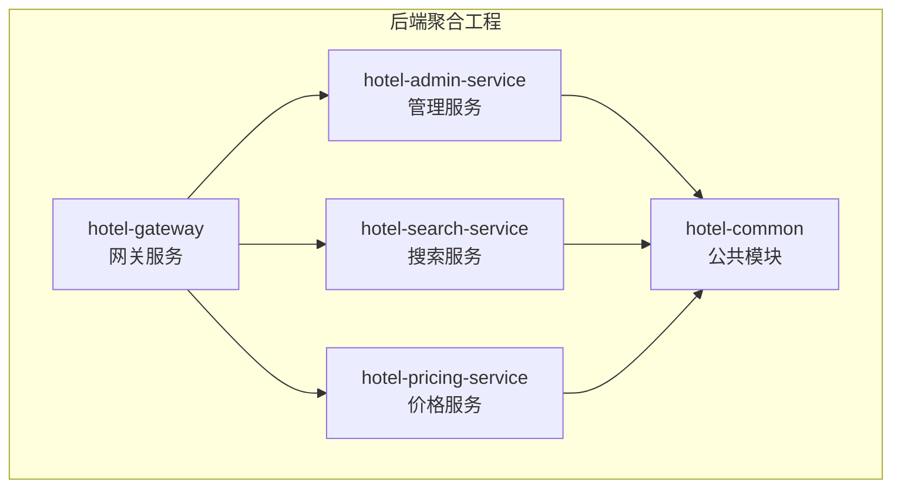
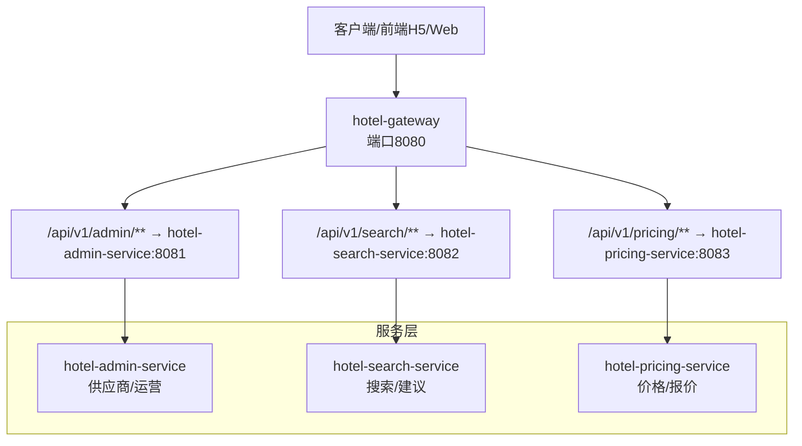
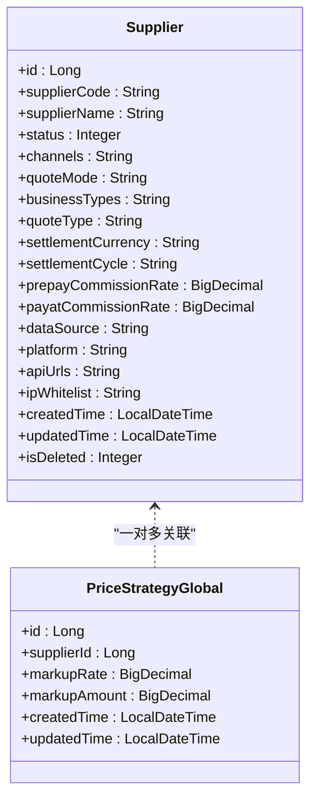
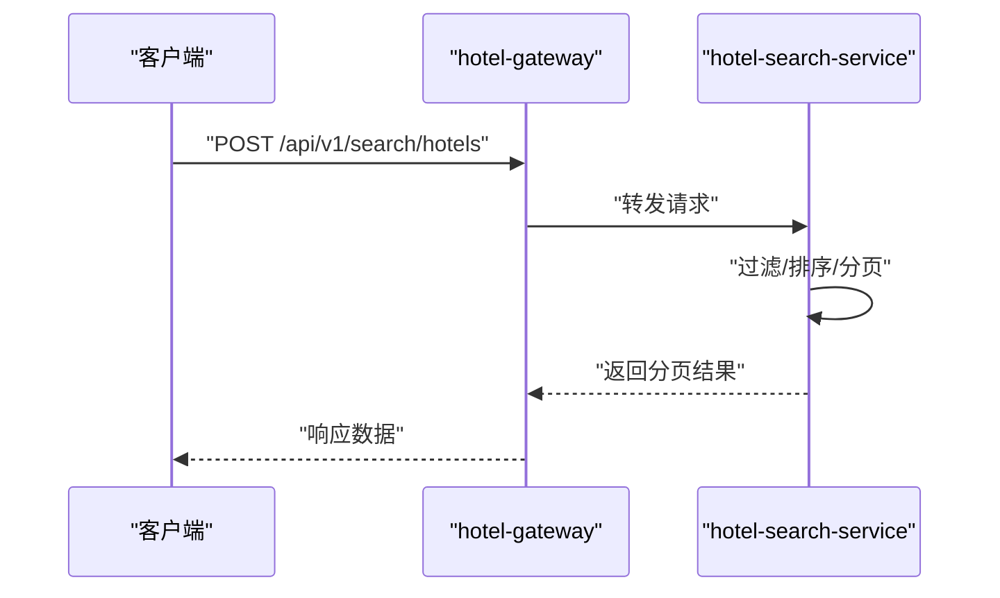
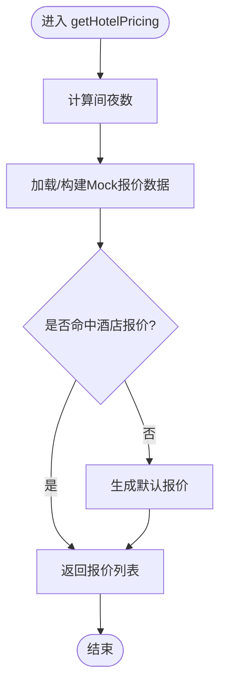
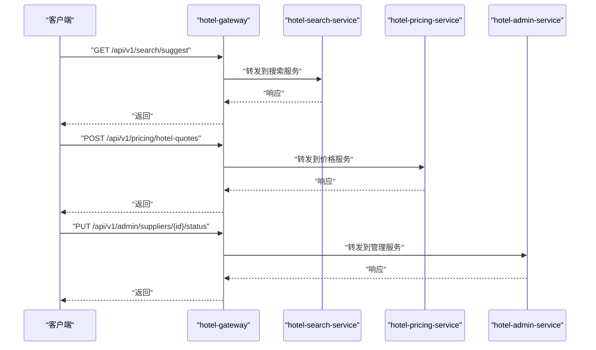
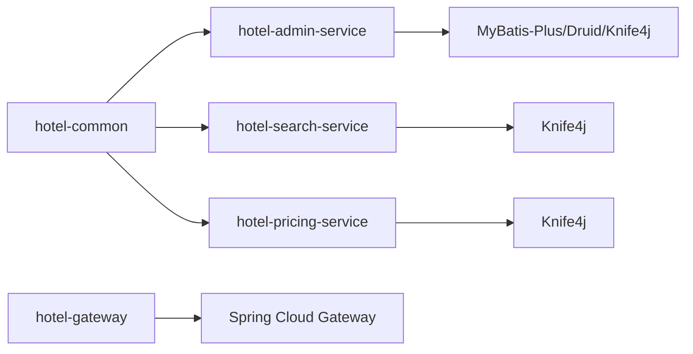

# 服务模块划分

<cite>
**本文引用的文件**
- [hotel-seller-backend/pom.xml](file://hotel-seller-backend/pom.xml)
- [hotel-admin-service/src/main/resources/application.yml](file://hotel-seller-backend/hotel-admin-service/src/main/resources/application.yml)
- [hotel-search-service/src/main/resources/application.yml](file://hotel-seller-backend/hotel-search-service/src/main/resources/application.yml)
- [hotel-pricing-service/src/main/resources/application.yml](file://hotel-seller-backend/hotel-pricing-service/src/main/resources/application.yml)
- [hotel-gateway/src/main/resources/application.yml](file://hotel-seller-backend/hotel-gateway/src/main/resources/application.yml)
- [hotel-admin-service/src/main/java/com/ceair/hotel/admin/AdminApplication.java](file://hotel-seller-backend/hotel-admin-service/src/main/java/com/ceair/hotel/admin/AdminApplication.java)
- [hotel-gateway/src/main/java/com/ceair/hotel/gateway/GatewayApplication.java](file://hotel-seller-backend/hotel-gateway/src/main/java/com/ceair/hotel/gateway/GatewayApplication.java)
- [hotel-admin-service/src/main/java/com/ceair/hotel/admin/controller/SupplierController.java](file://hotel-seller-backend/hotel-admin-service/src/main/java/com/ceair/hotel/admin/controller/SupplierController.java)
- [hotel-search-service/src/main/java/com/ceair/hotel/search/controller/SearchController.java](file://hotel-seller-backend/hotel-search-service/src/main/java/com/ceair/hotel/search/controller/SearchController.java)
- [hotel-pricing-service/src/main/java/com/ceair/hotel/pricing/controller/PricingController.java](file://hotel-seller-backend/hotel-pricing-service/src/main/java/com/ceair/hotel/pricing/controller/PricingController.java)
- [hotel-admin-service/src/main/java/com/ceair/hotel/admin/service/impl/SupplierServiceImpl.java](file://hotel-seller-backend/hotel-admin-service/src/main/java/com/ceair/hotel/admin/service/impl/SupplierServiceImpl.java)
- [hotel-search-service/src/main/java/com/ceair/hotel/search/service/impl/HotelSearchServiceImpl.java](file://hotel-seller-backend/hotel-search-service/src/main/java/com/ceair/hotel/search/service/impl/HotelSearchServiceImpl.java)
- [hotel-pricing-service/src/main/java/com/ceair/hotel/pricing/service/impl/PricingServiceImpl.java](file://hotel-seller-backend/hotel-pricing-service/src/main/java/com/ceair/hotel/pricing/service/impl/PricingServiceImpl.java)
- [hotel-common/src/main/java/com/ceair/hotel/common/entity/Supplier.java](file://hotel-seller-backend/hotel-common/src/main/java/com/ceair/hotel/common/entity/Supplier.java)
- [hotel-common/src/main/java/com/ceair/hotel/common/entity/PriceStrategyGlobal.java](file://hotel-seller-backend/hotel-common/src/main/java/com/ceair/hotel/common/entity/PriceStrategyGlobal.java)
</cite>

## 目录
1. [引言](#引言)
2. [项目结构](#项目结构)
3. [核心组件](#核心组件)
4. [架构总览](#架构总览)
5. [详细组件分析](#详细组件分析)
6. [依赖分析](#依赖分析)
7. [性能考虑](#性能考虑)
8. [故障排查指南](#故障排查指南)
9. [结论](#结论)
10. [附录](#附录)

## 引言
本文件面向酒店销售系统后端服务模块划分，围绕管理服务(hotel-admin-service)、搜索服务(hotel-search-service)、价格服务(hotel-pricing-service)与网关服务(hotel-gateway)进行系统化梳理。内容涵盖各微服务的职责边界、核心控制器与业务实现、配置文件要点、数据库与缓存策略、以及服务启动顺序与运行时最佳实践。旨在帮助开发者快速理解模块职责与协作关系，并为后续扩展与运维提供参考。

## 项目结构
后端采用多模块Maven聚合工程组织，包含公共模块与四个独立服务模块：
- hotel-common：公共实体、工具与异常处理
- hotel-gateway：Spring Cloud Gateway网关
- hotel-admin-service：供应商与运营相关管理能力
- hotel-search-service：酒店搜索与建议
- hotel-pricing-service：价格计算与报价

图表来源
- [hotel-seller-backend/pom.xml:21-27](file://hotel-seller-backend/pom.xml#L21-L27)

章节来源
- [hotel-seller-backend/pom.xml:1-122](file://hotel-seller-backend/pom.xml#L1-L122)

## 核心组件
- 管理服务(hotel-admin-service)
  - 职责：供应商管理、工作时间管理、联系人管理、缓存策略、操作日志与统计接口
  - 关键入口：SupplierController 提供供应商增删改查、上下线、工作时间与联系人查询
  - 业务实现：SupplierServiceImpl 负责供应商数据一致性、事务控制与日志记录
  - 公共实体：Supplier、SupplierWorkSchedule、SupplierContact、SupplierCacheStrategy、SupplierOperationLog
- 搜索服务(hotel-search-service)
  - 职责：酒店列表搜索、关键词建议
  - 关键入口：SearchController 提供搜索与建议接口
  - 业务实现：HotelSearchServiceImpl 当前基于内存Mock数据，支持关键词、目的地、星级、价格区间与多种排序
- 价格服务(hotel-pricing-service)
  - 职责：酒店房型报价查询
  - 关键入口：PricingController 提供报价查询接口
  - 业务实现：PricingServiceImpl 基于Mock数据模拟报价生成，包含房间与售卖报价组合
- 网关服务(hotel-gateway)
  - 职责：统一入口、跨域配置、路由转发、请求前缀剥离
  - 配置：application.yml 定义跨域与多条路由规则，分别指向搜索、价格与管理服务

章节来源
- [hotel-admin-service/src/main/java/com/ceair/hotel/admin/controller/SupplierController.java:1-105](file://hotel-seller-backend/hotel-admin-service/src/main/java/com/ceair/hotel/admin/controller/SupplierController.java#L1-L105)
- [hotel-admin-service/src/main/java/com/ceair/hotel/admin/service/impl/SupplierServiceImpl.java:1-162](file://hotel-seller-backend/hotel-admin-service/src/main/java/com/ceair/hotel/admin/service/impl/SupplierServiceImpl.java#L1-L162)
- [hotel-search-service/src/main/java/com/ceair/hotel/search/controller/SearchController.java:1-43](file://hotel-seller-backend/hotel-search-service/src/main/java/com/ceair/hotel/search/controller/SearchController.java#L1-L43)
- [hotel-search-service/src/main/java/com/ceair/hotel/search/service/impl/HotelSearchServiceImpl.java:1-210](file://hotel-seller-backend/hotel-search-service/src/main/java/com/ceair/hotel/search/service/impl/HotelSearchServiceImpl.java#L1-L210)
- [hotel-pricing-service/src/main/java/com/ceair/hotel/pricing/controller/PricingController.java:1-31](file://hotel-seller-backend/hotel-pricing-service/src/main/java/com/ceair/hotel/pricing/controller/PricingController.java#L1-L31)
- [hotel-pricing-service/src/main/java/com/ceair/hotel/pricing/service/impl/PricingServiceImpl.java:1-154](file://hotel-seller-backend/hotel-pricing-service/src/main/java/com/ceair/hotel/pricing/service/impl/PricingServiceImpl.java#L1-L154)
- [hotel-gateway/src/main/resources/application.yml:1-54](file://hotel-seller-backend/hotel-gateway/src/main/resources/application.yml#L1-L54)

## 架构总览
系统通过网关统一对外暴露REST接口，内部按功能拆分为三个领域服务，每个服务独立部署、独立配置数据源与缓存实例，避免耦合。

图表来源
- [hotel-gateway/src/main/resources/application.yml:17-48](file://hotel-seller-backend/hotel-gateway/src/main/resources/application.yml#L17-L48)

## 详细组件分析

### 管理服务(hotel-admin-service)：供应商与运营
- 控制器职责
  - 列表分页与关键字/状态过滤
  - 详情聚合（供应商+工作时间+联系人）
  - 新增/编辑供应商（含工作时间与联系人）
  - 上下线变更与操作日志
- 业务实现要点
  - 供应商编号唯一性校验
  - 新增时初始化缓存策略
  - 编辑时先删后插工作时间与联系人
  - 统一记录操作日志
- 数据模型
  - 供应商实体包含基础信息、渠道、报价模式、结算与佣金等字段
  - 全局价格策略实体包含加价比例与金额

图表来源
- [hotel-common/src/main/java/com/ceair/hotel/common/entity/Supplier.java:1-81](file://hotel-seller-backend/hotel-common/src/main/java/com/ceair/hotel/common/entity/Supplier.java#L1-L81)
- [hotel-common/src/main/java/com/ceair/hotel/common/entity/PriceStrategyGlobal.java:1-33](file://hotel-seller-backend/hotel-common/src/main/java/com/ceair/hotel/common/entity/PriceStrategyGlobal.java#L1-L33)

章节来源
- [hotel-admin-service/src/main/java/com/ceair/hotel/admin/controller/SupplierController.java:1-105](file://hotel-seller-backend/hotel-admin-service/src/main/java/com/ceair/hotel/admin/controller/SupplierController.java#L1-L105)
- [hotel-admin-service/src/main/java/com/ceair/hotel/admin/service/impl/SupplierServiceImpl.java:1-162](file://hotel-seller-backend/hotel-admin-service/src/main/java/com/ceair/hotel/admin/service/impl/SupplierServiceImpl.java#L1-L162)
- [hotel-common/src/main/java/com/ceair/hotel/common/entity/Supplier.java:1-81](file://hotel-seller-backend/hotel-common/src/main/java/com/ceair/hotel/common/entity/Supplier.java#L1-L81)
- [hotel-common/src/main/java/com/ceair/hotel/common/entity/PriceStrategyGlobal.java:1-33](file://hotel-seller-backend/hotel-common/src/main/java/com/ceair/hotel/common/entity/PriceStrategyGlobal.java#L1-L33)

### 搜索服务(hotel-search-service)：酒店搜索与建议
- 控制器职责
  - POST /api/v1/search/hotels：酒店列表搜索
  - GET /api/v1/search/suggest：关键词建议
- 业务实现要点
  - 当前使用内存Mock数据，支持关键词、目的地、星级、价格区间与多维排序
  - 支持分页返回PageResult
- 扩展方向
  - 后续接入ES与供应商API，替换当前内存实现

图表来源
- [hotel-search-service/src/main/java/com/ceair/hotel/search/controller/SearchController.java:29-33](file://hotel-seller-backend/hotel-search-service/src/main/java/com/ceair/hotel/search/controller/SearchController.java#L29-L33)
- [hotel-search-service/src/main/java/com/ceair/hotel/search/service/impl/HotelSearchServiceImpl.java:26-109](file://hotel-seller-backend/hotel-search-service/src/main/java/com/ceair/hotel/search/service/impl/HotelSearchServiceImpl.java#L26-L109)
- [hotel-gateway/src/main/resources/application.yml:18-24](file://hotel-seller-backend/hotel-gateway/src/main/resources/application.yml#L18-L24)

章节来源
- [hotel-search-service/src/main/java/com/ceair/hotel/search/controller/SearchController.java:1-43](file://hotel-seller-backend/hotel-search-service/src/main/java/com/ceair/hotel/search/controller/SearchController.java#L1-L43)
- [hotel-search-service/src/main/java/com/ceair/hotel/search/service/impl/HotelSearchServiceImpl.java:1-210](file://hotel-seller-backend/hotel-search-service/src/main/java/com/ceair/hotel/search/service/impl/HotelSearchServiceImpl.java#L1-L210)

### 价格服务(hotel-pricing-service)：报价与动态定价
- 控制器职责
  - POST /api/v1/pricing/hotel-quotes：获取酒店房型报价列表
- 业务实现要点
  - 基于入住/退房日期计算间夜数
  - Mock不同酒店的房间与售卖报价组合
  - 默认报价兜底策略
- 动态定价与促销
  - 可在PricingServiceImpl中扩展全局/特殊策略与促销标签处理

图表来源
- [hotel-pricing-service/src/main/java/com/ceair/hotel/pricing/controller/PricingController.java:25-29](file://hotel-seller-backend/hotel-pricing-service/src/main/java/com/ceair/hotel/pricing/controller/PricingController.java#L25-L29)
- [hotel-pricing-service/src/main/java/com/ceair/hotel/pricing/service/impl/PricingServiceImpl.java:22-41](file://hotel-seller-backend/hotel-pricing-service/src/main/java/com/ceair/hotel/pricing/service/impl/PricingServiceImpl.java#L22-L41)

章节来源
- [hotel-pricing-service/src/main/java/com/ceair/hotel/pricing/controller/PricingController.java:1-31](file://hotel-seller-backend/hotel-pricing-service/src/main/java/com/ceair/hotel/pricing/controller/PricingController.java#L1-L31)
- [hotel-pricing-service/src/main/java/com/ceair/hotel/pricing/service/impl/PricingServiceImpl.java:1-154](file://hotel-seller-backend/hotel-pricing-service/src/main/java/com/ceair/hotel/pricing/service/impl/PricingServiceImpl.java#L1-L154)

### 网关服务(hotel-gateway)：路由与过滤
- 跨域配置
  - 全局允许所有来源、方法与头部，支持凭据与最大缓存时间
- 路由规则
  - /api/v1/search/** → hotel-search-service:8082
  - /api/v1/pricing/** → hotel-pricing-service:8083
  - /api/v1/admin/** → hotel-admin-service:8081
  - 统一StripPrefix=0，保留原始路径
- 启动入口
  - GatewayApplication 启动Spring Cloud Gateway

图表来源
- [hotel-gateway/src/main/resources/application.yml:8-48](file://hotel-seller-backend/hotel-gateway/src/main/resources/application.yml#L8-L48)
- [hotel-gateway/src/main/java/com/ceair/hotel/gateway/GatewayApplication.java:1-13](file://hotel-seller-backend/hotel-gateway/src/main/java/com/ceair/hotel/gateway/GatewayApplication.java#L1-L13)

章节来源
- [hotel-gateway/src/main/resources/application.yml:1-54](file://hotel-seller-backend/hotel-gateway/src/main/resources/application.yml#L1-L54)
- [hotel-gateway/src/main/java/com/ceair/hotel/gateway/GatewayApplication.java:1-13](file://hotel-seller-backend/hotel-gateway/src/main/java/com/ceair/hotel/gateway/GatewayApplication.java#L1-L13)

## 依赖分析
- 模块依赖
  - 各服务均依赖 hotel-common 提供公共实体、分页与通用响应封装
  - 管理服务额外依赖MyBatis-Plus与Druid连接池
- 外部依赖
  - Spring Cloud Gateway、Knife4j、PageHelper、Hutool等

图表来源
- [hotel-seller-backend/pom.xml:40-92](file://hotel-seller-backend/pom.xml#L40-L92)

章节来源
- [hotel-seller-backend/pom.xml:1-122](file://hotel-seller-backend/pom.xml#L1-L122)

## 性能考虑
- 数据库连接池
  - 使用Druid，默认初始5、最小空闲5、最大活跃20，适合小规模并发
- 缓存策略
  - 管理服务Redis库0；搜索服务Redis库1；价格服务Redis库2
  - 建议在业务层引入本地缓存与分布式缓存配合，降低数据库压力
- 分页与排序
  - 搜索服务当前内存排序，建议在接入ES后利用索引与分页优化
- 网关过滤
  - 可增加限流、熔断与访问日志过滤器，提升整体稳定性

## 故障排查指南
- 端口占用
  - 确认网关(8080)、搜索(8082)、价格(8083)、管理(8081)未被占用
- 数据库连接
  - 检查各服务application.yml中的MySQL连接串、用户名与密码
- Redis可用性
  - 检查host/port/database配置，确保对应库可用
- 跨域问题
  - 网关已开启全局跨域，如仍出现跨域错误，检查前端请求头与预检请求
- 日志级别
  - application.yml中已开启debug日志，便于定位问题

章节来源
- [hotel-admin-service/src/main/resources/application.yml:9-22](file://hotel-seller-backend/hotel-admin-service/src/main/resources/application.yml#L9-L22)
- [hotel-search-service/src/main/resources/application.yml:7-20](file://hotel-seller-backend/hotel-search-service/src/main/resources/application.yml#L7-L20)
- [hotel-pricing-service/src/main/resources/application.yml:7-20](file://hotel-seller-backend/hotel-pricing-service/src/main/resources/application.yml#L7-L20)
- [hotel-gateway/src/main/resources/application.yml:9-16](file://hotel-seller-backend/hotel-gateway/src/main/resources/application.yml#L9-L16)

## 结论
本系统以网关为统一入口，将供应商管理、酒店搜索与价格计算拆分为独立微服务，结合公共模块与各自的数据源/缓存配置，形成清晰的职责边界。当前阶段以Mock数据为主，便于快速验证接口与流程；后续应重点完成搜索与价格服务的外部集成（ES与供应商API），并完善缓存与监控体系，以支撑更高并发与更复杂的业务场景。

## 附录

### 服务配置要点与最佳实践
- 管理服务(hotel-admin-service)
  - 端口：8081
  - 数据源：MySQL + Druid
  - Redis：库0
  - MyBatis-Plus：驼峰映射、逻辑删除、Mapper扫描
  - Knife4j：启用中文文档
- 搜索服务(hotel-search-service)
  - 端口：8082
  - 数据源：MySQL + Druid
  - Redis：库1
  - Knife4j：启用中文文档
- 价格服务(hotel-pricing-service)
  - 端口：8083
  - 数据源：MySQL + Druid
  - Redis：库2
  - Knife4j：启用中文文档
- 网关服务(hotel-gateway)
  - 端口：8080
  - 跨域：全局允许
  - 路由：/api/v1/search/** → 8082
  - 路由：/api/v1/pricing/** → 8083
  - 路由：/api/v1/admin/** → 8081
  - 过滤：StripPrefix=0

章节来源
- [hotel-admin-service/src/main/resources/application.yml:1-44](file://hotel-seller-backend/hotel-admin-service/src/main/resources/application.yml#L1-L44)
- [hotel-search-service/src/main/resources/application.yml:1-37](file://hotel-seller-backend/hotel-search-service/src/main/resources/application.yml#L1-L37)
- [hotel-pricing-service/src/main/resources/application.yml:1-37](file://hotel-seller-backend/hotel-pricing-service/src/main/resources/application.yml#L1-L37)
- [hotel-gateway/src/main/resources/application.yml:1-54](file://hotel-seller-backend/hotel-gateway/src/main/resources/application.yml#L1-L54)

### 启动顺序与运行时建议
- 启动顺序
  1) MySQL与Redis
  2) hotel-gateway
  3) hotel-search-service
  4) hotel-pricing-service
  5) hotel-admin-service
- 运行时建议
  - 使用Docker或Kubernetes编排，统一管理环境变量与资源限制
  - 为各服务配置独立健康检查端点与日志采集
  - 在网关层增加限流与熔断策略，保护下游服务
  - 将Knife4j文档用于联调测试，减少前后端对接成本