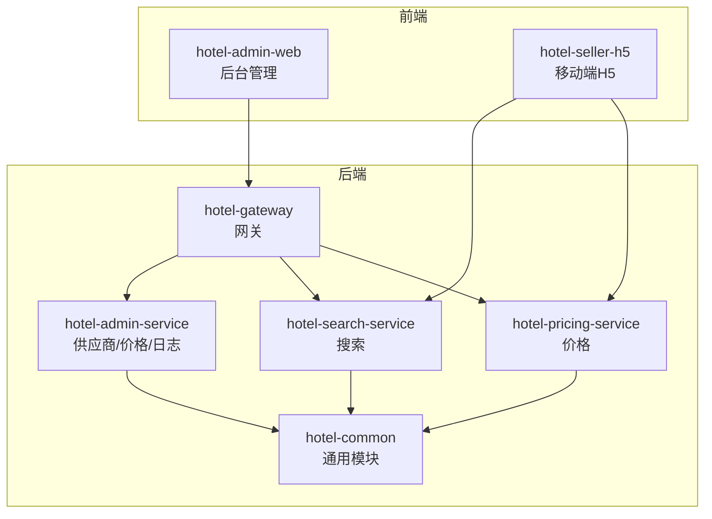
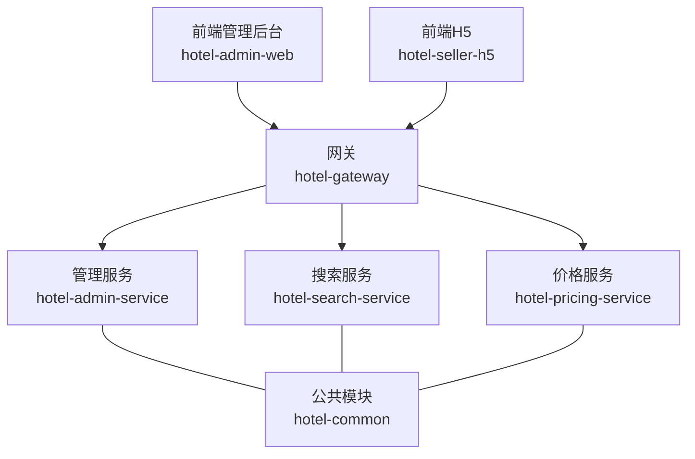
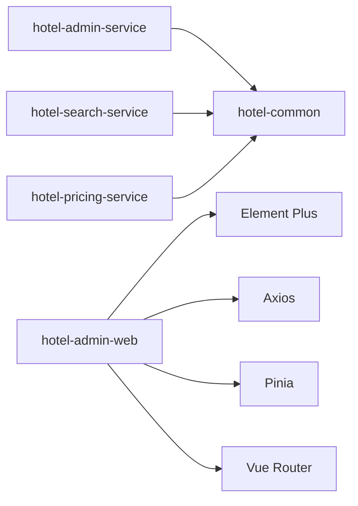
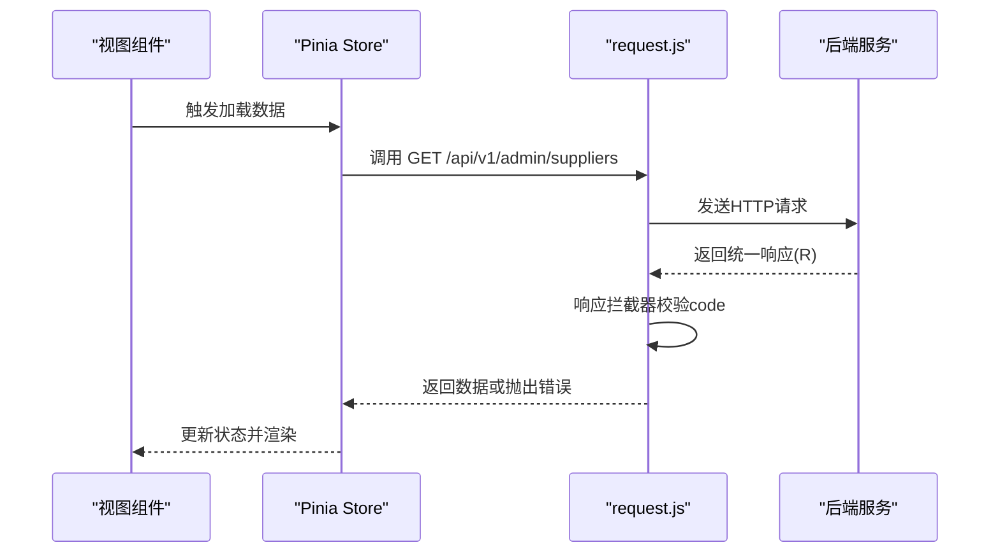
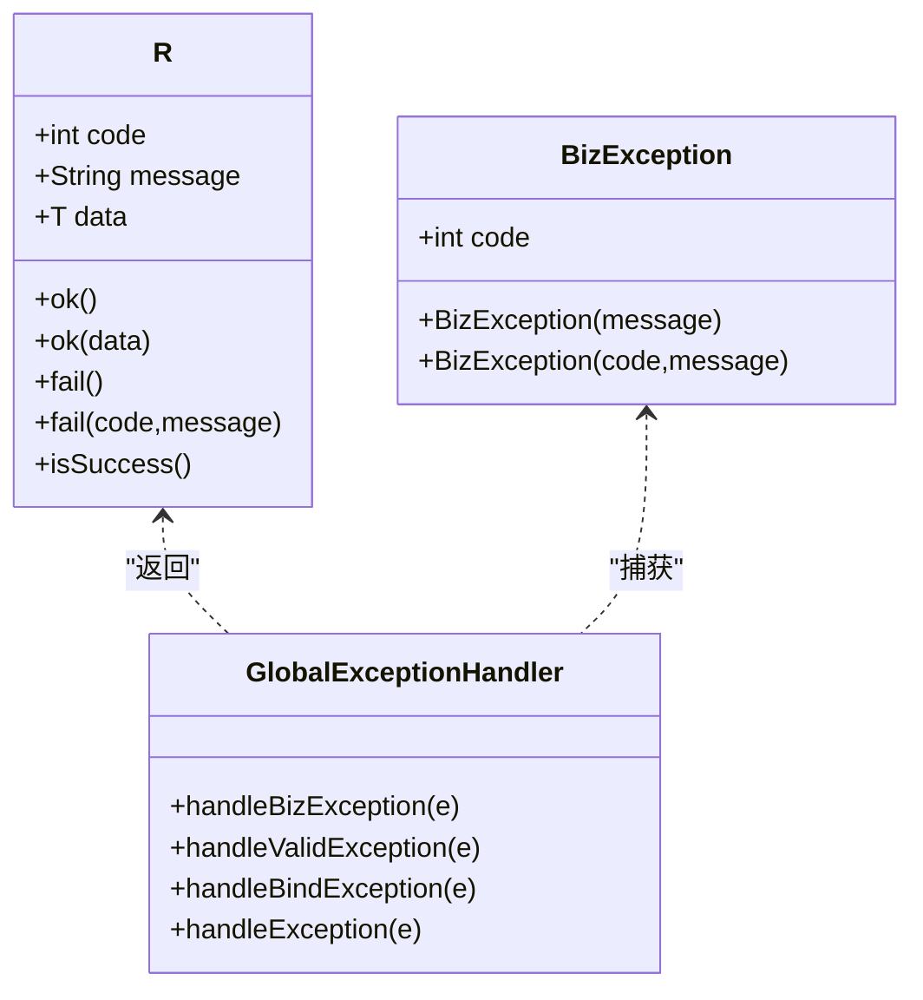
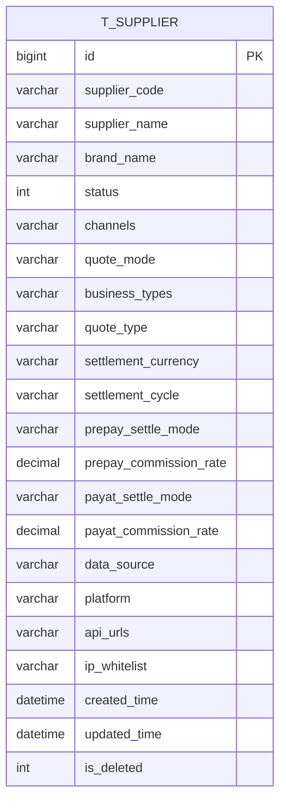

# 代码规范与最佳实践

<cite>
**本文引用的文件**   
- [main.js](file://hotel-admin-web/src/main.js)
- [package.json](file://hotel-admin-web/package.json)
- [vite.config.js](file://hotel-admin-web/vite.config.js)
- [request.js](file://hotel-admin-web/src/utils/request.js)
- [index.js（路由）](file://hotel-admin-web/src/router/index.js)
- [app.js（Pinia Store）](file://hotel-admin-web/src/stores/app.js)
- [variables.scss](file://hotel-admin-web/src/assets/styles/variables.scss)
- [global.scss](file://hotel-admin-web/src/assets/styles/global.scss)
- [SupplierList.vue](file://hotel-admin-web/src/views/supplier/SupplierList.vue)
- [AdminApplication.java](file://hotel-seller-backend/hotel-admin-service/src/main/java/com/ceair/hotel/admin/AdminApplication.java)
- [BizException.java](file://hotel-seller-backend/hotel-common/src/main/java/com/ceair/hotel/common/exception/BizException.java)
- [GlobalExceptionHandler.java](file://hotel-seller-backend/hotel-common/src/main/java/com/ceair/hotel/common/exception/GlobalExceptionHandler.java)
- [R.java](file://hotel-seller-backend/hotel-common/src/main/java/com/ceair/hotel/common/dto/R.java)
- [Supplier.java](file://hotel-seller-backend/hotel-common/src/main/java/com/ceair/hotel/common/entity/Supplier.java)
- [SupplierController.java](file://hotel-seller-backend/hotel-admin-service/src/main/java/com/ceair/hotel/admin/controller/SupplierController.java)
- [pom.xml（后端聚合工程）](file://hotel-seller-backend/pom.xml)
- [mock_data.sql](file://mock_data.sql)
</cite>

## 目录
1. [简介](#简介)
2. [项目结构](#项目结构)
3. [核心组件](#核心组件)
4. [架构总览](#架构总览)
5. [详细组件分析](#详细组件分析)
6. [依赖关系分析](#依赖关系分析)
7. [性能考量](#性能考量)
8. [故障排查指南](#故障排查指南)
9. [结论](#结论)
10. [附录](#附录)

## 简介
本指南面向酒店销售系统（前后端分离）的开发团队，提供统一的代码规范与最佳实践，涵盖：
- Java 后端编码规范（命名、类设计、注释、异常处理）
- Vue.js 前端开发规范（组件命名、样式组织、状态管理、API 调用）
- 数据库设计规范（表命名、字段定义、索引策略、数据类型）
- Git 工作流规范（分支管理、提交信息、代码评审）
- 代码质量工具配置（SonarQube、ESLint、Prettier）
- 实际示例与反面案例对比，帮助团队快速落地

## 项目结构
项目采用多模块后端 + 多前端应用的结构：
- 后端：hotel-seller-backend（聚合工程），包含 admin、search、pricing、gateway 等模块；公共模块 hotel-common 提供通用 DTO、实体、异常与配置
- 前端：hotel-admin-web（后台管理）、hotel-seller-h5（移动端 H5）

图示来源
- [pom.xml（后端聚合工程）:21-27](file://hotel-seller-backend/pom.xml#L21-L27)
- [AdminApplication.java:8-11](file://hotel-seller-backend/hotel-admin-service/src/main/java/com/ceair/hotel/admin/AdminApplication.java#L8-L11)

章节来源
- [pom.xml（后端聚合工程）:21-27](file://hotel-seller-backend/pom.xml#L21-L27)
- [AdminApplication.java:8-11](file://hotel-seller-backend/hotel-admin-service/src/main/java/com/ceair/hotel/admin/AdminApplication.java#L8-L11)

## 核心组件
- 前端入口与依赖
  - 应用入口注册 Pinia、路由、Element Plus，并全局引入样式与图标
  - 构建工具使用 Vite，集成自动导入与组件解析
- 前端网络层
  - Axios 封装，统一 baseURL、超时、请求/响应拦截器
  - 统一错误提示与错误抛出
- 前端路由与状态
  - 路由采用 history 模式，嵌套路由组织页面
  - Pinia 管理侧边栏折叠状态
- 前端样式
  - 设计令牌集中于 variables.scss，全局样式与组件样式分离
- 后端统一响应与异常
  - R<T> 统一响应体，GlobalExceptionHandler 全局异常处理
  - BizException 业务异常基类
- 后端控制器与实体
  - 控制器使用 Swagger 注解标注接口，参数校验与分页返回
  - 实体使用 MyBatis-Plus 注解映射表与字段，逻辑删除与自动填充

章节来源
- [main.js:1-23](file://hotel-admin-web/src/main.js#L1-L23)
- [package.json:1-29](file://hotel-admin-web/package.json#L1-L29)
- [vite.config.js:1-41](file://hotel-admin-web/vite.config.js#L1-L41)
- [request.js:1-35](file://hotel-admin-web/src/utils/request.js#L1-L35)
- [index.js（路由）:1-67](file://hotel-admin-web/src/router/index.js#L1-L67)
- [app.js（Pinia Store）:1-13](file://hotel-admin-web/src/stores/app.js#L1-L13)
- [variables.scss:1-52](file://hotel-admin-web/src/assets/styles/variables.scss#L1-L52)
- [global.scss:1-120](file://hotel-admin-web/src/assets/styles/global.scss#L1-L120)
- [R.java:1-48](file://hotel-seller-backend/hotel-common/src/main/java/com/ceair/hotel/common/dto/R.java#L1-L48)
- [GlobalExceptionHandler.java:1-41](file://hotel-seller-backend/hotel-common/src/main/java/com/ceair/hotel/common/exception/GlobalExceptionHandler.java#L1-L41)
- [BizException.java:1-23](file://hotel-seller-backend/hotel-common/src/main/java/com/ceair/hotel/common/exception/BizException.java#L1-L23)
- [SupplierController.java:1-105](file://hotel-seller-backend/hotel-admin-service/src/main/java/com/ceair/hotel/admin/controller/SupplierController.java#L1-L105)
- [Supplier.java:1-81](file://hotel-seller-backend/hotel-common/src/main/java/com/ceair/hotel/common/entity/Supplier.java#L1-L81)

## 架构总览
系统采用“前端多应用 + 后端微服务”的架构，通过网关统一接入，后端模块职责清晰，公共模块复用度高。

图示来源
- [pom.xml（后端聚合工程）:21-27](file://hotel-seller-backend/pom.xml#L21-L27)
- [AdminApplication.java:8-11](file://hotel-seller-backend/hotel-admin-service/src/main/java/com/ceair/hotel/admin/AdminApplication.java#L8-L11)

## 详细组件分析

### 前端组件规范（Vue.js）
- 组件命名
  - 页面组件使用名词短语 + Page.vue，如 DashboardPage.vue、SupplierList.vue
  - 功能组件使用描述性名词 + 组件后缀，如 PriceDisplay.vue、PromotionTag.vue
- 组件结构
  - 使用 Composition API（script setup），保持模板简洁
  - 事件绑定与交互逻辑集中在 script 区域，避免在模板中写复杂表达式
- 样式组织
  - 设计令牌集中于 variables.scss，全局样式位于 global.scss
  - 页面卡片、过滤栏、表格操作等采用语义化类名，避免内联样式
- 状态管理
  - 使用 Pinia 管理跨页面状态（如侧边栏折叠），避免滥用 Vuex
- API 调用
  - 通过统一 request.js 发起请求，响应拦截统一处理错误
  - 在组件中仅关注业务逻辑，避免在网络层细节分散

章节来源
- [SupplierList.vue:1-167](file://hotel-admin-web/src/views/supplier/SupplierList.vue#L1-L167)
- [variables.scss:1-52](file://hotel-admin-web/src/assets/styles/variables.scss#L1-L52)
- [global.scss:1-120](file://hotel-admin-web/src/assets/styles/global.scss#L1-L120)
- [request.js:1-35](file://hotel-admin-web/src/utils/request.js#L1-L35)
- [app.js（Pinia Store）:1-13](file://hotel-admin-web/src/stores/app.js#L1-L13)

### 后端编码规范（Java）
- 命名约定
  - 包名小写，模块包按功能划分（controller/service/mapper）
  - 类名使用名词或复合词，方法名使用动宾短语
  - 常量使用全大写+下划线
- 类设计原则
  - 控制器只做参数接收与结果封装，业务逻辑下沉到 Service
  - Service 层保证幂等与事务边界清晰
  - Mapper 层专注数据访问，避免业务判断
- 注释规范
  - Controller 使用 Swagger 注解标注接口与参数
  - 实体类字段使用中文注释，便于文档生成与维护
- 异常处理标准
  - 业务异常统一抛 BizException，由 GlobalExceptionHandler 统一封装响应
  - 参数校验异常统一捕获并返回友好提示
  - 未捕获异常记录日志并返回通用错误

章节来源
- [SupplierController.java:1-105](file://hotel-seller-backend/hotel-admin-service/src/main/java/com/ceair/hotel/admin/controller/SupplierController.java#L1-L105)
- [Supplier.java:1-81](file://hotel-seller-backend/hotel-common/src/main/java/com/ceair/hotel/common/entity/Supplier.java#L1-L81)
- [BizException.java:1-23](file://hotel-seller-backend/hotel-common/src/main/java/com/ceair/hotel/common/exception/BizException.java#L1-L23)
- [GlobalExceptionHandler.java:1-41](file://hotel-seller-backend/hotel-common/src/main/java/com/ceair/hotel/common/exception/GlobalExceptionHandler.java#L1-L41)
- [R.java:1-48](file://hotel-seller-backend/hotel-common/src/main/java/com/ceair/hotel/common/dto/R.java#L1-L48)

### 数据库设计规范
- 表命名
  - 使用小写下划线命名法，如 t_supplier、t_price_strategy_global
  - 业务主表以 t_ 前缀，枚举/字典类表可沿用该规则
- 字段定义
  - 主键统一使用自增 Long 类型，字段尽量非空并设置默认值
  - JSON 字段使用字符串存储，必要时在应用层进行序列化/反序列化
  - 时间字段使用 LocalDateTime 并启用自动填充
- 索引策略
  - 常用查询条件建立单列或联合索引，避免冗余索引
  - 聚合统计字段考虑建立覆盖索引
- 数据类型选择
  - 金额使用 decimal，精度满足业务需求
  - 状态、枚举使用 Integer 或 tinyint 存储，配合枚举类或字典表
- 示例参考
  - 供应商表 t_supplier 字段覆盖报价模式、结算周期、渠道等关键业务属性
  - 价格策略表 t_price_strategy_global/t_price_strategy_special 支持全局与特殊策略

章节来源
- [mock_data.sql:100-106](file://mock_data.sql#L100-L106)
- [Supplier.java:18-80](file://hotel-seller-backend/hotel-common/src/main/java/com/ceair/hotel/common/entity/Supplier.java#L18-L80)

### Git 工作流规范
- 分支管理
  - develop：日常开发分支
  - release/x.y：发布分支，冻结变更
  - hotfix/*：紧急修复分支
- 提交信息格式
  - 类型: 模块/功能简述
  - 示例：feat(admin): 新增供应商列表筛选
- 代码评审
  - PR 必须包含测试用例与变更说明
  - 评审通过后方可合并至 develop/release

（本节为通用规范说明，不直接分析具体文件）

### 代码质量工具配置
- SonarQube
  - 规则集：启用安全、可靠性、可维护性规则
  - 覆盖率：后端不低于 80%，前端不低于 70%
- ESLint（前端）
  - 规则：禁用 console/debugger，强制使用单引号、尾逗号
  - 插件：vue-eslint-parser、eslint-plugin-vue
- Prettier（前端）
  - 统一缩进、换行、引号风格
  - 与 ESLint 冲突时以 ESLint 为准

（本节为通用规范说明，不直接分析具体文件）

## 依赖关系分析
后端采用 Maven 多模块聚合，公共模块被各业务模块依赖；前端通过 Vite 插件自动导入 Element Plus 组件与图标，减少手动引入。

图示来源
- [pom.xml（后端聚合工程）:21-27](file://hotel-seller-backend/pom.xml#L21-L27)
- [package.json:11-20](file://hotel-admin-web/package.json#L11-L20)
- [vite.config.js:9-18](file://hotel-admin-web/vite.config.js#L9-L18)

章节来源
- [pom.xml（后端聚合工程）:21-27](file://hotel-seller-backend/pom.xml#L21-L27)
- [package.json:11-20](file://hotel-admin-web/package.json#L11-L20)
- [vite.config.js:9-18](file://hotel-admin-web/vite.config.js#L9-L18)

## 性能考量
- 前端
  - 懒加载路由组件，减少首屏体积
  - 合理使用虚拟滚动与分页，避免一次性渲染大量数据
  - 图标与静态资源走 CDN，减少本地打包体积
- 后端
  - 控制器层避免 N+1 查询，使用批量查询与缓存
  - 分页查询限制最大页大小，防止超大数据量
  - 日志级别生产环境使用 INFO，避免高频 I/O

（本节为通用指导，不直接分析具体文件）

## 故障排查指南
- 前端
  - 网络错误：检查 baseURL 与代理配置，确认响应拦截器是否正确抛错
  - UI 无数据：确认 mock 数据与真实接口切换逻辑
- 后端
  - 统一异常：查看 GlobalExceptionHandler 是否捕获到 BizException
  - 参数校验失败：检查 DTO 字段注解与前端传参是否一致
  - 数据库异常：核对实体注解与表结构一致性

章节来源
- [request.js:4-35](file://hotel-admin-web/src/utils/request.js#L4-L35)
- [GlobalExceptionHandler.java:17-39](file://hotel-seller-backend/hotel-common/src/main/java/com/ceair/hotel/common/exception/GlobalExceptionHandler.java#L17-L39)
- [Supplier.java:12-80](file://hotel-seller-backend/hotel-common/src/main/java/com/ceair/hotel/common/entity/Supplier.java#L12-L80)

## 结论
通过统一的前后端规范、清晰的模块划分与完善的异常与响应机制，团队可以显著提升开发效率与系统稳定性。建议在团队内定期回顾与更新规范，确保与技术演进同步。

## 附录

### 前端 API 调用流程（序列图）

图示来源
- [request.js:4-35](file://hotel-admin-web/src/utils/request.js#L4-L35)
- [SupplierController.java:26-34](file://hotel-seller-backend/hotel-admin-service/src/main/java/com/ceair/hotel/admin/controller/SupplierController.java#L26-L34)

### 后端统一响应与异常处理（类图）

图示来源
- [R.java:10-47](file://hotel-seller-backend/hotel-common/src/main/java/com/ceair/hotel/common/dto/R.java#L10-L47)
- [BizException.java:9-22](file://hotel-seller-backend/hotel-common/src/main/java/com/ceair/hotel/common/exception/BizException.java#L9-L22)
- [GlobalExceptionHandler.java:15-39](file://hotel-seller-backend/hotel-common/src/main/java/com/ceair/hotel/common/exception/GlobalExceptionHandler.java#L15-L39)

### 数据模型（ER 图）

图示来源
- [Supplier.java:13-80](file://hotel-seller-backend/hotel-common/src/main/java/com/ceair/hotel/common/entity/Supplier.java#L13-L80)
- [mock_data.sql:100-106](file://mock_data.sql#L100-L106)