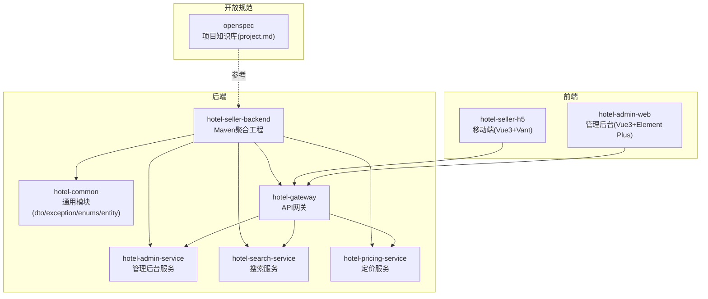
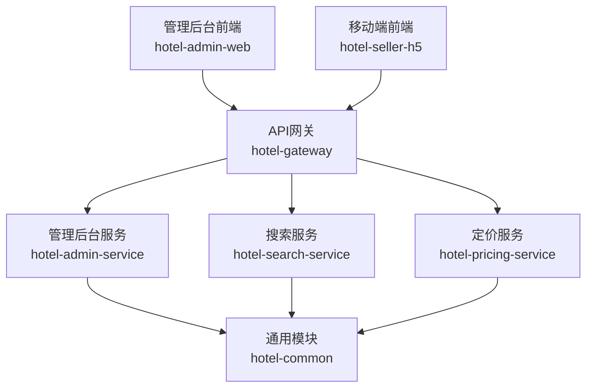
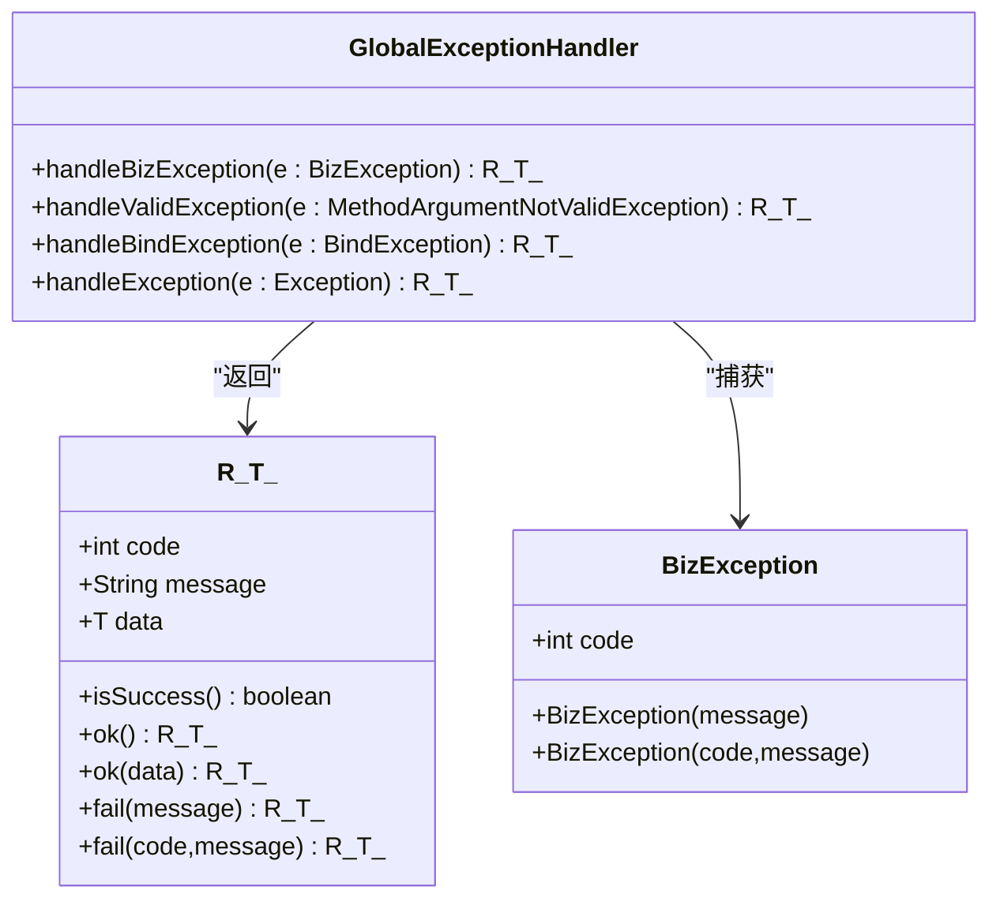
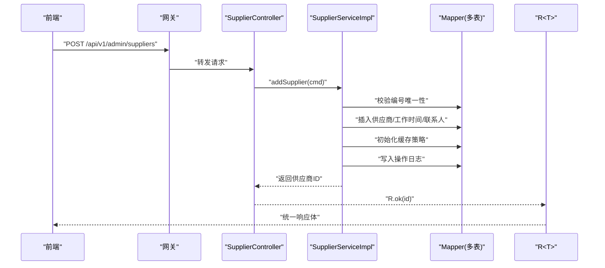
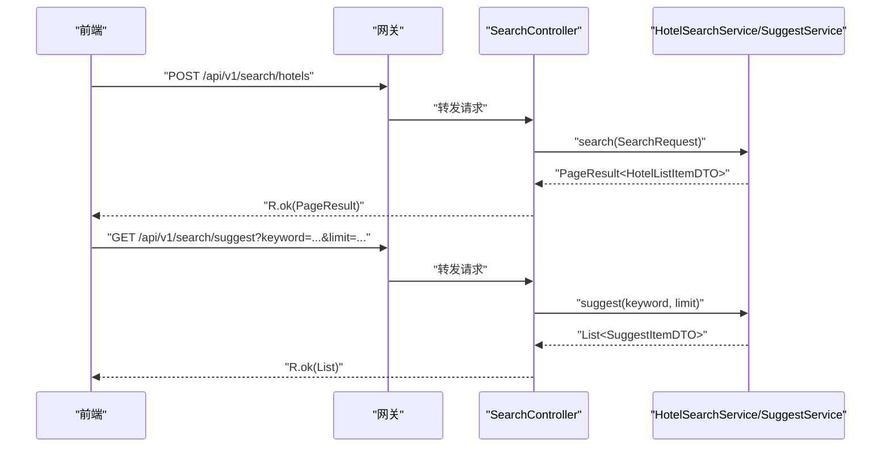
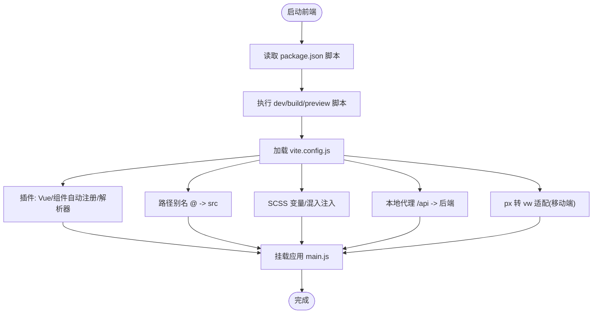
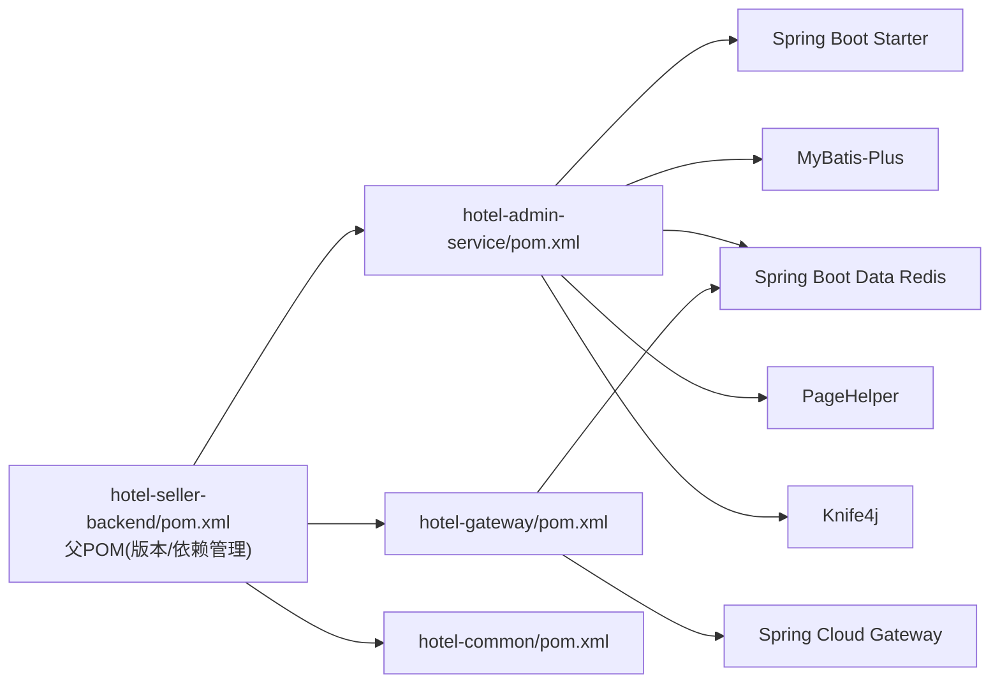

# 开发指南

<cite>
**本文引用的文件**
- [hotel-admin-web/package.json](file://hotel-admin-web/package.json)
- [hotel-admin-web/vite.config.js](file://hotel-admin-web/vite.config.js)
- [hotel-admin-web/src/main.js](file://hotel-admin-web/src/main.js)
- [hotel-seller-h5/package.json](file://hotel-seller-h5/package.json)
- [hotel-seller-h5/vite.config.js](file://hotel-seller-h5/vite.config.js)
- [hotel-seller-h5/src/main.js](file://hotel-seller-h5/src/main.js)
- [hotel-seller-backend/pom.xml](file://hotel-seller-backend/pom.xml)
- [hotel-seller-backend/hotel-admin-service/pom.xml](file://hotel-seller-backend/hotel-admin-service/pom.xml)
- [hotel-seller-backend/hotel-admin-service/src/main/java/com/ceair/hotel/admin/AdminApplication.java](file://hotel-seller-backend/hotel-admin-service/src/main/java/com/ceair/hotel/admin/AdminApplication.java)
- [hotel-seller-backend/hotel-gateway/pom.xml](file://hotel-seller-backend/hotel-gateway/pom.xml)
- [hotel-seller-backend/hotel-gateway/src/main/java/com/ceair/hotel/gateway/GatewayApplication.java](file://hotel-seller-backend/hotel-gateway/src/main/java/com/ceair/hotel/gateway/GatewayApplication.java)
- [hotel-seller-backend/hotel-common/src/main/java/com/ceair/hotel/common/dto/R.java](file://hotel-seller-backend/hotel-common/src/main/java/com/ceair/hotel/common/dto/R.java)
- [hotel-seller-backend/hotel-common/src/main/java/com/ceair/hotel/common/exception/BizException.java](file://hotel-seller-backend/hotel-common/src/main/java/com/ceair/hotel/common/exception/BizException.java)
- [hotel-seller-backend/hotel-common/src/main/java/com/ceair/hotel/common/exception/GlobalExceptionHandler.java](file://hotel-seller-backend/hotel-common/src/main/java/com/ceair/hotel/common/exception/GlobalExceptionHandler.java)
- [hotel-seller-backend/hotel-admin-service/src/main/java/com/ceair/hotel/admin/controller/SupplierController.java](file://hotel-seller-backend/hotel-admin-service/src/main/java/com/ceair/hotel/admin/controller/SupplierController.java)
- [hotel-seller-backend/hotel-admin-service/src/main/java/com/ceair/hotel/admin/service/impl/SupplierServiceImpl.java](file://hotel-seller-backend/hotel-admin-service/src/main/java/com/ceair/hotel/admin/service/impl/SupplierServiceImpl.java)
- [hotel-seller-backend/hotel-search-service/src/main/java/com/ceair/hotel/search/controller/SearchController.java](file://hotel-seller-backend/hotel-search-service/src/main/java/com/ceair/hotel/search/controller/SearchController.java)
- [openspec/project.md](file://openspec/project.md)
</cite>

## 目录
1. [简介](#简介)
2. [项目结构](#项目结构)
3. [核心组件](#核心组件)
4. [架构总览](#架构总览)
5. [详细组件分析](#详细组件分析)
6. [依赖关系分析](#依赖关系分析)
7. [性能考虑](#性能考虑)
8. [故障排查指南](#故障排查指南)
9. [结论](#结论)
10. [附录](#附录)

## 简介
本开发指南面向酒店销售系统的开发团队，提供从环境搭建、代码规范、测试策略、调试与性能分析到构建发布与版本管理的全流程标准。系统采用前后端分离架构：前端包含管理后台 Web 应用与移动端 H5 应用；后端采用多模块 Maven 工程，包含通用模块、网关模块以及多个业务服务模块（如管理后台服务、搜索服务、定价服务等）。通过统一的响应封装、全局异常处理与清晰的模块边界，保障系统的可维护性与扩展性。

## 项目结构
项目由三个前端应用与一个后端多模块工程组成，配合开放规范知识库，形成完整的开发与协作体系。

图表来源
- [hotel-seller-backend/pom.xml:21-27](file://hotel-seller-backend/pom.xml#L21-L27)
- [hotel-seller-backend/hotel-admin-service/pom.xml:1-14](file://hotel-seller-backend/hotel-admin-service/pom.xml#L1-L14)
- [hotel-seller-backend/hotel-gateway/pom.xml:1-14](file://hotel-seller-backend/hotel-gateway/pom.xml#L1-L14)
- [openspec/project.md:9-16](file://openspec/project.md#L9-L16)

章节来源
- [hotel-seller-backend/pom.xml:1-122](file://hotel-seller-backend/pom.xml#L1-L122)
- [openspec/project.md:1-41](file://openspec/project.md#L1-L41)

## 核心组件
- 响应封装与异常处理：统一响应体与全局异常处理，保证前后端交互一致性与错误可追踪性。
- 控制器与服务层：控制器负责参数校验与请求转发，服务层实现业务逻辑与事务控制。
- 前端应用：管理后台使用 Element Plus，移动端使用 Vant，并通过 Vite 进行构建与本地代理。
- 网关与模块化：网关统一接入，后端按功能拆分为独立模块，降低耦合度。

章节来源
- [hotel-seller-backend/hotel-common/src/main/java/com/ceair/hotel/common/dto/R.java:1-48](file://hotel-seller-backend/hotel-common/src/main/java/com/ceair/hotel/common/dto/R.java#L1-L48)
- [hotel-seller-backend/hotel-common/src/main/java/com/ceair/hotel/common/exception/GlobalExceptionHandler.java:1-41](file://hotel-seller-backend/hotel-common/src/main/java/com/ceair/hotel/common/exception/GlobalExceptionHandler.java#L1-L41)
- [hotel-seller-backend/hotel-admin-service/src/main/java/com/ceair/hotel/admin/controller/SupplierController.java:1-105](file://hotel-seller-backend/hotel-admin-service/src/main/java/com/ceair/hotel/admin/controller/SupplierController.java#L1-L105)
- [hotel-seller-backend/hotel-admin-service/src/main/java/com/ceair/hotel/admin/service/impl/SupplierServiceImpl.java:1-162](file://hotel-seller-backend/hotel-admin-service/src/main/java/com/ceair/hotel/admin/service/impl/SupplierServiceImpl.java#L1-L162)
- [hotel-admin-web/src/main.js:1-23](file://hotel-admin-web/src/main.js#L1-L23)
- [hotel-seller-h5/src/main.js:1-33](file://hotel-seller-h5/src/main.js#L1-L33)

## 架构总览
系统采用“前端应用 + API 网关 + 多业务服务 + 通用模块”的分层架构。前端通过网关访问后端服务，网关负责统一鉴权、限流与路由；后端通过模块化组织，公共能力下沉至通用模块，业务服务聚焦各自领域。

图表来源
- [hotel-seller-backend/hotel-gateway/src/main/java/com/ceair/hotel/gateway/GatewayApplication.java:1-13](file://hotel-seller-backend/hotel-gateway/src/main/java/com/ceair/hotel/gateway/GatewayApplication.java#L1-L13)
- [hotel-seller-backend/hotel-admin-service/src/main/java/com/ceair/hotel/admin/AdminApplication.java:1-16](file://hotel-seller-backend/hotel-admin-service/src/main/java/com/ceair/hotel/admin/AdminApplication.java#L1-L16)
- [hotel-seller-backend/hotel-search-service/src/main/java/com/ceair/hotel/search/controller/SearchController.java:1-43](file://hotel-seller-backend/hotel-search-service/src/main/java/com/ceair/hotel/search/controller/SearchController.java#L1-L43)
- [hotel-seller-backend/pom.xml:21-27](file://hotel-seller-backend/pom.xml#L21-L27)

## 详细组件分析

### 响应封装与异常处理
- 统一响应体：提供成功/失败封装与便捷工厂方法，便于前后端一致处理。
- 全局异常处理：对业务异常、参数校验异常与系统异常进行分类处理，返回标准化错误码与消息。

图表来源
- [hotel-seller-backend/hotel-common/src/main/java/com/ceair/hotel/common/dto/R.java:1-48](file://hotel-seller-backend/hotel-common/src/main/java/com/ceair/hotel/common/dto/R.java#L1-L48)
- [hotel-seller-backend/hotel-common/src/main/java/com/ceair/hotel/common/exception/BizException.java:1-23](file://hotel-seller-backend/hotel-common/src/main/java/com/ceair/hotel/common/exception/BizException.java#L1-L23)
- [hotel-seller-backend/hotel-common/src/main/java/com/ceair/hotel/common/exception/GlobalExceptionHandler.java:1-41](file://hotel-seller-backend/hotel-common/src/main/java/com/ceair/hotel/common/exception/GlobalExceptionHandler.java#L1-L41)

章节来源
- [hotel-seller-backend/hotel-common/src/main/java/com/ceair/hotel/common/dto/R.java:1-48](file://hotel-seller-backend/hotel-common/src/main/java/com/ceair/hotel/common/dto/R.java#L1-L48)
- [hotel-seller-backend/hotel-common/src/main/java/com/ceair/hotel/common/exception/GlobalExceptionHandler.java:1-41](file://hotel-seller-backend/hotel-common/src/main/java/com/ceair/hotel/common/exception/GlobalExceptionHandler.java#L1-L41)

### 供应商管理服务（示例）
- 控制器：提供供应商列表、详情、新增、编辑、上下线、工作时间与联系人查询等接口。
- 服务实现：包含分页查询、唯一性校验、事务性保存、初始化缓存策略与操作日志记录。

图表来源
- [hotel-seller-backend/hotel-admin-service/src/main/java/com/ceair/hotel/admin/controller/SupplierController.java:50-55](file://hotel-seller-backend/hotel-admin-service/src/main/java/com/ceair/hotel/admin/controller/SupplierController.java#L50-L55)
- [hotel-seller-backend/hotel-admin-service/src/main/java/com/ceair/hotel/admin/service/impl/SupplierServiceImpl.java:59-97](file://hotel-seller-backend/hotel-admin-service/src/main/java/com/ceair/hotel/admin/service/impl/SupplierServiceImpl.java#L59-L97)

章节来源
- [hotel-seller-backend/hotel-admin-service/src/main/java/com/ceair/hotel/admin/controller/SupplierController.java:1-105](file://hotel-seller-backend/hotel-admin-service/src/main/java/com/ceair/hotel/admin/controller/SupplierController.java#L1-L105)
- [hotel-seller-backend/hotel-admin-service/src/main/java/com/ceair/hotel/admin/service/impl/SupplierServiceImpl.java:1-162](file://hotel-seller-backend/hotel-admin-service/src/main/java/com/ceair/hotel/admin/service/impl/SupplierServiceImpl.java#L1-L162)

### 搜索服务接口
- 提供酒店列表搜索与关键词建议接口，返回分页结果与建议项列表。

图表来源
- [hotel-seller-backend/hotel-search-service/src/main/java/com/ceair/hotel/search/controller/SearchController.java:29-41](file://hotel-seller-backend/hotel-search-service/src/main/java/com/ceair/hotel/search/controller/SearchController.java#L29-L41)

章节来源
- [hotel-seller-backend/hotel-search-service/src/main/java/com/ceair/hotel/search/controller/SearchController.java:1-43](file://hotel-seller-backend/hotel-search-service/src/main/java/com/ceair/hotel/search/controller/SearchController.java#L1-L43)

### 前端应用与构建配置
- 管理后台（Element Plus）：配置自动导入组件、SCSS 变量注入、路径别名与本地代理。
- 移动端（Vant）：配置 Vant 自动解析器、SCSS 变量与混入注入、px 转 vw 适配、本地服务端口与主机绑定。

图表来源
- [hotel-admin-web/package.json:6-10](file://hotel-admin-web/package.json#L6-L10)
- [hotel-admin-web/vite.config.js:1-41](file://hotel-admin-web/vite.config.js#L1-L41)
- [hotel-admin-web/src/main.js:1-23](file://hotel-admin-web/src/main.js#L1-L23)
- [hotel-seller-h5/package.json:6-10](file://hotel-seller-h5/package.json#L6-L10)
- [hotel-seller-h5/vite.config.js:1-48](file://hotel-seller-h5/vite.config.js#L1-L48)
- [hotel-seller-h5/src/main.js:1-33](file://hotel-seller-h5/src/main.js#L1-L33)

章节来源
- [hotel-admin-web/package.json:1-29](file://hotel-admin-web/package.json#L1-L29)
- [hotel-admin-web/vite.config.js:1-41](file://hotel-admin-web/vite.config.js#L1-L41)
- [hotel-admin-web/src/main.js:1-23](file://hotel-admin-web/src/main.js#L1-L23)
- [hotel-seller-h5/package.json:1-30](file://hotel-seller-h5/package.json#L1-L30)
- [hotel-seller-h5/vite.config.js:1-48](file://hotel-seller-h5/vite.config.js#L1-L48)
- [hotel-seller-h5/src/main.js:1-33](file://hotel-seller-h5/src/main.js#L1-L33)

## 依赖关系分析
- 后端聚合工程定义了 Java 版本、Spring Cloud 版本、MyBatis-Plus、Druid、Knife4j、PageHelper 等依赖与版本管理，子模块按需引入。
- 管理后台服务依赖通用模块、Web、MyBatis-Plus、Redis、校验、Knife4j、PageHelper。
- 网关模块依赖 Spring Cloud Gateway 与 Redis Reactive。

图表来源
- [hotel-seller-backend/pom.xml:29-93](file://hotel-seller-backend/pom.xml#L29-L93)
- [hotel-seller-backend/hotel-admin-service/pom.xml:16-54](file://hotel-seller-backend/hotel-admin-service/pom.xml#L16-L54)
- [hotel-seller-backend/hotel-gateway/pom.xml:16-25](file://hotel-seller-backend/hotel-gateway/pom.xml#L16-L25)

章节来源
- [hotel-seller-backend/pom.xml:1-122](file://hotel-seller-backend/pom.xml#L1-L122)
- [hotel-seller-backend/hotel-admin-service/pom.xml:1-73](file://hotel-seller-backend/hotel-admin-service/pom.xml#L1-L73)
- [hotel-seller-backend/hotel-gateway/pom.xml:1-36](file://hotel-seller-backend/hotel-gateway/pom.xml#L1-L36)

## 性能考虑
- 前端
  - 使用组件自动导入减少手动引入成本，提升开发效率。
  - SCSS 变量与混入集中管理，避免重复计算与样式冲突。
  - px 转 vw 适配移动端，减少布局抖动与兼容性问题。
- 后端
  - 使用 PageHelper 实现分页，避免一次性加载大量数据。
  - 事务边界明确，批量写入时注意逐条插入或使用批处理优化。
  - 缓存策略初始化在新增供应商时完成，减少后续查询延迟。

章节来源
- [hotel-seller-backend/hotel-admin-service/src/main/java/com/ceair/hotel/admin/service/impl/SupplierServiceImpl.java:85-90](file://hotel-seller-backend/hotel-admin-service/src/main/java/com/ceair/hotel/admin/service/impl/SupplierServiceImpl.java#L85-L90)
- [hotel-seller-backend/hotel-admin-service/pom.xml:79-84](file://hotel-seller-backend/hotel-admin-service/pom.xml#L79-L84)

## 故障排查指南
- 统一响应与异常
  - 通过统一响应体快速定位错误类型与消息；全局异常处理器对业务异常与参数校验异常进行分类返回。
- 常见问题
  - 参数校验失败：检查请求体字段与校验注解，查看返回的默认错误消息。
  - 业务异常：根据抛出的业务异常码与消息定位具体业务分支。
  - 数据不一致：确认事务边界与回滚条件，核对批量写入顺序。
- 日志与可观测性
  - 业务关键操作记录操作日志，便于审计与回溯。
  - 建议在网关与各服务中开启必要的日志级别，便于定位跨服务调用问题。

章节来源
- [hotel-seller-backend/hotel-common/src/main/java/com/ceair/hotel/common/exception/GlobalExceptionHandler.java:17-39](file://hotel-seller-backend/hotel-common/src/main/java/com/ceair/hotel/common/exception/GlobalExceptionHandler.java#L17-L39)
- [hotel-seller-backend/hotel-admin-service/src/main/java/com/ceair/hotel/admin/service/impl/SupplierServiceImpl.java:150-160](file://hotel-seller-backend/hotel-admin-service/src/main/java/com/ceair/hotel/admin/service/impl/SupplierServiceImpl.java#L150-L160)

## 结论
本指南提供了酒店销售系统从环境搭建到上线运维的完整开发标准。通过统一的响应与异常处理、清晰的模块边界与前端构建配置，团队可以高效协作并保持代码质量。建议在实际开发中持续完善开放规范知识库，沉淀最佳实践与常见问题解决方案。

## 附录

### 开发环境搭建与 IDE 配置
- 前端
  - 安装 Node.js 与包管理工具，分别在两个前端目录安装依赖并运行开发脚本。
  - 配置 IDE 的 TypeScript/Vue 支持与 ESLint/Prettier 插件，启用保存时自动格式化。
  - 配置 Vite 代理，确保前端能正确访问后端服务。
- 后端
  - 安装 JDK 与 Maven，导入聚合工程，等待依赖解析完成。
  - 配置 Lombok 插件，确保实体类与日志注解正常生效。
  - 配置数据库与 Redis，确保服务启动时连接可用。

章节来源
- [hotel-admin-web/package.json:6-10](file://hotel-admin-web/package.json#L6-L10)
- [hotel-seller-h5/package.json:6-10](file://hotel-seller-h5/package.json#L6-L10)
- [hotel-seller-backend/pom.xml:29-38](file://hotel-seller-backend/pom.xml#L29-L38)

### 代码规范与最佳实践
- 命名约定
  - 包名小写，类名采用大驼峰，方法与变量采用小驼峰。
  - 接口与抽象类使用语义化前缀（如 IXXXService），实现类使用 Impl 后缀。
- 注释规范
  - 类与方法添加必要注释，说明职责、参数、返回值与异常。
  - Swagger 注解用于接口文档生成，保持接口描述与实现一致。
- 架构设计原则
  - 单一职责：控制器仅做参数与路由转发，业务逻辑下沉至服务层。
  - 开闭原则：通过接口与抽象类扩展新能力，避免修改既有实现。
  - 依赖倒置：服务层依赖接口而非具体实现，便于替换与测试。

章节来源
- [hotel-seller-backend/hotel-admin-service/src/main/java/com/ceair/hotel/admin/controller/SupplierController.java:15-22](file://hotel-seller-backend/hotel-admin-service/src/main/java/com/ceair/hotel/admin/controller/SupplierController.java#L15-L22)
- [hotel-seller-backend/hotel-admin-service/src/main/java/com/ceair/hotel/admin/service/impl/SupplierServiceImpl.java:20-23](file://hotel-seller-backend/hotel-admin-service/src/main/java/com/ceair/hotel/admin/service/impl/SupplierServiceImpl.java#L20-L23)

### 测试策略
- 单元测试
  - 对服务层方法进行隔离测试，使用 Mock 或内存数据库验证业务逻辑。
- 集成测试
  - 在容器内启动网关与相关服务，验证接口连通性与数据一致性。
- 端到端测试
  - 使用自动化测试框架覆盖关键用户路径，如供应商增删改查、搜索与建议流程。

[本节为通用指导，无需特定文件引用]

### 调试技巧与性能分析
- 前端
  - 使用浏览器开发者工具检查网络请求与响应，结合 Vite 代理定位跨域与路由问题。
  - 在移动端场景下验证 px 转 vw 适配效果。
- 后端
  - 通过全局异常处理器输出的日志快速定位异常点。
  - 使用慢查询日志与分页参数验证数据库性能瓶颈。
- 性能分析
  - 关注事务边界与批量写入，避免长事务与阻塞。
  - 对高频接口进行压测，评估并发与资源占用。

章节来源
- [hotel-seller-backend/hotel-common/src/main/java/com/ceair/hotel/common/exception/GlobalExceptionHandler.java:17-39](file://hotel-seller-backend/hotel-common/src/main/java/com/ceair/hotel/common/exception/GlobalExceptionHandler.java#L17-L39)

### 构建、打包与发布
- 前端
  - 使用构建脚本生成生产包，检查静态资源与路由配置。
- 后端
  - 使用 Maven 打包，确保排除 Lombok 并生成可执行 JAR。
  - 将网关与各服务分别部署，配置路由规则与健康检查。
- 版本管理
  - 使用语义化版本号，变更记录与发布说明同步更新。

章节来源
- [hotel-admin-web/package.json:6-10](file://hotel-admin-web/package.json#L6-L10)
- [hotel-seller-h5/package.json:6-10](file://hotel-seller-h5/package.json#L6-L10)
- [hotel-seller-backend/hotel-admin-service/pom.xml:56-71](file://hotel-seller-backend/hotel-admin-service/pom.xml#L56-L71)

### 贡献指南、代码审查与协作规范
- 分支命名
  - 功能分支：feature/xxx
  - 修复分支：fix/xxx
  - 热修复分支：hotfix/xxx
- 提交信息
  - 格式：类型(scope): 描述
  - 示例：feat(admin): 新增供应商状态管理接口
- 代码审查
  - 至少一名 reviewer 通过，确保代码风格、安全性与可维护性。
- 开放规范
  - 项目背景、架构、术语与外部依赖在知识库中统一维护，便于新成员快速上手。

章节来源
- [openspec/project.md:18-25](file://openspec/project.md#L18-L25)