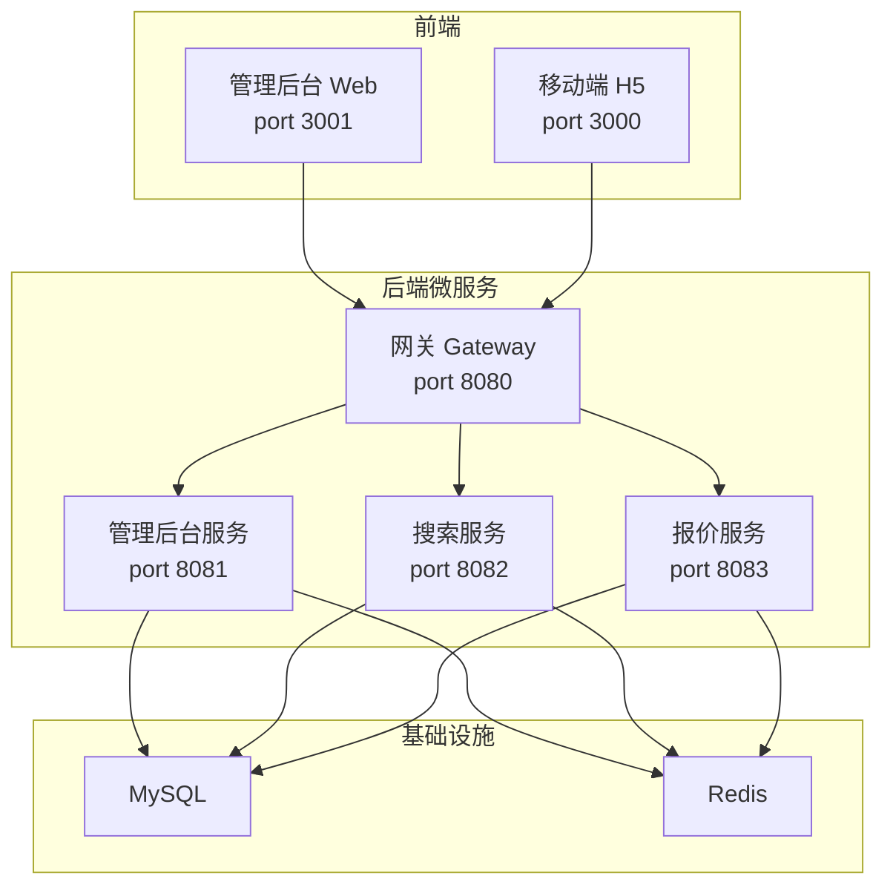
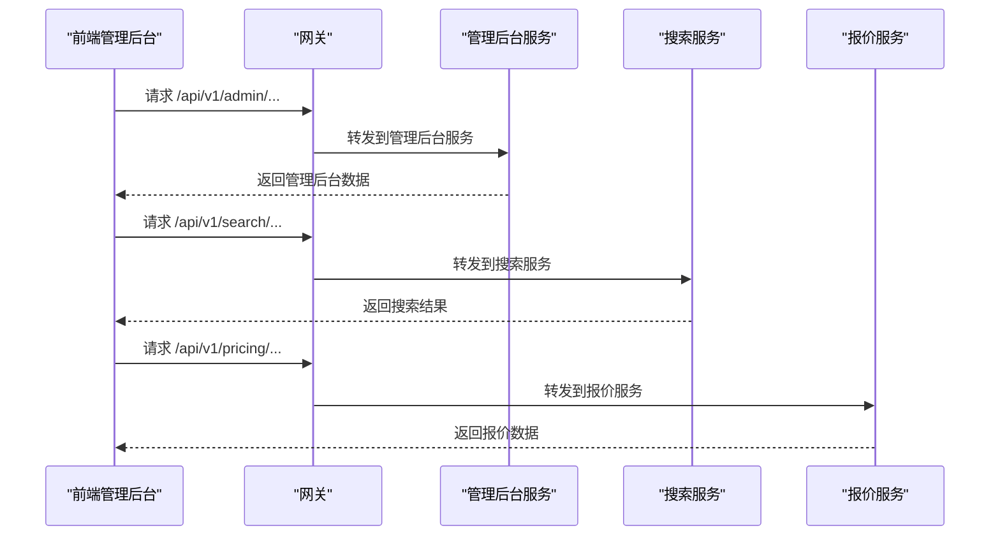
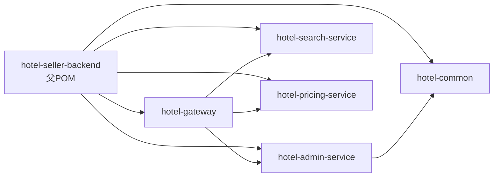

# 开发环境搭建

<cite>
**本文引用的文件**
- [hotel-admin-web/package.json](file://hotel-admin-web/package.json)
- [hotel-seller-h5/package.json](file://hotel-seller-h5/package.json)
- [hotel-admin-web/vite.config.js](file://hotel-admin-web/vite.config.js)
- [hotel-seller-h5/vite.config.js](file://hotel-seller-h5/vite.config.js)
- [hotel-seller-backend/pom.xml](file://hotel-seller-backend/pom.xml)
- [hotel-seller-backend/hotel-admin-service/pom.xml](file://hotel-seller-backend/hotel-admin-service/pom.xml)
- [hotel-seller-backend/hotel-common/pom.xml](file://hotel-seller-backend/hotel-common/pom.xml)
- [hotel-seller-backend/hotel-admin-service/src/main/resources/application.yml](file://hotel-seller-backend/hotel-admin-service/src/main/resources/application.yml)
- [hotel-seller-backend/hotel-gateway/src/main/resources/application.yml](file://hotel-seller-backend/hotel-gateway/src/main/resources/application.yml)
- [hotel-seller-backend/hotel-search-service/src/main/resources/application.yml](file://hotel-seller-backend/hotel-search-service/src/main/resources/application.yml)
- [hotel-seller-backend/hotel-pricing-service/src/main/resources/application.yml](file://hotel-seller-backend/hotel-pricing-service/src/main/resources/application.yml)
- [mock_data.sql](file://mock_data.sql)
</cite>

## 目录
1. [简介](#简介)
2. [项目结构](#项目结构)
3. [核心组件](#核心组件)
4. [架构总览](#架构总览)
5. [详细组件分析](#详细组件分析)
6. [依赖关系分析](#依赖关系分析)
7. [性能考虑](#性能考虑)
8. [故障排查指南](#故障排查指南)
9. [结论](#结论)
10. [附录](#附录)

## 简介
本指南面向酒店销售系统的开发者，提供从零搭建完整开发环境的操作步骤，涵盖：
- Java 开发环境配置（JDK 版本、Maven、IDE）
- Node.js 环境配置（npm/yarn/pnpm 选择与配置）
- 数据库与中间件环境（MySQL、Redis）与初始化脚本
- Docker 容器化部署准备
- IDE 配置（IntelliJ IDEA、VS Code 插件与格式化、调试）
- 环境验证流程，确保前后端与后端微服务协同工作

## 项目结构
系统采用前后端分离与多模块后端微服务架构：
- 前端包含管理后台 Web 与移动端 H5 两个独立应用，均基于 Vue 3 + Vite 构建
- 后端为 Maven 多模块工程，包含通用模块与多个微服务模块（网关、管理后台、搜索、报价等）
- 数据库与 Redis 作为共享基础设施，各服务通过各自配置连接

图表来源
- [hotel-admin-web/vite.config.js:24-32](file://hotel-admin-web/vite.config.js#L24-L32)
- [hotel-seller-backend/hotel-gateway/src/main/resources/application.yml:17-48](file://hotel-seller-backend/hotel-gateway/src/main/resources/application.yml#L17-L48)
- [hotel-seller-backend/hotel-admin-service/src/main/resources/application.yml:9-22](file://hotel-seller-backend/hotel-admin-service/src/main/resources/application.yml#L9-L22)
- [hotel-seller-backend/hotel-search-service/src/main/resources/application.yml:7-20](file://hotel-seller-backend/hotel-search-service/src/main/resources/application.yml#L7-L20)
- [hotel-seller-backend/hotel-pricing-service/src/main/resources/application.yml:7-20](file://hotel-seller-backend/hotel-pricing-service/src/main/resources/application.yml#L7-L20)

章节来源
- [hotel-admin-web/vite.config.js:1-41](file://hotel-admin-web/vite.config.js#L1-L41)
- [hotel-seller-h5/vite.config.js:1-48](file://hotel-seller-h5/vite.config.js#L1-L48)
- [hotel-seller-backend/hotel-gateway/src/main/resources/application.yml:1-54](file://hotel-seller-backend/hotel-gateway/src/main/resources/application.yml#L1-L54)
- [hotel-seller-backend/hotel-admin-service/src/main/resources/application.yml:1-44](file://hotel-seller-backend/hotel-admin-service/src/main/resources/application.yml#L1-L44)
- [hotel-seller-backend/hotel-search-service/src/main/resources/application.yml:1-37](file://hotel-seller-backend/hotel-search-service/src/main/resources/application.yml#L1-L37)
- [hotel-seller-backend/hotel-pricing-service/src/main/resources/application.yml:1-37](file://hotel-seller-backend/hotel-pricing-service/src/main/resources/application.yml#L1-L37)

## 核心组件
- 前端管理后台 Web（Vue 3 + Element Plus + Vite）
- 前端移动端 H5（Vue 3 + Vant + Vite）
- 后端微服务（Spring Boot + Spring Cloud + MyBatis-Plus + Druid + Knife4j）
- 网关（Spring Cloud Gateway 路由）
- 数据库（MySQL）
- 缓存（Redis）

章节来源
- [hotel-admin-web/package.json:11-27](file://hotel-admin-web/package.json#L11-L27)
- [hotel-seller-h5/package.json:11-28](file://hotel-seller-h5/package.json#L11-L28)
- [hotel-seller-backend/pom.xml:29-38](file://hotel-seller-backend/pom.xml#L29-L38)
- [hotel-seller-backend/hotel-admin-service/pom.xml:16-54](file://hotel-seller-backend/hotel-admin-service/pom.xml#L16-L54)

## 架构总览
系统通过网关统一对外提供 REST API，前端通过代理访问后端服务。各微服务独立运行，共享 MySQL 与 Redis。

图表来源
- [hotel-seller-backend/hotel-gateway/src/main/resources/application.yml:17-48](file://hotel-seller-backend/hotel-gateway/src/main/resources/application.yml#L17-L48)
- [hotel-admin-web/vite.config.js:26-31](file://hotel-admin-web/vite.config.js#L26-L31)

章节来源
- [hotel-seller-backend/hotel-gateway/src/main/resources/application.yml:1-54](file://hotel-seller-backend/hotel-gateway/src/main/resources/application.yml#L1-L54)
- [hotel-admin-web/vite.config.js:1-41](file://hotel-admin-web/vite.config.js#L1-L41)

## 详细组件分析

### Java 开发环境配置
- JDK 版本
  - 后端父工程属性指定 Java 版本为 1.8，建议使用 JDK 8 或兼容的更高版本进行编译与运行
- Maven 配置
  - 使用 Maven 管理多模块工程，父 POM 统一管理依赖版本与构建插件
  - 各子模块引入 Spring Boot Starter、MyBatis-Plus、Druid、Knife4j、PageHelper 等依赖
- IDE 设置（IntelliJ IDEA）
  - 导入根目录的 Maven 工程，启用注解处理与 Lombok 支持
  - 配置 Maven Settings（如本地仓库、镜像），确保依赖下载稳定
  - 为每个模块设置正确的运行配置（例如 Admin Service 的入口类）
- 运行顺序建议
  - 先启动网关（Gateway），再启动各微服务（Admin/Search/Pricing），最后启动前端

章节来源
- [hotel-seller-backend/pom.xml:29-38](file://hotel-seller-backend/pom.xml#L29-L38)
- [hotel-seller-backend/pom.xml:95-120](file://hotel-seller-backend/pom.xml#L95-L120)
- [hotel-seller-backend/hotel-admin-service/pom.xml:16-54](file://hotel-seller-backend/hotel-admin-service/pom.xml#L16-L54)
- [hotel-seller-backend/hotel-common/pom.xml:16-37](file://hotel-seller-backend/hotel-common/pom.xml#L16-L37)

### Node.js 环境配置
- 包管理器选择
  - 项目使用 npm（package-lock.json 存在），可直接使用 npm install
  - 如偏好 yarn/pnpm，可替换为相应命令，但需注意依赖锁定文件一致性
- 依赖安装
  - 在前端目录分别执行安装命令（管理后台 Web 与移动端 H5）
- 开发与构建
  - dev/build/preview 脚本已在 package.json 中定义
  - Vite 配置中包含别名、自动导入、组件解析与 SCSS 预处理器设置

章节来源
- [hotel-admin-web/package.json:6-10](file://hotel-admin-web/package.json#L6-L10)
- [hotel-admin-web/package.json:11-27](file://hotel-admin-web/package.json#L11-L27)
- [hotel-seller-h5/package.json:6-10](file://hotel-seller-h5/package.json#L6-L10)
- [hotel-seller-h5/package.json:11-28](file://hotel-seller-h5/package.json#L11-L28)
- [hotel-admin-web/vite.config.js:8-18](file://hotel-admin-web/vite.config.js#L8-L18)
- [hotel-seller-h5/vite.config.js:8-14](file://hotel-seller-h5/vite.config.js#L8-L14)

### 数据库与中间件环境
- MySQL
  - 后端各服务默认连接本地 MySQL（端口 3306），数据库名 hotel_seller
  - 管理后台服务使用数据库 0；搜索服务使用数据库 1；报价服务使用数据库 2
  - 建议先创建数据库与用户，再执行初始化 SQL
- Redis
  - 各服务默认连接本地 Redis（端口 6379），数据库索引不同以隔离
- 初始化脚本
  - 提供完整的测试数据脚本，包含城市、供应商、价格策略、推荐酒店、报价快照、日志与统计等表
  - 执行顺序：先执行 DDL（系统设计文档 2.5.1 章节），再导入本脚本

章节来源
- [hotel-seller-backend/hotel-admin-service/src/main/resources/application.yml:9-22](file://hotel-seller-backend/hotel-admin-service/src/main/resources/application.yml#L9-L22)
- [hotel-seller-backend/hotel-search-service/src/main/resources/application.yml:7-20](file://hotel-seller-backend/hotel-search-service/src/main/resources/application.yml#L7-L20)
- [hotel-seller-backend/hotel-pricing-service/src/main/resources/application.yml:7-20](file://hotel-seller-backend/hotel-pricing-service/src/main/resources/application.yml#L7-L20)
- [mock_data.sql:1-12](file://mock_data.sql#L1-L12)

### Docker 环境配置
- 建议准备 MySQL 与 Redis 容器，映射本地端口与持久化卷
- 后端服务可通过 Docker 镜像运行，或直接使用本地 JDK/Maven 启动
- 前端可打包后使用 Nginx 容器部署
- 网关与各微服务之间通过容器网络互通

（本节为概念性指导，无需具体文件引用）

### IDE 配置与调试
- IntelliJ IDEA
  - 导入 Maven 工程，启用注解处理与 Lombok
  - 为每个 Spring Boot 模块配置运行配置，设置主类与 VM 参数
  - 使用 Maven 工具窗口执行 clean compile package
- VS Code（前端）
  - 安装 Vue/SCSS/Vetur/ESLint/Prettier 等扩展
  - 配置任务与调试配置，启动 Vite 开发服务器
- 代理与跨域
  - 前端 Vite 代理指向后端服务端口，确保跨域头允许
  - 网关已配置全局 CORS，便于本地联调

章节来源
- [hotel-admin-web/vite.config.js:24-32](file://hotel-admin-web/vite.config.js#L24-L32)
- [hotel-seller-backend/hotel-gateway/src/main/resources/application.yml:9-16](file://hotel-seller-backend/hotel-gateway/src/main/resources/application.yml#L9-L16)

## 依赖关系分析
后端多模块工程通过父 POM 统一版本管理，模块间存在依赖关系与运行时耦合。

图表来源
- [hotel-seller-backend/pom.xml:21-27](file://hotel-seller-backend/pom.xml#L21-L27)
- [hotel-seller-backend/hotel-admin-service/pom.xml:16-20](file://hotel-seller-backend/hotel-admin-service/pom.xml#L16-L20)

章节来源
- [hotel-seller-backend/pom.xml:1-122](file://hotel-seller-backend/pom.xml#L1-L122)
- [hotel-seller-backend/hotel-admin-service/pom.xml:1-73](file://hotel-seller-backend/hotel-admin-service/pom.xml#L1-L73)

## 性能考虑
- 前端
  - Vite 开发服务器热更新与按需加载，生产构建开启压缩与 Tree Shaking
  - H5 侧启用 px 转 vw 的 PostCSS 插件，适配移动端
- 后端
  - Druid 连接池参数合理配置，避免连接泄漏
  - MyBatis-Plus 分页与日志级别控制，生产关闭详细日志
  - Redis 多数据库隔离，避免键冲突

（本节为通用指导，无需具体文件引用）

## 故障排查指南
- 前端无法访问后端接口
  - 检查 Vite 代理配置是否指向正确的后端端口
  - 确认网关路由规则与服务端口一致
- 数据库连接失败
  - 校验 MySQL 地址、端口、用户名、密码与数据库名
  - 确认初始化脚本已成功执行
- Redis 连接异常
  - 校验 Redis 主机、端口与数据库索引
- 微服务启动失败
  - 检查 JDK 版本与 Maven 依赖是否完整
  - 关注服务端口占用与跨域配置

章节来源
- [hotel-admin-web/vite.config.js:24-32](file://hotel-admin-web/vite.config.js#L24-L32)
- [hotel-seller-backend/hotel-gateway/src/main/resources/application.yml:17-48](file://hotel-seller-backend/hotel-gateway/src/main/resources/application.yml#L17-L48)
- [hotel-seller-backend/hotel-admin-service/src/main/resources/application.yml:9-22](file://hotel-seller-backend/hotel-admin-service/src/main/resources/application.yml#L9-L22)

## 结论
按照本指南完成 Java、Node.js、数据库与中间件的安装与配置，并执行初始化脚本后，即可启动网关与各微服务，配合前端开发服务器实现完整的本地联调。建议在开发过程中遵循统一的代码风格与调试流程，确保团队协作效率与系统稳定性。

## 附录

### 环境验证步骤清单
- Java 环境
  - 验证 JDK 版本与 Maven 版本
  - 在后端根目录执行 Maven 构建，确认无错误
- 数据库与缓存
  - 启动 MySQL 与 Redis，创建 hotel_seller 数据库
  - 执行初始化 SQL，校验各表数据量
- 后端服务
  - 启动网关（8080），再依次启动 Admin/Search/Pricing（8081/8082/8083）
  - 访问 Knife4j 文档（端口对应服务）确认接口可用
- 前端
  - 启动管理后台 Web（3001）与移动端 H5（3000）
  - 通过代理访问后端接口，检查页面功能

章节来源
- [hotel-seller-backend/pom.xml:108-120](file://hotel-seller-backend/pom.xml#L108-L120)
- [hotel-seller-backend/hotel-gateway/src/main/resources/application.yml:1-54](file://hotel-seller-backend/hotel-gateway/src/main/resources/application.yml#L1-L54)
- [hotel-seller-backend/hotel-admin-service/src/main/resources/application.yml:1-44](file://hotel-seller-backend/hotel-admin-service/src/main/resources/application.yml#L1-L44)
- [hotel-seller-backend/hotel-search-service/src/main/resources/application.yml:1-37](file://hotel-seller-backend/hotel-search-service/src/main/resources/application.yml#L1-L37)
- [hotel-seller-backend/hotel-pricing-service/src/main/resources/application.yml:1-37](file://hotel-seller-backend/hotel-pricing-service/src/main/resources/application.yml#L1-L37)
- [hotel-admin-web/vite.config.js:24-32](file://hotel-admin-web/vite.config.js#L24-L32)
- [hotel-seller-h5/vite.config.js:43-46](file://hotel-seller-h5/vite.config.js#L43-L46)
- [mock_data.sql:1-12](file://mock_data.sql#L1-L12)