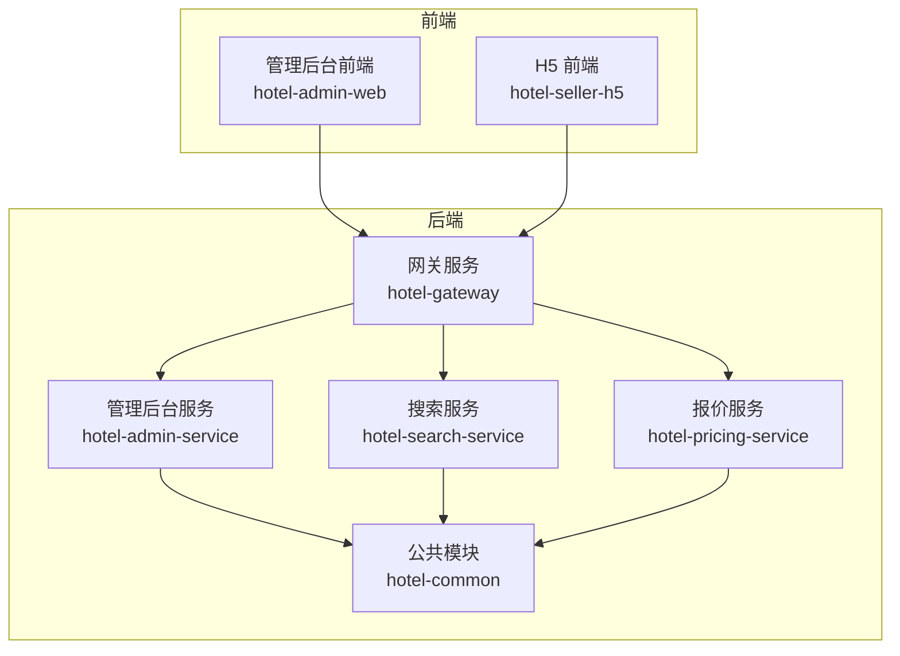
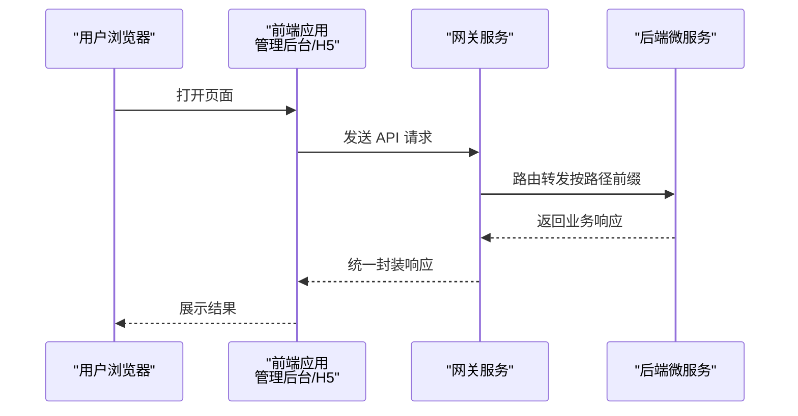
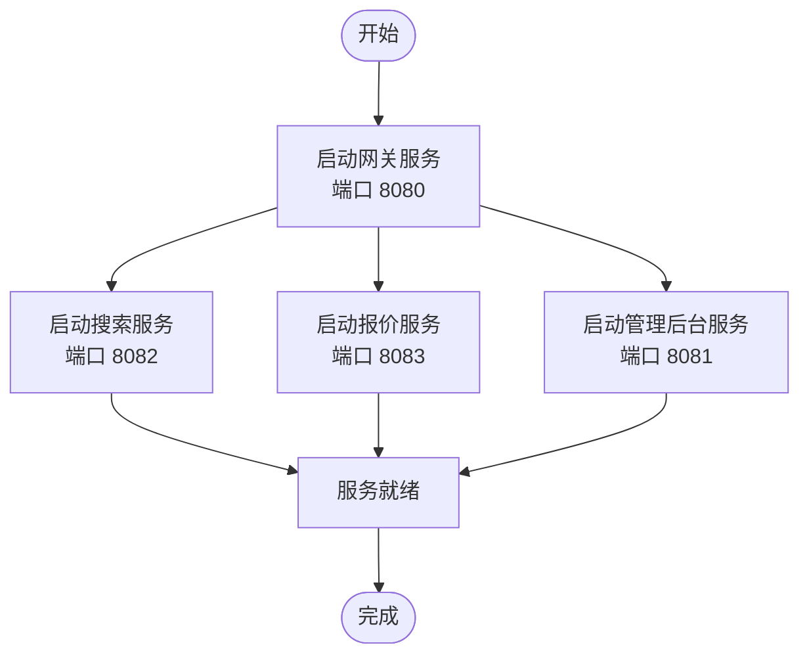
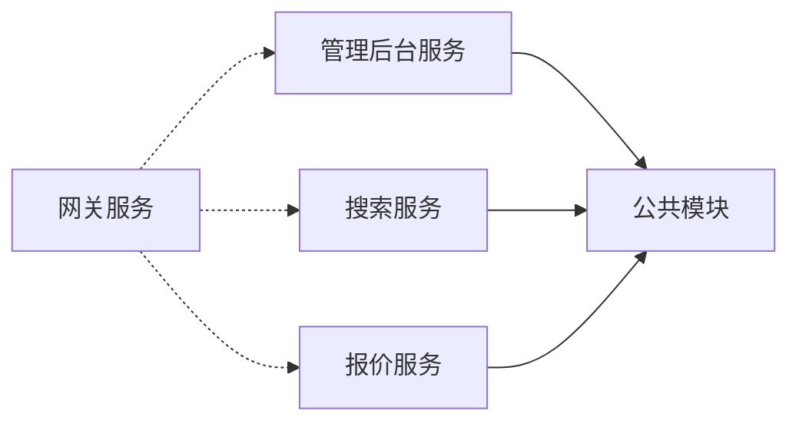

# 快速开始

<cite>
**本文引用的文件**
- [pom.xml](file://hotel-seller-backend/pom.xml)
- [application.yml（网关）](file://hotel-seller-backend/hotel-gateway/src/main/resources/application.yml)
- [application.yml（管理后台服务）](file://hotel-seller-backend/hotel-admin-service/src/main/resources/application.yml)
- [application.yml（搜索服务）](file://hotel-seller-backend/hotel-search-service/src/main/resources/application.yml)
- [application.yml（报价服务）](file://hotel-seller-backend/hotel-pricing-service/src/main/resources/application.yml)
- [AdminApplication.java](file://hotel-seller-backend/hotel-admin-service/src/main/java/com/ceair/hotel/admin/AdminApplication.java)
- [SearchApplication.java](file://hotel-seller-backend/hotel-search-service/src/main/java/com/ceair/hotel/search/SearchApplication.java)
- [PricingApplication.java](file://hotel-seller-backend/hotel-pricing-service/src/main/java/com/ceair/hotel/pricing/PricingApplication.java)
- [GatewayApplication.java](file://hotel-seller-backend/hotel-gateway/src/main/java/com/ceair/hotel/gateway/GatewayApplication.java)
- [package.json（管理后台前端）](file://hotel-admin-web/package.json)
- [package.json（H5前端）](file://hotel-seller-h5/package.json)
- [main.js（管理后台前端）](file://hotel-admin-web/src/main.js)
- [main.js（H5前端）](file://hotel-seller-h5/src/main.js)
- [mock_data.sql](file://mock_data.sql)
- [R.java（统一响应封装）](file://hotel-seller-backend/hotel-common/src/main/java/com/ceair/hotel/common/dto/R.java)
</cite>

## 目录
1. [简介](#简介)
2. [项目结构](#项目结构)
3. [核心组件](#核心组件)
4. [架构总览](#架构总览)
5. [详细组件分析](#详细组件分析)
6. [依赖关系分析](#依赖关系分析)
7. [性能注意事项](#性能注意事项)
8. [故障排除指南](#故障排除指南)
9. [结论](#结论)
10. [附录](#附录)

## 简介
本指南面向新加入的开发者，帮助你在最短时间内完成酒店销售系统的本地环境搭建与完整启动。系统采用前后端分离架构：后端为基于 Spring Boot 的微服务集群，通过网关统一对外提供 REST API；前端包含管理后台（PC）与移动端 H5 两套应用。你将获得完整的环境要求、项目搭建步骤、启动顺序、常见问题排查以及基本使用示例。

## 项目结构
系统由四个主要模块组成：
- 后端聚合工程（Maven 多模块）
  - 网关服务：统一入口与路由转发
  - 管理后台服务：运营与管理功能
  - 搜索服务：酒店检索与建议
  - 报价服务：价格计算与快照
  - 公共模块：通用实体、工具与异常处理
- 前端应用
  - 管理后台 Web（PC 端）
  - H5 移动端应用

图表来源
- [pom.xml:21-27](file://hotel-seller-backend/pom.xml#L21-L27)
- [application.yml（网关）:17-48](file://hotel-seller-backend/hotel-gateway/src/main/resources/application.yml#L17-L48)
- [AdminApplication.java:8-11](file://hotel-seller-backend/hotel-admin-service/src/main/java/com/ceair/hotel/admin/AdminApplication.java#L8-L11)
- [SearchApplication.java:8-11](file://hotel-seller-backend/hotel-search-service/src/main/java/com/ceair/hotel/search/SearchApplication.java#L8-L11)
- [PricingApplication.java:8-11](file://hotel-seller-backend/hotel-pricing-service/src/main/java/com/ceair/hotel/pricing/PricingApplication.java#L8-L11)
- [GatewayApplication.java:6-12](file://hotel-seller-backend/hotel-gateway/src/main/java/com/ceair/hotel/gateway/GatewayApplication.java#L6-L12)

章节来源
- [pom.xml:1-122](file://hotel-seller-backend/pom.xml#L1-L122)

## 核心组件
- 微服务与端口
  - 网关服务：默认端口 8080
  - 管理后台服务：默认端口 8081
  - 搜索服务：默认端口 8082
  - 报价服务：默认端口 8083
- 数据库与缓存
  - MySQL：各服务均连接本地数据库 hotel_seller
  - Redis：管理后台使用库 0，搜索服务使用库 1，报价服务使用库 2
- 前端
  - 管理后台前端：基于 Vue 3 + Vite
  - H5 前端：基于 Vue 3 + Vite

章节来源
- [application.yml（网关）:1-54](file://hotel-seller-backend/hotel-gateway/src/main/resources/application.yml#L1-L54)
- [application.yml（管理后台服务）:1-44](file://hotel-seller-backend/hotel-admin-service/src/main/resources/application.yml#L1-L44)
- [application.yml（搜索服务）:1-37](file://hotel-seller-backend/hotel-search-service/src/main/resources/application.yml#L1-L37)
- [application.yml（报价服务）:1-37](file://hotel-seller-backend/hotel-pricing-service/src/main/resources/application.yml#L1-L37)
- [package.json（管理后台前端）:1-29](file://hotel-admin-web/package.json#L1-L29)
- [package.json（H5前端）:1-30](file://hotel-seller-h5/package.json#L1-L30)

## 架构总览
系统通过网关统一接收请求，根据路径将请求转发到对应的后端微服务。前端应用通过网关提供的 API 进行交互。

图表来源
- [application.yml（网关）:17-48](file://hotel-seller-backend/hotel-gateway/src/main/resources/application.yml#L17-L48)

## 详细组件分析

### 环境要求
- Java
  - 后端使用 Java 8（属性中定义）
- Maven
  - 用于构建后端多模块工程
- MySQL
  - 本地部署，数据库名 hotel_seller
  - 各服务使用相同数据库实例，但逻辑隔离于不同表
- Redis
  - 本地部署，按服务使用不同库（0/1/2）
- Node.js 与包管理器
  - 前端使用 Vite，需要 Node.js 与 npm/yarn/pnpm
- Windows 开发者权限
  - 需要以管理员或具备相应权限的账户运行本地服务

章节来源
- [pom.xml:29-30](file://hotel-seller-backend/pom.xml#L29-L30)
- [application.yml（管理后台服务）:9-22](file://hotel-seller-backend/hotel-admin-service/src/main/resources/application.yml#L9-L22)
- [application.yml（搜索服务）:7-20](file://hotel-seller-backend/hotel-search-service/src/main/resources/application.yml#L7-L20)
- [application.yml（报价服务）:7-20](file://hotel-seller-backend/hotel-pricing-service/src/main/resources/application.yml#L7-L20)

### 项目搭建步骤
- 克隆仓库
  - 使用 Git 克隆项目到本地目录
- 安装依赖
  - 后端：在 hotel-seller-backend 目录执行 Maven 构建（下载依赖）
  - 前端：分别进入 hotel-admin-web 与 hotel-seller-h5 目录执行依赖安装命令
- 初始化数据库
  - 创建数据库 hotel_seller
  - 按照系统设计文档的 DDL 章节创建表结构
  - 导入 mock 数据文件（覆盖基础数据、供应商、价格策略、推荐酒店、快照等）
- 修改配置文件
  - 如需变更数据库账号密码或 Redis 地址，请在各服务 application.yml 中同步修改
- 启动后端微服务
  - 启动顺序：先启动网关服务，再启动其他微服务
- 启动前端应用
  - 分别进入两个前端目录，执行开发服务器命令
- 访问系统
  - 管理后台前端：默认访问地址见前端脚本
  - H5 前端：默认访问地址见前端脚本

章节来源
- [mock_data.sql:1-13](file://mock_data.sql#L1-L13)
- [application.yml（网关）:1-54](file://hotel-seller-backend/hotel-gateway/src/main/resources/application.yml#L1-L54)
- [application.yml（管理后台服务）:1-44](file://hotel-seller-backend/hotel-admin-service/src/main/resources/application.yml#L1-L44)
- [application.yml（搜索服务）:1-37](file://hotel-seller-backend/hotel-search-service/src/main/resources/application.yml#L1-L37)
- [application.yml（报价服务）:1-37](file://hotel-seller-backend/hotel-pricing-service/src/main/resources/application.yml#L1-L37)
- [package.json（管理后台前端）:6-10](file://hotel-admin-web/package.json#L6-L10)
- [package.json（H5前端）:6-10](file://hotel-seller-h5/package.json#L6-L10)

### 后端微服务启动顺序
- 网关服务（hotel-gateway）
  - 作用：统一入口、跨域配置、路由转发
  - 启动类：GatewayApplication
- 搜索服务（hotel-search-service）
  - 作用：酒店检索、建议词
  - 启动类：SearchApplication
- 报价服务（hotel-pricing-service）
  - 作用：价格计算、快照管理
  - 启动类：PricingApplication
- 管理后台服务（hotel-admin-service）
  - 作用：运营后台、价格策略、推荐酒店、日志统计
  - 启动类：AdminApplication

图表来源
- [application.yml（网关）:1-54](file://hotel-seller-backend/hotel-gateway/src/main/resources/application.yml#L1-L54)
- [SearchApplication.java:12-15](file://hotel-seller-backend/hotel-search-service/src/main/java/com/ceair/hotel/search/SearchApplication.java#L12-L15)
- [PricingApplication.java:12-15](file://hotel-seller-backend/hotel-pricing-service/src/main/java/com/ceair/hotel/pricing/PricingApplication.java#L12-L15)
- [AdminApplication.java:12-13](file://hotel-seller-backend/hotel-admin-service/src/main/java/com/ceair/hotel/admin/AdminApplication.java#L12-L13)

### 前端应用启动方法
- 管理后台前端（hotel-admin-web）
  - 启动脚本：dev
  - 依赖：Vue 3、Element Plus、Axios、Pinia、Vue Router
  - 入口：main.js
- H5 前端（hotel-seller-h5）
  - 启动脚本：dev
  - 依赖：Vue 3、Vant、Axios、Pinia、Vue Router
  - 入口：main.js

章节来源
- [package.json（管理后台前端）:6-28](file://hotel-admin-web/package.json#L6-L28)
- [package.json（H5前端）:6-29](file://hotel-seller-h5/package.json#L6-L29)
- [main.js（管理后台前端）:1-23](file://hotel-admin-web/src/main.js#L1-L23)
- [main.js（H5前端）:1-33](file://hotel-seller-h5/src/main.js#L1-L33)

### 基本使用示例
- 访问网关健康检查或 Swagger 文档（Knife4j）
  - 管理后台服务：可通过 Knife4j查看接口文档
  - 搜索服务：可通过 Knife4j查看接口文档
  - 报价服务：可通过 Knife4j查看接口文档
- 在管理后台前端中登录并查看运营面板
- 在 H5 前端中进行目的地选择、日期选择、酒店列表浏览与详情查看

章节来源
- [application.yml（管理后台服务）:36-39](file://hotel-seller-backend/hotel-admin-service/src/main/resources/application.yml#L36-L39)
- [application.yml（搜索服务）:29-32](file://hotel-seller-backend/hotel-search-service/src/main/resources/application.yml#L29-L32)
- [application.yml（报价服务）:29-32](file://hotel-seller-backend/hotel-pricing-service/src/main/resources/application.yml#L29-L32)

## 依赖关系分析
- 后端模块依赖
  - 公共模块被各业务服务复用
  - 网关服务不直接依赖业务模块，仅负责路由
- 前端依赖
  - 管理后台前端依赖 Element Plus 生态
  - H5 前端依赖 Vant 生态
- 统一响应封装
  - R<T> 提供统一的响应结构，便于前后端约定

图表来源
- [pom.xml:86-92](file://hotel-seller-backend/pom.xml#L86-L92)
- [R.java（统一响应封装）:9-22](file://hotel-seller-backend/hotel-common/src/main/java/com/ceair/hotel/common/dto/R.java#L9-L22)

章节来源
- [pom.xml:86-92](file://hotel-seller-backend/pom.xml#L86-L92)
- [R.java（统一响应封装）:1-48](file://hotel-seller-backend/hotel-common/src/main/java/com/ceair/hotel/common/dto/R.java#L1-L48)

## 性能注意事项
- Redis 分库使用
  - 管理后台、搜索、报价分别使用不同库，避免键冲突与热点集中
- 数据库连接池
  - Druid 连接池参数已在各服务配置中设置，可根据并发适当调整
- 日志级别
  - 默认开启调试日志，生产环境建议降低日志级别
- 前端资源
  - 使用 Vite 开发时启用热更新，构建阶段注意资源压缩与缓存策略

章节来源
- [application.yml（管理后台服务）:15-18](file://hotel-seller-backend/hotel-admin-service/src/main/resources/application.yml#L15-L18)
- [application.yml（搜索服务）:13-16](file://hotel-seller-backend/hotel-search-service/src/main/resources/application.yml#L13-L16)
- [application.yml（报价服务）:13-16](file://hotel-seller-backend/hotel-pricing-service/src/main/resources/application.yml#L13-L16)

## 故障排除指南
- 启动失败：端口占用
  - 网关默认 8080，管理后台 8081，搜索 8082，报价 8083
  - 修改 application.yml 中 server.port 或释放占用端口
- 数据库连接失败
  - 检查 MySQL 是否启动、数据库是否存在、账号密码是否正确
  - 确认 JDBC URL、驱动类名与时区设置
- Redis 连接失败
  - 检查 Redis 服务状态与网络连通性
  - 确认库编号与访问权限
- 前端无法访问后端接口
  - 确认网关路由配置正确
  - 检查跨域配置（CORS）是否允许前端域名
- Swagger 文档无法打开
  - 确认 Knife4j 已启用且端口未被占用
- 响应格式异常
  - 检查后端统一响应封装是否被正确使用

章节来源
- [application.yml（网关）:9-16](file://hotel-seller-backend/hotel-gateway/src/main/resources/application.yml#L9-L16)
- [application.yml（管理后台服务）:9-22](file://hotel-seller-backend/hotel-admin-service/src/main/resources/application.yml#L9-L22)
- [application.yml（搜索服务）:7-20](file://hotel-seller-backend/hotel-search-service/src/main/resources/application.yml#L7-L20)
- [application.yml（报价服务）:7-20](file://hotel-seller-backend/hotel-pricing-service/src/main/resources/application.yml#L7-L20)
- [R.java（统一响应封装）:24-42](file://hotel-seller-backend/hotel-common/src/main/java/com/ceair/hotel/common/dto/R.java#L24-L42)

## 结论
按照本指南完成环境准备、数据库初始化与服务启动后，你将能够成功运行酒店销售系统的完整链路。建议在本地开发环境中先验证网关与三个微服务的连通性，再分别启动前后端应用进行联调。遇到问题时，优先检查端口、数据库与 Redis 连接以及跨域配置。

## 附录
- 系统默认端口
  - 网关：8080
  - 管理后台：8081
  - 搜索服务：8082
  - 报价服务：8083
- 前端默认脚本
  - 管理后台前端：npm run dev
  - H5 前端：npm run dev