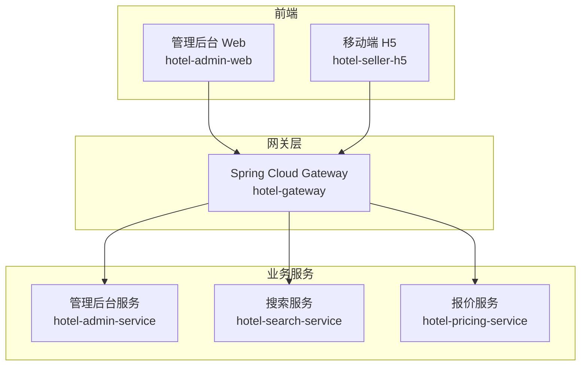
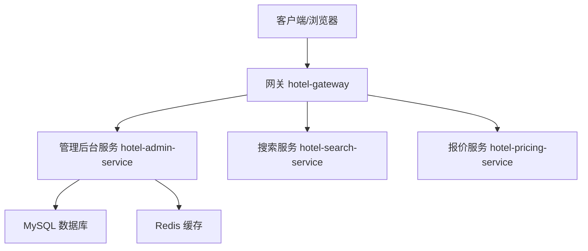
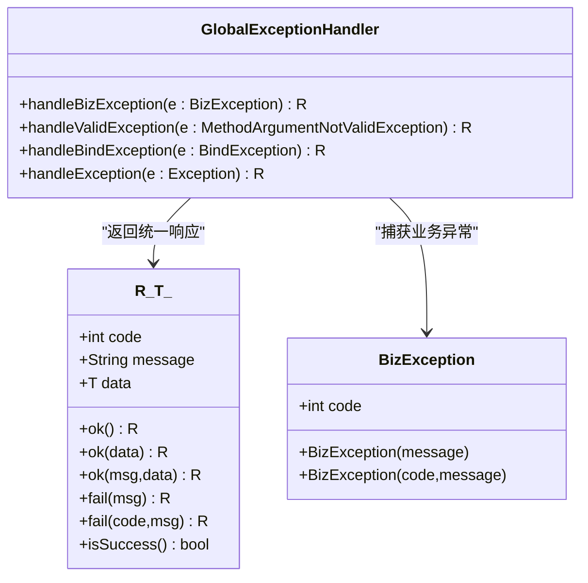
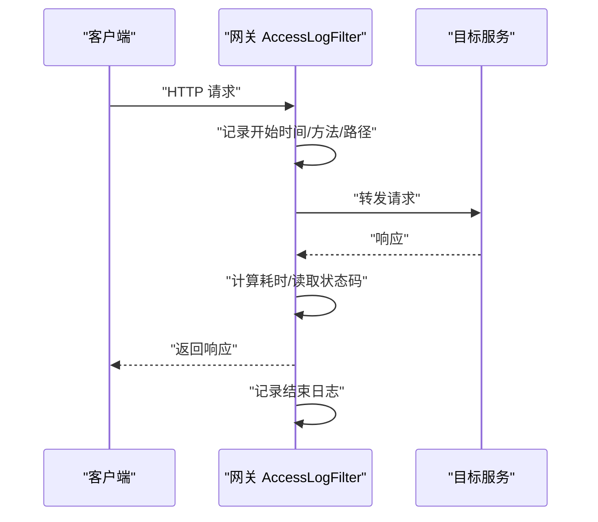
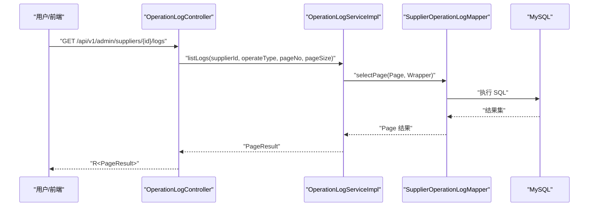
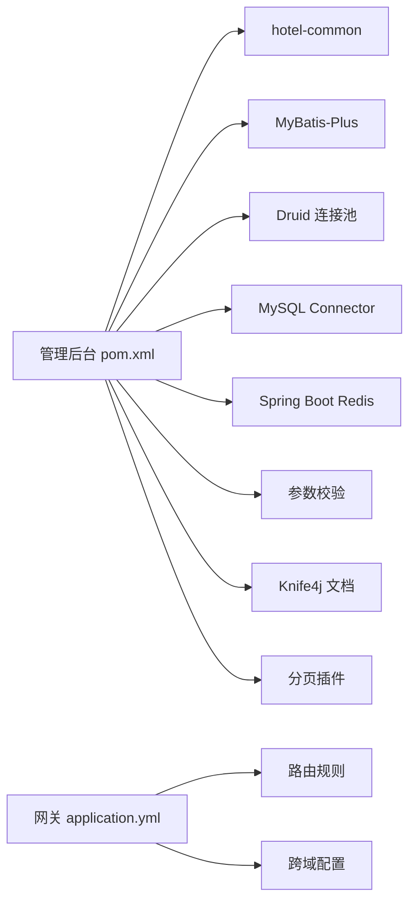

# 故障排查与FAQ

<cite>
**本文引用的文件**
- [GlobalExceptionHandler.java](file://hotel-seller-backend/hotel-common/src/main/java/com/ceair/hotel/common/exception/GlobalExceptionHandler.java)
- [BizException.java](file://hotel-seller-backend/hotel-common/src/main/java/com/ceair/hotel/common/exception/BizException.java)
- [R.java](file://hotel-seller-backend/hotel-common/src/main/java/com/ceair/hotel/common/dto/R.java)
- [AccessLogFilter.java](file://hotel-seller-backend/hotel-gateway/src/main/java/com/ceair/hotel/gateway/filter/AccessLogFilter.java)
- [application.yml（网关）](file://hotel-seller-backend/hotel-gateway/src/main/resources/application.yml)
- [OperationLogController.java](file://hotel-seller-backend/hotel-admin-service/src/main/java/com/ceair/hotel/admin/controller/OperationLogController.java)
- [OperationLogServiceImpl.java](file://hotel-seller-backend/hotel-admin-service/src/main/java/com/ceair/hotel/admin/service/impl/OperationLogServiceImpl.java)
- [SupplierOperationLogMapper.java](file://hotel-seller-backend/hotel-admin-service/src/main/java/com/ceair/hotel/admin/mapper/SupplierOperationLogMapper.java)
- [application.yml（管理后台）](file://hotel-seller-backend/hotel-admin-service/src/main/resources/application.yml)
- [pom.xml（管理后台）](file://hotel-seller-backend/hotel-admin-service/pom.xml)
</cite>

## 目录
1. [简介](#简介)
2. [项目结构](#项目结构)
3. [核心组件](#核心组件)
4. [架构总览](#架构总览)
5. [详细组件分析](#详细组件分析)
6. [依赖分析](#依赖分析)
7. [性能考虑](#性能考虑)
8. [故障排查指南](#故障排查指南)
9. [结论](#结论)
10. [附录](#附录)

## 简介
本文件面向技术支持与运维人员，围绕酒店销售系统的运行与维护，提供系统性故障排查与常见问题解答。内容涵盖：
- 错误类型、成因与解决方法
- 日志分析指南（访问日志、业务日志、错误日志）
- 性能问题诊断、内存泄漏排查思路
- 数据库连接问题定位与修复
- 网络连接、服务注册与API调用异常排查
- 异常处理机制、全局异常捕获与错误返回策略
- 实用排障步骤与最佳实践

## 项目结构
系统采用前后端分离与微服务架构：
- 前端：管理后台 Web（hotel-admin-web）、移动端 H5（hotel-seller-h5）
- 网关层：Spring Cloud Gateway（hotel-gateway），统一接入与路由
- 业务服务层：
  - 管理后台服务（hotel-admin-service）：供应商、价格策略、推荐酒店、缓存策略、操作日志等
  - 搜索服务（hotel-search-service）
  - 报价服务（hotel-pricing-service）
- 公共模块：统一异常、响应封装、实体与枚举（hotel-common）

**章节来源**
- [application.yml（网关）:1-54](file://hotel-seller-backend/hotel-gateway/src/main/resources/application.yml#L1-L54)

## 核心组件
- 统一响应体与异常封装：R<T> 作为所有接口的标准返回；BizException 用于业务异常；GlobalExceptionHandler 提供全局异常捕获与标准化返回。
- 网关访问日志：AccessLogFilter 在请求进入与完成时记录路径、方法、状态码与耗时。
- 管理后台日志查询：OperationLogController 提供供应商与全量操作日志分页查询。

**章节来源**
- [R.java:1-48](file://hotel-seller-backend/hotel-common/src/main/java/com/ceair/hotel/common/dto/R.java#L1-L48)
- [BizException.java:1-23](file://hotel-seller-backend/hotel-common/src/main/java/com/ceair/hotel/common/exception/BizException.java#L1-L23)
- [GlobalExceptionHandler.java:1-41](file://hotel-seller-backend/hotel-common/src/main/java/com/ceair/hotel/common/exception/GlobalExceptionHandler.java#L1-L41)
- [AccessLogFilter.java:1-41](file://hotel-seller-backend/hotel-gateway/src/main/java/com/ceair/hotel/gateway/filter/AccessLogFilter.java#L1-L41)
- [OperationLogController.java:1-42](file://hotel-seller-backend/hotel-admin-service/src/main/java/com/ceair/hotel/admin/controller/OperationLogController.java#L1-L42)

## 架构总览
系统通过网关进行统一入口与路由转发，业务服务通过 MyBatis-Plus 访问 MySQL，并使用 Redis 缓存。公共模块提供统一异常与响应封装。

**图表来源**
- [application.yml（网关）:17-48](file://hotel-seller-backend/hotel-gateway/src/main/resources/application.yml#L17-L48)
- [application.yml（管理后台）:9-22](file://hotel-seller-backend/hotel-admin-service/src/main/resources/application.yml#L9-L22)

## 详细组件分析

### 组件A：全局异常处理与统一响应
- 全局异常处理：
  - 捕获业务异常 BizException，返回带业务码与消息的统一响应
  - 参数校验异常 MethodArgumentNotValidException、BindException，提取首个错误消息返回
  - 其他未捕获异常，记录错误日志并返回通用提示
- 统一响应体 R<T>：
  - 成功/失败静态工厂方法，支持携带数据或仅消息
  - isSuccess 判定成功与否
- 业务异常 BizException：
  - 支持自定义业务码与消息，便于前端与监控侧识别

**图表来源**
- [GlobalExceptionHandler.java:17-39](file://hotel-seller-backend/hotel-common/src/main/java/com/ceair/hotel/common/exception/GlobalExceptionHandler.java#L17-L39)
- [R.java:24-46](file://hotel-seller-backend/hotel-common/src/main/java/com/ceair/hotel/common/dto/R.java#L24-L46)
- [BizException.java:13-21](file://hotel-seller-backend/hotel-common/src/main/java/com/ceair/hotel/common/exception/BizException.java#L13-L21)

**章节来源**
- [GlobalExceptionHandler.java:1-41](file://hotel-seller-backend/hotel-common/src/main/java/com/ceair/hotel/common/exception/GlobalExceptionHandler.java#L1-L41)
- [R.java:1-48](file://hotel-seller-backend/hotel-common/src/main/java/com/ceair/hotel/common/dto/R.java#L1-L48)
- [BizException.java:1-23](file://hotel-seller-backend/hotel-common/src/main/java/com/ceair/hotel/common/exception/BizException.java#L1-L23)

### 组件B：网关访问日志过滤器
- 功能：在请求进入与完成后记录方法、路径、状态码与耗时
- 顺序：优先级设置为较低负值，确保在链路中尽早记录
- 输出：INFO 级别日志，便于快速定位慢请求与异常状态

**图表来源**
- [AccessLogFilter.java:19-34](file://hotel-seller-backend/hotel-gateway/src/main/java/com/ceair/hotel/gateway/filter/AccessLogFilter.java#L19-L34)

**章节来源**
- [AccessLogFilter.java:1-41](file://hotel-seller-backend/hotel-gateway/src/main/java/com/ceair/hotel/gateway/filter/AccessLogFilter.java#L1-L41)
- [application.yml（网关）:50-54](file://hotel-seller-backend/hotel-gateway/src/main/resources/application.yml#L50-L54)

### 组件C：操作日志查询（管理后台）
- 控制器：提供按供应商与全量维度的日志分页查询接口
- 服务实现：基于条件构造器与分页插件，按操作时间倒序
- Mapper：MyBatis-Plus 基类映射

**图表来源**
- [OperationLogController.java:23-40](file://hotel-seller-backend/hotel-admin-service/src/main/java/com/ceair/hotel/admin/controller/OperationLogController.java#L23-L40)
- [OperationLogServiceImpl.java:19-32](file://hotel-seller-backend/hotel-admin-service/src/main/java/com/ceair/hotel/admin/service/impl/OperationLogServiceImpl.java#L19-L32)
- [SupplierOperationLogMapper.java:1-10](file://hotel-seller-backend/hotel-admin-service/src/main/java/com/ceair/hotel/admin/mapper/SupplierOperationLogMapper.java#L1-L10)

**章节来源**
- [OperationLogController.java:1-42](file://hotel-seller-backend/hotel-admin-service/src/main/java/com/ceair/hotel/admin/controller/OperationLogController.java#L1-L42)
- [OperationLogServiceImpl.java:1-34](file://hotel-seller-backend/hotel-admin-service/src/main/java/com/ceair/hotel/admin/service/impl/OperationLogServiceImpl.java#L1-L34)
- [SupplierOperationLogMapper.java:1-10](file://hotel-seller-backend/hotel-admin-service/src/main/java/com/ceair/hotel/admin/mapper/SupplierOperationLogMapper.java#L1-L10)

## 依赖分析
- 管理后台服务依赖公共模块（统一异常与响应）、MyBatis-Plus、Druid 连接池、MySQL、Redis、参数校验、Knife4j 文档与分页插件。
- 网关配置了跨域、路由规则与日志级别。

**图表来源**
- [pom.xml（管理后台）:16-53](file://hotel-seller-backend/hotel-admin-service/pom.xml#L16-L53)
- [application.yml（网关）:7-16](file://hotel-seller-backend/hotel-gateway/src/main/resources/application.yml#L7-L16)
- [application.yml（网关）:17-48](file://hotel-seller-backend/hotel-gateway/src/main/resources/application.yml#L17-L48)

**章节来源**
- [pom.xml（管理后台）:1-73](file://hotel-seller-backend/hotel-admin-service/pom.xml#L1-L73)
- [application.yml（网关）:1-54](file://hotel-seller-backend/hotel-gateway/src/main/resources/application.yml#L1-L54)

## 性能考虑
- 网关日志：利用 AccessLogFilter 记录请求耗时，可快速识别慢请求与异常状态码，建议结合监控平台对高耗时路径进行专项优化。
- 分页查询：操作日志查询使用分页插件，避免一次性加载大量数据；建议前端控制每页大小并启用懒加载。
- 数据库连接池：管理后台配置了 Druid 连接池初始大小、最大活跃数等参数，建议根据并发与QPS调整。
- 缓存策略：管理后台服务集成 Redis，建议对热点数据增加缓存命中率统计与过期策略，避免缓存穿透与雪崩。
- 参数校验：全局异常捕获对参数校验异常进行统一处理，减少重复校验逻辑，提升接口健壮性。

[本节为通用指导，不直接分析具体文件，故无“章节来源”]

## 故障排查指南

### 一、常见错误类型与解决方法
- 业务异常（如参数非法、状态不合法等）
  - 现象：接口返回统一响应中的业务码与消息
  - 排查：查看全局异常处理器对 BizException 的处理；核对前端传参与后端校验规则
  - 解决：修正入参或业务流程，必要时扩展业务码以便区分场景
  - 参考
    - [GlobalExceptionHandler.java:17-21](file://hotel-seller-backend/hotel-common/src/main/java/com/ceair/hotel/common/exception/GlobalExceptionHandler.java#L17-L21)
    - [BizException.java:13-21](file://hotel-seller-backend/hotel-common/src/main/java/com/ceair/hotel/common/exception/BizException.java#L13-L21)
- 参数校验异常
  - 现象：返回 400 与首个错误消息
  - 排查：检查控制器参数注解与校验规则；确认前端表单与请求体格式
  - 解决：完善前端校验与提示，后端保留必要校验兜底
  - 参考
    - [GlobalExceptionHandler.java:23-33](file://hotel-seller-backend/hotel-common/src/main/java/com/ceair/hotel/common/exception/GlobalExceptionHandler.java#L23-L33)
- 未捕获系统异常
  - 现象：统一返回“系统异常，请稍后重试”
  - 排查：查看错误日志堆栈；定位异常发生的服务与接口
  - 解决：补充特定异常处理器或修复代码缺陷
  - 参考
    - [GlobalExceptionHandler.java:35-39](file://hotel-seller-backend/hotel-common/src/main/java/com/ceair/hotel/common/exception/GlobalExceptionHandler.java#L35-L39)

**章节来源**
- [GlobalExceptionHandler.java:17-39](file://hotel-seller-backend/hotel-common/src/main/java/com/ceair/hotel/common/exception/GlobalExceptionHandler.java#L17-L39)
- [BizException.java:13-21](file://hotel-seller-backend/hotel-common/src/main/java/com/ceair/hotel/common/exception/BizException.java#L13-L21)

### 二、日志分析指南
- 访问日志（网关）
  - 关键字段：方法、路径、状态码、耗时
  - 定位：高耗时请求、频繁 5xx/4xx 的接口
  - 参考
    - [AccessLogFilter.java:20-34](file://hotel-seller-backend/hotel-gateway/src/main/java/com/ceair/hotel/gateway/filter/AccessLogFilter.java#L20-L34)
    - [application.yml（网关）:50-54](file://hotel-seller-backend/hotel-gateway/src/main/resources/application.yml#L50-L54)
- 业务日志（操作日志）
  - 查询接口：按供应商 ID 或全量分页查询
  - 定位：日志条目缺失、排序异常、分页错乱
  - 参考
    - [OperationLogController.java:23-40](file://hotel-seller-backend/hotel-admin-service/src/main/java/com/ceair/hotel/admin/controller/OperationLogController.java#L23-L40)
    - [OperationLogServiceImpl.java:19-32](file://hotel-seller-backend/hotel-admin-service/src/main/java/com/ceair/hotel/admin/service/impl/OperationLogServiceImpl.java#L19-L32)
- 错误日志（系统异常）
  - 全局异常捕获会记录错误堆栈，便于回溯
  - 参考
    - [GlobalExceptionHandler.java:35-39](file://hotel-seller-backend/hotel-common/src/main/java/com/ceair/hotel/common/exception/GlobalExceptionHandler.java#L35-L39)

**章节来源**
- [AccessLogFilter.java:19-34](file://hotel-seller-backend/hotel-gateway/src/main/java/com/ceair/hotel/gateway/filter/AccessLogFilter.java#L19-L34)
- [OperationLogController.java:23-40](file://hotel-seller-backend/hotel-admin-service/src/main/java/com/ceair/hotel/admin/controller/OperationLogController.java#L23-L40)
- [OperationLogServiceImpl.java:19-32](file://hotel-seller-backend/hotel-admin-service/src/main/java/com/ceair/hotel/admin/service/impl/OperationLogServiceImpl.java#L19-L32)
- [GlobalExceptionHandler.java:35-39](file://hotel-seller-backend/hotel-common/src/main/java/com/ceair/hotel/common/exception/GlobalExceptionHandler.java#L35-L39)

### 三、性能问题诊断
- 快速定位
  - 使用网关访问日志筛选高耗时接口
  - 查看服务线程池与数据库连接池使用情况
- 建议措施
  - 对热点接口增加缓存与限流
  - 优化复杂查询与分页参数
  - 调整 Druid 连接池参数与 MyBatis-Plus 批量操作

**章节来源**
- [AccessLogFilter.java:20-34](file://hotel-seller-backend/hotel-gateway/src/main/java/com/ceair/hotel/gateway/filter/AccessLogFilter.java#L20-L34)
- [application.yml（管理后台）:15-18](file://hotel-seller-backend/hotel-admin-service/src/main/resources/application.yml#L15-L18)

### 四、内存泄漏排查思路
- 观察指标：堆内存、GC 频率与停顿时间
- 排查要点：长生命周期对象持有短生命周期资源、缓存未清理、线程池泄漏
- 处置建议：引入内存快照对比、定期巡检大对象、规范资源释放

[本节为通用指导，不直接分析具体文件，故无“章节来源”]

### 五、数据库连接问题
- 现象：连接超时、连接池耗尽、SQL 执行异常
- 排查步骤
  - 检查连接串、账号密码、网络连通性
  - 查看 Druid 连接池状态与告警
  - 核对 MyBatis-Plus 日志输出与 SQL 性能
- 参考
  - [application.yml（管理后台）:9-29](file://hotel-seller-backend/hotel-admin-service/src/main/resources/application.yml#L9-L29)
  - [pom.xml（管理后台）:21-37](file://hotel-seller-backend/hotel-admin-service/pom.xml#L21-L37)

**章节来源**
- [application.yml（管理后台）:9-29](file://hotel-seller-backend/hotel-admin-service/src/main/resources/application.yml#L9-L29)
- [pom.xml（管理后台）:21-37](file://hotel-seller-backend/hotel-admin-service/pom.xml#L21-L37)

### 六、网络连接问题
- 现象：请求超时、DNS 解析失败、跨域失败
- 排查步骤
  - 确认网关路由配置与目标服务可达
  - 检查跨域配置是否允许来源与方法
  - 使用 curl/浏览器开发者工具验证请求头与状态码
- 参考
  - [application.yml（网关）:7-16](file://hotel-seller-backend/hotel-gateway/src/main/resources/application.yml#L7-L16)
  - [application.yml（网关）:17-48](file://hotel-seller-backend/hotel-gateway/src/main/resources/application.yml#L17-L48)

**章节来源**
- [application.yml（网关）:7-16](file://hotel-seller-backend/hotel-gateway/src/main/resources/application.yml#L7-L16)
- [application.yml（网关）:17-48](file://hotel-seller-backend/hotel-gateway/src/main/resources/application.yml#L17-L48)

### 七、服务注册失败与API调用异常
- 现象：服务不可达、路由无法转发、404/502
- 排查步骤
  - 检查服务端口与健康状态
  - 核对网关路由 ID、URI 与断言匹配
  - 查看网关与服务日志，确认请求是否到达
- 参考
  - [application.yml（网关）:17-48](file://hotel-seller-backend/hotel-gateway/src/main/resources/application.yml#L17-L48)

**章节来源**
- [application.yml（网关）:17-48](file://hotel-seller-backend/hotel-gateway/src/main/resources/application.yml#L17-L48)

### 八、异常处理机制与错误返回策略
- 全局异常捕获：业务异常、参数校验异常、系统异常分别处理
- 统一响应：R<T> 提供成功/失败工厂方法，前端据此解析
- 建议
  - 为不同业务场景定义明确的业务码
  - 对敏感信息脱敏，避免泄露
  - 前端统一拦截与提示，保持用户体验一致

**章节来源**
- [GlobalExceptionHandler.java:17-39](file://hotel-seller-backend/hotel-common/src/main/java/com/ceair/hotel/common/exception/GlobalExceptionHandler.java#L17-L39)
- [R.java:24-46](file://hotel-seller-backend/hotel-common/src/main/java/com/ceair/hotel/common/dto/R.java#L24-L46)

## 结论
通过统一异常与响应封装、网关访问日志与操作日志查询能力，系统具备较好的可观测性与可维护性。建议在生产环境中：
- 明确业务码与错误分类，完善监控与告警
- 优化数据库与缓存访问，合理配置连接池与分页
- 加强跨域与路由治理，保障接口稳定性
- 建立例行巡检与压测机制，持续改进性能与可靠性

[本节为总结性内容，不直接分析具体文件，故无“章节来源”]

## 附录

### A. 常见问题FAQ
- Q：接口返回 500 且无详细错误信息
  - A：查看全局异常处理器日志，定位具体异常类型与堆栈
  - 参考
    - [GlobalExceptionHandler.java:35-39](file://hotel-seller-backend/hotel-common/src/main/java/com/ceair/hotel/common/exception/GlobalExceptionHandler.java#L35-L39)
- Q：分页查询结果为空或排序异常
  - A：确认查询条件与排序字段是否存在；检查分页参数合法性
  - 参考
    - [OperationLogServiceImpl.java:19-32](file://hotel-seller-backend/hotel-admin-service/src/main/java/com/ceair/hotel/admin/service/impl/OperationLogServiceImpl.java#L19-L32)
- Q：网关路由 404
  - A：核对 Path 断言与 StripPrefix 配置；确认目标服务端口与健康状态
  - 参考
    - [application.yml（网关）:17-48](file://hotel-seller-backend/hotel-gateway/src/main/resources/application.yml#L17-L48)

**章节来源**
- [GlobalExceptionHandler.java:35-39](file://hotel-seller-backend/hotel-common/src/main/java/com/ceair/hotel/common/exception/GlobalExceptionHandler.java#L35-L39)
- [OperationLogServiceImpl.java:19-32](file://hotel-seller-backend/hotel-admin-service/src/main/java/com/ceair/hotel/admin/service/impl/OperationLogServiceImpl.java#L19-L32)
- [application.yml（网关）:17-48](file://hotel-seller-backend/hotel-gateway/src/main/resources/application.yml#L17-L48)