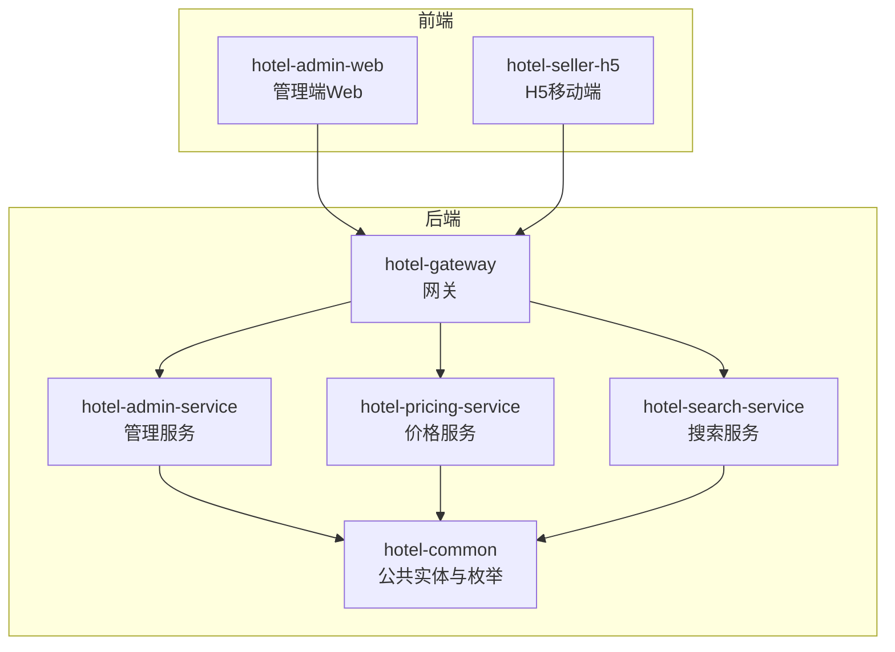
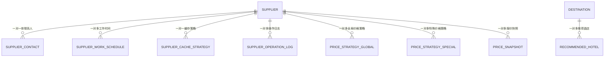
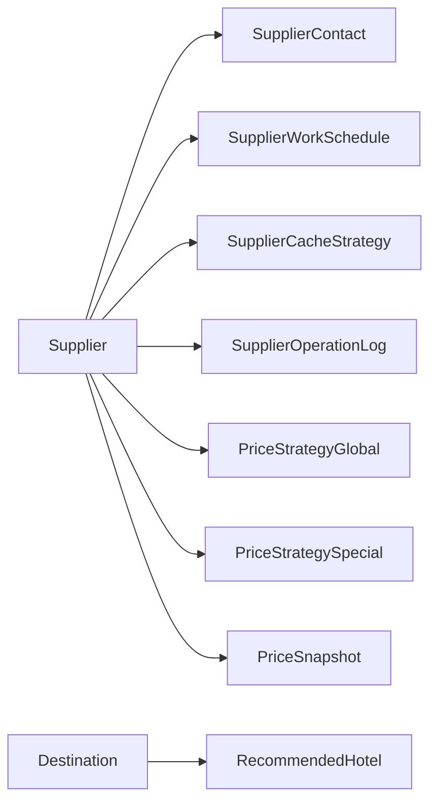
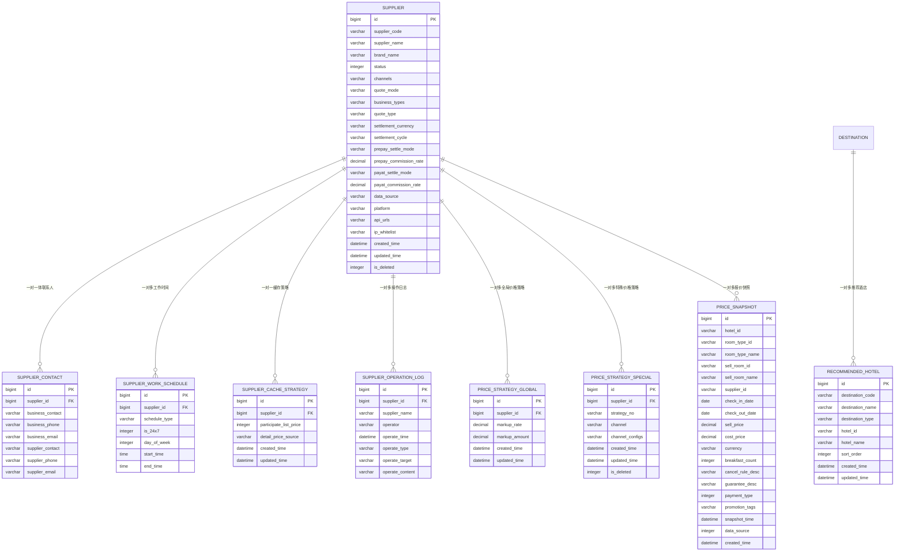
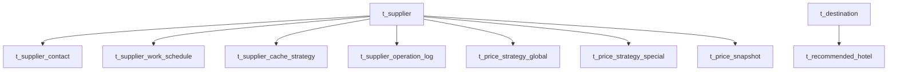

# 实体关系设计

<cite>
**本文引用的文件**
- [Supplier.java](file://hotel-seller-backend/hotel-common/src/main/java/com/ceair/hotel/common/entity/Supplier.java)
- [SupplierContact.java](file://hotel-seller-backend/hotel-common/src/main/java/com/ceair/hotel/common/entity/SupplierContact.java)
- [SupplierWorkSchedule.java](file://hotel-seller-backend/hotel-common/src/main/java/com/ceair/hotel/common/entity/SupplierWorkSchedule.java)
- [SupplierCacheStrategy.java](file://hotel-seller-backend/hotel-common/src/main/java/com/ceair/hotel/common/entity/SupplierCacheStrategy.java)
- [SupplierOperationLog.java](file://hotel-seller-backend/hotel-common/src/main/java/com/ceair/hotel/common/entity/SupplierOperationLog.java)
- [PriceStrategyGlobal.java](file://hotel-seller-backend/hotel-common/src/main/java/com/ceair/hotel/common/entity/PriceStrategyGlobal.java)
- [PriceStrategySpecial.java](file://hotel-seller-backend/hotel-common/src/main/java/com/ceair/hotel/common/entity/PriceStrategySpecial.java)
- [PriceSnapshot.java](file://hotel-seller-backend/hotel-common/src/main/java/com/ceair/hotel/common/entity/PriceSnapshot.java)
- [RecommendedHotel.java](file://hotel-seller-backend/hotel-common/src/main/java/com/ceair/hotel/common/entity/RecommendedHotel.java)
- [SupplierStatus.java](file://hotel-seller-backend/hotel-common/src/main/java/com/ceair/hotel/common/enums/SupplierStatus.java)
- [StarLevel.java](file://hotel-seller-backend/hotel-common/src/main/java/com/ceair/hotel/common/enums/StarLevel.java)
- [PaymentType.java](file://hotel-seller-backend/hotel-common/src/main/java/com/ceair/hotel/common/enums/PaymentType.java)
- [OperateType.java](file://hotel-seller-backend/hotel-common/src/main/java/com/ceair/hotel/common/enums/OperateType.java)
- [R.java](file://hotel-seller-backend/hotel-common/src/main/java/com/ceair/hotel/common/dto/R.java)
- [PageRequest.java](file://hotel-seller-backend/hotel-common/src/main/java/com/ceair/hotel/common/dto/PageRequest.java)
- [PageResult.java](file://hotel-seller-backend/hotel-common/src/main/java/com/ceair/hotel/common/dto/PageResult.java)
- [mock_data.sql](file://mock_data.sql)
</cite>

## 目录
1. [简介](#简介)
2. [项目结构](#项目结构)
3. [核心组件](#核心组件)
4. [架构总览](#架构总览)
5. [详细组件分析](#详细组件分析)
6. [依赖分析](#依赖分析)
7. [性能考量](#性能考量)
8. [故障排查指南](#故障排查指南)
9. [结论](#结论)
10. [附录](#附录)

## 简介
本设计文档面向酒店销售系统，聚焦于核心业务实体及其关系映射，涵盖一对一、一对多与多对多关系，明确主键与外键设计原则、引用完整性约束，并提供完整的实体关系图（ERD）与数据库表结构图。同时总结关系设计最佳实践与性能优化建议，为数据库设计与ORM映射提供准确参考。

## 项目结构
后端采用多模块分层架构，核心实体集中在公共模块 hotel-common 中，各业务服务通过 MyBatis-Plus 进行持久化访问。前端包含管理端 Web 与 H5 两套界面，分别负责运营后台与移动端展示。

## 核心组件
本系统围绕“供应商”为中心的业务域展开，配套价格策略、缓存策略、工作时间、联系人、操作日志与推荐酒店等实体，形成完整的供应商生命周期与报价体系。

- 供应商（Supplier）
- 供应商联系人（SupplierContact）
- 供应商工作时间（SupplierWorkSchedule）
- 供应商缓存策略（SupplierCacheStrategy）
- 供应商操作日志（SupplierOperationLog）
- 全局价格策略（PriceStrategyGlobal）
- 特殊价格策略（PriceStrategySpecial）
- 报价快照（PriceSnapshot）
- 推荐酒店（RecommendedHotel）

上述实体均通过注解标注表名与字段映射，统一使用逻辑删除字段与自动填充时间戳字段，确保数据一致性与审计能力。

**章节来源**
- [Supplier.java:1-81](file://hotel-seller-backend/hotel-common/src/main/java/com/ceair/hotel/common/entity/Supplier.java#L1-L81)
- [SupplierContact.java:1-29](file://hotel-seller-backend/hotel-common/src/main/java/com/ceair/hotel/common/entity/SupplierContact.java#L1-L29)
- [SupplierWorkSchedule.java:1-33](file://hotel-seller-backend/hotel-common/src/main/java/com/ceair/hotel/common/entity/SupplierWorkSchedule.java#L1-L33)
- [SupplierCacheStrategy.java:1-32](file://hotel-seller-backend/hotel-common/src/main/java/com/ceair/hotel/common/entity/SupplierCacheStrategy.java#L1-L32)
- [SupplierOperationLog.java:1-32](file://hotel-seller-backend/hotel-common/src/main/java/com/ceair/hotel/common/entity/SupplierOperationLog.java#L1-L32)
- [PriceStrategyGlobal.java:1-33](file://hotel-seller-backend/hotel-common/src/main/java/com/ceair/hotel/common/entity/PriceStrategyGlobal.java#L1-L33)
- [PriceStrategySpecial.java:1-38](file://hotel-seller-backend/hotel-common/src/main/java/com/ceair/hotel/common/entity/PriceStrategySpecial.java#L1-L38)
- [PriceSnapshot.java:1-54](file://hotel-seller-backend/hotel-common/src/main/java/com/ceair/hotel/common/entity/PriceSnapshot.java#L1-L54)
- [RecommendedHotel.java:1-36](file://hotel-seller-backend/hotel-common/src/main/java/com/ceair/hotel/common/entity/RecommendedHotel.java#L1-L36)

## 架构总览
系统以“供应商”为核心实体，围绕其建立价格策略与缓存策略，配合联系人、工作时间与操作日志实现运营闭环；报价快照作为降级兜底数据源，支撑搜索与详情页展示；推荐酒店服务于目的地与关键词热度场景。

**图表来源**
- [Supplier.java:12](file://hotel-seller-backend/hotel-common/src/main/java/com/ceair/hotel/common/entity/Supplier.java#L12)
- [SupplierContact.java:17](file://hotel-seller-backend/hotel-common/src/main/java/com/ceair/hotel/common/entity/SupplierContact.java#L17)
- [SupplierWorkSchedule.java:18](file://hotel-seller-backend/hotel-common/src/main/java/com/ceair/hotel/common/entity/SupplierWorkSchedule.java#L18)
- [SupplierCacheStrategy.java:18](file://hotel-seller-backend/hotel-common/src/main/java/com/ceair/hotel/common/entity/SupplierCacheStrategy.java#L18)
- [SupplierOperationLog.java:18](file://hotel-seller-backend/hotel-common/src/main/java/com/ceair/hotel/common/entity/SupplierOperationLog.java#L18)
- [PriceStrategyGlobal.java:19](file://hotel-seller-backend/hotel-common/src/main/java/com/ceair/hotel/common/entity/PriceStrategyGlobal.java#L19)
- [PriceStrategySpecial.java:18](file://hotel-seller-backend/hotel-common/src/main/java/com/ceair/hotel/common/entity/PriceStrategySpecial.java#L18)
- [PriceSnapshot.java:25](file://hotel-seller-backend/hotel-common/src/main/java/com/ceair/hotel/common/entity/PriceSnapshot.java#L25)
- [RecommendedHotel.java:24](file://hotel-seller-backend/hotel-common/src/main/java/com/ceair/hotel/common/entity/RecommendedHotel.java#L24)

## 详细组件分析

### 供应商（Supplier）
- 主键：自增 id
- 关系：
  - 一对一：联系人（SupplierContact）
  - 一对多：工作时间（SupplierWorkSchedule）、缓存策略（SupplierCacheStrategy）、操作日志（SupplierOperationLog）
  - 一对多：价格策略（PriceStrategyGlobal、PriceStrategySpecial）
  - 一对多：报价快照（PriceSnapshot）
- 设计要点：
  - 状态字段与逻辑删除字段配合，支持上下线与软删除
  - 多个 JSON 字段承载渠道、业务类型、API 地址等扩展配置
  - 自动填充 created_time、updated_time，便于审计

**章节来源**
- [Supplier.java:15-80](file://hotel-seller-backend/hotel-common/src/main/java/com/ceair/hotel/common/entity/Supplier.java#L15-L80)

### 供应商联系人（SupplierContact）
- 主键：自增 id
- 外键：supplier_id → Supplier.id
- 设计要点：
  - 包含我方商务与对方客服两组联系信息，便于运营协作
  - 与供应商为一对一关系，通过外键保证唯一性

**章节来源**
- [SupplierContact.java:14-28](file://hotel-seller-backend/hotel-common/src/main/java/com/ceair/hotel/common/entity/SupplierContact.java#L14-L28)

### 供应商工作时间（SupplierWorkSchedule）
- 主键：自增 id
- 外键：supplier_id → Supplier.id
- 设计要点：
  - 支持“工作时间”和“订单确认时间”两类模板
  - 支持 7×24 或按星期设置具体时间段
  - 通过 schedule_type 与 day_of_week 组合表达灵活排班

**章节来源**
- [SupplierWorkSchedule.java:15-32](file://hotel-seller-backend/hotel-common/src/main/java/com/ceair/hotel/common/entity/SupplierWorkSchedule.java#L15-L32)

### 供应商缓存策略（SupplierCacheStrategy）
- 主键：自增 id
- 外键：supplier_id → Supplier.id
- 设计要点：
  - 控制是否参与列表页报价与详情页价格来源（缓存优先或实时）
  - 自动时间戳字段，便于策略变更审计

**章节来源**
- [SupplierCacheStrategy.java:15-31](file://hotel-seller-backend/hotel-common/src/main/java/com/ceair/hotel/common/entity/SupplierCacheStrategy.java#L15-L31)

### 供应商操作日志（SupplierOperationLog）
- 主键：自增 id
- 外键：supplier_id → Supplier.id
- 设计要点：
  - 记录创建、编辑、上下线等关键操作
  - operate_type 使用枚举，保证操作类型一致性

**章节来源**
- [SupplierOperationLog.java:15-31](file://hotel-seller-backend/hotel-common/src/main/java/com/ceair/hotel/common/entity/SupplierOperationLog.java#L15-L31)

### 全局价格策略（PriceStrategyGlobal）
- 主键：自增 id
- 外键：supplier_id → Supplier.id
- 设计要点：
  - 提供统一的加价比例与加价金额配置
  - 与供应商为一对多关系，支持不同供应商差异化定价

**章节来源**
- [PriceStrategyGlobal.java:16-32](file://hotel-seller-backend/hotel-common/src/main/java/com/ceair/hotel/common/entity/PriceStrategyGlobal.java#L16-L32)

### 特殊价格策略（PriceStrategySpecial）
- 主键：自增 id
- 外键：supplier_id → Supplier.id
- 设计要点：
  - 支持按渠道（APP/H5/WEB）差异化加价
  - 采用 JSON 存储渠道配置，便于扩展
  - 提供逻辑删除字段，支持历史策略归档

**章节来源**
- [PriceStrategySpecial.java:15-37](file://hotel-seller-backend/hotel-common/src/main/java/com/ceair/hotel/common/entity/PriceStrategySpecial.java#L15-L37)

### 报价快照（PriceSnapshot）
- 主键：自增 id
- 设计要点：
  - 记录酒店、房型、售卖房型、供应商、入住离店日期、价格与支付方式等
  - 支持多数据源回写与降级兜底（NORMAL_REF/APPROX_REF/NO_PRICE）
  - 与供应商为一对多关系，用于历史价格追溯与降级展示

**章节来源**
- [PriceSnapshot.java:17-53](file://hotel-seller-backend/hotel-common/src/main/java/com/ceair/hotel/common/entity/PriceSnapshot.java#L17-L53)

### 推荐酒店（RecommendedHotel）
- 主键：自增 id
- 设计要点：
  - 与目的地（Destination）为一对多关系，支持按城市/区域推荐
  - 通过排序序号控制展示优先级

**章节来源**
- [RecommendedHotel.java:15-35](file://hotel-seller-backend/hotel-common/src/main/java/com/ceair/hotel/common/entity/RecommendedHotel.java#L15-L35)

### 枚举与通用DTO
- 枚举：SupplierStatus、StarLevel、PaymentType、OperateType
- DTO：R（统一响应）、PageRequest（分页请求）、PageResult（分页响应）

这些组件为系统提供类型安全与一致的交互契约，支撑前后端与服务间的数据交换。

**章节来源**
- [SupplierStatus.java:11-24](file://hotel-seller-backend/hotel-common/src/main/java/com/ceair/hotel/common/enums/SupplierStatus.java#L11-L24)
- [StarLevel.java:8-16](file://hotel-seller-backend/hotel-common/src/main/java/com/ceair/hotel/common/enums/StarLevel.java#L8-L16)
- [PaymentType.java:8-16](file://hotel-seller-backend/hotel-common/src/main/java/com/ceair/hotel/common/enums/PaymentType.java#L8-L16)
- [OperateType.java:8-16](file://hotel-seller-backend/hotel-common/src/main/java/com/ceair/hotel/common/enums/OperateType.java#L8-L16)
- [R.java:10-47](file://hotel-seller-backend/hotel-common/src/main/java/com/ceair/hotel/common/dto/R.java#L10-L47)
- [PageRequest.java:10-17](file://hotel-seller-backend/hotel-common/src/main/java/com/ceair/hotel/common/dto/PageRequest.java#L10-L17)
- [PageResult.java:10-25](file://hotel-seller-backend/hotel-common/src/main/java/com/ceair/hotel/common/dto/PageResult.java#L10-L25)

## 依赖分析
- 实体间依赖以“供应商”为中心向外辐射，形成清晰的层次化关系
- 价格策略与缓存策略均依赖供应商，体现“供应商→策略”的单向依赖
- 报价快照与推荐酒店分别服务于搜索与运营推荐场景，与供应商存在间接关联（通过酒店/房型维度）

**图表来源**
- [Supplier.java:12](file://hotel-seller-backend/hotel-common/src/main/java/com/ceair/hotel/common/entity/Supplier.java#L12)
- [SupplierContact.java:17](file://hotel-seller-backend/hotel-common/src/main/java/com/ceair/hotel/common/entity/SupplierContact.java#L17)
- [SupplierWorkSchedule.java:18](file://hotel-seller-backend/hotel-common/src/main/java/com/ceair/hotel/common/entity/SupplierWorkSchedule.java#L18)
- [SupplierCacheStrategy.java:18](file://hotel-seller-backend/hotel-common/src/main/java/com/ceair/hotel/common/entity/SupplierCacheStrategy.java#L18)
- [SupplierOperationLog.java:18](file://hotel-seller-backend/hotel-common/src/main/java/com/ceair/hotel/common/entity/SupplierOperationLog.java#L18)
- [PriceStrategyGlobal.java:19](file://hotel-seller-backend/hotel-common/src/main/java/com/ceair/hotel/common/entity/PriceStrategyGlobal.java#L19)
- [PriceStrategySpecial.java:18](file://hotel-seller-backend/hotel-common/src/main/java/com/ceair/hotel/common/entity/PriceStrategySpecial.java#L18)
- [PriceSnapshot.java:25](file://hotel-seller-backend/hotel-common/src/main/java/com/ceair/hotel/common/entity/PriceSnapshot.java#L25)
- [RecommendedHotel.java:24](file://hotel-seller-backend/hotel-common/src/main/java/com/ceair/hotel/common/entity/RecommendedHotel.java#L24)

## 性能考量
- 索引设计建议
  - 在供应商相关表的 supplier_id 上建立索引，加速策略、缓存、日志与快照的查询
  - 在报价快照的 hotel_id、room_type_id、check_in_date、check_out_date 组合上建立复合索引，优化搜索与降级展示
  - 在推荐酒店的 destination_code 与 sort_order 上建立组合索引，提升推荐列表查询效率
- 缓存策略
  - 详情页优先缓存（CACHE_FIRST）减少实时查询压力
  - 列表页报价参与度可按供应商开关，避免无效调用
- 查询优化
  - 价格策略读取采用“全局+特殊”叠加计算，建议在应用层进行批量加载与本地缓存
  - 报价快照按时间窗口与数据源分类，结合 TTL 策略实现分级降级
- 事务与并发
  - 供应商状态变更与价格策略更新应使用乐观锁或版本号控制
  - 日志写入采用异步批处理，降低写放大

## 故障排查指南
- 常见问题定位
  - 供应商上下线异常：检查 Supplier.status 与 Supplier.is_deleted 的状态一致性
  - 报价缺失或延迟：核对 SupplierCacheStrategy.detail_price_source 与 PriceStrategySpecial 的生效范围
  - 快照过期导致价格不显示：检查 PriceSnapshot.snapshot_time 与数据源标识
- 日志与审计
  - 通过 SupplierOperationLog 的 operate_type 与 operate_target 快速定位问题操作
  - 使用统一响应 DTO（R）与分页 DTO（PageRequest/PageResult）辅助接口调试

**章节来源**
- [Supplier.java:78-80](file://hotel-seller-backend/hotel-common/src/main/java/com/ceair/hotel/common/entity/Supplier.java#L78-L80)
- [SupplierOperationLog.java:23-31](file://hotel-seller-backend/hotel-common/src/main/java/com/ceair/hotel/common/entity/SupplierOperationLog.java#L23-L31)
- [R.java:10-47](file://hotel-seller-backend/hotel-common/src/main/java/com/ceair/hotel/common/dto/R.java#L10-L47)
- [PageRequest.java:10-17](file://hotel-seller-backend/hotel-common/src/main/java/com/ceair/hotel/common/dto/PageRequest.java#L10-L17)
- [PageResult.java:10-25](file://hotel-seller-backend/hotel-common/src/main/java/com/ceair/hotel/common/dto/PageResult.java#L10-L25)

## 结论
本设计以“供应商”为核心，构建了从联系人、工作时间、缓存策略到价格策略与报价快照的完整关系链，辅以推荐酒店与操作日志，满足运营与技术层面的双重需求。通过合理的主外键设计、索引策略与降级机制，系统在功能完备的同时兼顾性能与可维护性。

## 附录

### 实体关系图（ERD）

**图表来源**
- [Supplier.java:12-80](file://hotel-seller-backend/hotel-common/src/main/java/com/ceair/hotel/common/entity/Supplier.java#L12-L80)
- [SupplierContact.java:11-28](file://hotel-seller-backend/hotel-common/src/main/java/com/ceair/hotel/common/entity/SupplierContact.java#L11-L28)
- [SupplierWorkSchedule.java:12-32](file://hotel-seller-backend/hotel-common/src/main/java/com/ceair/hotel/common/entity/SupplierWorkSchedule.java#L12-L32)
- [SupplierCacheStrategy.java:12-31](file://hotel-seller-backend/hotel-common/src/main/java/com/ceair/hotel/common/entity/SupplierCacheStrategy.java#L12-L31)
- [SupplierOperationLog.java:12-31](file://hotel-seller-backend/hotel-common/src/main/java/com/ceair/hotel/common/entity/SupplierOperationLog.java#L12-L31)
- [PriceStrategyGlobal.java:13-32](file://hotel-seller-backend/hotel-common/src/main/java/com/ceair/hotel/common/entity/PriceStrategyGlobal.java#L13-L32)
- [PriceStrategySpecial.java:12-37](file://hotel-seller-backend/hotel-common/src/main/java/com/ceair/hotel/common/entity/PriceStrategySpecial.java#L12-L37)
- [PriceSnapshot.java:14-53](file://hotel-seller-backend/hotel-common/src/main/java/com/ceair/hotel/common/entity/PriceSnapshot.java#L14-L53)
- [RecommendedHotel.java:12-35](file://hotel-seller-backend/hotel-common/src/main/java/com/ceair/hotel/common/entity/RecommendedHotel.java#L12-L35)

### 数据库表结构图（示意）

**图表来源**
- [mock_data.sql:98-106](file://mock_data.sql#L98-L106)
- [mock_data.sql:139-147](file://mock_data.sql#L139-L147)
- [mock_data.sql:151-159](file://mock_data.sql#L151-L159)
- [mock_data.sql:179-191](file://mock_data.sql#L179-L191)
- [mock_data.sql:276-319](file://mock_data.sql#L276-L319)
- [mock_data.sql:211-235](file://mock_data.sql#L211-L235)