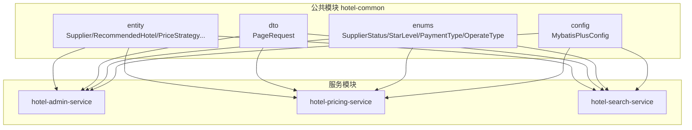
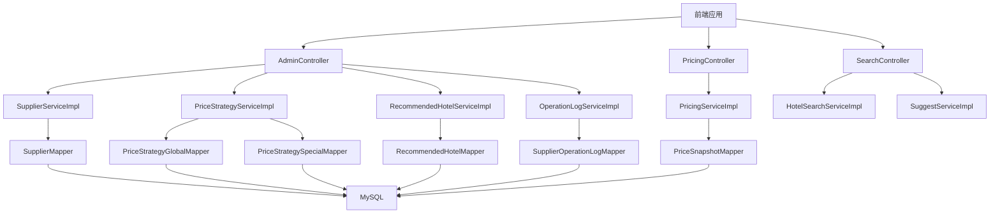
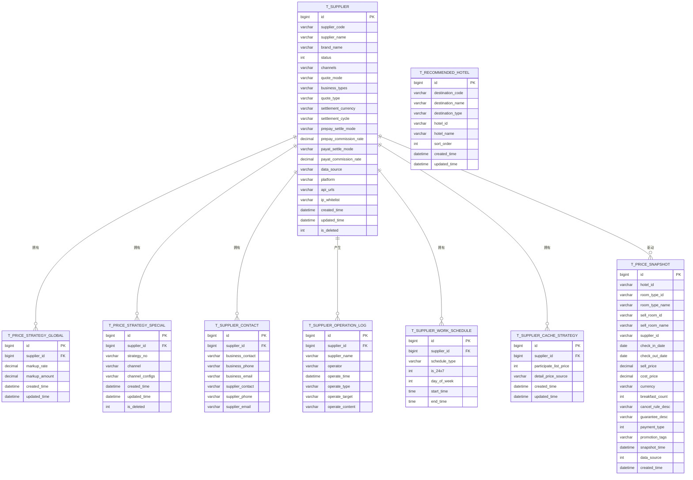
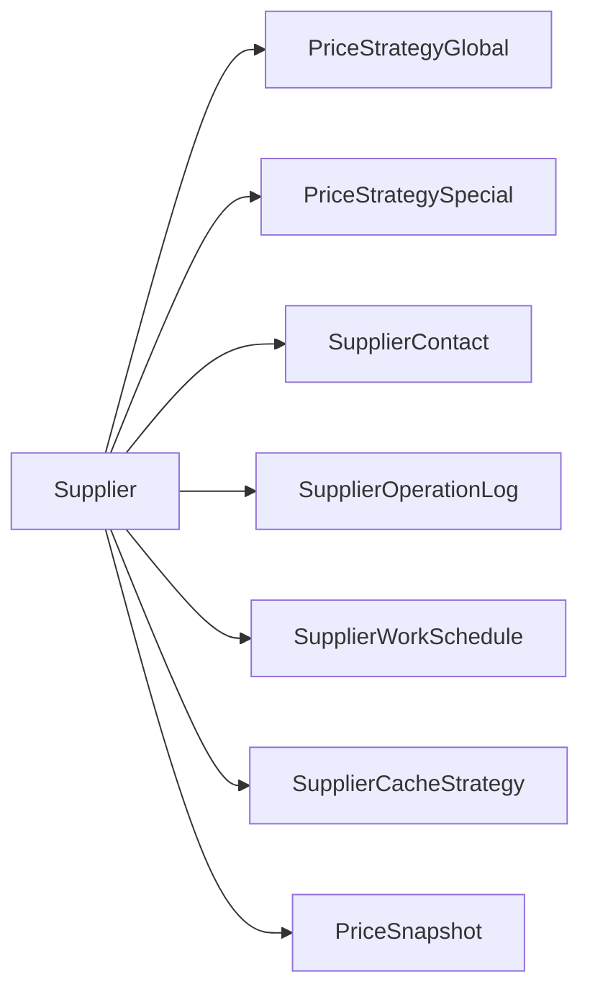

# 数据模型设计

<cite>
**本文引用的文件**
- [Supplier.java](file://hotel-seller-backend/hotel-common/src/main/java/com/ceair/hotel/common/entity/Supplier.java)
- [RecommendedHotel.java](file://hotel-seller-backend/hotel-common/src/main/java/com/ceair/hotel/common/entity/RecommendedHotel.java)
- [PriceStrategyGlobal.java](file://hotel-seller-backend/hotel-common/src/main/java/com/ceair/hotel/common/entity/PriceStrategyGlobal.java)
- [PriceStrategySpecial.java](file://hotel-seller-backend/hotel-common/src/main/java/com/ceair/hotel/common/entity/PriceStrategySpecial.java)
- [SupplierContact.java](file://hotel-seller-backend/hotel-common/src/main/java/com/ceair/hotel/common/entity/SupplierContact.java)
- [SupplierOperationLog.java](file://hotel-seller-backend/hotel-common/src/main/java/com/ceair/hotel/common/entity/SupplierOperationLog.java)
- [SupplierWorkSchedule.java](file://hotel-seller-backend/hotel-common/src/main/java/com/ceair/hotel/common/entity/SupplierWorkSchedule.java)
- [SupplierCacheStrategy.java](file://hotel-seller-backend/hotel-common/src/main/java/com/ceair/hotel/common/entity/SupplierCacheStrategy.java)
- [PriceSnapshot.java](file://hotel-seller-backend/hotel-common/src/main/java/com/ceair/hotel/common/entity/PriceSnapshot.java)
- [MybatisPlusConfig.java](file://hotel-seller-backend/hotel-common/src/main/java/com/ceair/hotel/common/config/MybatisPlusConfig.java)
- [PageRequest.java](file://hotel-seller-backend/hotel-common/src/main/java/com/ceair/hotel/common/dto/PageRequest.java)
- [SupplierStatus.java](file://hotel-seller-backend/hotel-common/src/main/java/com/ceair/hotel/common/enums/SupplierStatus.java)
- [StarLevel.java](file://hotel-seller-backend/hotel-common/src/main/java/com/ceair/hotel/common/enums/StarLevel.java)
- [PaymentType.java](file://hotel-seller-backend/hotel-common/src/main/java/com/ceair/hotel/common/enums/PaymentType.java)
- [OperateType.java](file://hotel-seller-backend/hotel-common/src/main/java/com/ceair/hotel/common/enums/OperateType.java)
- [mock_data.sql](file://mock_data.sql)
</cite>

## 目录
1. [简介](#简介)
2. [项目结构](#项目结构)
3. [核心组件](#核心组件)
4. [架构总览](#架构总览)
5. [详细组件分析](#详细组件分析)
6. [依赖分析](#依赖分析)
7. [性能考虑](#性能考虑)
8. [故障排查指南](#故障排查指南)
9. [结论](#结论)
10. [附录](#附录)

## 简介
本文件为酒店销售系统提供完整、可落地的数据模型文档。内容涵盖实体类设计理念、字段定义与业务含义、实体关系映射、主外键约束与索引设计建议、数据库表结构、字段类型与约束、分页查询与数据访问层设计模式（MyBatis-Plus）、数据验证与业务规则、以及数据生命周期管理策略。文档同时提供实体关系图与ER图，帮助前后端开发与数据库设计人员准确理解与实现。

## 项目结构
本项目采用多模块分层架构，数据模型集中在公共模块 hotel-common 的 entity、dto、enums、config 包中，配合各服务模块的 mapper、service、controller 实现数据访问与业务处理。MyBatis-Plus 配置统一在公共模块完成，提供分页插件与自动填充功能。

图表来源
- [MybatisPlusConfig.java:1-37](file://hotel-seller-backend/hotel-common/src/main/java/com/ceair/hotel/common/config/MybatisPlusConfig.java#L1-L37)
- [PageRequest.java:1-18](file://hotel-seller-backend/hotel-common/src/main/java/com/ceair/hotel/common/dto/PageRequest.java#L1-L18)

章节来源
- [MybatisPlusConfig.java:1-37](file://hotel-seller-backend/hotel-common/src/main/java/com/ceair/hotel/common/config/MybatisPlusConfig.java#L1-L37)
- [PageRequest.java:1-18](file://hotel-seller-backend/hotel-common/src/main/java/com/ceair/hotel/common/dto/PageRequest.java#L1-L18)

## 核心组件
本节对核心实体进行逐项说明，包括表名、字段、业务含义、枚举映射与默认值策略等。

- 供应商信息表 t_supplier
  - 主键: id
  - 关键字段: 供应商编号、供应商名称、品牌名、状态、上架渠道(JSON)、报价模式、开通业务(JSON)、报价类型、结算币种/周期、预付/现付结算方式与佣金比例、数据来源、对接平台、API地址(JSON)、IP白名单
  - 逻辑删除: isDeleted
  - 自动填充: createdTime、updatedTime
  - 业务要点: 渠道与业务类型以JSON存储，便于灵活扩展；状态枚举见 SupplierStatus

- 推荐酒店配置表 t_recommended_hotel
  - 主键: id
  - 关键字段: 目的地编码/名称/类型、酒店ID/名称、排序序号
  - 自动填充: createdTime、updatedTime
  - 业务要点: 通过排序序号控制展示优先级

- 全局价格策略表 t_price_strategy_global
  - 主键: id
  - 关键字段: 供应商ID、加价比例(%)、加价金额(元/间夜)
  - 自动填充: createdTime、updatedTime
  - 业务要点: 适用于所有房型的基础加价策略

- 特殊价格策略表 t_price_strategy_special
  - 主键: id
  - 关键字段: 供应商ID、策略编号、适用渠道(JSON)、各渠道加减价配置(JSON)
  - 逻辑删除: isDeleted
  - 自动填充: createdTime、updatedTime
  - 业务要点: 面向特定渠道的差异化定价

- 供应商联系信息表 t_supplier_contact
  - 主键: id
  - 关键字段: 供应商ID、我方商务负责人/电话/邮箱、对方客服负责人/电话/邮箱
  - 业务要点: 供应商运营支撑的关键联系人信息

- 供应商操作日志表 t_supplier_operation_log
  - 主键: id
  - 关键字段: 供应商ID/名称、操作者、操作时间、操作类型、操作对象、操作内容
  - 业务要点: 记录供应商生命周期内的关键变更

- 供应商工作时间配置表 t_supplier_work_schedule
  - 主键: id
  - 关键字段: 供应商ID、时间类型(WORK/ORDER_CONFIRM)、是否7×24、星期几、开始/结束时间
  - 业务要点: 支持不同场景下的工作时长配置

- 供应商缓存策略表 t_supplier_cache_strategy
  - 主键: id
  - 关键字段: 供应商ID、是否参与列表页报价、详情页价格来源(CACHE_FIRST/REALTIME)
  - 自动填充: createdTime、updatedTime
  - 业务要点: 控制报价缓存策略，平衡实时性与成本

- 报价快照表 t_price_snapshot
  - 主键: id
  - 关键字段: 酒店ID/房型ID/名称、售卖房型ID/名称、供应商ID、入住/离店日期、售卖价/成本价、币种、早餐数、退改规则/担保说明、支付方式、促销标签、快照采集时间、数据来源
  - 业务要点: 作为三级降级兜底数据源，支持不同快照年龄的展示策略

章节来源
- [Supplier.java:1-81](file://hotel-seller-backend/hotel-common/src/main/java/com/ceair/hotel/common/entity/Supplier.java#L1-L81)
- [RecommendedHotel.java:1-36](file://hotel-seller-backend/hotel-common/src/main/java/com/ceair/hotel/common/entity/RecommendedHotel.java#L1-L36)
- [PriceStrategyGlobal.java:1-33](file://hotel-seller-backend/hotel-common/src/main/java/com/ceair/hotel/common/entity/PriceStrategyGlobal.java#L1-L33)
- [PriceStrategySpecial.java:1-38](file://hotel-seller-backend/hotel-common/src/main/java/com/ceair/hotel/common/entity/PriceStrategySpecial.java#L1-L38)
- [SupplierContact.java:1-29](file://hotel-seller-backend/hotel-common/src/main/java/com/ceair/hotel/common/entity/SupplierContact.java#L1-L29)
- [SupplierOperationLog.java:1-32](file://hotel-seller-backend/hotel-common/src/main/java/com/ceair/hotel/common/entity/SupplierOperationLog.java#L1-L32)
- [SupplierWorkSchedule.java:1-33](file://hotel-seller-backend/hotel-common/src/main/java/com/ceair/hotel/common/entity/SupplierWorkSchedule.java#L1-L33)
- [SupplierCacheStrategy.java:1-32](file://hotel-seller-backend/hotel-common/src/main/java/com/ceair/hotel/common/entity/SupplierCacheStrategy.java#L1-L32)
- [PriceSnapshot.java:1-54](file://hotel-seller-backend/hotel-common/src/main/java/com/ceair/hotel/common/entity/PriceSnapshot.java#L1-L54)

## 架构总览
系统采用“公共实体+服务模块”的分层设计。公共模块提供统一的实体、DTO、枚举与MyBatis-Plus配置；服务模块通过Mapper/Service/Controller实现业务编排与数据访问。

图表来源
- [Supplier.java:1-81](file://hotel-seller-backend/hotel-common/src/main/java/com/ceair/hotel/common/entity/Supplier.java#L1-L81)
- [PriceStrategyGlobal.java:1-33](file://hotel-seller-backend/hotel-common/src/main/java/com/ceair/hotel/common/entity/PriceStrategyGlobal.java#L1-L33)
- [PriceStrategySpecial.java:1-38](file://hotel-seller-backend/hotel-common/src/main/java/com/ceair/hotel/common/entity/PriceStrategySpecial.java#L1-L38)
- [RecommendedHotel.java:1-36](file://hotel-seller-backend/hotel-common/src/main/java/com/ceair/hotel/common/entity/RecommendedHotel.java#L1-L36)
- [SupplierOperationLog.java:1-32](file://hotel-seller-backend/hotel-common/src/main/java/com/ceair/hotel/common/entity/SupplierOperationLog.java#L1-L32)
- [PriceSnapshot.java:1-54](file://hotel-seller-backend/hotel-common/src/main/java/com/ceair/hotel/common/entity/PriceSnapshot.java#L1-L54)

## 详细组件分析

### 实体类关系与ER图
基于实体类的主外键关系，绘制ER图如下：

图表来源
- [Supplier.java:1-81](file://hotel-seller-backend/hotel-common/src/main/java/com/ceair/hotel/common/entity/Supplier.java#L1-L81)
- [PriceStrategyGlobal.java:1-33](file://hotel-seller-backend/hotel-common/src/main/java/com/ceair/hotel/common/entity/PriceStrategyGlobal.java#L1-L33)
- [PriceStrategySpecial.java:1-38](file://hotel-seller-backend/hotel-common/src/main/java/com/ceair/hotel/common/entity/PriceStrategySpecial.java#L1-L38)
- [SupplierContact.java:1-29](file://hotel-seller-backend/hotel-common/src/main/java/com/ceair/hotel/common/entity/SupplierContact.java#L1-L29)
- [SupplierOperationLog.java:1-32](file://hotel-seller-backend/hotel-common/src/main/java/com/ceair/hotel/common/entity/SupplierOperationLog.java#L1-L32)
- [SupplierWorkSchedule.java:1-33](file://hotel-seller-backend/hotel-common/src/main/java/com/ceair/hotel/common/entity/SupplierWorkSchedule.java#L1-L33)
- [SupplierCacheStrategy.java:1-32](file://hotel-seller-backend/hotel-common/src/main/java/com/ceair/hotel/common/entity/SupplierCacheStrategy.java#L1-L32)
- [PriceSnapshot.java:1-54](file://hotel-seller-backend/hotel-common/src/main/java/com/ceair/hotel/common/entity/PriceSnapshot.java#L1-L54)

### 数据访问层设计模式与MyBatis-Plus配置
- 分页插件
  - 在 MyBatis-Plus 配置中注册分页拦截器，针对 MySQL 数据库类型生效，确保分页查询的通用性与性能。
- 自动填充
  - 通过 MetaObjectHandler 实现插入与更新时的 createdTime、updatedTime 自动赋值，保证数据一致性。
- 逻辑删除
  - 供应商与特殊价格策略实体使用逻辑删除注解，避免物理删除造成的数据丢失风险。
- 字段填充
  - 使用注解自动填充创建与更新时间，减少业务代码中的样板代码。

章节来源
- [MybatisPlusConfig.java:1-37](file://hotel-seller-backend/hotel-common/src/main/java/com/ceair/hotel/common/config/MybatisPlusConfig.java#L1-L37)
- [Supplier.java:72-79](file://hotel-seller-backend/hotel-common/src/main/java/com/ceair/hotel/common/entity/Supplier.java#L72-L79)
- [PriceStrategySpecial.java:35-36](file://hotel-seller-backend/hotel-common/src/main/java/com/ceair/hotel/common/entity/PriceStrategySpecial.java#L35-L36)

### 分页查询实现
- 分页请求基类
  - 提供默认页码与每页条数，并设置最小值校验，防止非法参数导致的异常。
- 服务层集成
  - 服务层接收 PageRequest 对象，结合 MyBatis-Plus 分页插件实现分页查询，返回 PageResult 结果封装。

章节来源
- [PageRequest.java:1-18](file://hotel-seller-backend/hotel-common/src/main/java/com/ceair/hotel/common/dto/PageRequest.java#L1-L18)

### 数据验证规则与业务规则
- 参数校验
  - 分页请求的页码与每页数量均设置最小值校验，确保分页参数合法。
- 枚举约束
  - 供应商状态、星级等级、支付方式、操作类型等使用枚举，保证取值范围可控且具备描述性。
- JSON字段规范
  - 渠道、业务类型、加价配置等以JSON格式存储，便于灵活扩展，但需在入库前进行结构与类型校验。
- 业务规则
  - 报价模式分为“底价模式”和“售卖价模式”，影响加价策略的应用方式。
  - 缓存策略区分“详情优先缓存”和“实时查询”，影响价格展示与调用成本。

章节来源
- [PageRequest.java:1-18](file://hotel-seller-backend/hotel-common/src/main/java/com/ceair/hotel/common/dto/PageRequest.java#L1-L18)
- [SupplierStatus.java:1-25](file://hotel-seller-backend/hotel-common/src/main/java/com/ceair/hotel/common/enums/SupplierStatus.java#L1-L25)
- [StarLevel.java:1-17](file://hotel-seller-backend/hotel-common/src/main/java/com/ceair/hotel/common/enums/StarLevel.java#L1-L17)
- [PaymentType.java:1-17](file://hotel-seller-backend/hotel-common/src/main/java/com/ceair/hotel/common/enums/PaymentType.java#L1-L17)
- [OperateType.java:1-17](file://hotel-seller-backend/hotel-common/src/main/java/com/ceair/hotel/common/enums/OperateType.java#L1-L17)

### 数据生命周期管理
- 创建与更新
  - 所有实体在插入与更新时自动维护 createdTime 与 updatedTime，确保审计与追踪能力。
- 逻辑删除
  - 供应商与特殊价格策略支持逻辑删除，保留历史数据并隔离无效记录。
- 快照生命周期
  - 报价快照根据采集时间与数据来源进行分级展示，支持不同年龄的降级策略（参考价/约价/不展示）。

章节来源
- [MybatisPlusConfig.java:26-35](file://hotel-seller-backend/hotel-common/src/main/java/com/ceair/hotel/common/config/MybatisPlusConfig.java#L26-L35)
- [Supplier.java:72-79](file://hotel-seller-backend/hotel-common/src/main/java/com/ceair/hotel/common/entity/Supplier.java#L72-L79)
- [PriceStrategySpecial.java:35-36](file://hotel-seller-backend/hotel-common/src/main/java/com/ceair/hotel/common/entity/PriceStrategySpecial.java#L35-L36)
- [PriceSnapshot.java:45-49](file://hotel-seller-backend/hotel-common/src/main/java/com/ceair/hotel/common/entity/PriceSnapshot.java#L45-L49)

## 依赖分析
- 组件耦合
  - 实体类之间通过外键建立清晰的一对多关系，如供应商与价格策略、联系人、工作时间、缓存策略、操作日志、报价快照等。
- 外部依赖
  - MyBatis-Plus 提供 ORM 能力与分页插件；Spring Boot 自动装配简化配置。
- 循环依赖
  - 当前实体关系为单向外键指向，未发现循环依赖风险。

图表来源
- [Supplier.java:1-81](file://hotel-seller-backend/hotel-common/src/main/java/com/ceair/hotel/common/entity/Supplier.java#L1-L81)
- [PriceStrategyGlobal.java:1-33](file://hotel-seller-backend/hotel-common/src/main/java/com/ceair/hotel/common/entity/PriceStrategyGlobal.java#L1-L33)
- [PriceStrategySpecial.java:1-38](file://hotel-seller-backend/hotel-common/src/main/java/com/ceair/hotel/common/entity/PriceStrategySpecial.java#L1-L38)
- [SupplierContact.java:1-29](file://hotel-seller-backend/hotel-common/src/main/java/com/ceair/hotel/common/entity/SupplierContact.java#L1-L29)
- [SupplierOperationLog.java:1-32](file://hotel-seller-backend/hotel-common/src/main/java/com/ceair/hotel/common/entity/SupplierOperationLog.java#L1-L32)
- [SupplierWorkSchedule.java:1-33](file://hotel-seller-backend/hotel-common/src/main/java/com/ceair/hotel/common/entity/SupplierWorkSchedule.java#L1-L33)
- [SupplierCacheStrategy.java:1-32](file://hotel-seller-backend/hotel-common/src/main/java/com/ceair/hotel/common/entity/SupplierCacheStrategy.java#L1-L32)
- [PriceSnapshot.java:1-54](file://hotel-seller-backend/hotel-common/src/main/java/com/ceair/hotel/common/entity/PriceSnapshot.java#L1-L54)

## 性能考虑
- 分页查询
  - 使用 MyBatis-Plus 分页插件，避免一次性加载大量数据；合理设置每页大小与索引覆盖。
- 索引设计建议
  - 供应商相关查询常用字段：supplier_id、status、channels、quote_type、settlement_currency 等，建议建立复合索引或单列索引以加速过滤与排序。
  - 报价快照查询常用字段：hotel_id、room_type_id、check_in_date、check_out_date、supplier_id、snapshot_time 等，建议建立组合索引以提升检索效率。
- 缓存策略
  - 详情页优先缓存与实时查询策略应结合业务场景选择，降低后端压力并提升用户体验。
- 日志与审计
  - 操作日志与搜索日志体量较大，建议按时间分区或定期归档，避免单表膨胀。

## 故障排查指南
- 分页参数异常
  - 若出现页码或每页数量非法，检查分页请求参数是否满足最小值校验。
- 逻辑删除数据不可见
  - 查询时注意逻辑删除字段，必要时显式包含已删除记录或调整查询条件。
- JSON字段解析失败
  - 入库前对渠道、业务类型、加价配置等JSON字段进行结构与类型校验，避免后续解析异常。
- 缓存命中率低
  - 检查缓存策略配置与 TTL 设置，结合业务高峰时段调整缓存策略。

章节来源
- [PageRequest.java:1-18](file://hotel-seller-backend/hotel-common/src/main/java/com/ceair/hotel/common/dto/PageRequest.java#L1-L18)
- [Supplier.java:72-79](file://hotel-seller-backend/hotel-common/src/main/java/com/ceair/hotel/common/entity/Supplier.java#L72-L79)
- [PriceStrategySpecial.java:35-36](file://hotel-seller-backend/hotel-common/src/main/java/com/ceair/hotel/common/entity/PriceStrategySpecial.java#L35-L36)

## 结论
本数据模型文档基于实体类与配置文件，给出了完整的表结构、字段定义、业务含义、关系映射与索引建议，并结合 MyBatis-Plus 的分页与自动填充能力，提供了可落地的开发与运维指导。通过合理的缓存策略与数据生命周期管理，可在保证性能的同时满足业务的灵活性需求。

## 附录
- 表结构与字段类型参考
  - 供应商信息表 t_supplier：主键自增，字符串/数值/JSON/时间字段组合，支持逻辑删除与自动填充。
  - 推荐酒店配置表 t_recommended_hotel：目的地与酒店标识、排序序号、自动填充时间。
  - 全局价格策略表 t_price_strategy_global：供应商ID、加价比例与金额、自动填充时间。
  - 特殊价格策略表 t_price_strategy_special：策略编号、渠道与配置JSON、逻辑删除与自动填充。
  - 供应商联系信息表 t_supplier_contact：联系人与联系方式。
  - 供应商操作日志表 t_supplier_operation_log：操作类型与内容。
  - 供应商工作时间配置表 t_supplier_work_schedule：工作与确认时间配置。
  - 供应商缓存策略表 t_supplier_cache_strategy：列表页参与与详情页价格来源。
  - 报价快照表 t_price_snapshot：酒店/房型/供应商/日期/价格/支付方式/快照时间与来源。

- 示例数据参考
  - mock_data.sql 提供了覆盖全部业务表的测试数据，可用于验证表结构与业务流程。

章节来源
- [mock_data.sql:1-520](file://mock_data.sql#L1-L520)