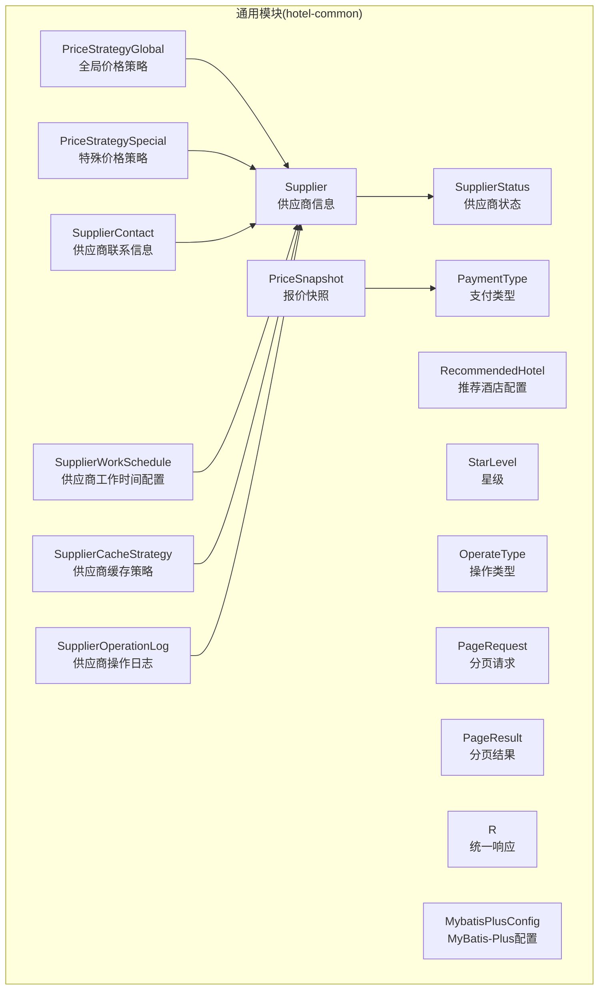
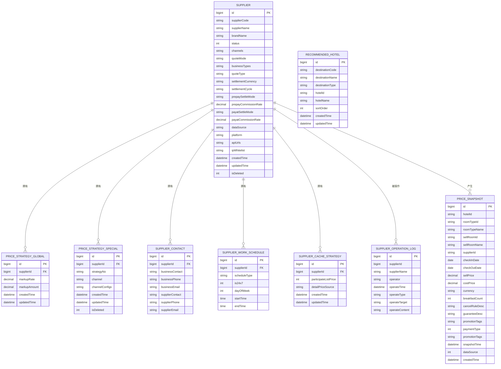
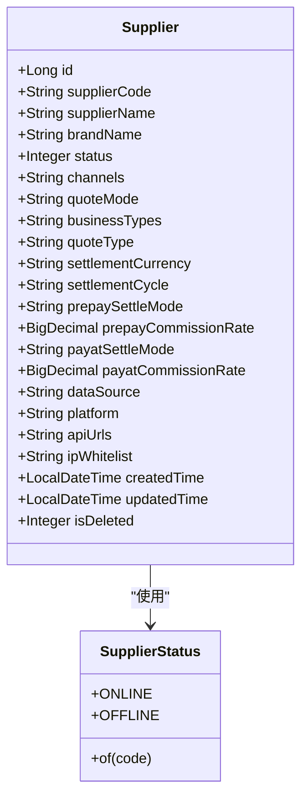
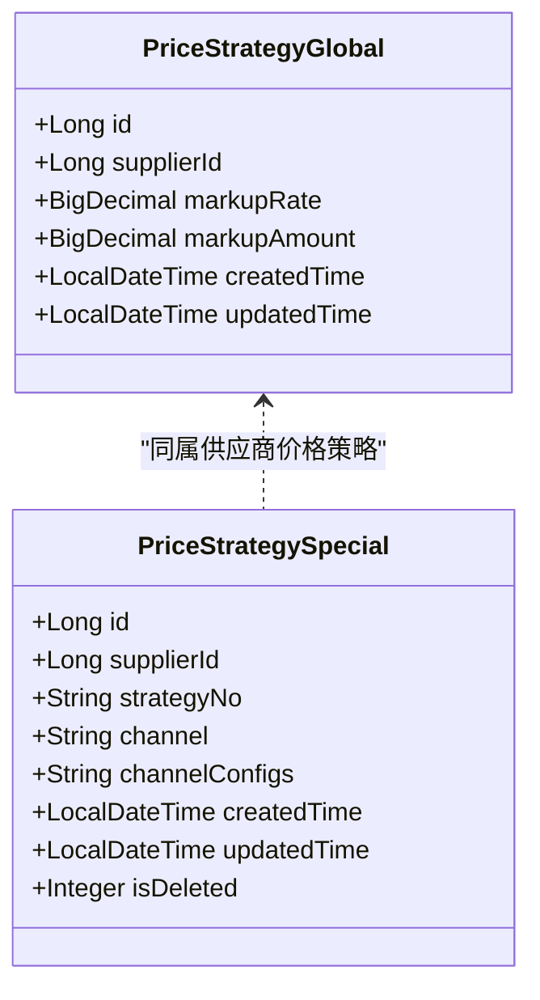
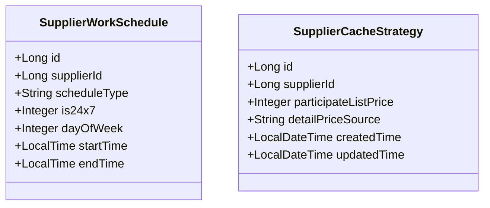
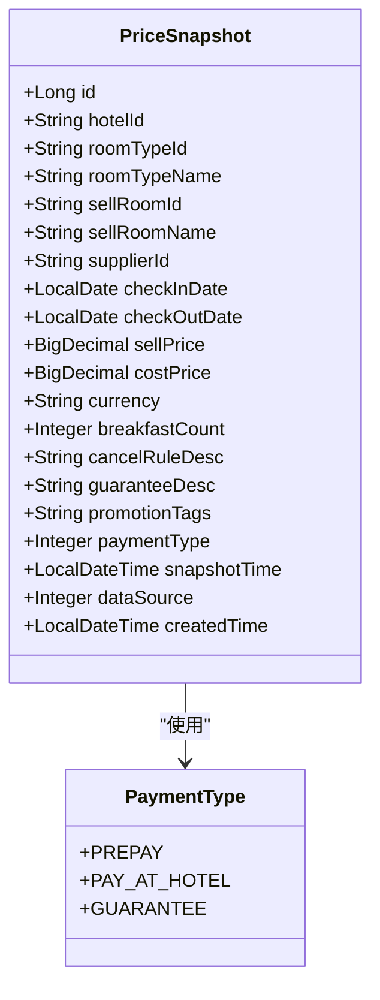
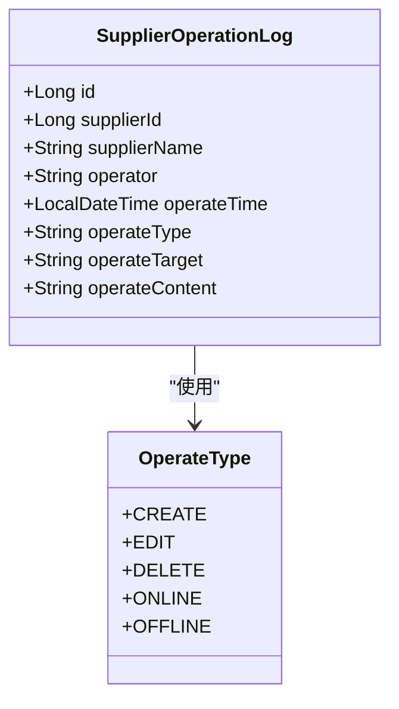
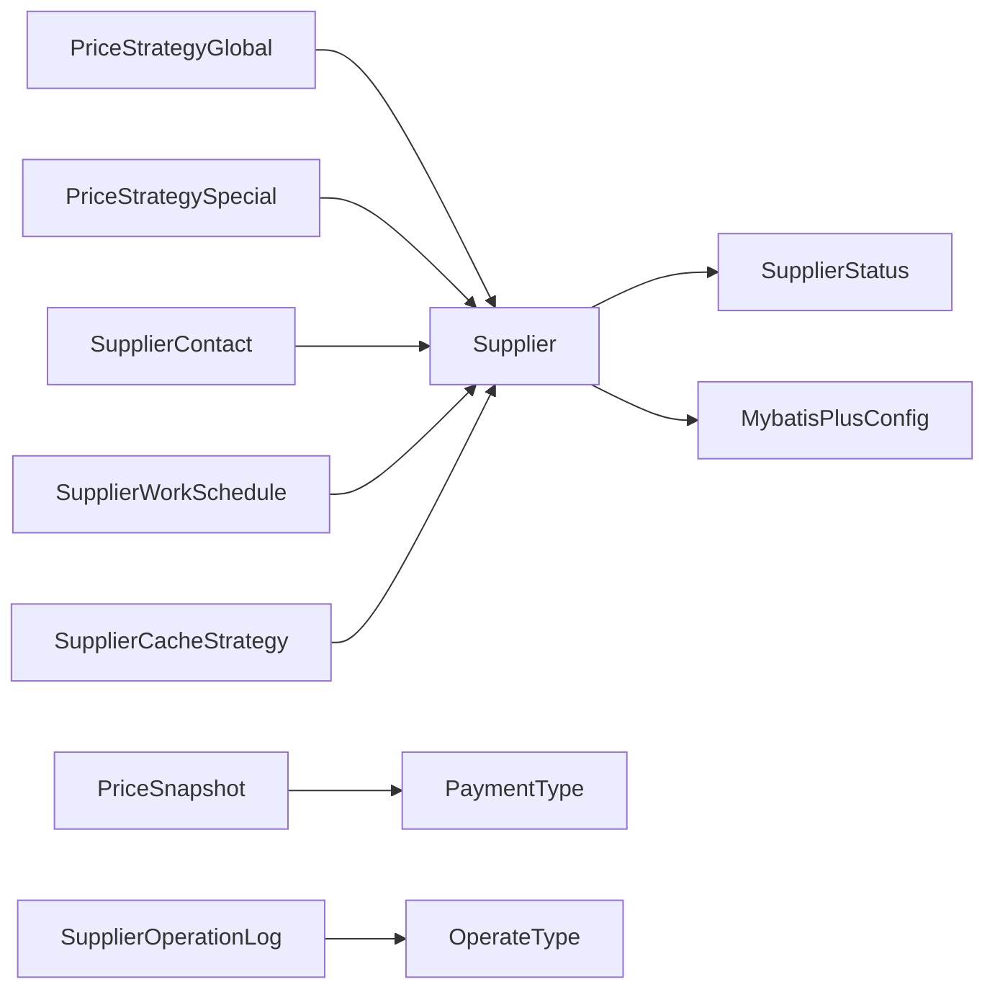

# 核心实体模型

<cite>
**本文引用的文件**
- [Supplier.java](file://hotel-seller-backend/hotel-common/src/main/java/com/ceair/hotel/common/entity/Supplier.java)
- [RecommendedHotel.java](file://hotel-seller-backend/hotel-common/src/main/java/com/ceair/hotel/common/entity/RecommendedHotel.java)
- [PriceStrategyGlobal.java](file://hotel-seller-backend/hotel-common/src/main/java/com/ceair/hotel/common/entity/PriceStrategyGlobal.java)
- [PriceStrategySpecial.java](file://hotel-seller-backend/hotel-common/src/main/java/com/ceair/hotel/common/entity/PriceStrategySpecial.java)
- [SupplierContact.java](file://hotel-seller-backend/hotel-common/src/main/java/com/ceair/hotel/common/entity/SupplierContact.java)
- [SupplierWorkSchedule.java](file://hotel-seller-backend/hotel-common/src/main/java/com/ceair/hotel/common/entity/SupplierWorkSchedule.java)
- [SupplierCacheStrategy.java](file://hotel-seller-backend/hotel-common/src/main/java/com/ceair/hotel/common/entity/SupplierCacheStrategy.java)
- [SupplierOperationLog.java](file://hotel-seller-backend/hotel-common/src/main/java/com/ceair/hotel/common/entity/SupplierOperationLog.java)
- [PriceSnapshot.java](file://hotel-seller-backend/hotel-common/src/main/java/com/ceair/hotel/common/entity/PriceSnapshot.java)
- [SupplierStatus.java](file://hotel-seller-backend/hotel-common/src/main/java/com/ceair/hotel/common/enums/SupplierStatus.java)
- [PaymentType.java](file://hotel-seller-backend/hotel-common/src/main/java/com/ceair/hotel/common/enums/PaymentType.java)
- [StarLevel.java](file://hotel-seller-backend/hotel-common/src/main/java/com/ceair/hotel/common/enums/StarLevel.java)
- [OperateType.java](file://hotel-seller-backend/hotel-common/src/main/java/com/ceair/hotel/common/enums/OperateType.java)
- [PageRequest.java](file://hotel-seller-backend/hotel-common/src/main/java/com/ceair/hotel/common/dto/PageRequest.java)
- [PageResult.java](file://hotel-seller-backend/hotel-common/src/main/java/com/ceair/hotel/common/dto/PageResult.java)
- [R.java](file://hotel-seller-backend/hotel-common/src/main/java/com/ceair/hotel/common/dto/R.java)
- [MybatisPlusConfig.java](file://hotel-seller-backend/hotel-common/src/main/java/com/ceair/hotel/common/config/MybatisPlusConfig.java)
</cite>

## 目录
1. [简介](#简介)
2. [项目结构](#项目结构)
3. [核心组件](#核心组件)
4. [架构总览](#架构总览)
5. [详细组件分析](#详细组件分析)
6. [依赖分析](#依赖分析)
7. [性能考量](#性能考量)
8. [故障排查指南](#故障排查指南)
9. [结论](#结论)
10. [附录](#附录)

## 简介
本文件面向后端开发与数据库设计，系统化梳理酒店销售系统的核心实体模型，覆盖实体设计理念、业务含义、字段定义、约束与默认值、生命周期与状态转换、序列化与版本兼容性等关键主题，并提供面向数据库建模的参考。本文以 hotel-common 模块中的实体与枚举为核心，结合通用 DTO 与 MyBatis-Plus 配置，形成完整的实体参考。

## 项目结构
- 实体层位于 hotel-common 模块的 entity 包，采用 MyBatis-Plus 注解映射数据库表，统一使用 Lombok 的 @Data 简化 getter/setter。
- 枚举层位于 enums 包，用于标准化状态、支付方式、星级等业务取值。
- DTO 层位于 dto 包，提供分页请求、分页结果与统一响应包装。
- 配置层位于 config 包，集中管理 MyBatis-Plus 的分页插件与自动填充（createdTime/updatedTime）。

图表来源
- [Supplier.java:11-80](file://hotel-seller-backend/hotel-common/src/main/java/com/ceair/hotel/common/entity/Supplier.java#L11-L80)
- [PriceStrategyGlobal.java:12-32](file://hotel-seller-backend/hotel-common/src/main/java/com/ceair/hotel/common/entity/PriceStrategyGlobal.java#L12-L32)
- [PriceStrategySpecial.java:11-37](file://hotel-seller-backend/hotel-common/src/main/java/com/ceair/hotel/common/entity/PriceStrategySpecial.java#L11-L37)
- [SupplierContact.java:10-28](file://hotel-seller-backend/hotel-common/src/main/java/com/ceair/hotel/common/entity/SupplierContact.java#L10-L28)
- [SupplierWorkSchedule.java:11-32](file://hotel-seller-backend/hotel-common/src/main/java/com/ceair/hotel/common/entity/SupplierWorkSchedule.java#L11-L32)
- [SupplierCacheStrategy.java:11-31](file://hotel-seller-backend/hotel-common/src/main/java/com/ceair/hotel/common/entity/SupplierCacheStrategy.java#L11-L31)
- [SupplierOperationLog.java:11-31](file://hotel-seller-backend/hotel-common/src/main/java/com/ceair/hotel/common/entity/SupplierOperationLog.java#L11-L31)
- [PriceSnapshot.java:13-53](file://hotel-seller-backend/hotel-common/src/main/java/com/ceair/hotel/common/entity/PriceSnapshot.java#L13-L53)
- [SupplierStatus.java:11-24](file://hotel-seller-backend/hotel-common/src/main/java/com/ceair/hotel/common/enums/SupplierStatus.java#L11-L24)
- [PaymentType.java:8-16](file://hotel-seller-backend/hotel-common/src/main/java/com/ceair/hotel/common/enums/PaymentType.java#L8-L16)
- [PageRequest.java:9-17](file://hotel-seller-backend/hotel-common/src/main/java/com/ceair/hotel/common/dto/PageRequest.java#L9-L17)
- [PageResult.java:9-25](file://hotel-seller-backend/hotel-common/src/main/java/com/ceair/hotel/common/dto/PageResult.java#L9-L25)
- [R.java:9-47](file://hotel-seller-backend/hotel-common/src/main/java/com/ceair/hotel/common/dto/R.java#L9-L47)
- [MybatisPlusConfig.java:16-36](file://hotel-seller-backend/hotel-common/src/main/java/com/ceair/hotel/common/config/MybatisPlusConfig.java#L16-L36)

章节来源
- [Supplier.java:11-80](file://hotel-seller-backend/hotel-common/src/main/java/com/ceair/hotel/common/entity/Supplier.java#L11-L80)
- [MybatisPlusConfig.java:16-36](file://hotel-seller-backend/hotel-common/src/main/java/com/ceair/hotel/common/config/MybatisPlusConfig.java#L16-L36)

## 核心组件
本节对各实体进行逐项说明，包括业务含义、字段类型、约束与默认值、生命周期与状态转换、序列化与版本兼容性建议。

- 供应商信息（Supplier）
  - 表映射：t_supplier
  - 关键字段与含义
    - id：主键自增
    - supplierCode/supplierName/brandName：供应商编号、名称、品牌名
    - status：状态，1-上线，0-下线；配合枚举 SupplierStatus
    - channels：上架渠道集合（JSON），如 APP/H5/WEB
    - quoteMode：报价模式
    - businessTypes：开通业务集合（JSON），如 PREPAY/PAY_AT_HOTEL
    - quoteType：报价类型（BASE_PRICE/SELL_PRICE）
    - settlementCurrency/settlementCycle/prepaySettleMode/payatSettleMode：结算相关
    - prepayCommissionRate/payatCommissionRate：预付/现付佣金比例
    - dataSource/platform：数据来源与对接平台
    - apiUrls/ipWhitelist：API 地址与 IP 白名单
    - createdTime/updatedTime：创建与更新时间（自动填充）
    - isDeleted：逻辑删除标记
  - 约束与默认值
    - 主键自增；createdTime/updatedTime 默认由 MyBatis-Plus 自动填充
    - status 默认值未在实体中指定，应由业务或数据库默认值保证一致性
  - 生命周期与状态转换
    - 通过 status 字段实现上线/下线切换；配合 OperateType 枚举记录操作类型
    - 逻辑删除 isDeleted 用于软删除
  - 序列化与版本兼容性
    - 使用 JSON 字段存储数组/集合（channels/businessTypes），便于扩展；版本升级时需保持字段可解析
    - 建议对 JSON 字段增加校验与默认空数组策略，避免空指针
  - 章节来源
    - [Supplier.java:13-80](file://hotel-seller-backend/hotel-common/src/main/java/com/ceair/hotel/common/entity/Supplier.java#L13-L80)
    - [SupplierStatus.java:11-24](file://hotel-seller-backend/hotel-common/src/main/java/com/ceair/hotel/common/enums/SupplierStatus.java#L11-L24)
    - [OperateType.java:8-16](file://hotel-seller-backend/hotel-common/src/main/java/com/ceair/hotel/common/enums/OperateType.java#L8-L16)
    - [MybatisPlusConfig.java:26-35](file://hotel-seller-backend/hotel-common/src/main/java/com/ceair/hotel/common/config/MybatisPlusConfig.java#L26-L35)

- 推荐酒店配置（RecommendedHotel）
  - 表映射：t_recommended_hotel
  - 关键字段与含义
    - id：主键自增
    - destinationCode/destinationName/destinationType：目的地编码/名称/类型
    - hotelId/hotelName：酒店标识与名称
    - sortOrder：排序序号（越小越靠前）
    - createdTime/updatedTime：自动填充
  - 约束与默认值
    - 主键自增；sortOrder 通常为整数，建议默认值为 0 或 9999 以便排序控制
  - 生命周期与状态转换
    - 作为配置表，主要通过新增/修改/删除维护推荐顺序
  - 章节来源
    - [RecommendedHotel.java:12-35](file://hotel-seller-backend/hotel-common/src/main/java/com/ceair/hotel/common/entity/RecommendedHotel.java#L12-L35)

- 全局价格策略（PriceStrategyGlobal）
  - 表映射：t_price_strategy_global
  - 关键字段与含义
    - id：主键自增
    - supplierId：所属供应商
    - markupRate/markupAmount：加价比例（百分比）与加价金额（元/间夜）
    - createdTime/updatedTime：自动填充
  - 约束与默认值
    - 主键自增；markupRate/markupAmount 为数值类型，建议默认值为 0
  - 生命周期与状态转换
    - 作为全局策略，通常只保留最新生效的一条记录
  - 章节来源
    - [PriceStrategyGlobal.java:13-32](file://hotel-seller-backend/hotel-common/src/main/java/com/ceair/hotel/common/entity/PriceStrategyGlobal.java#L13-L32)

- 特殊价格策略（PriceStrategySpecial）
  - 表映射：t_price_strategy_special
  - 关键字段与含义
    - id：主键自增
    - supplierId：所属供应商
    - strategyNo：策略编号
    - channel/channelConfigs：适用渠道集合与各渠道加减价配置（JSON）
    - createdTime/updatedTime：自动填充
    - isDeleted：逻辑删除
  - 约束与默认值
    - 主键自增；channelConfigs 为 JSON，建议默认空对象
  - 生命周期与状态转换
    - 通过 strategyNo 与时间维度控制生效范围；支持软删除
  - 章节来源
    - [PriceStrategySpecial.java:12-37](file://hotel-seller-backend/hotel-common/src/main/java/com/ceair/hotel/common/entity/PriceStrategySpecial.java#L12-L37)

- 供应商联系信息（SupplierContact）
  - 表映射：t_supplier_contact
  - 关键字段与含义
    - id：主键自增
    - supplierId：所属供应商
    - businessContact/businessPhone/businessEmail：我方商务联系人
    - supplierContact/supplierPhone/supplierEmail：对方客服联系人
  - 约束与默认值
    - 主键自增；联系信息为字符串，建议非必填字段允许为空
  - 生命周期与状态转换
    - 作为静态联系信息，按需更新
  - 章节来源
    - [SupplierContact.java:11-28](file://hotel-seller-backend/hotel-common/src/main/java/com/ceair/hotel/common/entity/SupplierContact.java#L11-L28)

- 供应商工作时间配置（SupplierWorkSchedule）
  - 表映射：t_supplier_work_schedule
  - 关键字段与含义
    - id：主键自增
    - supplierId：所属供应商
    - scheduleType：时间类型（WORK/ORDER_CONFIRM）
    - is24x7：是否 7×24 小时（1/0）
    - dayOfWeek：星期几（1-7）
    - startTime/endTime：开始/结束时间（LocalTime）
  - 约束与默认值
    - 主键自增；is24x7 默认值未在实体中指定
  - 生命周期与状态转换
    - 通过 scheduleType 与 dayOfWeek 维护不同场景的工作时间
  - 章节来源
    - [SupplierWorkSchedule.java:12-32](file://hotel-seller-backend/hotel-common/src/main/java/com/ceair/hotel/common/entity/SupplierWorkSchedule.java#L12-L32)

- 供应商缓存策略（SupplierCacheStrategy）
  - 表映射：t_supplier_cache_strategy
  - 关键字段与含义
    - id：主键自增
    - supplierId：所属供应商
    - participateListPrice：是否参与列表页报价（1/0）
    - detailPriceSource：详情页价格来源（CACHE_FIRST/REALTIME）
    - createdTime/updatedTime：自动填充
  - 约束与默认值
    - 主键自增；detailPriceSource 为枚举式字符串，建议默认值明确
  - 生命周期与状态转换
    - 作为运行时策略，按需调整
  - 章节来源
    - [SupplierCacheStrategy.java:12-31](file://hotel-seller-backend/hotel-common/src/main/java/com/ceair/hotel/common/entity/SupplierCacheStrategy.java#L12-L31)

- 供应商操作日志（SupplierOperationLog）
  - 表映射：t_supplier_operation_log
  - 关键字段与含义
    - id：主键自增
    - supplierId/supplierName/operator：供应商标识、名称、操作人
    - operateTime：操作时间
    - operateType：操作类型（CREATE/EDIT/DELETE/ONLINE/OFFLINE）
    - operateTarget/operateContent：操作对象与内容
  - 约束与默认值
    - 主键自增；operateType 受枚举 OperateType 约束
  - 生命周期与状态转换
    - 记录全生命周期的操作轨迹
  - 章节来源
    - [SupplierOperationLog.java:12-31](file://hotel-seller-backend/hotel-common/src/main/java/com/ceair/hotel/common/entity/SupplierOperationLog.java#L12-L31)
    - [OperateType.java:8-16](file://hotel-seller-backend/hotel-common/src/main/java/com/ceair/hotel/common/enums/OperateType.java#L8-L16)

- 报价快照（PriceSnapshot）
  - 表映射：t_price_snapshot
  - 关键字段与含义
    - id：主键自增
    - hotelId/roomTypeId/roomTypeName/sellRoomId/sellRoomName/supplierId：酒店/房型/售卖房型/供应商标识
    - checkInDate/checkOutDate：入住/离店日期
    - sellPrice/costPrice：售卖价（已加价）与成本价
    - currency/breakfastCount：币种与早餐数量
    - cancelRuleDesc/guaranteeDesc/promotionTags：取消规则/担保说明/促销标签
    - paymentType：支付方式（1-预付 2-现付）
    - snapshotTime：快照采集时间
    - dataSource：数据来源（1-用户搜索回写 2-后台探测 3-详情页回写）
    - createdTime：自动填充
  - 约束与默认值
    - 主键自增；paymentType 与枚举 PaymentType 对应
  - 生命周期与状态转换
    - 作为降级兜底数据源，定期刷新
  - 章节来源
    - [PriceSnapshot.java:14-53](file://hotel-seller-backend/hotel-common/src/main/java/com/ceair/hotel/common/entity/PriceSnapshot.java#L14-L53)
    - [PaymentType.java:8-16](file://hotel-seller-backend/hotel-common/src/main/java/com/ceair/hotel/common/enums/PaymentType.java#L8-L16)

## 架构总览
以下图示展示核心实体之间的关联关系与典型交互：

图表来源
- [Supplier.java:13-80](file://hotel-seller-backend/hotel-common/src/main/java/com/ceair/hotel/common/entity/Supplier.java#L13-L80)
- [RecommendedHotel.java:12-35](file://hotel-seller-backend/hotel-common/src/main/java/com/ceair/hotel/common/entity/RecommendedHotel.java#L12-L35)
- [PriceStrategyGlobal.java:13-32](file://hotel-seller-backend/hotel-common/src/main/java/com/ceair/hotel/common/entity/PriceStrategyGlobal.java#L13-L32)
- [PriceStrategySpecial.java:12-37](file://hotel-seller-backend/hotel-common/src/main/java/com/ceair/hotel/common/entity/PriceStrategySpecial.java#L12-L37)
- [SupplierContact.java:11-28](file://hotel-seller-backend/hotel-common/src/main/java/com/ceair/hotel/common/entity/SupplierContact.java#L11-L28)
- [SupplierWorkSchedule.java:12-32](file://hotel-seller-backend/hotel-common/src/main/java/com/ceair/hotel/common/entity/SupplierWorkSchedule.java#L12-L32)
- [SupplierCacheStrategy.java:12-31](file://hotel-seller-backend/hotel-common/src/main/java/com/ceair/hotel/common/entity/SupplierCacheStrategy.java#L12-L31)
- [SupplierOperationLog.java:12-31](file://hotel-seller-backend/hotel-common/src/main/java/com/ceair/hotel/common/entity/SupplierOperationLog.java#L12-L31)
- [PriceSnapshot.java:14-53](file://hotel-seller-backend/hotel-common/src/main/java/com/ceair/hotel/common/entity/PriceSnapshot.java#L14-L53)

## 详细组件分析

### 供应商信息（Supplier）分析
- 设计理念
  - 聚合供应商基础资料、结算与报价能力、对接平台与安全配置
- 字段与约束
  - JSON 字段 channels/businessTypes/apiUrls/ipWhitelist 提供灵活扩展
  - status 与枚举 SupplierStatus 对齐
- 生命周期与状态转换
  - 通过 status 切换上线/下线；isDeleted 支持软删除
- 序列化与版本兼容
  - JSON 字段需向前兼容；建议引入 Schema 校验与默认值策略

图表来源
- [Supplier.java:13-80](file://hotel-seller-backend/hotel-common/src/main/java/com/ceair/hotel/common/entity/Supplier.java#L13-L80)
- [SupplierStatus.java:11-24](file://hotel-seller-backend/hotel-common/src/main/java/com/ceair/hotel/common/enums/SupplierStatus.java#L11-L24)

章节来源
- [Supplier.java:13-80](file://hotel-seller-backend/hotel-common/src/main/java/com/ceair/hotel/common/entity/Supplier.java#L13-L80)
- [SupplierStatus.java:11-24](file://hotel-seller-backend/hotel-common/src/main/java/com/ceair/hotel/common/enums/SupplierStatus.java#L11-L24)

### 价格策略（PriceStrategyGlobal/PriceStrategySpecial）分析
- 设计理念
  - 全局策略统一加价规则；特殊策略按渠道差异化定价
- 字段与约束
  - markupRate/markupAmount 与 channelConfigs 为 JSON，便于灵活配置
- 生命周期与状态转换
  - 特殊策略支持软删除与编号管理

图表来源
- [PriceStrategyGlobal.java:13-32](file://hotel-seller-backend/hotel-common/src/main/java/com/ceair/hotel/common/entity/PriceStrategyGlobal.java#L13-L32)
- [PriceStrategySpecial.java:12-37](file://hotel-seller-backend/hotel-common/src/main/java/com/ceair/hotel/common/entity/PriceStrategySpecial.java#L12-L37)

章节来源
- [PriceStrategyGlobal.java:13-32](file://hotel-seller-backend/hotel-common/src/main/java/com/ceair/hotel/common/entity/PriceStrategyGlobal.java#L13-L32)
- [PriceStrategySpecial.java:12-37](file://hotel-seller-backend/hotel-common/src/main/java/com/ceair/hotel/common/entity/PriceStrategySpecial.java#L12-L37)

### 工作时间与缓存策略（SupplierWorkSchedule/SupplierCacheStrategy）分析
- 设计理念
  - 通过 scheduleType 与 dayOfWeek 精细化配置不同场景工作时间；通过 detailPriceSource 控制详情页价格来源
- 字段与约束
  - is24x7 与 dayOfWeek 用于表达工作时间区间
- 生命周期与状态转换
  - 随业务需求动态调整

图表来源
- [SupplierWorkSchedule.java:12-32](file://hotel-seller-backend/hotel-common/src/main/java/com/ceair/hotel/common/entity/SupplierWorkSchedule.java#L12-L32)
- [SupplierCacheStrategy.java:12-31](file://hotel-seller-backend/hotel-common/src/main/java/com/ceair/hotel/common/entity/SupplierCacheStrategy.java#L12-L31)

章节来源
- [SupplierWorkSchedule.java:12-32](file://hotel-seller-backend/hotel-common/src/main/java/com/ceair/hotel/common/entity/SupplierWorkSchedule.java#L12-L32)
- [SupplierCacheStrategy.java:12-31](file://hotel-seller-backend/hotel-common/src/main/java/com/ceair/hotel/common/entity/SupplierCacheStrategy.java#L12-L31)

### 报价快照（PriceSnapshot）分析
- 设计理念
  - 记录售卖价、成本价、支付方式、取消/担保规则与促销标签，支撑降级与回放
- 字段与约束
  - paymentType 与枚举 PaymentType 对齐
- 生命周期与状态转换
  - 定期采集与刷新

图表来源
- [PriceSnapshot.java:14-53](file://hotel-seller-backend/hotel-common/src/main/java/com/ceair/hotel/common/entity/PriceSnapshot.java#L14-L53)
- [PaymentType.java:8-16](file://hotel-seller-backend/hotel-common/src/main/java/com/ceair/hotel/common/enums/PaymentType.java#L8-L16)

章节来源
- [PriceSnapshot.java:14-53](file://hotel-seller-backend/hotel-common/src/main/java/com/ceair/hotel/common/entity/PriceSnapshot.java#L14-L53)
- [PaymentType.java:8-16](file://hotel-seller-backend/hotel-common/src/main/java/com/ceair/hotel/common/enums/PaymentType.java#L8-L16)

### 操作日志（SupplierOperationLog）分析
- 设计理念
  - 记录供应商全生命周期操作，便于审计与追踪
- 字段与约束
  - operateType 与枚举 OperateType 对齐

图表来源
- [SupplierOperationLog.java:12-31](file://hotel-seller-backend/hotel-common/src/main/java/com/ceair/hotel/common/entity/SupplierOperationLog.java#L12-L31)
- [OperateType.java:8-16](file://hotel-seller-backend/hotel-common/src/main/java/com/ceair/hotel/common/enums/OperateType.java#L8-L16)

章节来源
- [SupplierOperationLog.java:12-31](file://hotel-seller-backend/hotel-common/src/main/java/com/ceair/hotel/common/entity/SupplierOperationLog.java#L12-L31)
- [OperateType.java:8-16](file://hotel-seller-backend/hotel-common/src/main/java/com/ceair/hotel/common/enums/OperateType.java#L8-L16)

## 依赖分析
- 实体与枚举
  - Supplier 依赖 SupplierStatus；PriceSnapshot 依赖 PaymentType；SupplierOperationLog 依赖 OperateType
- 实体与配置
  - 所有实体共享 createdTime/updatedTime 的自动填充行为，由 MybatisPlusConfig 提供
- 实体与服务
  - 各实体在 admin-service/search/pricing 等服务中被读写，但实体本身不直接依赖服务层

图表来源
- [Supplier.java:13-80](file://hotel-seller-backend/hotel-common/src/main/java/com/ceair/hotel/common/entity/Supplier.java#L13-L80)
- [SupplierStatus.java:11-24](file://hotel-seller-backend/hotel-common/src/main/java/com/ceair/hotel/common/enums/SupplierStatus.java#L11-L24)
- [PriceSnapshot.java:14-53](file://hotel-seller-backend/hotel-common/src/main/java/com/ceair/hotel/common/entity/PriceSnapshot.java#L14-L53)
- [PaymentType.java:8-16](file://hotel-seller-backend/hotel-common/src/main/java/com/ceair/hotel/common/enums/PaymentType.java#L8-L16)
- [SupplierOperationLog.java:12-31](file://hotel-seller-backend/hotel-common/src/main/java/com/ceair/hotel/common/entity/SupplierOperationLog.java#L12-L31)
- [OperateType.java:8-16](file://hotel-seller-backend/hotel-common/src/main/java/com/ceair/hotel/common/enums/OperateType.java#L8-L16)
- [MybatisPlusConfig.java:16-36](file://hotel-seller-backend/hotel-common/src/main/java/com/ceair/hotel/common/config/MybatisPlusConfig.java#L16-L36)

章节来源
- [MybatisPlusConfig.java:16-36](file://hotel-seller-backend/hotel-common/src/main/java/com/ceair/hotel/common/config/MybatisPlusConfig.java#L16-L36)

## 性能考量
- 自动填充与索引
  - createdTime/updatedTime 由 MyBatis-Plus 自动填充，建议在表上建立相应索引以优化查询
- JSON 字段
  - channels/businessTypes/channelConfigs 等 JSON 字段在查询时可能影响性能，建议仅在必要时读取或拆分冗余字段
- 分页与查询
  - PageRequest/PageResult 提供标准分页参数与结果封装，建议在高频查询接口中启用分页与限流

## 故障排查指南
- 常见问题
  - 字段为空或默认值异常：检查 MybatisPlusConfig 的自动填充是否生效；确认数据库默认值与实体注解一致
  - JSON 字段解析失败：确保 JSON 结构与业务约定一致；对空值提供默认空对象/空数组
  - 状态枚举不匹配：核对 SupplierStatus/PaymentType/OperateType 的 code 与数据库存储值
- 排查步骤
  - 核对实体注解与数据库表结构一致性
  - 检查统一响应 R 的返回码与消息
  - 查看 SupplierOperationLog 的操作记录定位问题

章节来源
- [MybatisPlusConfig.java:26-35](file://hotel-seller-backend/hotel-common/src/main/java/com/ceair/hotel/common/config/MybatisPlusConfig.java#L26-L35)
- [R.java:9-47](file://hotel-seller-backend/hotel-common/src/main/java/com/ceair/hotel/common/dto/R.java#L9-L47)
- [SupplierOperationLog.java:12-31](file://hotel-seller-backend/hotel-common/src/main/java/com/ceair/hotel/common/entity/SupplierOperationLog.java#L12-L31)

## 结论
本文从实体设计、字段定义、约束与默认值、生命周期与状态转换、序列化与版本兼容性等方面，系统梳理了酒店销售系统的核心实体模型。建议在数据库层面落实自动填充索引、JSON 字段的可解析性与默认值策略，并在服务层遵循统一响应与分页规范，以保障系统的稳定性与可维护性。

## 附录
- 通用 DTO 与配置
  - 分页请求 PageRequest：默认页码 1，每页 20 条
  - 分页结果 PageResult：封装总数、页码、页大小与列表
  - 统一响应 R：成功/失败的统一封装与判断方法
  - MyBatis-Plus 配置：分页插件与 createdTime/updatedTime 自动填充

章节来源
- [PageRequest.java:9-17](file://hotel-seller-backend/hotel-common/src/main/java/com/ceair/hotel/common/dto/PageRequest.java#L9-L17)
- [PageResult.java:9-25](file://hotel-seller-backend/hotel-common/src/main/java/com/ceair/hotel/common/dto/PageResult.java#L9-L25)
- [R.java:9-47](file://hotel-seller-backend/hotel-common/src/main/java/com/ceair/hotel/common/dto/R.java#L9-L47)
- [MybatisPlusConfig.java:16-36](file://hotel-seller-backend/hotel-common/src/main/java/com/ceair/hotel/common/config/MybatisPlusConfig.java#L16-L36)