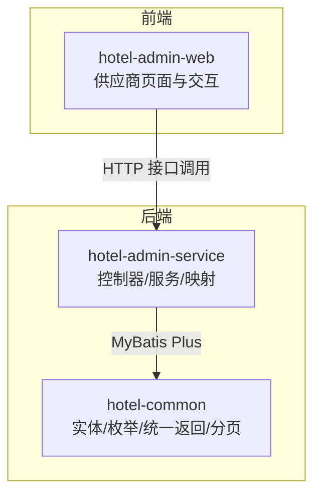
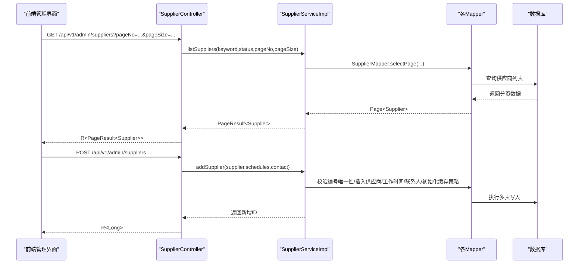
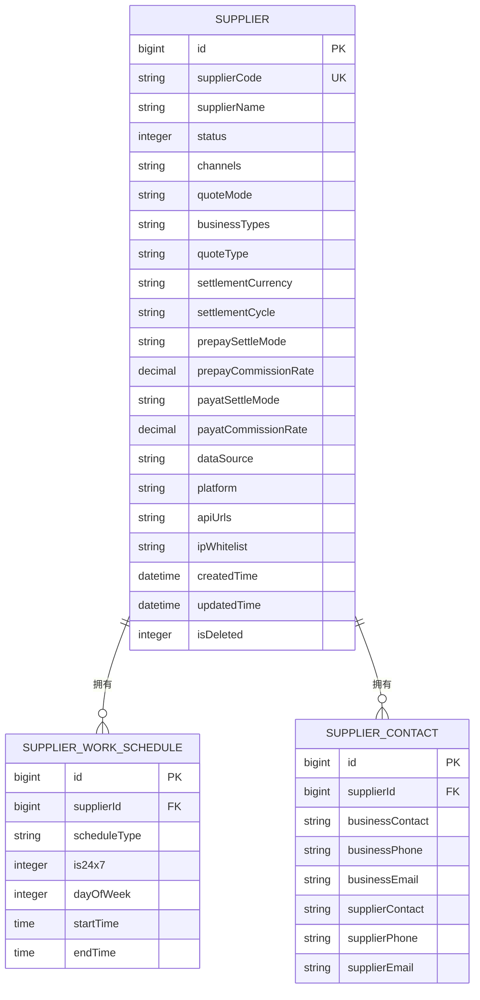
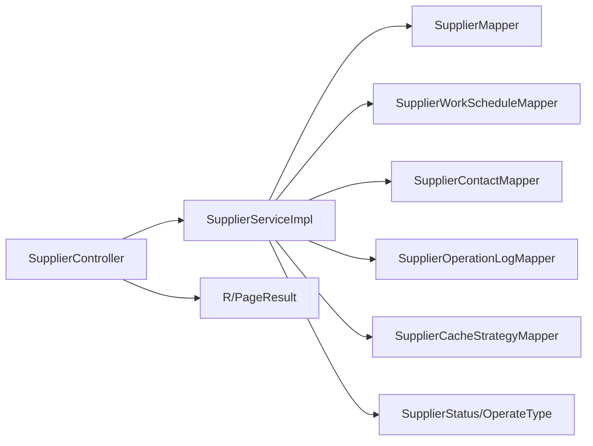

# 供应商管理模块

<cite>
**本文引用的文件**
- [SupplierController.java](file://hotel-seller-backend/hotel-admin-service/src/main/java/com/ceair/hotel/admin/controller/SupplierController.java)
- [SupplierServiceImpl.java](file://hotel-seller-backend/hotel-admin-service/src/main/java/com/ceair/hotel/admin/service/impl/SupplierServiceImpl.java)
- [SupplierService.java](file://hotel-seller-backend/hotel-admin-service/src/main/java/com/ceair/hotel/admin/service/SupplierService.java)
- [SupplierMapper.java](file://hotel-seller-backend/hotel-admin-service/src/main/java/com/ceair/hotel/admin/mapper/SupplierMapper.java)
- [SupplierWorkScheduleMapper.java](file://hotel-seller-backend/hotel-admin-service/src/main/java/com/ceair/hotel/admin/mapper/SupplierWorkScheduleMapper.java)
- [SupplierContactMapper.java](file://hotel-seller-backend/hotel-admin-service/src/main/java/com/ceair/hotel/admin/mapper/SupplierContactMapper.java)
- [Supplier.java](file://hotel-seller-backend/hotel-common/src/main/java/com/ceair/hotel/common/entity/Supplier.java)
- [SupplierWorkSchedule.java](file://hotel-seller-backend/hotel-common/src/main/java/com/ceair/hotel/common/entity/SupplierWorkSchedule.java)
- [SupplierContact.java](file://hotel-seller-backend/hotel-common/src/main/java/com/ceair/hotel/common/entity/SupplierContact.java)
- [SupplierStatus.java](file://hotel-seller-backend/hotel-common/src/main/java/com/ceair/hotel/common/enums/SupplierStatus.java)
- [OperateType.java](file://hotel-seller-backend/hotel-common/src/main/java/com/ceair/hotel/common/enums/OperateType.java)
- [PageResult.java](file://hotel-seller-backend/hotel-common/src/main/java/com/ceair/hotel/common/dto/PageResult.java)
- [R.java](file://hotel-seller-backend/hotel-common/src/main/java/com/ceair/hotel/common/dto/R.java)
- [SupplierList.vue](file://hotel-admin-web/src/views/supplier/SupplierList.vue)
</cite>

## 目录
1. [简介](#简介)
2. [项目结构](#项目结构)
3. [核心组件](#核心组件)
4. [架构总览](#架构总览)
5. [详细组件分析](#详细组件分析)
6. [依赖分析](#依赖分析)
7. [性能考虑](#性能考虑)
8. [故障排查指南](#故障排查指南)
9. [结论](#结论)
10. [附录](#附录)

## 简介
本文件面向供应商管理模块的功能与技术实现，覆盖从接口设计到业务逻辑、数据模型与前端集成的全链路说明。重点包括：
- 供应商的增删改查、状态管理、工作时间配置与联系人管理
- SupplierController 的 API 设计与调用方式
- SupplierService 的业务逻辑、事务与异常处理
- 数据模型 Supplier、SupplierWorkSchedule、SupplierContact 的关系与设计要点
- 扩展与最佳实践建议

## 项目结构
该模块采用前后端分离架构，后端由 Spring Boot 微服务组成，前端使用 Vue 3 + Element Plus 构建管理界面。

**图表来源**
- [SupplierController.java:1-105](file://hotel-seller-backend/hotel-admin-service/src/main/java/com/ceair/hotel/admin/controller/SupplierController.java#L1-L105)
- [SupplierServiceImpl.java:1-162](file://hotel-seller-backend/hotel-admin-service/src/main/java/com/ceair/hotel/admin/service/impl/SupplierServiceImpl.java#L1-L162)
- [Supplier.java:1-81](file://hotel-seller-backend/hotel-common/src/main/java/com/ceair/hotel/common/entity/Supplier.java#L1-L81)
- [SupplierWorkSchedule.java:1-33](file://hotel-seller-backend/hotel-common/src/main/java/com/ceair/hotel/common/entity/SupplierWorkSchedule.java#L1-L33)
- [SupplierContact.java:1-29](file://hotel-seller-backend/hotel-common/src/main/java/com/ceair/hotel/common/entity/SupplierContact.java#L1-L29)
- [SupplierList.vue:1-167](file://hotel-admin-web/src/views/supplier/SupplierList.vue#L1-L167)

**章节来源**
- [SupplierController.java:1-105](file://hotel-seller-backend/hotel-admin-service/src/main/java/com/ceair/hotel/admin/controller/SupplierController.java#L1-L105)
- [SupplierServiceImpl.java:1-162](file://hotel-seller-backend/hotel-admin-service/src/main/java/com/ceair/hotel/admin/service/impl/SupplierServiceImpl.java#L1-L162)
- [Supplier.java:1-81](file://hotel-seller-backend/hotel-common/src/main/java/com/ceair/hotel/common/entity/Supplier.java#L1-L81)
- [SupplierWorkSchedule.java:1-33](file://hotel-seller-backend/hotel-common/src/main/java/com/ceair/hotel/common/entity/SupplierWorkSchedule.java#L1-L33)
- [SupplierContact.java:1-29](file://hotel-seller-backend/hotel-common/src/main/java/com/ceair/hotel/common/entity/SupplierContact.java#L1-L29)
- [SupplierList.vue:1-167](file://hotel-admin-web/src/views/supplier/SupplierList.vue#L1-L167)

## 核心组件
- 控制器层：提供 REST API，封装请求参数与响应包装
- 服务层：实现业务规则、事务控制与异常处理
- 数据访问层：基于 MyBatis Plus Mapper 进行数据库操作
- 公共层：统一响应体、分页结果、实体与枚举定义

关键职责划分：
- SupplierController：暴露供应商管理接口（分页、详情、新增、编辑、上下线、工作时间与联系人查询）
- SupplierServiceImpl：实现业务逻辑（校验、事务、日志记录），协调多个 Mapper 完成复合写入
- 实体与枚举：描述供应商主数据、工作时间与联系人，以及状态与操作类型

**章节来源**
- [SupplierController.java:18-105](file://hotel-seller-backend/hotel-admin-service/src/main/java/com/ceair/hotel/admin/controller/SupplierController.java#L18-L105)
- [SupplierServiceImpl.java:23-162](file://hotel-seller-backend/hotel-admin-service/src/main/java/com/ceair/hotel/admin/service/impl/SupplierServiceImpl.java#L23-L162)
- [SupplierService.java:10-33](file://hotel-seller-backend/hotel-admin-service/src/main/java/com/ceair/hotel/admin/service/SupplierService.java#L10-L33)
- [R.java:1-48](file://hotel-seller-backend/hotel-common/src/main/java/com/ceair/hotel/common/dto/R.java#L1-L48)
- [PageResult.java:1-26](file://hotel-seller-backend/hotel-common/src/main/java/com/ceair/hotel/common/dto/PageResult.java#L1-L26)

## 架构总览
后端采用分层架构，前端通过 HTTP 调用后端接口，后端以统一响应体返回结果。

**图表来源**
- [SupplierController.java:26-55](file://hotel-seller-backend/hotel-admin-service/src/main/java/com/ceair/hotel/admin/controller/SupplierController.java#L26-L55)
- [SupplierServiceImpl.java:31-97](file://hotel-seller-backend/hotel-admin-service/src/main/java/com/ceair/hotel/admin/service/impl/SupplierServiceImpl.java#L31-L97)
- [SupplierMapper.java:1-10](file://hotel-seller-backend/hotel-admin-service/src/main/java/com/ceair/hotel/admin/mapper/SupplierMapper.java#L1-L10)
- [SupplierWorkScheduleMapper.java:1-13](file://hotel-seller-backend/hotel-admin-service/src/main/java/com/ceair/hotel/admin/mapper/SupplierWorkScheduleMapper.java#L1-L13)
- [SupplierContactMapper.java:1-10](file://hotel-seller-backend/hotel-admin-service/src/main/java/com/ceair/hotel/admin/mapper/SupplierContactMapper.java#L1-L10)

## 详细组件分析

### API 接口设计（SupplierController）
- 基础路径：/api/v1/admin/suppliers
- 支持的 HTTP 方法与用途：
  - GET /api/v1/admin/suppliers：分页查询供应商列表（支持关键词与状态过滤）
  - GET /api/v1/admin/suppliers/{id}：获取供应商详情（包含供应商、工作时间、联系人）
  - POST /api/v1/admin/suppliers：新增供应商（包含供应商、工作时间、联系人）
  - PUT /api/v1/admin/suppliers/{id}：编辑供应商
  - PUT /api/v1/admin/suppliers/{id}/status：切换供应商状态（上线/下线）
  - GET /api/v1/admin/suppliers/{id}/schedules：查询供应商工作时间
  - GET /api/v1/admin/suppliers/{id}/contact：查询供应商联系人

请求与响应要点：
- 请求体统一使用 JSON；分页参数通过查询字符串传递
- 响应体统一使用 R<T> 包装，包含 code、message、data 字段
- 分页结果使用 PageResult<T>，包含总数、页码、页大小与列表

典型调用示例（路径参考）：
- 列表分页：[SupplierController.java:28-34](file://hotel-seller-backend/hotel-admin-service/src/main/java/com/ceair/hotel/admin/controller/SupplierController.java#L28-L34)
- 新增供应商：[SupplierController.java:51-55](file://hotel-seller-backend/hotel-admin-service/src/main/java/com/ceair/hotel/admin/controller/SupplierController.java#L51-L55)
- 编辑供应商：[SupplierController.java:57-62](file://hotel-seller-backend/hotel-admin-service/src/main/java/com/ceair/hotel/admin/controller/SupplierController.java#L57-L62)
- 切换状态：[SupplierController.java:64-69](file://hotel-seller-backend/hotel-admin-service/src/main/java/com/ceair/hotel/admin/controller/SupplierController.java#L64-L69)
- 工作时间查询：[SupplierController.java:71-75](file://hotel-seller-backend/hotel-admin-service/src/main/java/com/ceair/hotel/admin/controller/SupplierController.java#L71-L75)
- 联系人查询：[SupplierController.java:77-81](file://hotel-seller-backend/hotel-admin-service/src/main/java/com/ceair/hotel/admin/controller/SupplierController.java#L77-L81)

**章节来源**
- [SupplierController.java:18-105](file://hotel-seller-backend/hotel-admin-service/src/main/java/com/ceair/hotel/admin/controller/SupplierController.java#L18-L105)
- [R.java:1-48](file://hotel-seller-backend/hotel-common/src/main/java/com/ceair/hotel/common/dto/R.java#L1-L48)
- [PageResult.java:1-26](file://hotel-seller-backend/hotel-common/src/main/java/com/ceair/hotel/common/dto/PageResult.java#L1-L26)

### 业务逻辑实现（SupplierService/Impl）
- 列表查询：支持关键词（名称或编号模糊匹配）与状态过滤，按更新时间倒序
- 新增供应商：校验编号唯一性，执行供应商、工作时间、联系人三类数据的插入，并初始化缓存策略，记录操作日志
- 编辑供应商：先加载旧数据，再更新主表；工作时间采用“先删后插”策略；联系人同样“先删后插”
- 切换状态：根据目标状态设置并记录日志（区分上线/下线）
- 工作时间与联系人：提供独立查询方法，供详情聚合使用

事务与异常：
- 使用 @Transactional(rollbackFor = Exception.class) 保证新增/编辑/状态变更的原子性
- 通过 BizException 抛出业务异常，由全局异常处理器统一转换为 R.fail(...) 响应

日志记录：
- 统一日志字段：供应商ID/名称、操作者、操作时间、操作类型、目标与内容
- 便于审计与问题追踪

**章节来源**
- [SupplierServiceImpl.java:31-162](file://hotel-seller-backend/hotel-admin-service/src/main/java/com/ceair/hotel/admin/service/impl/SupplierServiceImpl.java#L31-L162)
- [SupplierService.java:10-33](file://hotel-seller-backend/hotel-admin-service/src/main/java/com/ceair/hotel/admin/service/SupplierService.java#L10-L33)
- [SupplierStatus.java:1-25](file://hotel-seller-backend/hotel-common/src/main/java/com/ceair/hotel/common/enums/SupplierStatus.java#L1-L25)
- [OperateType.java:1-17](file://hotel-seller-backend/hotel-common/src/main/java/com/ceair/hotel/common/enums/OperateType.java#L1-L17)

### 数据模型与关系
供应商主数据、工作时间与联系人三者构成完整的供应商档案。

设计要点：
- 供应商编号唯一（UK），用于新增时的唯一性校验
- 工作时间按供应商维度维护，支持多种时间类型与每周多条记录
- 联系人信息包含我方商务与对方客服两组联系信息
- 逻辑删除字段 isDeleted 支持软删除

**图表来源**
- [Supplier.java:1-81](file://hotel-seller-backend/hotel-common/src/main/java/com/ceair/hotel/common/entity/Supplier.java#L1-L81)
- [SupplierWorkSchedule.java:1-33](file://hotel-seller-backend/hotel-common/src/main/java/com/ceair/hotel/common/entity/SupplierWorkSchedule.java#L1-L33)
- [SupplierContact.java:1-29](file://hotel-seller-backend/hotel-common/src/main/java/com/ceair/hotel/common/entity/SupplierContact.java#L1-L29)

**章节来源**
- [Supplier.java:1-81](file://hotel-seller-backend/hotel-common/src/main/java/com/ceair/hotel/common/entity/Supplier.java#L1-L81)
- [SupplierWorkSchedule.java:1-33](file://hotel-seller-backend/hotel-common/src/main/java/com/ceair/hotel/common/entity/SupplierWorkSchedule.java#L1-L33)
- [SupplierContact.java:1-29](file://hotel-seller-backend/hotel-common/src/main/java/com/ceair/hotel/common/entity/SupplierContact.java#L1-L29)

### 前端集成与使用示例
- 供应商列表页展示了筛选、分页、状态切换与跳转至详情/编辑/价格策略的操作
- 前端通过路由与接口调用完成用户交互，接口路径与参数可参考后端控制器定义

示例（路径参考）：
- 列表页交互逻辑：[SupplierList.vue:116-161](file://hotel-admin-web/src/views/supplier/SupplierList.vue#L116-L161)
- 新增/编辑/详情路由跳转：[SupplierList.vue:141-151](file://hotel-admin-web/src/views/supplier/SupplierList.vue#L141-L151)

**章节来源**
- [SupplierList.vue:1-167](file://hotel-admin-web/src/views/supplier/SupplierList.vue#L1-L167)

## 依赖分析
- 控制器依赖服务接口，服务实现依赖多个 Mapper 与公共 DTO/枚举
- Mapper 层基于 MyBatis Plus，简化 CRUD
- 统一响应体与分页结果在公共模块中复用

**图表来源**
- [SupplierController.java:1-105](file://hotel-seller-backend/hotel-admin-service/src/main/java/com/ceair/hotel/admin/controller/SupplierController.java#L1-L105)
- [SupplierServiceImpl.java:1-162](file://hotel-seller-backend/hotel-admin-service/src/main/java/com/ceair/hotel/admin/service/impl/SupplierServiceImpl.java#L1-L162)
- [SupplierMapper.java:1-10](file://hotel-seller-backend/hotel-admin-service/src/main/java/com/ceair/hotel/admin/mapper/SupplierMapper.java#L1-L10)
- [SupplierWorkScheduleMapper.java:1-13](file://hotel-seller-backend/hotel-admin-service/src/main/java/com/ceair/hotel/admin/mapper/SupplierWorkScheduleMapper.java#L1-L13)
- [SupplierContactMapper.java:1-10](file://hotel-seller-backend/hotel-admin-service/src/main/java/com/ceair/hotel/admin/mapper/SupplierContactMapper.java#L1-L10)
- [R.java:1-48](file://hotel-seller-backend/hotel-common/src/main/java/com/ceair/hotel/common/dto/R.java#L1-L48)
- [PageResult.java:1-26](file://hotel-seller-backend/hotel-common/src/main/java/com/ceair/hotel/common/dto/PageResult.java#L1-L26)
- [SupplierStatus.java:1-25](file://hotel-seller-backend/hotel-common/src/main/java/com/ceair/hotel/common/enums/SupplierStatus.java#L1-L25)
- [OperateType.java:1-17](file://hotel-seller-backend/hotel-common/src/main/java/com/ceair/hotel/common/enums/OperateType.java#L1-L17)

**章节来源**
- [SupplierController.java:1-105](file://hotel-seller-backend/hotel-admin-service/src/main/java/com/ceair/hotel/admin/controller/SupplierController.java#L1-L105)
- [SupplierServiceImpl.java:1-162](file://hotel-seller-backend/hotel-admin-service/src/main/java/com/ceair/hotel/admin/service/impl/SupplierServiceImpl.java#L1-L162)

## 性能考虑
- 分页查询：使用 MyBatis Plus Page 与 LambdaQueryWrapper，避免一次性加载大量数据
- 复合写入：新增/编辑涉及多表写入，建议确保数据库索引（如供应商编号唯一索引）与事务边界合理
- 日志写入：操作日志单独表存储，注意批量写入与异步化策略（如需进一步优化）
- 前端分页：列表页使用 Element Plus 分页控件，结合后端分页接口提升交互体验

## 故障排查指南
常见问题与定位建议：
- 新增失败（编号重复）：检查供应商编号是否唯一，查看服务层唯一性校验逻辑
  - 参考：[SupplierServiceImpl.java:61-66](file://hotel-seller-backend/hotel-admin-service/src/main/java/com/ceair/hotel/admin/service/impl/SupplierServiceImpl.java#L61-L66)
- 供应商不存在：详情查询时若未找到记录会抛出业务异常
  - 参考：[SupplierServiceImpl.java:50-56](file://hotel-seller-backend/hotel-admin-service/src/main/java/com/ceair/hotel/admin/service/impl/SupplierServiceImpl.java#L50-L56)
- 编辑后工作时间/联系人未更新：确认“先删后插”逻辑是否正确执行
  - 参考：[SupplierServiceImpl.java:106-122](file://hotel-seller-backend/hotel-admin-service/src/main/java/com/ceair/hotel/admin/service/impl/SupplierServiceImpl.java#L106-L122)
- 状态切换未记录日志：检查操作类型与日志字段填充
  - 参考：[SupplierServiceImpl.java:127-136](file://hotel-seller-backend/hotel-admin-service/src/main/java/com/ceair/hotel/admin/service/impl/SupplierServiceImpl.java#L127-L136)

**章节来源**
- [SupplierServiceImpl.java:50-136](file://hotel-seller-backend/hotel-admin-service/src/main/java/com/ceair/hotel/admin/service/impl/SupplierServiceImpl.java#L50-L136)

## 结论
供应商管理模块通过清晰的分层设计与统一的响应规范，实现了供应商主数据、工作时间与联系人的全生命周期管理。服务层在事务与异常处理方面提供了稳健保障，前端界面则提供了直观的交互体验。后续可在日志异步化、索引优化与缓存策略等方面持续演进。

## 附录

### API 定义速览
- 分页查询供应商列表
  - 方法：GET
  - 路径：/api/v1/admin/suppliers
  - 查询参数：keyword（可选）、status（可选）、pageNo（默认1）、pageSize（默认10）
  - 响应：R<PageResult<Supplier>>
  - 参考：[SupplierController.java:28-34](file://hotel-seller-backend/hotel-admin-service/src/main/java/com/ceair/hotel/admin/controller/SupplierController.java#L28-L34)

- 获取供应商详情
  - 方法：GET
  - 路径：/api/v1/admin/suppliers/{id}
  - 响应：R<SupplierDetailVO>（包含供应商、工作时间、联系人）
  - 参考：[SupplierController.java:36-48](file://hotel-seller-backend/hotel-admin-service/src/main/java/com/ceair/hotel/admin/controller/SupplierController.java#L36-L48)

- 新增供应商
  - 方法：POST
  - 路径：/api/v1/admin/suppliers
  - 请求体：SupplierSaveCmd（包含 supplier、schedules、contact）
  - 响应：R<Long>（返回新增ID）
  - 参考：[SupplierController.java:51-55](file://hotel-seller-backend/hotel-admin-service/src/main/java/com/ceair/hotel/admin/controller/SupplierController.java#L51-L55)

- 编辑供应商
  - 方法：PUT
  - 路径：/api/v1/admin/suppliers/{id}
  - 请求体：SupplierSaveCmd（包含 supplier、schedules、contact）
  - 响应：R<Void>
  - 参考：[SupplierController.java:57-62](file://hotel-seller-backend/hotel-admin-service/src/main/java/com/ceair/hotel/admin/controller/SupplierController.java#L57-L62)

- 切换供应商状态
  - 方法：PUT
  - 路径：/api/v1/admin/suppliers/{id}/status
  - 请求体：StatusCmd（包含 status、operator）
  - 响应：R<Void>
  - 参考：[SupplierController.java:64-69](file://hotel-seller-backend/hotel-admin-service/src/main/java/com/ceair/hotel/admin/controller/SupplierController.java#L64-L69)

- 查询供应商工作时间
  - 方法：GET
  - 路径：/api/v1/admin/suppliers/{id}/schedules
  - 响应：R<List<SupplierWorkSchedule>>
  - 参考：[SupplierController.java:71-75](file://hotel-seller-backend/hotel-admin-service/src/main/java/com/ceair/hotel/admin/controller/SupplierController.java#L71-L75)

- 查询供应商联系人
  - 方法：GET
  - 路径：/api/v1/admin/suppliers/{id}/contact
  - 响应：R<SupplierContact>
  - 参考：[SupplierController.java:77-81](file://hotel-seller-backend/hotel-admin-service/src/main/java/com/ceair/hotel/admin/controller/SupplierController.java#L77-L81)

### 统一响应与分页
- 统一响应体 R<T>：包含 code、message、data，成功默认 200
  - 参考：[R.java:1-48](file://hotel-seller-backend/hotel-common/src/main/java/com/ceair/hotel/common/dto/R.java#L1-L48)
- 分页结果 PageResult<T>：包含 totalCount、pageNo、pageSize、list
  - 参考：[PageResult.java:1-26](file://hotel-seller-backend/hotel-common/src/main/java/com/ceair/hotel/common/dto/PageResult.java#L1-L26)