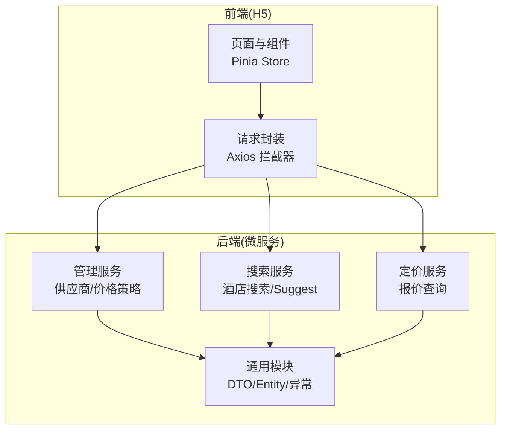
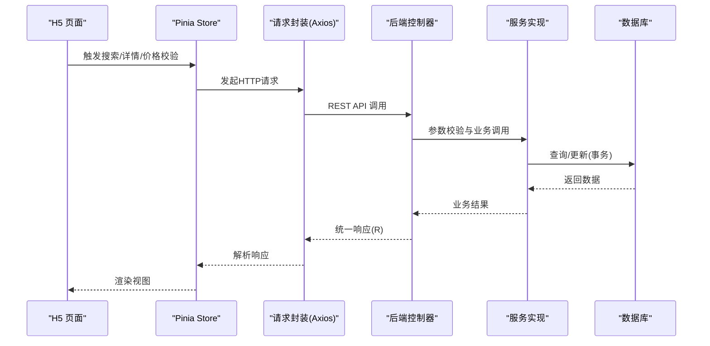
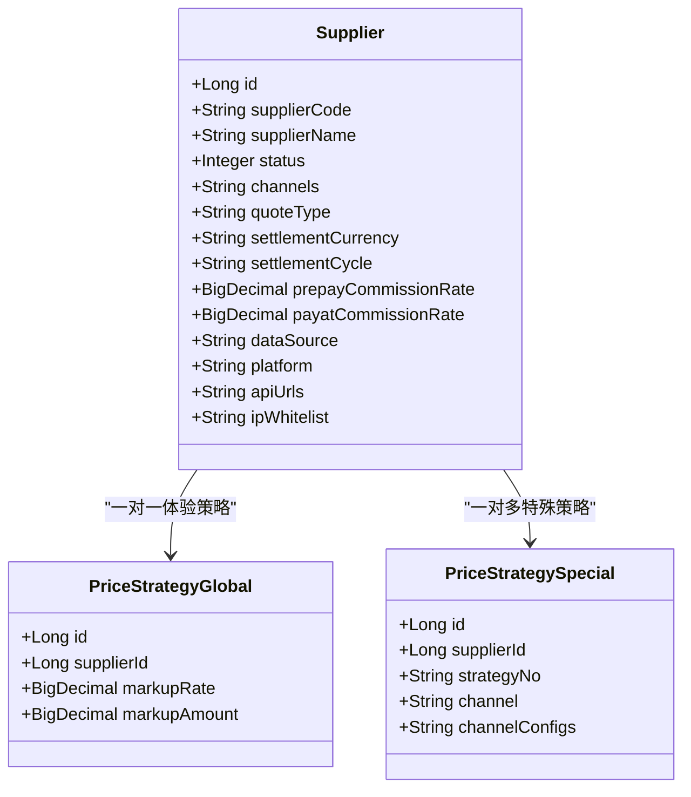
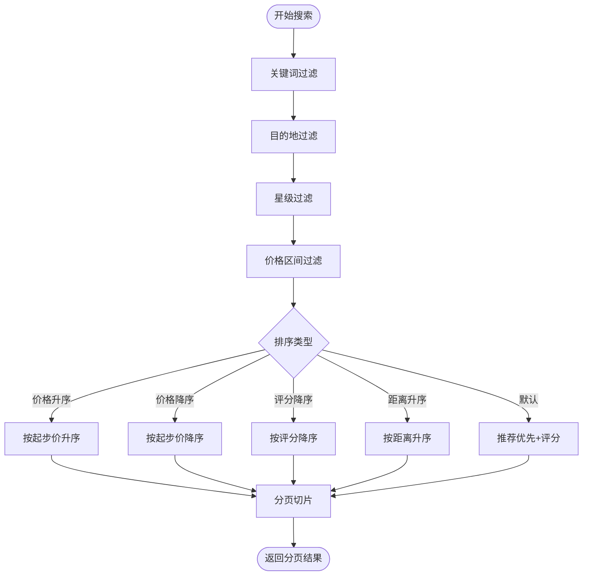
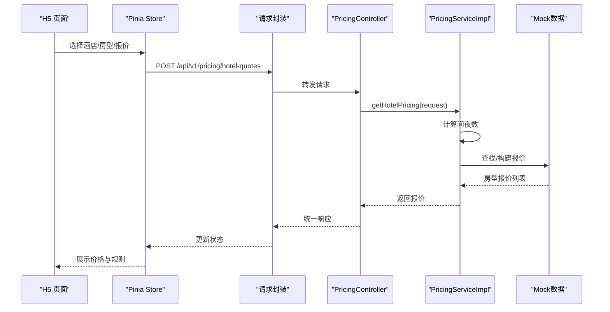
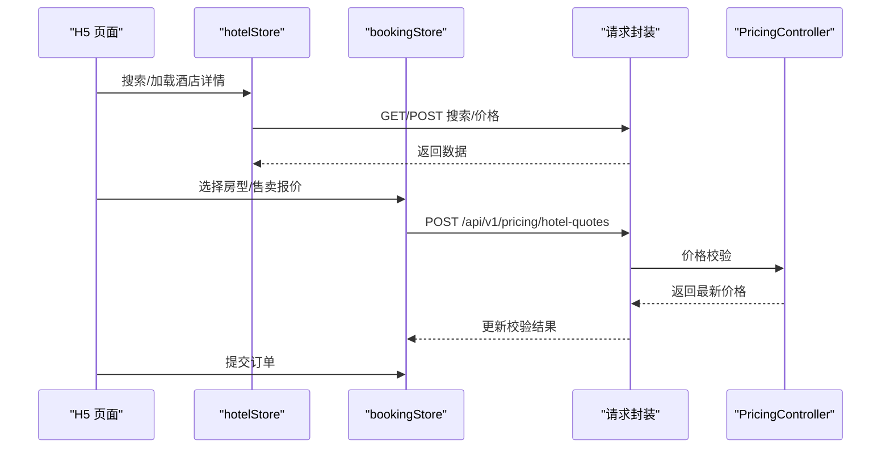
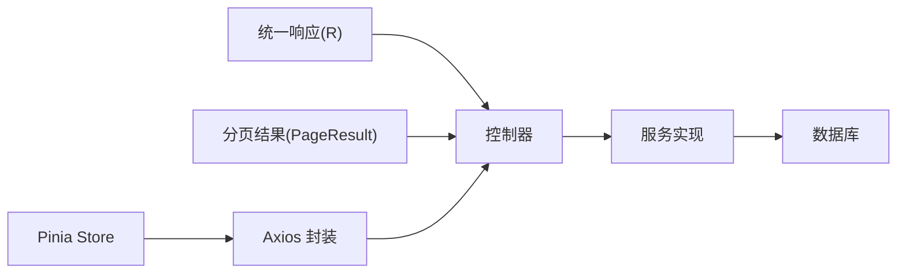

# 核心功能模块

<cite>
**本文引用的文件**
- [hotel-seller-backend\hotel-admin-service\src\main\java\com\ceair\hotel\admin\controller\SupplierController.java](file://hotel-seller-backend\hotel-admin-service\src\main\java\com\ceair\hotel\admin\controller\SupplierController.java)
- [hotel-seller-backend\hotel-admin-service\src\main\java\com\ceair\hotel\admin\service\impl\SupplierServiceImpl.java](file://hotel-seller-backend\hotel-admin-service\src\main\java\com\ceair\hotel\admin\service\impl\SupplierServiceImpl.java)
- [hotel-seller-backend\hotel-admin-service\src\main\java\com\ceair\hotel\admin\controller\PriceStrategyController.java](file://hotel-seller-backend\hotel-admin-service\src\main\java\com\ceair\hotel\admin\controller\PriceStrategyController.java)
- [hotel-seller-backend\hotel-admin-service\src\main\java\com\ceair\hotel\admin\service\impl\PriceStrategyServiceImpl.java](file://hotel-seller-backend\hotel-admin-service\src\main\java\com\ceair\hotel\admin\service\impl\PriceStrategyServiceImpl.java)
- [hotel-seller-backend\hotel-search-service\src\main\java\com\ceair\hotel\search\controller\SearchController.java](file://hotel-seller-backend\hotel-search-service\src\main\java\com\ceair\hotel\search\controller\SearchController.java)
- [hotel-seller-backend\hotel-search-service\src\main\java\com\ceair\hotel\search\service\impl\HotelSearchServiceImpl.java](file://hotel-seller-backend\hotel-search-service\src\main\java\com\ceair\hotel\search\service\impl\HotelSearchServiceImpl.java)
- [hotel-seller-backend\hotel-pricing-service\src\main\java\com\ceair\hotel\pricing\controller\PricingController.java](file://hotel-seller-backend\hotel-pricing-service\src\main\java\com\ceair\hotel\pricing\controller\PricingController.java)
- [hotel-seller-backend\hotel-pricing-service\src\main\java\com\ceair\hotel\pricing\service\impl\PricingServiceImpl.java](file://hotel-seller-backend\hotel-pricing-service\src\main\java\com\ceair\hotel\pricing\service\impl\PricingServiceImpl.java)
- [hotel-seller-backend\hotel-common\src\main\java\com\ceair\hotel\common\entity\Supplier.java](file://hotel-seller-backend\hotel-common\src\main\java\com\ceair\hotel\common\entity\Supplier.java)
- [hotel-seller-backend\hotel-common\src\main\java\com\ceair\hotel\common\entity\PriceStrategyGlobal.java](file://hotel-seller-backend\hotel-common\src\main\java\com\ceair\hotel\common\entity\PriceStrategyGlobal.java)
- [hotel-seller-backend\hotel-common\src\main\java\com\ceair\hotel\common\entity\PriceStrategySpecial.java](file://hotel-seller-backend\hotel-common\src\main\java\com\ceair\hotel\common\entity\PriceStrategySpecial.java)
- [hotel-seller-backend\hotel-common\src\main\java\com\ceair\hotel\common\dto\PageResult.java](file://hotel-seller-backend\hotel-common\src\main\java\com\ceair\hotel\common\dto\PageResult.java)
- [hotel-seller-backend\hotel-common\src\main\java\com\ceair\hotel\common\dto\R.java](file://hotel-seller-backend\hotel-common\src\main\java\com\ceair\hotel\common\dto\R.java)
- [hotel-seller-h5\src\stores\hotelStore.js](file://hotel-seller-h5\src\stores\hotelStore.js)
- [hotel-seller-h5\src\stores\bookingStore.js](file://hotel-seller-h5\src\stores\bookingStore.js)
- [hotel-seller-h5\src\utils\request.js](file://hotel-seller-h5\src\utils\request.js)
</cite>

## 目录
1. [简介](#简介)
2. [项目结构](#项目结构)
3. [核心组件](#核心组件)
4. [架构总览](#架构总览)
5. [详细组件分析](#详细组件分析)
6. [依赖分析](#依赖分析)
7. [性能考虑](#性能考虑)
8. [故障排查指南](#故障排查指南)
9. [结论](#结论)
10. [附录](#附录)

## 简介
本文件面向酒店销售系统的核心功能模块，围绕供应商管理、酒店搜索、价格计算与预订管理四大模块进行深入解析。内容涵盖业务逻辑、数据流、用户交互、模块间协作、API 接口说明、配置参数、扩展与自定义开发建议，以及性能优化策略，帮助开发者快速理解并高效扩展系统。

## 项目结构
系统采用前后端分离与多服务微服务架构：
- 前端：H5 客户端（Pinia 状态管理、Vant UI、Axios 请求封装）
- 后端：Admin 管理服务、搜索服务、定价服务、通用模块（公共 DTO、实体、枚举、异常处理等）

图表来源
- [hotel-seller-backend\hotel-admin-service\src\main\java\com\ceair\hotel\admin\controller\SupplierController.java:18-21](file://hotel-seller-backend\hotel-admin-service\src\main\java\com\ceair\hotel\admin\controller\SupplierController.java#L18-L21)
- [hotel-seller-backend\hotel-search-service\src\main\java\com\ceair\hotel\search\controller\SearchController.java:20-23](file://hotel-seller-backend\hotel-search-service\src\main\java\com\ceair\hotel\search\controller\SearchController.java#L20-L23)
- [hotel-seller-backend\hotel-pricing-service\src\main\java\com\ceair\hotel\pricing\controller\PricingController.java:17-20](file://hotel-seller-backend\hotel-pricing-service\src\main\java\com\ceair\hotel\pricing\controller\PricingController.java#L17-L20)
- [hotel-seller-backend\hotel-common\src\main\java\com\ceair\hotel\common\dto\R.java:9-14](file://hotel-seller-backend\hotel-common\src\main\java\com\ceair\hotel\common\dto\R.java#L9-L14)

章节来源
- [hotel-seller-backend\hotel-admin-service\src\main\java\com\ceair\hotel\admin\controller\SupplierController.java:18-21](file://hotel-seller-backend\hotel-admin-service\src\main\java\com\ceair\hotel\admin\controller\SupplierController.java#L18-L21)
- [hotel-seller-backend\hotel-search-service\src\main\java\com\ceair\hotel\search\controller\SearchController.java:20-23](file://hotel-seller-backend\hotel-search-service\src\main\java\com\ceair\hotel\search\controller\SearchController.java#L20-L23)
- [hotel-seller-backend\hotel-pricing-service\src\main\java\com\ceair\hotel\pricing\controller\PricingController.java:17-20](file://hotel-seller-backend\hotel-pricing-service\src\main\java\com\ceair\hotel\pricing\controller\PricingController.java#L17-L20)
- [hotel-seller-backend\hotel-common\src\main\java\com\ceair\hotel\common\dto\R.java:9-14](file://hotel-seller-backend\hotel-common\src\main\java\com\ceair\hotel\common\dto\R.java#L9-L14)

## 核心组件
- 供应商管理模块：提供供应商的增删改查、上下线、工作时间与联系人维护，并记录操作日志。
- 酒店搜索模块：支持关键词、目的地、星级、价格区间筛选与多种排序规则；返回分页结果。
- 价格计算模块：根据酒店 ID、入住离店日期与渠道，返回房型报价列表，包含可取消、早餐、促销等维度。
- 预订管理模块：前端 Pinia Store 负责选择酒店、房型、报价，价格校验与下单表单管理。

章节来源
- [hotel-seller-backend\hotel-admin-service\src\main\java\com\ceair\hotel\admin\controller\SupplierController.java:26-81](file://hotel-seller-backend\hotel-admin-service\src\main\java\com\ceair\hotel\admin\controller\SupplierController.java#L26-L81)
- [hotel-seller-backend\hotel-search-service\src\main\java\com\ceair\hotel\search\service\impl\HotelSearchServiceImpl.java:27-109](file://hotel-seller-backend\hotel-search-service\src\main\java\com\ceair\hotel\search\service\impl\HotelSearchServiceImpl.java#L27-L109)
- [hotel-seller-backend\hotel-pricing-service\src\main\java\com\ceair\hotel\pricing\service\impl\PricingServiceImpl.java:23-41](file://hotel-seller-backend\hotel-pricing-service\src\main\java\com\ceair\hotel\pricing\service\impl\PricingServiceImpl.java#L23-L41)
- [hotel-seller-h5\src\stores\hotelStore.js:37-72](file://hotel-seller-h5\src\stores\hotelStore.js#L37-L72)
- [hotel-seller-h5\src\stores\bookingStore.js:42-61](file://hotel-seller-h5\src\stores\bookingStore.js#L42-L61)

## 架构总览
系统通过统一响应体与分页模型抽象，控制器负责参数接收与调用服务层，服务层执行业务逻辑并持久化或调用外部数据源。前端通过 Axios 封装统一注入头信息与错误处理，Pinia Store 管理状态与异步数据加载。

图表来源
- [hotel-seller-backend\hotel-common\src\main\java\com\ceair\hotel\common\dto\R.java:9-14](file://hotel-seller-backend\hotel-common\src\main\java\com\ceair\hotel\common\dto\R.java#L9-L14)
- [hotel-seller-backend\hotel-common\src\main\java\com\ceair\hotel\common\dto\PageResult.java:10-24](file://hotel-seller-backend\hotel-common\src\main\java\com\ceair\hotel\common\dto\PageResult.java#L10-L24)
- [hotel-seller-h5\src\utils\request.js:4-8](file://hotel-seller-h5\src\utils\request.js#L4-L8)

## 详细组件分析

### 供应商管理模块
- 控制器职责
  - 分页查询供应商列表（关键词、状态、分页）
  - 查询供应商详情（主信息、工作时间、联系人）
  - 新增/编辑供应商（含工作时间与联系人）
  - 上下线供应商（记录操作日志）
  - 查询供应商工作时间与联系人

- 服务层实现要点
  - 列表查询：支持关键字模糊匹配（名称/编号），按状态过滤，按更新时间倒序
  - 新增供应商：校验编号唯一性，插入主表，批量写入工作时间与联系人，初始化缓存策略，记录操作日志
  - 编辑供应商：先删后插工作时间与联系人，更新主表，记录日志
  - 上下线：更新状态并记录日志

- 实体与字段
  - 供应商主表包含编号、名称、品牌、状态、渠道、业务类型、报价类型、结算币种与周期、预付/现付佣金比例、数据来源与对接平台、API 地址与 IP 白名单等
  - 全局价格策略包含加价比例与金额
  - 特殊价格策略包含策略编号、适用渠道与各渠道加减价配置

图表来源
- [hotel-seller-backend\hotel-common\src\main\java\com\ceair\hotel\common\entity\Supplier.java:13-80](file://hotel-seller-backend\hotel-common\src\main\java\com\ceair\hotel\common\entity\Supplier.java#L13-L80)
- [hotel-seller-backend\hotel-common\src\main\java\com\ceair\hotel\common\entity\PriceStrategyGlobal.java:14-32](file://hotel-seller-backend\hotel-common\src\main\java\com\ceair\hotel\common\entity\PriceStrategyGlobal.java#L14-L32)
- [hotel-seller-backend\hotel-common\src\main\java\com\ceair\hotel\common\entity\PriceStrategySpecial.java:13-37](file://hotel-seller-backend\hotel-common\src\main\java\com\ceair\hotel\common\entity\PriceStrategySpecial.java#L13-L37)

章节来源
- [hotel-seller-backend\hotel-admin-service\src\main\java\com\ceair\hotel\admin\controller\SupplierController.java:26-81](file://hotel-seller-backend\hotel-admin-service\src\main\java\com\ceair\hotel\admin\controller\SupplierController.java#L26-L81)
- [hotel-seller-backend\hotel-admin-service\src\main\java\com\ceair\hotel\admin\service\impl\SupplierServiceImpl.java:31-148](file://hotel-seller-backend\hotel-admin-service\src\main\java\com\ceair\hotel\admin\service\impl\SupplierServiceImpl.java#L31-L148)
- [hotel-seller-backend\hotel-admin-service\src\main\java\com\ceair\hotel\admin\controller\PriceStrategyController.java:25-66](file://hotel-seller-backend\hotel-admin-service\src\main\java\com\ceair\hotel\admin\controller\PriceStrategyController.java#L25-L66)
- [hotel-seller-backend\hotel-admin-service\src\main\java\com\ceair\hotel\admin\service\impl\PriceStrategyServiceImpl.java:30-96](file://hotel-seller-backend\hotel-admin-service\src\main\java\com\ceair\hotel\admin\service\impl\PriceStrategyServiceImpl.java#L30-L96)
- [hotel-seller-backend\hotel-common\src\main\java\com\ceair\hotel\common\entity\Supplier.java:13-80](file://hotel-seller-backend\hotel-common\src\main\java\com\ceair\hotel\common\entity\Supplier.java#L13-L80)
- [hotel-seller-backend\hotel-common\src\main\java\com\ceair\hotel\common\entity\PriceStrategyGlobal.java:14-32](file://hotel-seller-backend\hotel-common\src\main\java\com\ceair\hotel\common\entity\PriceStrategyGlobal.java#L14-L32)
- [hotel-seller-backend\hotel-common\src\main\java\com\ceair\hotel\common\entity\PriceStrategySpecial.java:13-37](file://hotel-seller-backend\hotel-common\src\main\java\com\ceair\hotel\common\entity\PriceStrategySpecial.java#L13-L37)

### 酒店搜索模块
- 控制器职责
  - 搜索酒店列表：接收搜索请求，返回分页结果
  - 搜索建议：关键词与数量限制

- 服务层实现要点
  - 一期使用内存 Mock 数据，后续可接入 ES 与供应商 API
  - 过滤条件：关键词（中英文名称、地址）、目的地、星级集合、价格区间
  - 排序策略：价格升序/降序、评分降序、距离升序、推荐优先+评分
  - 分页：基于页码与页大小切片

图表来源
- [hotel-seller-backend\hotel-search-service\src\main\java\com\ceair\hotel\search\service\impl\HotelSearchServiceImpl.java:27-109](file://hotel-seller-backend\hotel-search-service\src\main\java\com\ceair\hotel\search\service\impl\HotelSearchServiceImpl.java#L27-L109)

章节来源
- [hotel-seller-backend\hotel-search-service\src\main\java\com\ceair\hotel\search\controller\SearchController.java:29-41](file://hotel-seller-backend\hotel-search-service\src\main\java\com\ceair\hotel\search\controller\SearchController.java#L29-L41)
- [hotel-seller-backend\hotel-search-service\src\main\java\com\ceair\hotel\search\service\impl\HotelSearchServiceImpl.java:27-109](file://hotel-seller-backend\hotel-search-service\src\main\java\com\ceair\hotel\search\service\impl\HotelSearchServiceImpl.java#L27-L109)
- [hotel-seller-backend\hotel-common\src\main\java\com\ceair\hotel\common\dto\PageResult.java:10-24](file://hotel-seller-backend\hotel-common\src\main\java\com\ceair\hotel\common\dto\PageResult.java#L10-L24)

### 价格计算模块
- 控制器职责
  - 获取酒店房型报价列表：接收查询请求，返回报价明细

- 服务层实现要点
  - 一期使用 Mock 数据模拟三级降级逻辑
  - 计算间夜数，默认至少 1 夜
  - 不同酒店返回不同房型与售卖报价，包含价格、支付类型、早餐、取消规则、促销标签、最低价标记等

图表来源
- [hotel-seller-backend\hotel-pricing-service\src\main\java\com\ceair\hotel\pricing\controller\PricingController.java:25-29](file://hotel-seller-backend\hotel-pricing-service\src\main\java\com\ceair\hotel\pricing\controller\PricingController.java#L25-L29)
- [hotel-seller-backend\hotel-pricing-service\src\main\java\com\ceair\hotel\pricing\service\impl\PricingServiceImpl.java:23-41](file://hotel-seller-backend\hotel-pricing-service\src\main\java\com\ceair\hotel\pricing\service\impl\PricingServiceImpl.java#L23-L41)

章节来源
- [hotel-seller-backend\hotel-pricing-service\src\main\java\com\ceair\hotel\pricing\controller\PricingController.java:25-29](file://hotel-seller-backend\hotel-pricing-service\src\main\java\com\ceair\hotel\pricing\controller\PricingController.java#L25-L29)
- [hotel-seller-backend\hotel-pricing-service\src\main\java\com\ceair\hotel\pricing\service\impl\PricingServiceImpl.java:23-152](file://hotel-seller-backend\hotel-pricing-service\src\main\java\com\ceair\hotel\pricing\service\impl\PricingServiceImpl.java#L23-L152)

### 预订管理模块
- 酒店列表与详情
  - 列表页：分页加载、排序与筛选，支持加载更多
  - 详情页：加载酒店价格与房型，支持展开/收起房型展示

- 价格校验与下单
  - 选择酒店、房型、售卖报价后，发起价格校验，比较原价与新价，提示是否变动
  - 表单管理：客人信息、联系方式、到店时间、偏好、备注、发票、优惠券、积分等

图表来源
- [hotel-seller-h5\src\stores\hotelStore.js:37-72](file://hotel-seller-h5\src\stores\hotelStore.js#L37-L72)
- [hotel-seller-h5\src\stores\bookingStore.js:42-61](file://hotel-seller-h5\src\stores\bookingStore.js#L42-L61)
- [hotel-seller-backend\hotel-pricing-service\src\main\java\com\ceair\hotel\pricing\controller\PricingController.java:25-29](file://hotel-seller-backend\hotel-pricing-service\src\main\java\com\ceair\hotel\pricing\controller\PricingController.java#L25-L29)

章节来源
- [hotel-seller-h5\src\stores\hotelStore.js:37-88](file://hotel-seller-h5\src\stores\hotelStore.js#L37-L88)
- [hotel-seller-h5\src\stores\bookingStore.js:42-84](file://hotel-seller-h5\src\stores\bookingStore.js#L42-L84)
- [hotel-seller-h5\src\utils\request.js:4-47](file://hotel-seller-h5\src\utils\request.js#L4-L47)

## 依赖分析
- 统一响应与分页
  - 所有控制器返回统一响应体，前端统一处理
  - 分页结果封装为 PageResult，便于前端渲染

- 控制器到服务层
  - 控制器仅负责参数接收与调用服务层
  - 服务层承担业务逻辑与事务控制

- 前端到后端
  - Axios 封装统一注入基础路径、超时、鉴权头、会话标识
  - 前端 Store 负责状态管理与异步数据加载

图表来源
- [hotel-seller-backend\hotel-common\src\main\java\com\ceair\hotel\common\dto\R.java:9-14](file://hotel-seller-backend\hotel-common\src\main\java\com\ceair\hotel\common\dto\R.java#L9-L14)
- [hotel-seller-backend\hotel-common\src\main\java\com\ceair\hotel\common\dto\PageResult.java:10-24](file://hotel-seller-backend\hotel-common\src\main\java\com\ceair\hotel\common\dto\PageResult.java#L10-L24)
- [hotel-seller-h5\src\utils\request.js:4-8](file://hotel-seller-h5\src\utils\request.js#L4-L8)

章节来源
- [hotel-seller-backend\hotel-common\src\main\java\com\ceair\hotel\common\dto\R.java:9-14](file://hotel-seller-backend\hotel-common\src\main\java\com\ceair\hotel\common\dto\R.java#L9-L14)
- [hotel-seller-backend\hotel-common\src\main\java\com\ceair\hotel\common\dto\PageResult.java:10-24](file://hotel-seller-backend\hotel-common\src\main\java\com\ceair\hotel\common\dto\PageResult.java#L10-L24)
- [hotel-seller-h5\src\utils\request.js:4-47](file://hotel-seller-h5\src\utils\request.js#L4-L47)

## 性能考虑
- 搜索模块
  - 当前使用内存 Mock 数据，建议后续接入 ES 并对常用查询建立索引；对关键词与目的地建立组合索引，减少全量扫描
  - 排序与分页在服务层完成，建议在数据库侧增加排序字段索引，避免大结果集排序
  - 可引入本地缓存与分布式缓存，针对热门目的地与高频关键词做缓存

- 定价模块
  - Mock 数据阶段建议按酒店维度缓存报价，减少重复构造
  - 后续接入真实供应商 API 时，建议引入熔断与降级策略，保证核心链路可用

- 供应商与价格策略
  - 批量写入工作时间与联系人采用“先删后插”，建议在事务内合并更新以降低锁竞争
  - 日志记录与策略变更建议异步化，避免阻塞主流程

- 前端
  - 列表分页加载与详情懒加载，避免一次性加载过多数据
  - Axios 设置合理超时与重试策略，提升弱网体验

## 故障排查指南
- 统一响应与错误处理
  - 后端统一返回 R 对象，前端拦截器根据 code 判断并提示错误信息
  - 网络异常与超时分别提示，便于定位问题

- 业务异常
  - 供应商新增时编号唯一性校验，编辑/删除时策略存在性校验
  - 供应商上下线记录操作日志，便于审计

- 建议排查步骤
  - 检查请求头（鉴权、渠道、会话标识）是否正确
  - 查看后端日志与统一异常处理，确认业务异常原因
  - 前端查看响应体与错误提示，结合接口文档核对参数

章节来源
- [hotel-seller-backend\hotel-common\src\main\java\com\ceair\hotel\common\dto\R.java:36-42](file://hotel-seller-backend\hotel-common\src\main\java\com\ceair\hotel\common\dto\R.java#L36-L42)
- [hotel-seller-h5\src\utils\request.js:18-35](file://hotel-seller-h5\src\utils\request.js#L18-L35)
- [hotel-seller-backend\hotel-admin-service\src\main\java\com\ceair\hotel\admin\service\impl\SupplierServiceImpl.java:52-55](file://hotel-seller-backend\hotel-admin-service\src\main\java\com\ceair\hotel\admin\service\impl\SupplierServiceImpl.java#L52-L55)
- [hotel-seller-backend\hotel-admin-service\src\main\java\com\ceair\hotel\admin\service\impl\PriceStrategyServiceImpl.java:77-95](file://hotel-seller-backend\hotel-admin-service\src\main\java\com\ceair\hotel\admin\service\impl\PriceStrategyServiceImpl.java#L77-L95)

## 结论
本系统通过清晰的模块划分与统一的响应与分页模型，实现了从供应商管理、酒店搜索、价格计算到预订管理的完整闭环。当前阶段以 Mock 数据为主，具备良好的扩展性与演进路径。建议尽快接入真实数据源与缓存/搜索引擎，完善监控与降级策略，持续优化用户体验与系统稳定性。

## 附录
- API 接口清单（后端）
  - 供应商管理
    - GET /api/v1/admin/suppliers
    - GET /api/v1/admin/suppliers/{id}
    - POST /api/v1/admin/suppliers
    - PUT /api/v1/admin/suppliers/{id}
    - PUT /api/v1/admin/suppliers/{id}/status
    - GET /api/v1/admin/suppliers/{id}/schedules
    - GET /api/v1/admin/suppliers/{id}/contact
  - 价格策略管理
    - GET /api/v1/admin/suppliers/{supplierId}/global-strategy
    - PUT /api/v1/admin/suppliers/{supplierId}/global-strategy
    - GET /api/v1/admin/suppliers/{supplierId}/price-strategies
    - POST /api/v1/admin/suppliers/{supplierId}/price-strategies
    - PUT /api/v1/admin/price-strategies/{strategyId}
    - DELETE /api/v1/admin/price-strategies/{strategyId}
  - 酒店搜索
    - POST /api/v1/search/hotels
    - GET /api/v1/search/suggest
  - 酒店报价
    - POST /api/v1/pricing/hotel-quotes

- 前端配置与参数
  - Axios 基础路径、超时、鉴权头、会话标识
  - Pinia Store 状态与动作（列表、详情、价格校验、表单）

章节来源
- [hotel-seller-backend\hotel-admin-service\src\main\java\com\ceair\hotel\admin\controller\SupplierController.java:26-81](file://hotel-seller-backend\hotel-admin-service\src\main\java\com\ceair\hotel\admin\controller\SupplierController.java#L26-L81)
- [hotel-seller-backend\hotel-admin-service\src\main\java\com\ceair\hotel\admin\controller\PriceStrategyController.java:25-66](file://hotel-seller-backend\hotel-admin-service\src\main\java\com\ceair\hotel\admin\controller\PriceStrategyController.java#L25-L66)
- [hotel-seller-backend\hotel-search-service\src\main\java\com\ceair\hotel\search\controller\SearchController.java:29-41](file://hotel-seller-backend\hotel-search-service\src\main\java\com\ceair\hotel\search\controller\SearchController.java#L29-L41)
- [hotel-seller-backend\hotel-pricing-service\src\main\java\com\ceair\hotel\pricing\controller\PricingController.java:25-29](file://hotel-seller-backend\hotel-pricing-service\src\main\java\com\ceair\hotel\pricing\controller\PricingController.java#L25-L29)
- [hotel-seller-h5\src\utils\request.js:4-8](file://hotel-seller-h5\src\utils\request.js#L4-L8)
- [hotel-seller-h5\src\stores\hotelStore.js:37-88](file://hotel-seller-h5\src\stores\hotelStore.js#L37-L88)
- [hotel-seller-h5\src\stores\bookingStore.js:42-84](file://hotel-seller-h5\src\stores\bookingStore.js#L42-L84)