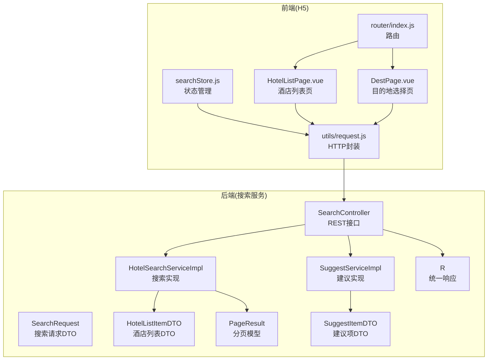
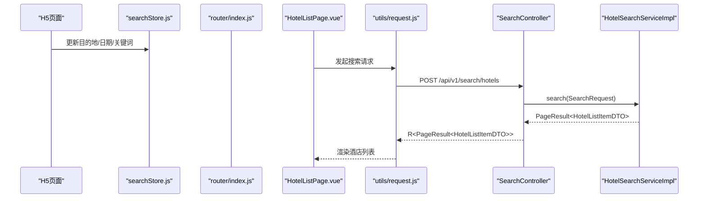
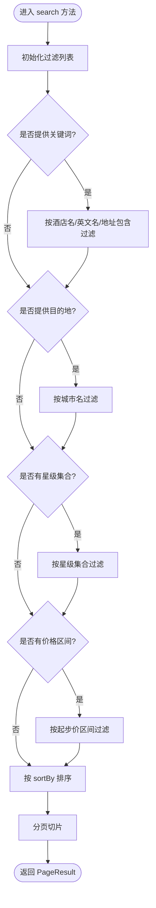
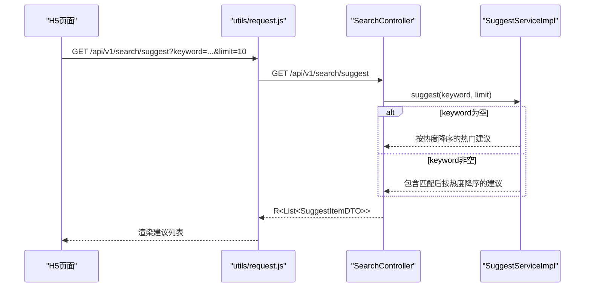
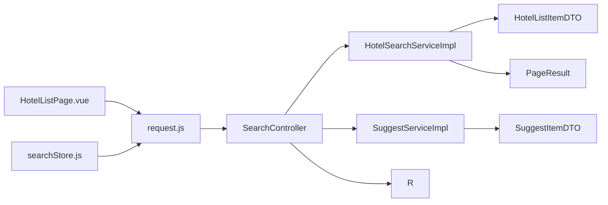

# 酒店搜索模块

<cite>
**本文引用的文件**
- [SearchController.java](file://hotel-seller-backend/hotel-search-service/src/main/java/com/ceair/hotel/search/controller/SearchController.java)
- [HotelSearchServiceImpl.java](file://hotel-seller-backend/hotel-search-service/src/main/java/com/ceair/hotel/search/service/impl/HotelSearchServiceImpl.java)
- [HotelSearchService.java](file://hotel-seller-backend/hotel-search-service/src/main/java/com/ceair/hotel/search/service/HotelSearchService.java)
- [SuggestServiceImpl.java](file://hotel-seller-backend/hotel-search-service/src/main/java/com/ceair/hotel/search/service/impl/SuggestServiceImpl.java)
- [SuggestService.java](file://hotel-seller-backend/hotel-search-service/src/main/java/com/ceair/hotel/search/service/SuggestService.java)
- [SearchRequest.java](file://hotel-seller-backend/hotel-search-service/src/main/java/com/ceair/hotel/search/dto/SearchRequest.java)
- [HotelListItemDTO.java](file://hotel-seller-backend/hotel-search-service/src/main/java/com/ceair/hotel/search/dto/HotelListItemDTO.java)
- [SuggestItemDTO.java](file://hotel-seller-backend/hotel-search-service/src/main/java/com/ceair/hotel/search/dto/SuggestItemDTO.java)
- [PageResult.java](file://hotel-seller-backend/hotel-common/src/main/java/com/ceair/hotel/common/dto/PageResult.java)
- [R.java](file://hotel-seller-backend/hotel-common/src/main/java/com/ceair/hotel/common/dto/R.java)
- [searchStore.js](file://hotel-seller-h5/src/stores/searchStore.js)
- [HotelListPage.vue](file://hotel-seller-h5/src/views/HotelList/HotelListPage.vue)
- [DestPage.vue](file://hotel-seller-h5/src/views/Destination/DestPage.vue)
- [router/index.js](file://hotel-seller-h5/src/router/index.js)
- [request.js](file://hotel-seller-h5/src/utils/request.js)
</cite>

## 目录
1. [简介](#简介)
2. [项目结构](#项目结构)
3. [核心组件](#核心组件)
4. [架构总览](#架构总览)
5. [详细组件分析](#详细组件分析)
6. [依赖分析](#依赖分析)
7. [性能考虑](#性能考虑)
8. [故障排查指南](#故障排查指南)
9. [结论](#结论)
10. [附录](#附录)

## 简介
本文件面向开发者与产品人员，系统性阐述酒店搜索模块的完整实现：从多维度搜索算法（关键词匹配、星级筛选、价格区间、排序规则）、智能推荐与热门搜索词生成，到 SearchController 的 API 设计与 HotelSearchService 的业务逻辑。文档同时提供数据传输对象（DTO）的设计说明、前后端交互流程、以及可扩展的性能优化与算法演进建议。

## 项目结构
酒店搜索模块由后端微服务与前端 H5 页面组成：
- 后端：hotel-search-service 提供搜索与建议接口；hotel-common 提供统一响应与分页模型。
- 前端：H5 使用 Pinia 状态管理与 Vue 组件承载搜索体验，通过 Axios 封装的请求工具访问后端。

图表来源
- [SearchController.java:1-43](file://hotel-seller-backend/hotel-search-service/src/main/java/com/ceair/hotel/search/controller/SearchController.java#L1-43)
- [HotelSearchServiceImpl.java:1-210](file://hotel-seller-backend/hotel-search-service/src/main/java/com/ceair/hotel/search/service/impl/HotelSearchServiceImpl.java#L1-210)
- [SuggestServiceImpl.java:1-82](file://hotel-seller-backend/hotel-search-service/src/main/java/com/ceair/hotel/search/service/impl/SuggestServiceImpl.java#L1-82)
- [SearchRequest.java:1-55](file://hotel-seller-backend/hotel-search-service/src/main/java/com/ceair/hotel/search/dto/SearchRequest.java#L1-55)
- [HotelListItemDTO.java:1-50](file://hotel-seller-backend/hotel-search-service/src/main/java/com/ceair/hotel/search/dto/HotelListItemDTO.java#L1-50)
- [SuggestItemDTO.java:1-29](file://hotel-seller-backend/hotel-search-service/src/main/java/com/ceair/hotel/search/dto/SuggestItemDTO.java#L1-29)
- [PageResult.java:1-26](file://hotel-seller-backend/hotel-common/src/main/java/com/ceair/hotel/common/dto/PageResult.java#L1-26)
- [R.java:1-48](file://hotel-seller-backend/hotel-common/src/main/java/com/ceair/hotel/common/dto/R.java#L1-48)
- [searchStore.js:1-95](file://hotel-seller-h5/src/stores/searchStore.js#L1-95)
- [HotelListPage.vue:1-372](file://hotel-seller-h5/src/views/HotelList/HotelListPage.vue#L1-372)
- [DestPage.vue:1-95](file://hotel-seller-h5/src/views/Destination/DestPage.vue#L1-95)
- [router/index.js:1-65](file://hotel-seller-h5/src/router/index.js#L1-65)
- [request.js:1-47](file://hotel-seller-h5/src/utils/request.js#L1-47)

章节来源
- [SearchController.java:1-43](file://hotel-seller-backend/hotel-search-service/src/main/java/com/ceair/hotel/search/controller/SearchController.java#L1-L43)
- [HotelSearchServiceImpl.java:1-210](file://hotel-seller-backend/hotel-search-service/src/main/java/com/ceair/hotel/search/service/impl/HotelSearchServiceImpl.java#L1-L210)
- [SuggestServiceImpl.java:1-82](file://hotel-seller-backend/hotel-search-service/src/main/java/com/ceair/hotel/search/service/impl/SuggestServiceImpl.java#L1-L82)
- [SearchRequest.java:1-55](file://hotel-seller-backend/hotel-search-service/src/main/java/com/ceair/hotel/search/dto/SearchRequest.java#L1-L55)
- [HotelListItemDTO.java:1-50](file://hotel-seller-backend/hotel-search-service/src/main/java/com/ceair/hotel/search/dto/HotelListItemDTO.java#L1-L50)
- [SuggestItemDTO.java:1-29](file://hotel-seller-backend/hotel-search-service/src/main/java/com/ceair/hotel/search/dto/SuggestItemDTO.java#L1-L29)
- [PageResult.java:1-26](file://hotel-seller-backend/hotel-common/src/main/java/com/ceair/hotel/common/dto/PageResult.java#L1-L26)
- [R.java:1-48](file://hotel-seller-backend/hotel-common/src/main/java/com/ceair/hotel/common/dto/R.java#L1-L48)
- [searchStore.js:1-95](file://hotel-seller-h5/src/stores/searchStore.js#L1-L95)
- [HotelListPage.vue:1-372](file://hotel-seller-h5/src/views/HotelList/HotelListPage.vue#L1-L372)
- [DestPage.vue:1-95](file://hotel-seller-h5/src/views/Destination/DestPage.vue#L1-L95)
- [router/index.js:1-65](file://hotel-seller-h5/src/router/index.js#L1-L65)
- [request.js:1-47](file://hotel-seller-h5/src/utils/request.js#L1-L47)

## 核心组件
- SearchController：提供“酒店列表搜索”和“搜索建议”两个 REST 接口，负责接收请求参数、调用服务层并返回统一封装的响应。
- HotelSearchService 及其实现：完成关键词过滤、目的地过滤、星级与价格区间筛选、多维排序与分页。
- SuggestService 及其实现：基于热度值返回热门搜索词或按关键词模糊匹配建议项。
- 数据传输对象：SearchRequest、HotelListItemDTO、SuggestItemDTO 定义了请求与响应的数据结构。
- 统一响应与分页：R 作为统一响应包装器，PageResult 作为分页载体。

章节来源
- [SearchController.java:29-41](file://hotel-seller-backend/hotel-search-service/src/main/java/com/ceair/hotel/search/controller/SearchController.java#L29-L41)
- [HotelSearchService.java:10-17](file://hotel-seller-backend/hotel-search-service/src/main/java/com/ceair/hotel/search/service/HotelSearchService.java#L10-L17)
- [HotelSearchServiceImpl.java:26-109](file://hotel-seller-backend/hotel-search-service/src/main/java/com/ceair/hotel/search/service/impl/HotelSearchServiceImpl.java#L26-L109)
- [SuggestService.java:10-19](file://hotel-seller-backend/hotel-search-service/src/main/java/com/ceair/hotel/search/service/SuggestService.java#L10-L19)
- [SuggestServiceImpl.java:22-39](file://hotel-seller-backend/hotel-search-service/src/main/java/com/ceair/hotel/search/service/impl/SuggestServiceImpl.java#L22-L39)
- [SearchRequest.java:11-54](file://hotel-seller-backend/hotel-search-service/src/main/java/com/ceair/hotel/search/dto/SearchRequest.java#L11-L54)
- [HotelListItemDTO.java:11-49](file://hotel-seller-backend/hotel-search-service/src/main/java/com/ceair/hotel/search/dto/HotelListItemDTO.java#L11-L49)
- [SuggestItemDTO.java:9-28](file://hotel-seller-backend/hotel-search-service/src/main/java/com/ceair/hotel/search/dto/SuggestItemDTO.java#L9-L28)
- [R.java:10-47](file://hotel-seller-backend/hotel-common/src/main/java/com/ceair/hotel/common/dto/R.java#L10-L47)
- [PageResult.java:10-25](file://hotel-seller-backend/hotel-common/src/main/java/com/ceair/hotel/common/dto/PageResult.java#L10-L25)

## 架构总览
后端采用 Spring MVC 控制器 + 服务层 + DTO 的分层设计；前端通过 Pinia 管理搜索状态，Vue 组件驱动 UI，Axios 封装统一请求与错误提示。

图表来源
- [HotelListPage.vue:130-145](file://hotel-seller-h5/src/views/HotelList/HotelListPage.vue#L130-L145)
- [request.js:10-35](file://hotel-seller-h5/src/utils/request.js#L10-L35)
- [SearchController.java:31-33](file://hotel-seller-backend/hotel-search-service/src/main/java/com/ceair/hotel/search/controller/SearchController.java#L31-L33)
- [HotelSearchServiceImpl.java:27-109](file://hotel-seller-backend/hotel-search-service/src/main/java/com/ceair/hotel/search/service/impl/HotelSearchServiceImpl.java#L27-L109)

## 详细组件分析

### SearchController API 设计
- 接口一：POST /api/v1/search/hotels
  - 请求体：SearchRequest
  - 响应体：R<PageResult<HotelListItemDTO>>
- 接口二：GET /api/v1/search/suggest
  - 查询参数：keyword（可选）、limit（默认10）
  - 响应体：R<List<SuggestItemDTO>>

该设计遵循统一响应与分页规范，便于前端稳定消费。

章节来源
- [SearchController.java:29-41](file://hotel-seller-backend/hotel-search-service/src/main/java/com/ceair/hotel/search/controller/SearchController.java#L29-L41)
- [R.java:24-34](file://hotel-seller-backend/hotel-common/src/main/java/com/ceair/hotel/common/dto/R.java#L24-L34)
- [PageResult.java:17-24](file://hotel-seller-backend/hotel-common/src/main/java/com/ceair/hotel/common/dto/PageResult.java#L17-L24)

### HotelSearchService 业务逻辑
- 输入：SearchRequest（目的地、关键词、入住/离店、房/人/儿童、星级、价格区间、排序、分页）
- 处理流程：
  1) 关键词过滤：支持中文/英文酒店名与地址包含匹配
  2) 目的地过滤：按城市名精确匹配
  3) 星级筛选：多选集合交集
  4) 价格区间：起步价上下限过滤
  5) 排序：支持价格升/降、评分降、距离升、推荐优先+评分降
  6) 分页：计算总条数、切片返回当前页
- 输出：PageResult<HotelListItemDTO>

图表来源
- [HotelSearchServiceImpl.java:27-109](file://hotel-seller-backend/hotel-search-service/src/main/java/com/ceair/hotel/search/service/impl/HotelSearchServiceImpl.java#L27-L109)

章节来源
- [HotelSearchService.java:12-16](file://hotel-seller-backend/hotel-search-service/src/main/java/com/ceair/hotel/search/service/HotelSearchService.java#L12-L16)
- [HotelSearchServiceImpl.java:26-109](file://hotel-seller-backend/hotel-search-service/src/main/java/com/ceair/hotel/search/service/impl/HotelSearchServiceImpl.java#L26-L109)

### 智能推荐与热门搜索词
- 热门搜索词：当 keyword 为空时，按热度值降序返回前 N 条建议
- 关键词建议：当 keyword 存在时，按关键词或副标题包含匹配，再按热度降序返回
- 建议类型：城市、酒店、POI、品牌、行政区等

图表来源
- [SearchController.java:35-41](file://hotel-seller-backend/hotel-search-service/src/main/java/com/ceair/hotel/search/controller/SearchController.java#L35-L41)
- [SuggestServiceImpl.java:22-39](file://hotel-seller-backend/hotel-search-service/src/main/java/com/ceair/hotel/search/service/impl/SuggestServiceImpl.java#L22-L39)

章节来源
- [SuggestService.java:12-18](file://hotel-seller-backend/hotel-search-service/src/main/java/com/ceair/hotel/search/service/SuggestService.java#L12-L18)
- [SuggestServiceImpl.java:22-39](file://hotel-seller-backend/hotel-search-service/src/main/java/com/ceair/hotel/search/service/impl/SuggestServiceImpl.java#L22-L39)

### 数据传输对象设计与使用
- SearchRequest
  - 字段覆盖目的地、日期、人数、关键词、筛选与排序、分页
  - 默认值：房间/成人默认值、排序默认“推荐”，分页默认第1页20条
- HotelListItemDTO
  - 酒店基础信息、评分与评价数、图片、地址、城市/区县、起步价与币种、价格来源标记、促销标签、早餐描述、距离、是否推荐、供应商ID
- SuggestItemDTO
  - 关键词、类型、类型标签、关联ID、副标题、热度值

章节来源
- [SearchRequest.java:11-54](file://hotel-seller-backend/hotel-search-service/src/main/java/com/ceair/hotel/search/dto/SearchRequest.java#L11-L54)
- [HotelListItemDTO.java:11-49](file://hotel-seller-backend/hotel-search-service/src/main/java/com/ceair/hotel/search/dto/HotelListItemDTO.java#L11-L49)
- [SuggestItemDTO.java:9-28](file://hotel-seller-backend/hotel-search-service/src/main/java/com/ceair/hotel/search/dto/SuggestItemDTO.java#L9-L28)

### 前后端交互与页面行为
- 目的地选择：DestPage.vue 支持热门城市与输入框搜索，选择后回填至 Pinia 状态
- 酒店列表页：HotelListPage.vue 读取 Pinia 中的目的地与日期，触发搜索并渲染列表；支持排序切换与筛选入口
- 请求封装：request.js 设置基础路径、超时、鉴权头与会话标识，并统一封装响应与错误提示

章节来源
- [DestPage.vue:32-40](file://hotel-seller-h5/src/views/Destination/DestPage.vue#L32-L40)
- [HotelListPage.vue:130-145](file://hotel-seller-h5/src/views/HotelList/HotelListPage.vue#L130-L145)
- [searchStore.js:54-92](file://hotel-seller-h5/src/stores/searchStore.js#L54-L92)
- [request.js:4-47](file://hotel-seller-h5/src/utils/request.js#L4-L47)

## 依赖分析
- 控制器依赖服务接口，服务实现依赖 DTO 与分页模型
- 前端依赖路由与状态管理，通过 HTTP 工具访问后端
- 统一响应与分页模型在公共模块，避免重复定义

图表来源
- [SearchController.java:26-27](file://hotel-seller-backend/hotel-search-service/src/main/java/com/ceair/hotel/search/controller/SearchController.java#L26-L27)
- [HotelSearchServiceImpl.java:24](file://hotel-seller-backend/hotel-search-service/src/main/java/com/ceair/hotel/search/service/impl/HotelSearchServiceImpl.java#L24)
- [SuggestServiceImpl.java:20](file://hotel-seller-backend/hotel-search-service/src/main/java/com/ceair/hotel/search/service/impl/SuggestServiceImpl.java#L20)
- [HotelListItemDTO.java:11-49](file://hotel-seller-backend/hotel-search-service/src/main/java/com/ceair/hotel/search/dto/HotelListItemDTO.java#L11-L49)
- [SuggestItemDTO.java:9-28](file://hotel-seller-backend/hotel-search-service/src/main/java/com/ceair/hotel/search/dto/SuggestItemDTO.java#L9-L28)
- [PageResult.java:10-25](file://hotel-seller-backend/hotel-common/src/main/java/com/ceair/hotel/common/dto/PageResult.java#L10-L25)
- [R.java:10-47](file://hotel-seller-backend/hotel-common/src/main/java/com/ceair/hotel/common/dto/R.java#L10-L47)
- [HotelListPage.vue:130-145](file://hotel-seller-h5/src/views/HotelList/HotelListPage.vue#L130-L145)
- [request.js:4-47](file://hotel-seller-h5/src/utils/request.js#L4-L47)

## 性能考虑
- 当前实现为内存 Mock 数据，适合演示与单元测试
- 后续演进建议：
  - 索引设计：对关键词（中/英名、地址）、城市、星级、价格区间建立倒排/组合索引
  - 缓存机制：热门搜索词与热门酒店列表缓存，降低数据库与下游供应商 API 压力
  - 查询优化：分页游标或基于时间戳的增量分页，避免深度分页导致的性能问题
  - 排序优化：对评分、价格、距离建立有序索引，减少排序阶段的内存占用
  - 并行化：多来源（自有库存、第三方供应商）并行查询与合并，缩短首屏时间
  - 降级策略：上游不可用时返回缓存或兜底数据，保障可用性

## 故障排查指南
- 统一响应码：R 中 code=200 表示成功，否则视为失败；前端拦截器会弹出错误提示
- 网络异常：request.js 对超时、离线、服务器异常分别给出提示
- 参数校验：后端未做复杂校验，若出现空指针或异常，检查前端传参是否符合 DTO 规范
- 日志定位：服务端实现包含日志打印，可在搜索入口与建议入口查看请求参数与处理耗时

章节来源
- [R.java:24-42](file://hotel-seller-backend/hotel-common/src/main/java/com/ceair/hotel/common/dto/R.java#L24-L42)
- [request.js:18-35](file://hotel-seller-h5/src/utils/request.js#L18-L35)
- [HotelSearchServiceImpl.java:28-30](file://hotel-seller-backend/hotel-search-service/src/main/java/com/ceair/hotel/search/service/impl/HotelSearchServiceImpl.java#L28-L30)
- [SuggestServiceImpl.java:22-29](file://hotel-seller-backend/hotel-search-service/src/main/java/com/ceair/hotel/search/service/impl/SuggestServiceImpl.java#L22-L29)

## 结论
酒店搜索模块以清晰的分层与 DTO 设计实现了多维搜索、智能推荐与建议功能。当前为内存 Mock 实现，便于快速验证；后续可按索引、缓存、并行与降级策略进行性能与稳定性增强，满足真实业务场景下的高并发与低延迟需求。

## 附录

### API 定义概览
- 搜索酒店列表
  - 方法：POST
  - 路径：/api/v1/search/hotels
  - 请求体：SearchRequest
  - 响应体：R<PageResult<HotelListItemDTO>>
- 搜索建议
  - 方法：GET
  - 路径：/api/v1/search/suggest
  - 查询参数：keyword（可选）、limit（默认10）
  - 响应体：R<List<SuggestItemDTO>>

章节来源
- [SearchController.java:29-41](file://hotel-seller-backend/hotel-search-service/src/main/java/com/ceair/hotel/search/controller/SearchController.java#L29-L41)

### 代码示例路径参考
- 搜索请求构造（前端）：[HotelListPage.vue:130-136](file://hotel-seller-h5/src/views/HotelList/HotelListPage.vue#L130-L136)
- 搜索请求 DTO 字段定义：[SearchRequest.java:11-54](file://hotel-seller-backend/hotel-search-service/src/main/java/com/ceair/hotel/search/dto/SearchRequest.java#L11-L54)
- 搜索结果 DTO 字段定义：[HotelListItemDTO.java:11-49](file://hotel-seller-backend/hotel-search-service/src/main/java/com/ceair/hotel/search/dto/HotelListItemDTO.java#L11-L49)
- 建议项 DTO 字段定义：[SuggestItemDTO.java:9-28](file://hotel-seller-backend/hotel-search-service/src/main/java/com/ceair/hotel/search/dto/SuggestItemDTO.java#L9-L28)
- 统一响应与分页模型：[R.java:10-47](file://hotel-seller-backend/hotel-common/src/main/java/com/ceair/hotel/common/dto/R.java#L10-L47), [PageResult.java:10-25](file://hotel-seller-backend/hotel-common/src/main/java/com/ceair/hotel/common/dto/PageResult.java#L10-L25)