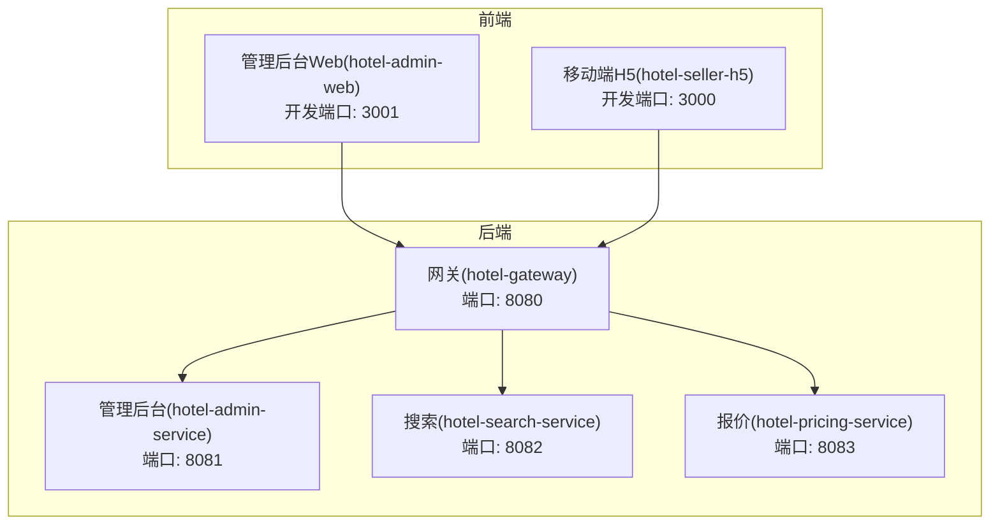
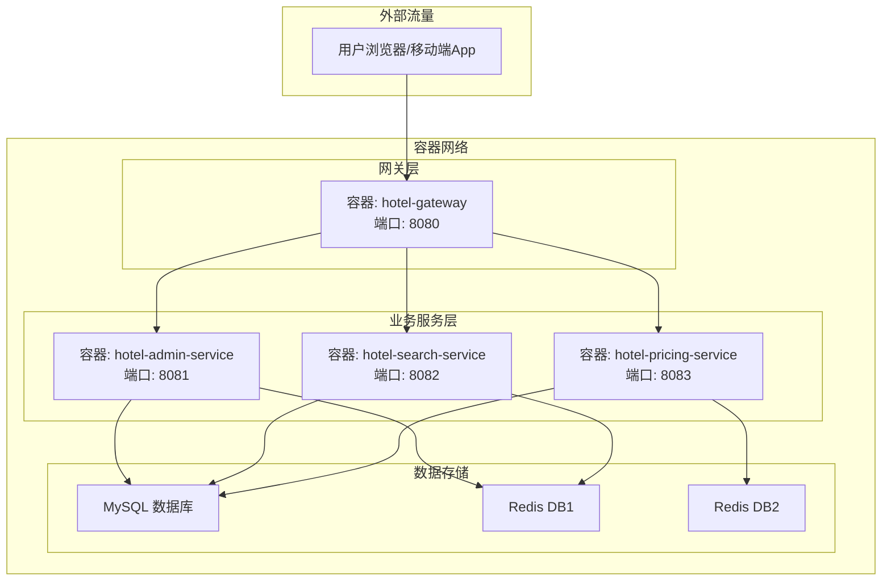
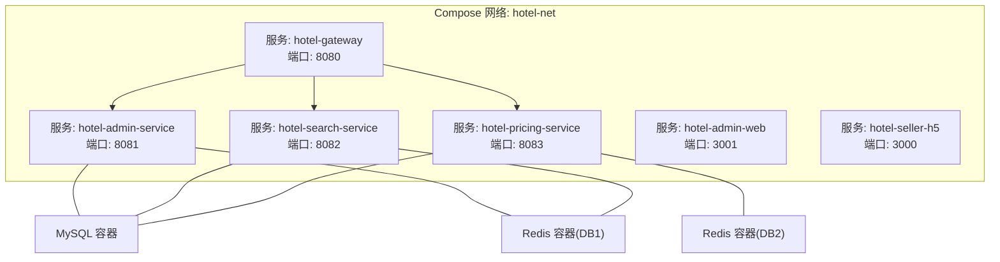
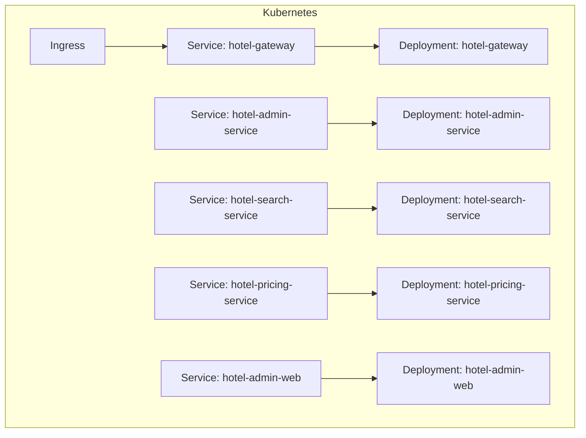
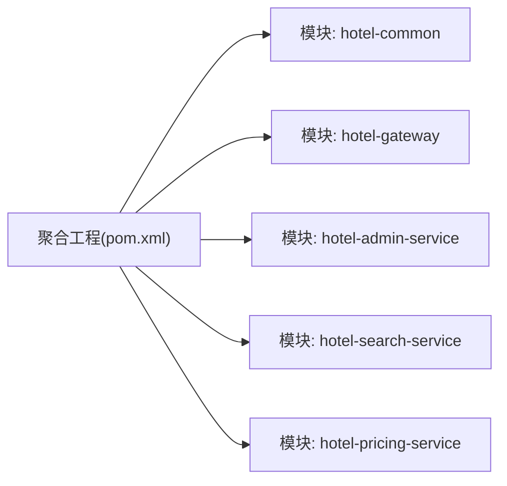

# 容器化部署

<cite>
**本文引用的文件**
- [hotel-seller-backend/pom.xml](file://hotel-seller-backend/pom.xml)
- [hotel-seller-backend/hotel-admin-service/pom.xml](file://hotel-seller-backend/hotel-admin-service/pom.xml)
- [hotel-seller-backend/hotel-gateway/pom.xml](file://hotel-seller-backend/hotel-gateway/pom.xml)
- [hotel-seller-backend/hotel-pricing-service/pom.xml](file://hotel-seller-backend/hotel-pricing-service/pom.xml)
- [hotel-seller-backend/hotel-search-service/pom.xml](file://hotel-seller-backend/hotel-search-service/pom.xml)
- [hotel-seller-backend/hotel-admin-service/src/main/resources/application.yml](file://hotel-seller-backend/hotel-admin-service/src/main/resources/application.yml)
- [hotel-seller-backend/hotel-gateway/src/main/resources/application.yml](file://hotel-seller-backend/hotel-gateway/src/main/resources/application.yml)
- [hotel-seller-backend/hotel-pricing-service/src/main/resources/application.yml](file://hotel-seller-backend/hotel-pricing-service/src/main/resources/application.yml)
- [hotel-seller-backend/hotel-search-service/src/main/resources/application.yml](file://hotel-seller-backend/hotel-search-service/src/main/resources/application.yml)
- [hotel-seller-backend/hotel-admin-service/src/main/java/com/ceair/hotel/admin/AdminApplication.java](file://hotel-seller-backend/hotel-admin-service/src/main/java/com/ceair/hotel/admin/AdminApplication.java)
- [hotel-seller-backend/hotel-gateway/src/main/java/com/ceair/hotel/gateway/GatewayApplication.java](file://hotel-seller-backend/hotel-gateway/src/main/java/com/ceair/hotel/gateway/GatewayApplication.java)
- [hotel-seller-backend/hotel-pricing-service/src/main/java/com/ceair/hotel/pricing/PricingApplication.java](file://hotel-seller-backend/hotel-pricing-service/src/main/java/com/ceair/hotel/pricing/PricingApplication.java)
- [hotel-seller-backend/hotel-search-service/src/main/java/com/ceair/hotel/search/SearchApplication.java](file://hotel-seller-backend/hotel-search-service/src/main/java/com/ceair/hotel/search/SearchApplication.java)
- [hotel-admin-web/package.json](file://hotel-admin-web/package.json)
- [hotel-admin-web/vite.config.js](file://hotel-admin-web/vite.config.js)
- [hotel-seller-h5/package.json](file://hotel-seller-h5/package.json)
- [hotel-seller-h5/vite.config.js](file://hotel-seller-h5/vite.config.js)
</cite>

## 目录
1. [简介](#简介)
2. [项目结构](#项目结构)
3. [核心组件](#核心组件)
4. [架构总览](#架构总览)
5. [详细组件分析](#详细组件分析)
6. [依赖关系分析](#依赖关系分析)
7. [性能考虑](#性能考虑)
8. [故障排查指南](#故障排查指南)
9. [结论](#结论)
10. [附录](#附录)

## 简介
本文件面向酒店销售系统的容器化部署，覆盖后端服务与前端应用的镜像构建、Docker Compose 编排、健康检查与资源限制、以及 Kubernetes 清单示例（Deployment、Service、Ingress）。同时给出容器安全最佳实践与镜像扫描建议，帮助团队在开发、测试与生产环境中稳定、安全地交付系统。

## 项目结构
系统由以下主要部分组成：
- 后端聚合工程：包含网关与多个微服务模块（管理后台、搜索、报价等），统一使用 Maven 管理版本与依赖。
- 前端应用：管理后台 Web（hotel-admin-web）与移动端 H5（hotel-seller-h5），分别通过 Vite 构建。

图表来源
- [hotel-seller-backend/hotel-gateway/src/main/resources/application.yml:1-54](file://hotel-seller-backend/hotel-gateway/src/main/resources/application.yml#L1-L54)
- [hotel-seller-backend/hotel-admin-service/src/main/resources/application.yml:1-44](file://hotel-seller-backend/hotel-admin-service/src/main/resources/application.yml#L1-L44)
- [hotel-seller-backend/hotel-search-service/src/main/resources/application.yml:1-37](file://hotel-seller-backend/hotel-search-service/src/main/resources/application.yml#L1-L37)
- [hotel-seller-backend/hotel-pricing-service/src/main/resources/application.yml:1-37](file://hotel-seller-backend/hotel-pricing-service/src/main/resources/application.yml#L1-L37)
- [hotel-admin-web/vite.config.js:24-32](file://hotel-admin-web/vite.config.js#L24-L32)
- [hotel-seller-h5/vite.config.js:43-46](file://hotel-seller-h5/vite.config.js#L43-L46)

章节来源
- [hotel-seller-backend/pom.xml:21-27](file://hotel-seller-backend/pom.xml#L21-L27)
- [hotel-admin-web/package.json:1-29](file://hotel-admin-web/package.json#L1-L29)
- [hotel-seller-h5/package.json:1-30](file://hotel-seller-h5/package.json#L1-L30)

## 核心组件
- 网关服务：负责跨域、路由与请求转发，将 /api/v1/search、/api/v1/pricing、/api/v1/admin、/api/v1/stats 请求分发到对应后端服务。
- 管理后台服务：提供供应商、价格策略、推荐酒店、统计等管理接口。
- 搜索服务：提供关键词匹配、Suggest、排序与筛选能力。
- 报价服务：提供缓存报价、实时报价、加价处理与规则解析。
- 前端应用：管理后台 Web 与移动端 H5，分别通过 Vite 开发服务器提供本地调试与构建产物。

章节来源
- [hotel-seller-backend/hotel-gateway/src/main/resources/application.yml:17-48](file://hotel-seller-backend/hotel-gateway/src/main/resources/application.yml#L17-L48)
- [hotel-seller-backend/hotel-admin-service/src/main/resources/application.yml:1-44](file://hotel-seller-backend/hotel-admin-service/src/main/resources/application.yml#L1-L44)
- [hotel-seller-backend/hotel-search-service/src/main/resources/application.yml:1-37](file://hotel-seller-backend/hotel-search-service/src/main/resources/application.yml#L1-L37)
- [hotel-seller-backend/hotel-pricing-service/src/main/resources/application.yml:1-37](file://hotel-seller-backend/hotel-pricing-service/src/main/resources/application.yml#L1-L37)
- [hotel-admin-web/vite.config.js:24-32](file://hotel-admin-web/vite.config.js#L24-L32)
- [hotel-seller-h5/vite.config.js:43-46](file://hotel-seller-h5/vite.config.js#L43-L46)

## 架构总览
下图展示容器化后的典型拓扑：前端通过网关访问后端服务；各后端服务连接各自的数据库与 Redis 实例；网关统一暴露对外端口。

图表来源
- [hotel-seller-backend/hotel-gateway/src/main/resources/application.yml:17-48](file://hotel-seller-backend/hotel-gateway/src/main/resources/application.yml#L17-L48)
- [hotel-seller-backend/hotel-admin-service/src/main/resources/application.yml:9-23](file://hotel-seller-backend/hotel-admin-service/src/main/resources/application.yml#L9-L23)
- [hotel-seller-backend/hotel-search-service/src/main/resources/application.yml:7-21](file://hotel-seller-backend/hotel-search-service/src/main/resources/application.yml#L7-L21)
- [hotel-seller-backend/hotel-pricing-service/src/main/resources/application.yml:7-21](file://hotel-seller-backend/hotel-pricing-service/src/main/resources/application.yml#L7-L21)

## 详细组件分析

### 后端服务镜像构建与多阶段优化
- Java 版本与打包工具：后端使用 Java 8 与 Maven，服务均通过 spring-boot-maven-plugin 打包为可执行 JAR。
- 多阶段构建建议：
  - 第一阶段：使用 maven:3.9.6-jdk-8 作为构建镜像，执行 mvn clean package。
  - 第二阶段：使用 eclipse-temurin:8-jre-alpine 作为运行镜像，复制生成的 JAR 到 /app/app.jar，并以非 root 用户运行。
  - 可选：在第一阶段启用 Maven 本地仓库缓存目录，减少重复下载依赖的时间。
- 运行参数：通过 JAVA_OPTS 或 JVM 参数控制堆大小、GC、日志级别等；默认端口见各服务 application.yml。
- 健康检查：建议在容器内暴露 /actuator/health（如启用），并在 Dockerfile 中添加 HEALTHCHECK 指令或在 Compose/K8s 中配置 liveness/readiness 探针。
- 资源限制：在 Compose/K8s 中设置 CPU/内存 requests/limits，避免资源争用。
- 重启策略：开发环境可使用 unless-stopped，生产环境建议 restart: unless-stopped 并结合探针。

章节来源
- [hotel-seller-backend/pom.xml:29-38](file://hotel-seller-backend/pom.xml#L29-L38)
- [hotel-seller-backend/hotel-admin-service/pom.xml:56-71](file://hotel-seller-backend/hotel-admin-service/pom.xml#L56-L71)
- [hotel-seller-backend/hotel-gateway/pom.xml:27-34](file://hotel-seller-backend/hotel-gateway/pom.xml#L27-L34)
- [hotel-seller-backend/hotel-pricing-service/pom.xml:52-59](file://hotel-seller-backend/hotel-pricing-service/pom.xml#L52-L59)
- [hotel-seller-backend/hotel-search-service/pom.xml:52-59](file://hotel-seller-backend/hotel-search-service/pom.xml#L52-L59)

### 前端应用镜像制作
- 管理后台 Web（hotel-admin-web）
  - 构建命令：npm run build，输出至 dist 目录。
  - 运行方式：使用 Nginx 静态文件服务器提供 dist 目录；或使用轻量 HTTP 服务器（如 serve）。
  - Dockerfile 建议：基于 nginx:alpine 或 node:alpine + nginx，复制 dist 目录并配置静态站点。
- 移动端 H5（hotel-seller-h5）
  - 构建命令：npm run build，输出至 dist 目录。
  - 运行方式：同上，使用 Nginx 提供静态文件。
- 开发模式：前端通过 Vite 开发服务器提供热更新与代理，开发端口分别为 3001（管理后台）与 3000（H5）。

章节来源
- [hotel-admin-web/package.json:6-10](file://hotel-admin-web/package.json#L6-L10)
- [hotel-admin-web/vite.config.js:24-32](file://hotel-admin-web/vite.config.js#L24-L32)
- [hotel-seller-h5/package.json:6-10](file://hotel-seller-h5/package.json#L6-L10)
- [hotel-seller-h5/vite.config.js:43-46](file://hotel-seller-h5/vite.config.js#L43-L46)

### Docker Compose 编排配置
- 网络：定义自定义桥接网络 hotel-net，确保服务间可通过服务名互访。
- 服务端口映射：
  - 网关：8080 -> 8080
  - 管理后台：8081 -> 8081
  - 搜索服务：8082 -> 8082
  - 报价服务：8083 -> 8083
  - 前端：3001 -> 3001（管理后台）、3000 -> 3000（H5）
- 数据卷：
  - 前端：挂载 dist 目录用于开发时热更新（可选）。
  - 后端：如需持久化日志，可挂载日志目录。
- 环境变量：
  - 数据库与 Redis 地址、端口、账号密码通过环境变量注入，避免硬编码。
  - 示例键名：MYSQL_HOST/MYSQL_PORT/MYSQL_USER/MYSQL_PASSWORD/MYSQL_DB；REDIS_HOST/REDIS_PORT/REDIS_DB。
- 健康检查：对每个服务配置 HTTP 探针（如 /actuator/health），失败自动重启。
- 资源限制：为每个服务设置 memory/CPUs 上限，避免资源争用。
- 重启策略：unless-stopped。

图表来源
- [hotel-seller-backend/hotel-gateway/src/main/resources/application.yml:17-48](file://hotel-seller-backend/hotel-gateway/src/main/resources/application.yml#L17-L48)
- [hotel-seller-backend/hotel-admin-service/src/main/resources/application.yml:9-23](file://hotel-seller-backend/hotel-admin-service/src/main/resources/application.yml#L9-L23)
- [hotel-seller-backend/hotel-search-service/src/main/resources/application.yml:7-21](file://hotel-seller-backend/hotel-search-service/src/main/resources/application.yml#L7-L21)
- [hotel-seller-backend/hotel-pricing-service/src/main/resources/application.yml:7-21](file://hotel-seller-backend/hotel-pricing-service/src/main/resources/application.yml#L7-L21)

### Kubernetes 部署清单示例
- Deployment
  - 选择器与模板：label 匹配 app.kubernetes.io/name。
  - 容器镜像：使用已构建的后端/前端镜像。
  - 端口：与服务端口一致。
  - 探针：livenessProbe/readinessProbe 指向 /actuator/health（如启用）。
  - 资源：requests/limits。
  - 安全：使用非 root 用户运行（如镜像支持）。
- Service
  - ClusterIP 类型：内部服务发现。
  - 端口映射：targetPort 与容器端口一致。
- Ingress
  - 路由规则：将 /api/v1/* 分发到网关 Service；静态资源由前端 Service 提供。
  - TLS：生产环境启用 HTTPS。
- ConfigMap/Secret
  - 将数据库与 Redis 的连接信息放入 Secret；其他通用配置放入 ConfigMap。

图表来源
- [hotel-seller-backend/hotel-gateway/src/main/resources/application.yml:17-48](file://hotel-seller-backend/hotel-gateway/src/main/resources/application.yml#L17-L48)

## 依赖关系分析
- 后端模块依赖关系：聚合工程统一管理 Spring Cloud、MyBatis-Plus、Druid、Knife4j、PageHelper 等版本。
- 应用启动类：各服务通过 Spring Boot 启动类加载配置与扫描包路径。
- 网关路由：根据路径前缀将请求转发到对应服务实例。

图表来源
- [hotel-seller-backend/pom.xml:21-27](file://hotel-seller-backend/pom.xml#L21-L27)

章节来源
- [hotel-seller-backend/pom.xml:40-93](file://hotel-seller-backend/pom.xml#L40-L93)
- [hotel-seller-backend/hotel-admin-service/src/main/java/com/ceair/hotel/admin/AdminApplication.java:8-10](file://hotel-seller-backend/hotel-admin-service/src/main/java/com/ceair/hotel/admin/AdminApplication.java#L8-L10)
- [hotel-seller-backend/hotel-gateway/src/main/java/com/ceair/hotel/gateway/GatewayApplication.java:6-7](file://hotel-seller-backend/hotel-gateway/src/main/java/com/ceair/hotel/gateway/GatewayApplication.java#L6-L7)
- [hotel-seller-backend/hotel-pricing-service/src/main/java/com/ceair/hotel/pricing/PricingApplication.java:8-10](file://hotel-seller-backend/hotel-pricing-service/src/main/java/com/ceair/hotel/pricing/PricingApplication.java#L8-L10)
- [hotel-seller-backend/hotel-search-service/src/main/java/com/ceair/hotel/search/SearchApplication.java:8-10](file://hotel-seller-backend/hotel-search-service/src/main/java/com/ceair/hotel/search/SearchApplication.java#L8-L10)

## 性能考虑
- JVM 参数：通过 JAVA_OPTS 设置堆大小、GC 参数与日志级别，避免频繁 Full GC。
- 连接池：数据库连接池与 Redis 连接池应合理配置初始大小、最大活跃数与超时时间。
- 缓存策略：利用 Redis 缓存热点数据，降低数据库压力。
- 前端静态资源：开启 gzip/br 压缩与 CDN 加速，减少首屏加载时间。
- 资源隔离：在容器中设置 CPU/内存限制，避免“邻居干扰”。

## 故障排查指南
- 网关路由问题：确认 application.yml 中路由 ID、URI 与路径前缀是否正确。
- 数据库连接：核对 MYSQL_HOST/PORT/USER/PASSWORD/DB 是否与环境变量一致。
- Redis 连接：核对 REDIS_HOST/PORT/DB 是否与服务配置一致。
- 健康检查失败：确认 /actuator/health 可用且返回 200；必要时调整探针阈值。
- 日志定位：查看容器日志与后端服务日志级别，逐步缩小范围。

章节来源
- [hotel-seller-backend/hotel-gateway/src/main/resources/application.yml:17-48](file://hotel-seller-backend/hotel-gateway/src/main/resources/application.yml#L17-L48)
- [hotel-seller-backend/hotel-admin-service/src/main/resources/application.yml:9-23](file://hotel-seller-backend/hotel-admin-service/src/main/resources/application.yml#L9-L23)
- [hotel-seller-backend/hotel-search-service/src/main/resources/application.yml:7-21](file://hotel-seller-backend/hotel-search-service/src/main/resources/application.yml#L7-L21)
- [hotel-seller-backend/hotel-pricing-service/src/main/resources/application.yml:7-21](file://hotel-seller-backend/hotel-pricing-service/src/main/resources/application.yml#L7-L21)

## 结论
通过标准化的镜像构建、合理的 Compose 编排与 K8s 清单，酒店销售系统可在多环境中实现一致、可控、可观测的交付。配合健康检查、资源限制与安全加固，可显著提升系统稳定性与安全性。

## 附录

### 容器安全最佳实践
- 使用最小化基础镜像（如 alpine）并定期更新。
- 非 root 用户运行容器，限制文件系统权限。
- 使用只读根文件系统，按需挂载必要目录。
- 在 Compose/K8s 中启用 PodSecurity Standards（如 baseline/restricted）。
- 使用镜像漏洞扫描工具（如 Trivy、Clair、Grype）进行扫描。
- 通过 Secret 管理敏感信息，避免明文写入镜像或配置。

### 镜像扫描建议
- CI 流水线集成：在构建完成后自动扫描镜像，阻断高危漏洞镜像发布。
- 扫描范围：基础镜像、应用镜像、第三方依赖。
- 告警分级：区分高危/中危/低危，制定修复优先级与时间窗。