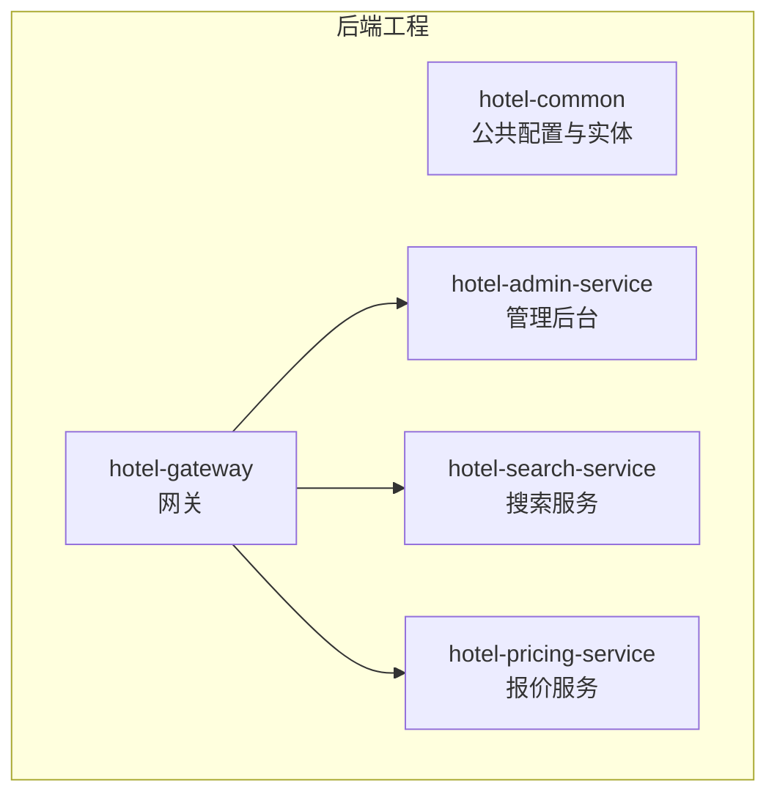
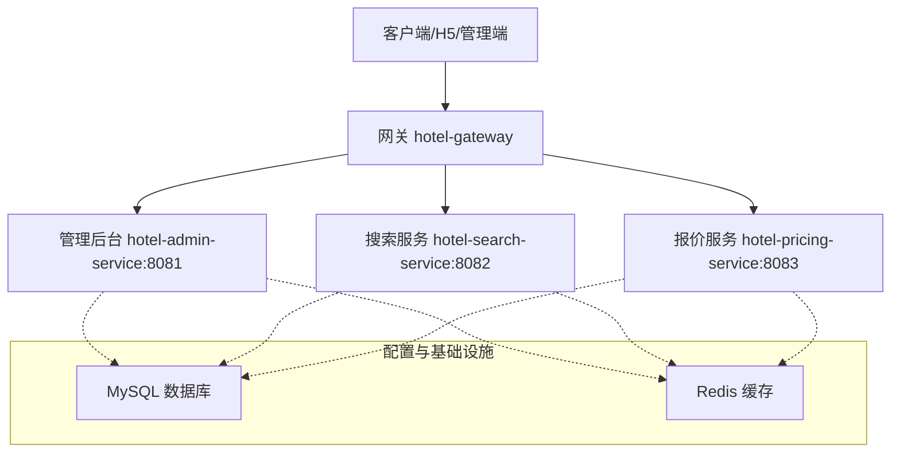
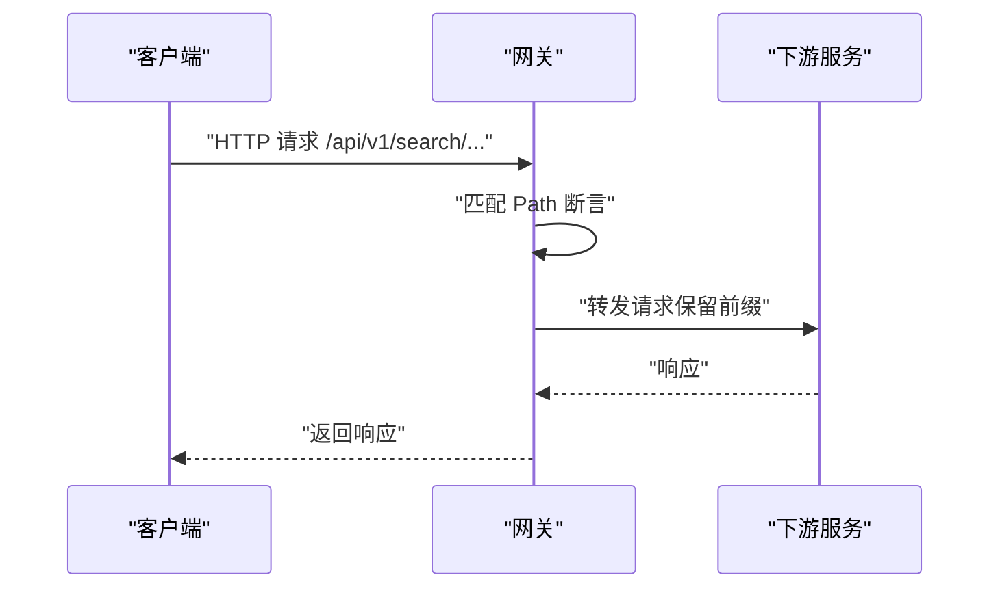
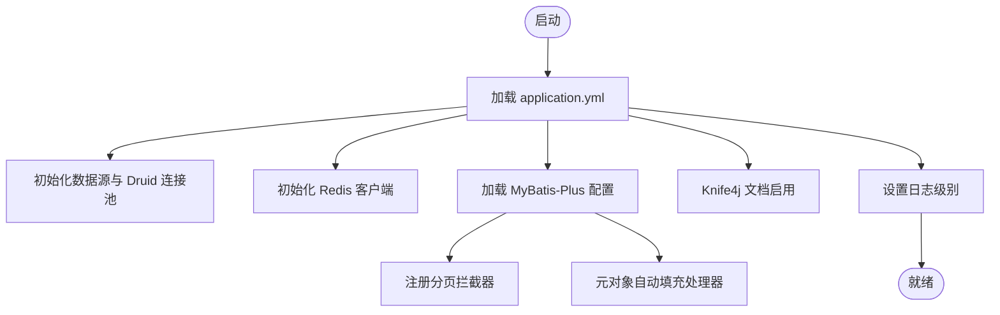
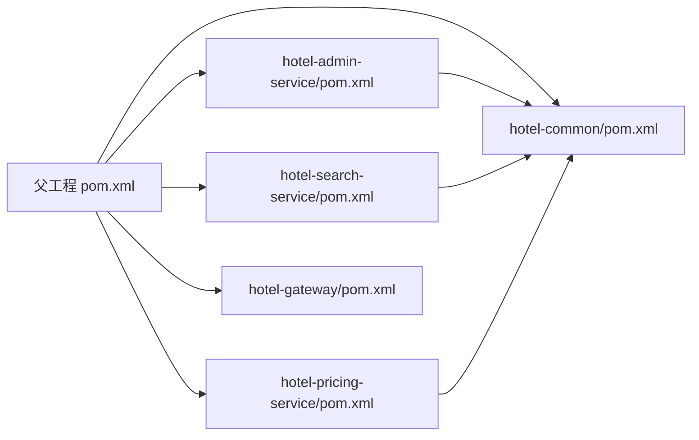

# 环境配置

<cite>
**本文引用的文件**
- [hotel-admin-service/application.yml](file://hotel-seller-backend/hotel-admin-service/src/main/resources/application.yml)
- [hotel-search-service/application.yml](file://hotel-seller-backend/hotel-search-service/src/main/resources/application.yml)
- [hotel-pricing-service/application.yml](file://hotel-seller-backend/hotel-pricing-service/src/main/resources/application.yml)
- [hotel-gateway/application.yml](file://hotel-seller-backend/hotel-gateway/src/main/resources/application.yml)
- [hotel-common/MybatisPlusConfig.java](file://hotel-seller-backend/hotel-common/src/main/java/com/ceair/hotel/common/config/MybatisPlusConfig.java)
- [hotel-admin-service/pom.xml](file://hotel-seller-backend/hotel-admin-service/pom.xml)
- [hotel-search-service/pom.xml](file://hotel-seller-backend/hotel-search-service/pom.xml)
- [hotel-pricing-service/pom.xml](file://hotel-seller-backend/hotel-pricing-service/pom.xml)
- [hotel-seller-backend/pom.xml](file://hotel-seller-backend/pom.xml)
- [hotel-gateway/GatewayApplication.java](file://hotel-seller-backend/hotel-gateway/src/main/java/com/ceair/hotel/gateway/GatewayApplication.java)
</cite>

## 目录
1. [简介](#简介)
2. [项目结构](#项目结构)
3. [核心组件](#核心组件)
4. [架构总览](#架构总览)
5. [详细组件分析](#详细组件分析)
6. [依赖分析](#依赖分析)
7. [性能考虑](#性能考虑)
8. [故障排查指南](#故障排查指南)
9. [结论](#结论)
10. [附录](#附录)

## 简介
本文件面向酒店销售系统的运维与开发团队，提供从开发到生产的环境配置指南。重点覆盖以下方面：
- 开发、测试、生产三类环境的配置差异与落地方式
- 数据库连接、Redis 缓存、日志级别、端口等关键配置项
- 各服务模块的配置文件结构与关键项说明（application.yml）
- 环境变量管理、配置文件加密与敏感信息保护最佳实践
- 配置热更新机制与配置验证方法

## 项目结构
后端采用多模块 Maven 工程组织，包含通用模块与多个微服务模块：
- hotel-common：公共配置与实体定义
- hotel-gateway：网关路由
- hotel-admin-service：管理后台服务
- hotel-search-service：搜索服务
- hotel-pricing-service：报价服务

图表来源
- [hotel-seller-backend/pom.xml:21-27](file://hotel-seller-backend/pom.xml#L21-L27)

章节来源
- [hotel-seller-backend/pom.xml:21-27](file://hotel-seller-backend/pom.xml#L21-L27)

## 核心组件
本节聚焦各服务的关键配置项与实现要点。

- 网关服务（hotel-gateway）
  - 路由规则：将 /api/v1/search/** 转发至搜索服务，/api/v1/pricing/** 转发至报价服务，/api/v1/admin/** 与 /api/v1/stats/** 转发至管理后台服务
  - CORS 全局跨域配置：允许任意来源、头与方法，并支持凭据与缓存预检请求
  - 日志级别：对 Spring Cloud Gateway 与业务包进行差异化控制

- 管理后台服务（hotel-admin-service）
  - 端口：8081
  - 数据源：MySQL，Druid 连接池参数（初始大小、最小空闲、最大活跃）
  - Redis：本地主机，数据库索引 0
  - MyBatis-Plus：映射文件位置、类型别名包、下划线转驼峰、逻辑删除字段与值
  - Knife4j：启用并设置语言为简体中文
  - 日志：业务包日志级别为调试

- 搜索服务（hotel-search-service）
  - 端口：8082
  - 数据源：MySQL，Druid 连接池参数
  - Redis：本地主机，数据库索引 1
  - MyBatis-Plus：映射文件位置、类型别名包、下划线转驼峰
  - Knife4j：启用并设置语言为简体中文
  - 日志：业务包日志级别为调试

- 报价服务（hotel-pricing-service）
  - 端口：8083
  - 数据源：MySQL，Druid 连接池参数
  - Redis：本地主机，数据库索引 2
  - MyBatis-Plus：映射文件位置、类型别名包、下划线转驼峰
  - Knife4j：启用并设置语言为简体中文
  - 日志：业务包日志级别为调试

章节来源
- [hotel-gateway/application.yml:1-54](file://hotel-seller-backend/hotel-gateway/src/main/resources/application.yml#L1-L54)
- [hotel-admin-service/application.yml:1-44](file://hotel-seller-backend/hotel-admin-service/src/main/resources/application.yml#L1-L44)
- [hotel-search-service/application.yml:1-37](file://hotel-seller-backend/hotel-search-service/src/main/resources/application.yml#L1-L37)
- [hotel-pricing-service/application.yml:1-37](file://hotel-seller-backend/hotel-pricing-service/src/main/resources/application.yml#L1-L37)

## 架构总览
下图展示服务间关系与网关路由行为：

图表来源
- [hotel-gateway/application.yml:17-48](file://hotel-seller-backend/hotel-gateway/src/main/resources/application.yml#L17-L48)
- [hotel-admin-service/application.yml:9-22](file://hotel-seller-backend/hotel-admin-service/src/main/resources/application.yml#L9-L22)
- [hotel-search-service/application.yml:7-20](file://hotel-seller-backend/hotel-search-service/src/main/resources/application.yml#L7-L20)
- [hotel-pricing-service/application.yml:7-20](file://hotel-seller-backend/hotel-pricing-service/src/main/resources/application.yml#L7-L20)

## 详细组件分析

### 网关组件（Gateway）
- 路由与过滤器
  - 前缀剥离：StripPrefix=0，保留原始路径前缀
  - 动态转发：根据 Path 断言将请求分发至对应下游服务
- CORS 全局配置
  - 允许任意来源模式、任意方法与头、允许凭据、预检缓存时长
- 日志级别
  - 对网关与业务包分别设置日志级别，便于问题定位

图表来源
- [hotel-gateway/application.yml:17-48](file://hotel-seller-backend/hotel-gateway/src/main/resources/application.yml#L17-L48)

章节来源
- [hotel-gateway/application.yml:1-54](file://hotel-seller-backend/hotel-gateway/src/main/resources/application.yml#L1-L54)
- [hotel-gateway/GatewayApplication.java:1-13](file://hotel-seller-backend/hotel-gateway/src/main/java/com/ceair/hotel/gateway/GatewayApplication.java#L1-L13)

### 管理后台服务（Admin Service）
- 数据源与连接池
  - MySQL 驱动与 URL、用户名、密码、Druid 初始/最小/最大连接数
- Redis
  - 主机、端口、数据库索引
- MyBatis-Plus
  - Mapper XML 位置、实体包、下划线转驼峰、日志实现
  - 逻辑删除字段与值配置
- 文档与日志
  - Knife4j 启用与语言设置
  - 业务包日志级别为调试

图表来源
- [hotel-admin-service/application.yml:9-34](file://hotel-seller-backend/hotel-admin-service/src/main/resources/application.yml#L9-L34)
- [hotel-common/MybatisPlusConfig.java:19-35](file://hotel-seller-backend/hotel-common/src/main/java/com/ceair/hotel/common/config/MybatisPlusConfig.java#L19-L35)

章节来源
- [hotel-admin-service/application.yml:1-44](file://hotel-seller-backend/hotel-admin-service/src/main/resources/application.yml#L1-L44)
- [hotel-common/MybatisPlusConfig.java:1-37](file://hotel-seller-backend/hotel-common/src/main/java/com/ceair/hotel/common/config/MybatisPlusConfig.java#L1-L37)

### 搜索服务（Search Service）
- 数据源与 Redis
  - MySQL 与 Druid 参数；Redis 使用数据库索引 1
- MyBatis-Plus
  - 映射文件与类型别名包；下划线转驼峰
- 文档与日志
  - Knife4j 启用；业务包日志级别为调试

章节来源
- [hotel-search-service/application.yml:1-37](file://hotel-seller-backend/hotel-search-service/src/main/resources/application.yml#L1-L37)

### 报价服务（Pricing Service）
- 数据源与 Redis
  - MySQL 与 Druid 参数；Redis 使用数据库索引 2
- MyBatis-Plus
  - 映射文件与类型别名包；下划线转驼峰
- 文档与日志
  - Knife4j 启用；业务包日志级别为调试

章节来源
- [hotel-pricing-service/application.yml:1-37](file://hotel-seller-backend/hotel-pricing-service/src/main/resources/application.yml#L1-L37)

## 依赖分析
- 版本与依赖管理
  - Spring Boot 2.7.18、Spring Cloud 版本通过属性统一管理
  - MyBatis-Plus、Druid、Knife4j、PageHelper 等版本集中声明
- 模块依赖
  - 各服务模块依赖 hotel-common，复用公共配置与实体
  - 网关模块不直接依赖具体业务模块，通过路由转发

图表来源
- [hotel-seller-backend/pom.xml:21-92](file://hotel-seller-backend/pom.xml#L21-L92)
- [hotel-admin-service/pom.xml:16-54](file://hotel-seller-backend/hotel-admin-service/pom.xml#L16-L54)
- [hotel-search-service/pom.xml:16-50](file://hotel-seller-backend/hotel-search-service/pom.xml#L16-L50)
- [hotel-pricing-service/pom.xml:16-49](file://hotel-seller-backend/hotel-pricing-service/pom.xml#L16-L49)

章节来源
- [hotel-seller-backend/pom.xml:29-92](file://hotel-seller-backend/pom.xml#L29-L92)
- [hotel-admin-service/pom.xml:16-54](file://hotel-seller-backend/hotel-admin-service/pom.xml#L16-L54)
- [hotel-search-service/pom.xml:16-50](file://hotel-seller-backend/hotel-search-service/pom.xml#L16-L50)
- [hotel-pricing-service/pom.xml:16-49](file://hotel-seller-backend/hotel-pricing-service/pom.xml#L16-L49)

## 性能考虑
- 数据库连接池
  - 建议根据并发与 QPS 调整 Druid 的初始大小、最小空闲与最大活跃数
- 分页与日志
  - MyBatis-Plus 分页拦截器已启用，避免全表扫描
  - 开发环境开启调试日志，生产建议调整为 INFO 或 WARN，降低 IO 压力
- 缓存策略
  - 各服务独立使用不同 Redis 数据库索引，便于隔离与监控
- 网关性能
  - 路由与过滤器保持简单，避免在网关层做重计算

## 故障排查指南
- 网关无法转发
  - 检查路由断言与目标 URI 是否正确
  - 确认下游服务端口与可达性
- 数据库连接失败
  - 校验 JDBC URL、用户名、密码与驱动类名
  - 检查 MySQL 服务状态与防火墙
- Redis 连接异常
  - 校验主机、端口与数据库索引
  - 检查 Redis 服务状态与认证
- 文档不可访问
  - 确认 Knife4j 已启用且语言设置正确
- 日志级别过低导致难以定位问题
  - 在开发环境可临时提升日志级别，生产环境按需调整

章节来源
- [hotel-gateway/application.yml:17-48](file://hotel-seller-backend/hotel-gateway/src/main/resources/application.yml#L17-L48)
- [hotel-admin-service/application.yml:9-22](file://hotel-seller-backend/hotel-admin-service/src/main/resources/application.yml#L9-L22)
- [hotel-search-service/application.yml:7-20](file://hotel-seller-backend/hotel-search-service/src/main/resources/application.yml#L7-L20)
- [hotel-pricing-service/application.yml:7-20](file://hotel-seller-backend/hotel-pricing-service/src/main/resources/application.yml#L7-L20)

## 结论
- 本系统通过 application.yml 将服务端口、数据源、Redis、MyBatis-Plus、Knife4j 与日志等关键配置集中化管理
- 网关负责统一入口与路由转发，配合 CORS 全局配置简化跨域
- 建议在生产环境严格区分端口、数据库与 Redis 实例，确保资源隔离与安全
- 通过环境变量与外部化配置实现敏感信息保护与热更新，结合配置校验保障上线质量

## 附录

### 环境配置差异建议
- 开发环境
  - 端口：与默认一致，便于本地联调
  - 数据库：本地 MySQL，开启调试日志
  - Redis：本地实例，按服务划分数据库索引
- 测试环境
  - 端口：与开发一致，但使用测试数据库与缓存实例
  - 数据库与缓存：独立实例，隔离测试数据
  - 日志：INFO 级别为主，必要时临时提升
- 生产环境
  - 端口：固定对外端口，避免冲突
  - 数据库：高可用主从或集群，连接池参数按压测结果优化
  - Redis：哨兵/集群部署，开启持久化与备份
  - 日志：ERROR/WARN，接入集中式日志平台

### 环境变量管理与敏感信息保护
- 使用环境变量覆盖敏感配置项（如数据库密码、Redis 密码），避免将明文写入仓库
- 推荐使用密文存储与解密组件（如 KMS、Vault），在应用启动时解密注入
- 配置文件中仅保留占位符，运行时由容器或平台注入真实值

### 配置热更新机制
- Spring Cloud Config 或 Nacos：集中管理配置，支持动态刷新
- Actuator：暴露 refresh 端点，触发刷新指定配置命名空间
- 注意：部分配置（如端口、数据源连接串）需要重启生效，应优先通过外部化配置与编排工具实现“滚动更新”

### 配置验证方法
- 启动自检：应用启动时校验关键配置（端口、数据库连通性、Redis 可达性）
- 单元测试：针对配置加载与默认值进行断言
- 健康检查：通过 Actuator 或自定义健康端点输出配置状态摘要