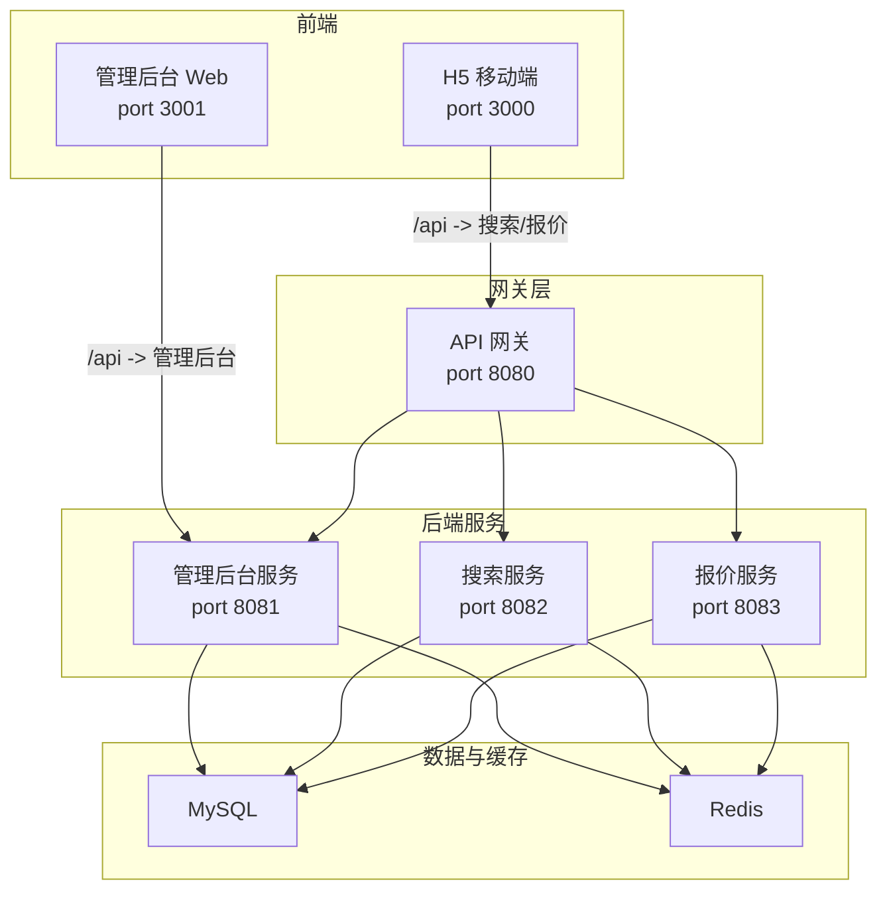
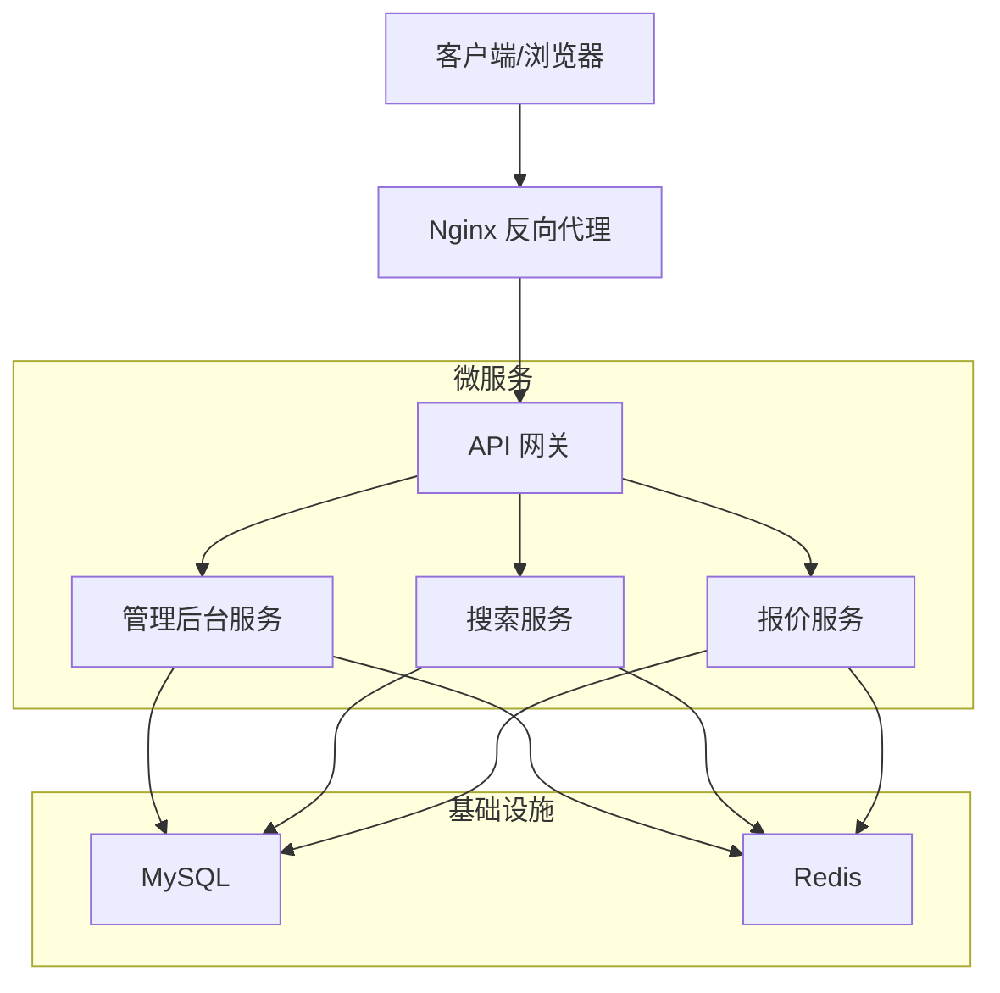
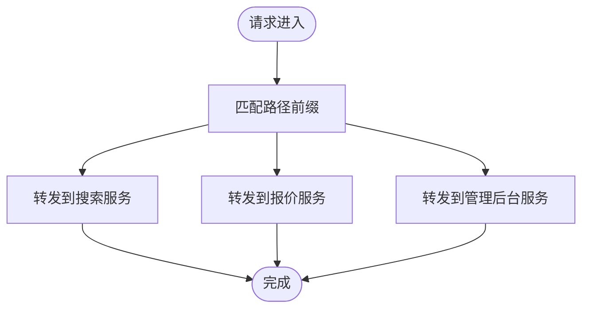
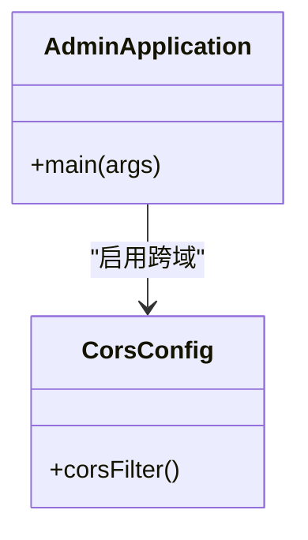
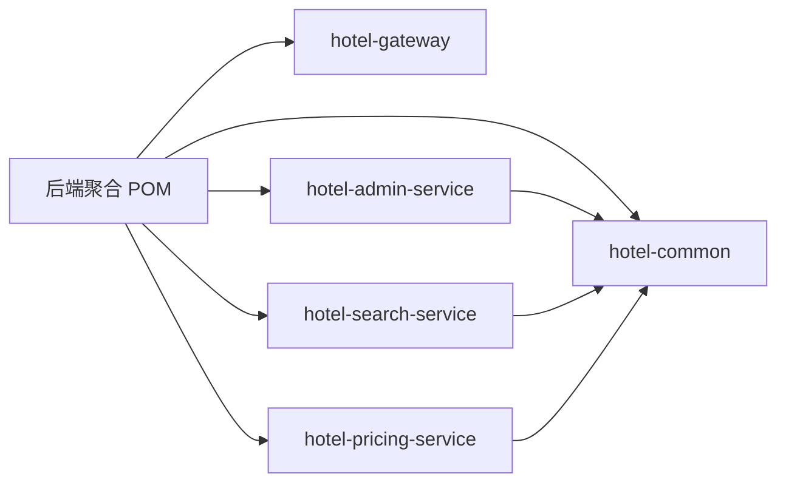

# 部署与运维

<cite>
**本文引用的文件**
- [hotel-seller-backend/pom.xml](file://hotel-seller-backend/pom.xml)
- [hotel-seller-backend/hotel-gateway/pom.xml](file://hotel-seller-backend/hotel-gateway/pom.xml)
- [hotel-seller-backend/hotel-admin-service/pom.xml](file://hotel-seller-backend/hotel-admin-service/pom.xml)
- [hotel-seller-backend/hotel-pricing-service/pom.xml](file://hotel-seller-backend/hotel-pricing-service/pom.xml)
- [hotel-seller-backend/hotel-search-service/pom.xml](file://hotel-seller-backend/hotel-search-service/pom.xml)
- [hotel-seller-backend/hotel-gateway/src/main/resources/application.yml](file://hotel-seller-backend/hotel-gateway/src/main/resources/application.yml)
- [hotel-seller-backend/hotel-admin-service/src/main/resources/application.yml](file://hotel-seller-backend/hotel-admin-service/src/main/resources/application.yml)
- [hotel-seller-backend/hotel-pricing-service/src/main/resources/application.yml](file://hotel-seller-backend/hotel-pricing-service/src/main/resources/application.yml)
- [hotel-seller-backend/hotel-search-service/src/main/resources/application.yml](file://hotel-seller-backend/hotel-search-service/src/main/resources/application.yml)
- [hotel-seller-backend/hotel-gateway/src/main/java/com/ceair/hotel/gateway/GatewayApplication.java](file://hotel-seller-backend/hotel-gateway/src/main/java/com/ceair/hotel/gateway/GatewayApplication.java)
- [hotel-seller-backend/hotel-admin-service/src/main/java/com/ceair/hotel/admin/AdminApplication.java](file://hotel-seller-backend/hotel-admin-service/src/main/java/com/ceair/hotel/admin/AdminApplication.java)
- [hotel-seller-backend/hotel-pricing-service/src/main/java/com/ceair/hotel/pricing/PricingApplication.java](file://hotel-seller-backend/hotel-pricing-service/src/main/java/com/ceair/hotel/pricing/PricingApplication.java)
- [hotel-seller-backend/hotel-search-service/src/main/java/com/ceair/hotel/search/SearchApplication.java](file://hotel-seller-backend/hotel-search-service/src/main/java/com/ceair/hotel/search/SearchApplication.java)
- [hotel-seller-backend/hotel-admin-service/src/main/java/com/ceair/hotel/admin/config/CorsConfig.java](file://hotel-seller-backend/hotel-admin-service/src/main/java/com/ceair/hotel/admin/config/CorsConfig.java)
- [hotel-admin-web/package.json](file://hotel-admin-web/package.json)
- [hotel-admin-web/vite.config.js](file://hotel-admin-web/vite.config.js)
- [hotel-seller-h5/package.json](file://hotel-seller-h5/package.json)
- [hotel-seller-h5/vite.config.js](file://hotel-seller-h5/vite.config.js)
- [mock_data.sql](file://mock_data.sql)
</cite>

## 目录
1. [简介](#简介)
2. [项目结构](#项目结构)
3. [核心组件](#核心组件)
4. [架构总览](#架构总览)
5. [详细组件分析](#详细组件分析)
6. [依赖关系分析](#依赖关系分析)
7. [性能考虑](#性能考虑)
8. [故障排查指南](#故障排查指南)
9. [结论](#结论)
10. [附录](#附录)

## 简介
本文件面向运维团队，提供酒店销售系统的完整部署与运维指南。内容涵盖环境配置（开发、测试、生产）、容器化与反向代理、数据库与缓存、消息队列集成建议、监控告警、日志管理、性能调优、CI/CD流水线、自动化部署与回滚策略，以及故障排查与应急响应预案。

## 项目结构
系统采用前后端分离与微服务架构：
- 网关层：统一入口与路由转发
- 业务服务层：搜索、报价、管理后台等微服务
- 前端：管理后台 Web 与 H5 移动端
- 数据与缓存：MySQL、Redis

图表来源
- [hotel-seller-backend/hotel-gateway/src/main/resources/application.yml:17-48](file://hotel-seller-backend/hotel-gateway/src/main/resources/application.yml#L17-L48)
- [hotel-seller-backend/hotel-admin-service/src/main/resources/application.yml:1-44](file://hotel-seller-backend/hotel-admin-service/src/main/resources/application.yml#L1-L44)
- [hotel-seller-backend/hotel-pricing-service/src/main/resources/application.yml:1-37](file://hotel-seller-backend/hotel-pricing-service/src/main/resources/application.yml#L1-L37)
- [hotel-seller-backend/hotel-search-service/src/main/resources/application.yml:1-37](file://hotel-seller-backend/hotel-search-service/src/main/resources/application.yml#L1-L37)

章节来源
- [hotel-seller-backend/pom.xml:21-27](file://hotel-seller-backend/pom.xml#L21-L27)
- [hotel-admin-web/vite.config.js:24-32](file://hotel-admin-web/vite.config.js#L24-L32)
- [hotel-seller-h5/vite.config.js:43-46](file://hotel-seller-h5/vite.config.js#L43-L46)

## 核心组件
- 网关服务：负责跨域、路由、统一鉴权与限流熔断（基于 Spring Cloud Gateway）
- 管理后台服务：供应商、价格策略、推荐酒店、缓存策略、统计与操作日志管理
- 搜索服务：酒店列表检索、Suggest 关键词与热度
- 报价服务：缓存报价、实时报价、加价处理、规则解析、快照降级
- 前端：管理后台 Web 与 H5 移动端，分别通过 Vite 开发服务器运行

章节来源
- [hotel-seller-backend/hotel-gateway/pom.xml:16-25](file://hotel-seller-backend/hotel-gateway/pom.xml#L16-L25)
- [hotel-seller-backend/hotel-admin-service/pom.xml:16-54](file://hotel-seller-backend/hotel-admin-service/pom.xml#L16-L54)
- [hotel-seller-backend/hotel-search-service/pom.xml:16-50](file://hotel-seller-backend/hotel-search-service/pom.xml#L16-L50)
- [hotel-seller-backend/hotel-pricing-service/pom.xml:16-50](file://hotel-seller-backend/hotel-pricing-service/pom.xml#L16-L50)

## 架构总览
系统以网关为中心，将前端请求按路径路由到对应微服务；各服务独立连接数据库与缓存，并通过 Knife4j 提供 OpenAPI 文档能力。

图表来源
- [hotel-seller-backend/hotel-gateway/src/main/resources/application.yml:17-48](file://hotel-seller-backend/hotel-gateway/src/main/resources/application.yml#L17-L48)
- [hotel-seller-backend/hotel-admin-service/src/main/resources/application.yml:9-22](file://hotel-seller-backend/hotel-admin-service/src/main/resources/application.yml#L9-L22)
- [hotel-seller-backend/hotel-pricing-service/src/main/resources/application.yml:7-20](file://hotel-seller-backend/hotel-pricing-service/src/main/resources/application.yml#L7-L20)
- [hotel-seller-backend/hotel-search-service/src/main/resources/application.yml:7-20](file://hotel-seller-backend/hotel-search-service/src/main/resources/application.yml#L7-L20)

## 详细组件分析

### 网关服务（API Gateway）
- 路由规则：根据路径前缀将请求转发至对应服务
- 跨域配置：允许任意来源、方法与头，支持凭据与最大缓存时间
- 日志级别：对网关与业务包输出不同日志等级

图表来源
- [hotel-seller-backend/hotel-gateway/src/main/resources/application.yml:17-48](file://hotel-seller-backend/hotel-gateway/src/main/resources/application.yml#L17-L48)

章节来源
- [hotel-seller-backend/hotel-gateway/src/main/java/com/ceair/hotel/gateway/GatewayApplication.java:1-13](file://hotel-seller-backend/hotel-gateway/src/main/java/com/ceair/hotel/gateway/GatewayApplication.java#L1-L13)
- [hotel-seller-backend/hotel-gateway/src/main/resources/application.yml:1-54](file://hotel-seller-backend/hotel-gateway/src/main/resources/application.yml#L1-L54)

### 管理后台服务（Admin Service）
- 端口与上下文：监听 8081，根路径
- 数据源：MySQL 连接、Druid 连接池参数
- 缓存：Redis，数据库编号 0
- ORM：MyBatis-Plus，驼峰映射与日志
- 文档：Knife4j 开启，语言设置为中文
- 日志：业务包 debug 级别

图表来源
- [hotel-seller-backend/hotel-admin-service/src/main/java/com/ceair/hotel/admin/AdminApplication.java:8-15](file://hotel-seller-backend/hotel-admin-service/src/main/java/com/ceair/hotel/admin/AdminApplication.java#L8-L15)
- [hotel-seller-backend/hotel-admin-service/src/main/java/com/ceair/hotel/admin/config/CorsConfig.java:15-27](file://hotel-seller-backend/hotel-admin-service/src/main/java/com/ceair/hotel/admin/config/CorsConfig.java#L15-L27)

章节来源
- [hotel-seller-backend/hotel-admin-service/src/main/resources/application.yml:1-44](file://hotel-seller-backend/hotel-admin-service/src/main/resources/application.yml#L1-L44)
- [hotel-seller-backend/hotel-admin-service/pom.xml:16-54](file://hotel-seller-backend/hotel-admin-service/pom.xml#L16-L54)

### 搜索服务（Search Service）
- 端口：8082
- 数据源与缓存：MySQL 与 Redis（数据库编号 1）
- ORM 与文档：MyBatis-Plus、Knife4j

章节来源
- [hotel-seller-backend/hotel-search-service/src/main/resources/application.yml:1-37](file://hotel-seller-backend/hotel-search-service/src/main/resources/application.yml#L1-L37)
- [hotel-seller-backend/hotel-search-service/pom.xml:16-50](file://hotel-seller-backend/hotel-search-service/pom.xml#L16-L50)

### 报价服务（Pricing Service）
- 端口：8083
- 数据源与缓存：MySQL 与 Redis（数据库编号 2）
- ORM 与文档：MyBatis-Plus、Knife4j

章节来源
- [hotel-seller-backend/hotel-pricing-service/src/main/resources/application.yml:1-37](file://hotel-seller-backend/hotel-pricing-service/src/main/resources/application.yml#L1-L37)
- [hotel-seller-backend/hotel-pricing-service/pom.xml:16-50](file://hotel-seller-backend/hotel-pricing-service/pom.xml#L16-L50)

### 前端组件
- 管理后台 Web：Vite 开发服务器端口 3001，代理到管理后台服务 8081
- H5 移动端：Vite 开发服务器端口 3000，支持视口适配与组件自动导入

章节来源
- [hotel-admin-web/vite.config.js:24-32](file://hotel-admin-web/vite.config.js#L24-L32)
- [hotel-seller-h5/vite.config.js:43-46](file://hotel-seller-h5/vite.config.js#L43-L46)
- [hotel-admin-web/package.json:6-10](file://hotel-admin-web/package.json#L6-L10)
- [hotel-seller-h5/package.json:6-10](file://hotel-seller-h5/package.json#L6-L10)

## 依赖关系分析
- Maven 多模块：后端聚合工程包含通用模块与各微服务模块
- 依赖版本：Spring Cloud、MyBatis-Plus、Druid、Knife4j、PageHelper 等集中管理
- 微服务依赖：各服务引入 web、MyBatis-Plus、Druid、Redis、Knife4j 等起步依赖

图表来源
- [hotel-seller-backend/pom.xml:21-27](file://hotel-seller-backend/pom.xml#L21-L27)

章节来源
- [hotel-seller-backend/pom.xml:40-93](file://hotel-seller-backend/pom.xml#L40-L93)
- [hotel-seller-backend/hotel-gateway/pom.xml:16-25](file://hotel-seller-backend/hotel-gateway/pom.xml#L16-L25)
- [hotel-seller-backend/hotel-admin-service/pom.xml:16-54](file://hotel-seller-backend/hotel-admin-service/pom.xml#L16-L54)
- [hotel-seller-backend/hotel-search-service/pom.xml:16-50](file://hotel-seller-backend/hotel-search-service/pom.xml#L16-L50)
- [hotel-seller-backend/hotel-pricing-service/pom.xml:16-50](file://hotel-seller-backend/hotel-pricing-service/pom.xml#L16-L50)

## 性能考虑
- 数据库连接池：合理设置初始大小、最小空闲与最大活跃数，避免连接争用
- 缓存分库：不同服务使用不同 Redis 数据库编号，降低键冲突与命中率竞争
- ORM 日志：生产关闭详细日志或限制到必要级别，减少 IO 压力
- 前端资源：H5 使用视口适配插件，减少移动端渲染开销
- 网关路由：避免过度复杂过滤器链，保持路径匹配高效

章节来源
- [hotel-seller-backend/hotel-admin-service/src/main/resources/application.yml:15-18](file://hotel-seller-backend/hotel-admin-service/src/main/resources/application.yml#L15-L18)
- [hotel-seller-backend/hotel-pricing-service/src/main/resources/application.yml:13-16](file://hotel-seller-backend/hotel-pricing-service/src/main/resources/application.yml#L13-L16)
- [hotel-seller-backend/hotel-search-service/src/main/resources/application.yml:13-16](file://hotel-seller-backend/hotel-search-service/src/main/resources/application.yml#L13-L16)
- [hotel-seller-h5/vite.config.js:29-41](file://hotel-seller-h5/vite.config.js#L29-L41)

## 故障排查指南
- 网关无法转发
  - 检查路由配置是否匹配请求路径
  - 查看网关日志级别与目标服务可达性
- 前端无法访问后端
  - 确认前端代理目标与后端端口一致
  - 检查跨域配置与浏览器控制台错误
- 数据库连接异常
  - 校验连接串、用户名密码与网络连通
  - 观察连接池参数与慢查询
- 缓存读写失败
  - 校验 Redis 地址、端口与认证
  - 检查数据库编号与键空间冲突
- 快照降级与无报价
  - 检查报价快照年龄与 TTL 配置
  - 核对无报价/售完缓存记录

章节来源
- [hotel-seller-backend/hotel-gateway/src/main/resources/application.yml:17-48](file://hotel-seller-backend/hotel-gateway/src/main/resources/application.yml#L17-L48)
- [hotel-admin-web/vite.config.js:26-31](file://hotel-admin-web/vite.config.js#L26-L31)
- [hotel-seller-backend/hotel-admin-service/src/main/resources/application.yml:9-22](file://hotel-seller-backend/hotel-admin-service/src/main/resources/application.yml#L9-L22)
- [hotel-seller-backend/hotel-pricing-service/src/main/resources/application.yml:7-20](file://hotel-seller-backend/hotel-pricing-service/src/main/resources/application.yml#L7-L20)
- [hotel-seller-backend/hotel-search-service/src/main/resources/application.yml:7-20](file://hotel-seller-backend/hotel-search-service/src/main/resources/application.yml#L7-L20)
- [mock_data.sql:272-340](file://mock_data.sql#L272-L340)

## 结论
本指南提供了从环境配置到运维实践的完整路径。建议在生产环境中启用更严格的日志与安全策略，完善监控与告警体系，并建立标准化的 CI/CD 流程与回滚预案，确保系统稳定与快速恢复。

## 附录

### 环境配置指南（开发/测试/生产）
- 开发环境
  - 使用本地 MySQL 与 Redis，服务端口如上所述
  - 前端通过 Vite 代理访问后端
- 测试环境
  - 使用独立数据库与缓存实例，隔离测试数据
  - 配置与生产相近的路由与跨域策略
- 生产环境
  - 使用容器编排与外部数据库/缓存
  - 配置 Nginx 反向代理与负载均衡
  - 启用健康检查、超时与重试策略

章节来源
- [hotel-seller-backend/hotel-gateway/src/main/resources/application.yml:1-54](file://hotel-seller-backend/hotel-gateway/src/main/resources/application.yml#L1-L54)
- [hotel-admin-web/vite.config.js:24-32](file://hotel-admin-web/vite.config.js#L24-L32)
- [hotel-seller-h5/vite.config.js:43-46](file://hotel-seller-h5/vite.config.js#L43-L46)

### Docker 容器化部署方案
- 构建镜像
  - 使用 Maven 打包后端服务，复制产物至镜像
  - 前端使用多阶段构建产出静态资源
- 运行容器
  - 分别启动网关、搜索、报价、管理后台服务容器
  - 挂载配置文件与日志目录
- 网络与存储
  - 使用自定义网络，暴露必要端口
  - 持久化 MySQL 与 Redis 数据卷

[本节为概念性指导，不直接分析具体文件，故无“章节来源”]

### Nginx 反向代理与负载均衡
- 反向代理
  - 将 /api 前缀转发至网关
  - 设置超时、缓冲与压缩
- 负载均衡
  - 对网关与后端服务配置多实例轮询
  - 健康检查与故障剔除

[本节为概念性指导，不直接分析具体文件，故无“章节来源”]

### 数据库与缓存部署
- 数据库
  - 初始化 DDL 与测试数据，校验表结构与索引
  - 配置主从复制与备份策略
- 缓存
  - Redis 集群或哨兵模式，持久化策略与内存淘汰
  - 不同服务使用不同数据库编号

章节来源
- [mock_data.sql:1-520](file://mock_data.sql#L1-L520)
- [hotel-seller-backend/hotel-admin-service/src/main/resources/application.yml:19-22](file://hotel-seller-backend/hotel-admin-service/src/main/resources/application.yml#L19-L22)
- [hotel-seller-backend/hotel-pricing-service/src/main/resources/application.yml:17-20](file://hotel-seller-backend/hotel-pricing-service/src/main/resources/application.yml#L17-L20)
- [hotel-seller-backend/hotel-search-service/src/main/resources/application.yml:17-20](file://hotel-seller-backend/hotel-search-service/src/main/resources/application.yml#L17-L20)

### 消息队列集成（建议）
- 异步解耦：订单、通知、统计等场景
- 幂等与重试：保证消息不丢失与重复消费
- 监控与告警：队列积压与消费延迟

[本节为概念性指导，不直接分析具体文件，故无“章节来源”]

### 监控告警与日志管理
- 监控指标：CPU、内存、QPS、错误率、响应时间、数据库连接数
- 告警阈值：分级告警与通知渠道
- 日志管理：结构化日志、日志切割与归档

[本节为概念性指导，不直接分析具体文件，故无“章节来源”]

### CI/CD 流水线与自动化部署
- 构建：Maven 打包、前端构建、镜像构建
- 测试：单元测试、集成测试、端到端测试
- 部署：蓝绿/金丝雀发布与回滚
- 回滚：版本标记与一键回滚

[本节为概念性指导，不直接分析具体文件，故无“章节来源”]