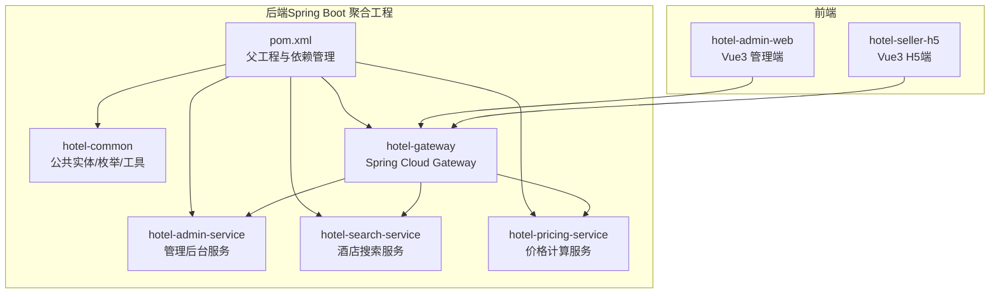
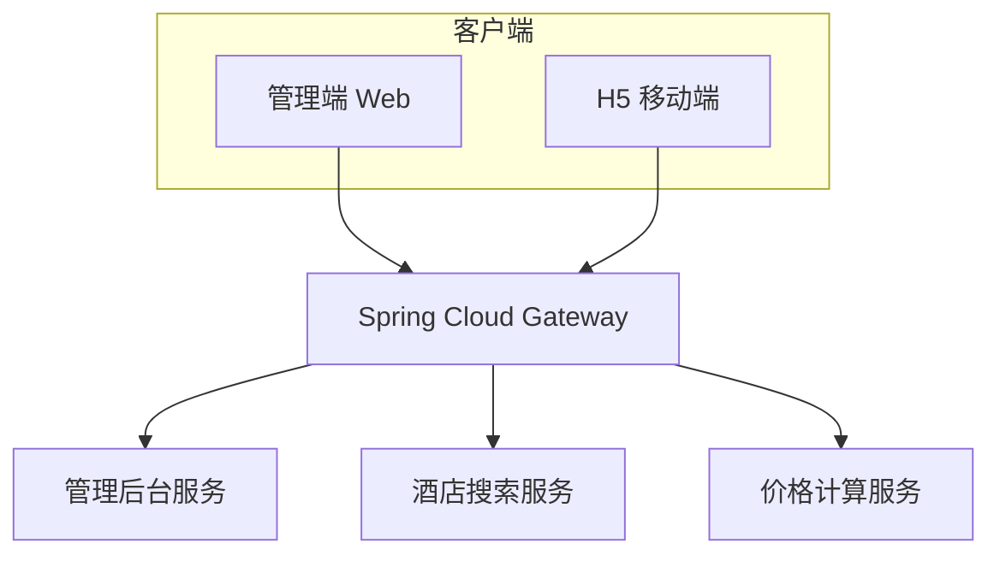
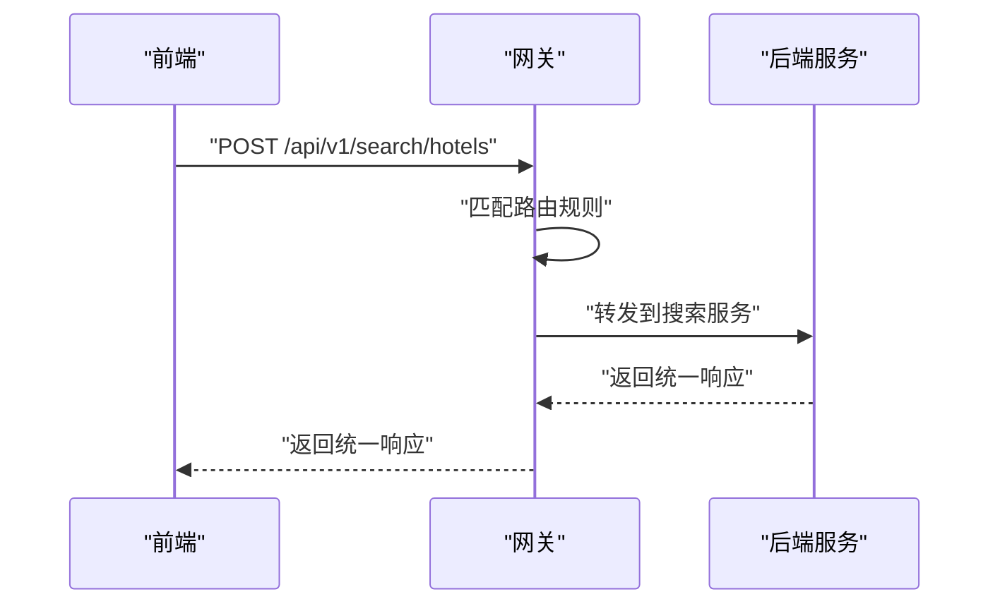
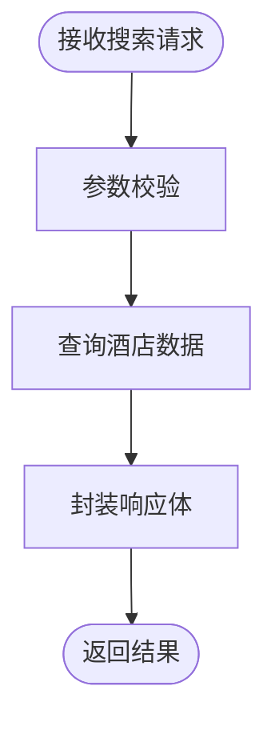
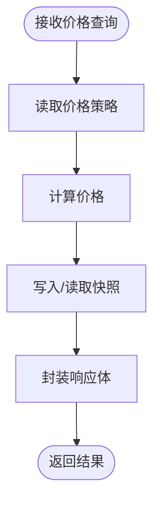
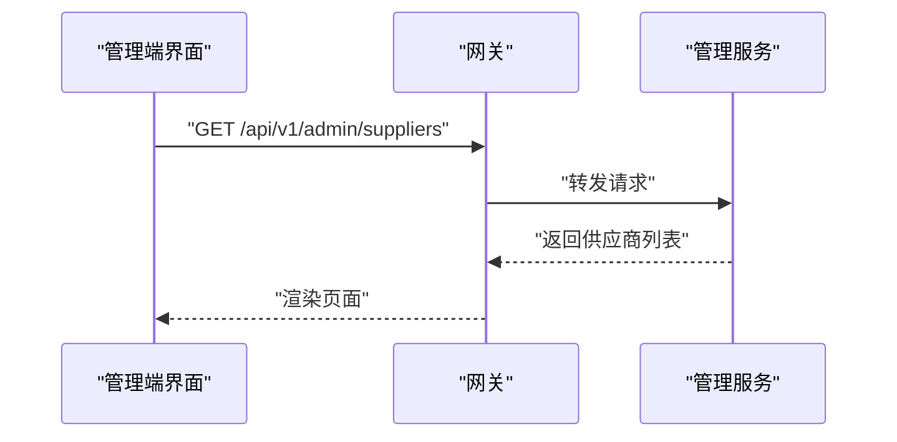
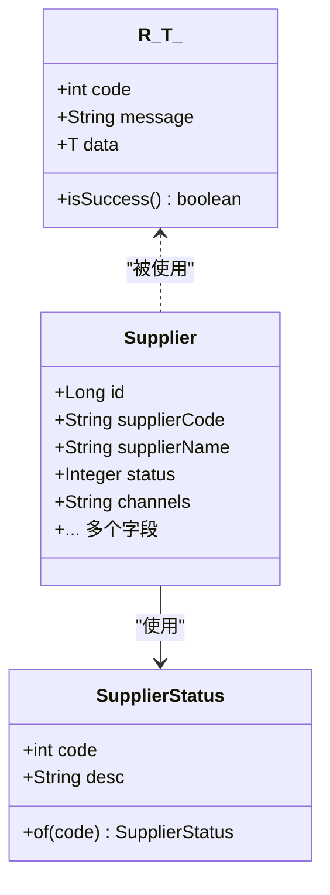
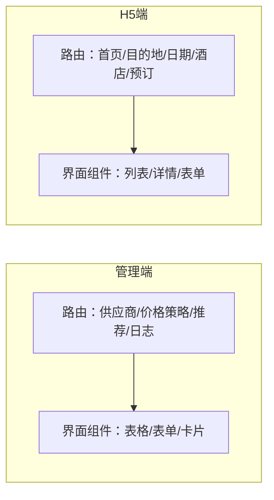
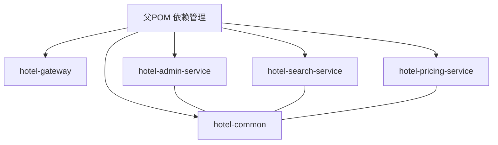

# 项目概述

<cite>
**本文引用的文件**
- [pom.xml](file://hotel-seller-backend/pom.xml)
- [GatewayApplication.java](file://hotel-seller-backend/hotel-gateway/src/main/java/com/ceair/hotel/gateway/GatewayApplication.java)
- [application.yml](file://hotel-seller-backend/hotel-gateway/src/main/resources/application.yml)
- [SearchApplication.java](file://hotel-seller-backend/hotel-search-service/src/main/java/com/ceair/hotel/search/SearchApplication.java)
- [application.yml](file://hotel-seller-backend/hotel-search-service/src/main/resources/application.yml)
- [PricingApplication.java](file://hotel-seller-backend/hotel-pricing-service/src/main/java/com/ceair/hotel/pricing/PricingApplication.java)
- [application.yml](file://hotel-seller-backend/hotel-pricing-service/src/main/resources/application.yml)
- [AdminApplication.java](file://hotel-seller-backend/hotel-admin-service/src/main/java/com/ceair/hotel/admin/AdminApplication.java)
- [application.yml](file://hotel-seller-backend/hotel-admin-service/src/main/resources/application.yml)
- [R.java](file://hotel-seller-backend/hotel-common/src/main/java/com/ceair/hotel/common/dto/R.java)
- [Supplier.java](file://hotel-seller-backend/hotel-common/src/main/java/com/ceair/hotel/common/entity/Supplier.java)
- [SupplierStatus.java](file://hotel-seller-backend/hotel-common/src/main/java/com/ceair/hotel/common/enums/SupplierStatus.java)
- [package.json（酒店管理端）](file://hotel-admin-web/package.json)
- [index.js（管理端路由）](file://hotel-admin-web/src/router/index.js)
- [package.json（H5前端）](file://hotel-seller-h5/package.json)
- [index.js（H5路由）](file://hotel-seller-h5/src/router/index.js)
</cite>

## 目录
1. [引言](#引言)
2. [项目结构](#项目结构)
3. [核心组件](#核心组件)
4. [架构总览](#架构总览)
5. [详细组件分析](#详细组件分析)
6. [依赖分析](#依赖分析)
7. [性能考虑](#性能考虑)
8. [故障排查指南](#故障排查指南)
9. [结论](#结论)
10. [附录](#附录)

## 引言
本项目是一个基于微服务架构的酒店预订与价格管理系统，面向“酒店销售”场景，覆盖供应商管理、酒店搜索、价格计算与预订流程等核心业务模块。系统通过统一网关进行流量接入与路由转发，后端采用多模块微服务拆分，分别承担搜索、报价、管理等职责；前端提供管理端与移动端（H5）两类界面，满足运营与用户侧需求。

系统的设计理念强调：
- 微服务解耦：按业务域划分服务，降低耦合度，提升可维护性与扩展性
- 统一响应与异常处理：通过通用响应体与全局异常处理，保证接口一致性
- 多租户数据隔离：不同服务连接独立数据库与Redis实例，避免资源争用
- 可观测性：集成Knife4j文档与基础日志配置，便于开发调试与联调

## 项目结构
后端采用Maven聚合工程组织，包含公共模块与多个微服务子模块；前端分为管理端与H5端，分别使用Vue3+Vite构建。

图表来源
- [pom.xml:21-27](file://hotel-seller-backend/pom.xml#L21-L27)
- [GatewayApplication.java:1-13](file://hotel-seller-backend/hotel-gateway/src/main/java/com/ceair/hotel/gateway/GatewayApplication.java#L1-L13)
- [SearchApplication.java:1-17](file://hotel-seller-backend/hotel-search-service/src/main/java/com/ceair/hotel/search/SearchApplication.java#L1-L17)
- [PricingApplication.java:1-17](file://hotel-seller-backend/hotel-pricing-service/src/main/java/com/ceair/hotel/pricing/PricingApplication.java#L1-L17)
- [AdminApplication.java:1-16](file://hotel-seller-backend/hotel-admin-service/src/main/java/com/ceair/hotel/admin/AdminApplication.java#L1-L16)

章节来源
- [pom.xml:1-122](file://hotel-seller-backend/pom.xml#L1-L122)

## 核心组件
- 网关层（hotel-gateway）
  - 作用：统一入口、跨域配置、路由转发、请求前缀剥离
  - 关键点：对/search、/pricing、/admin、/stats路径进行路由映射，转发至对应服务端口
- 搜索服务（hotel-search-service）
  - 作用：酒店检索、建议词查询等
  - 关键点：独立数据源与Redis实例，MyBatis-Plus配置，Knife4j启用
- 报价服务（hotel-pricing-service）
  - 作用：价格计算、报价生成、快照管理
  - 关键点：独立数据源与Redis实例，MyBatis-Plus配置，Knife4j启用
- 管理服务（hotel-admin-service）
  - 作用：供应商管理、价格策略、推荐酒店、操作日志、统计
  - 关键点：独立数据源与Redis实例，MyBatis-Plus配置，Knife4j启用
- 公共模块（hotel-common）
  - 作用：统一响应体、通用实体、枚举、异常处理
  - 关键点：R<T>统一响应体，Supplier实体与SupplierStatus枚举
- 前端（hotel-admin-web 与 hotel-seller-h5）
  - 作用：管理端与移动端界面，路由驱动页面跳转
  - 关键点：Vue3 + Pinia + Vue Router，Element Plus 与 Vant UI

章节来源
- [application.yml:17-48](file://hotel-seller-backend/hotel-gateway/src/main/resources/application.yml#L17-L48)
- [application.yml:1-37](file://hotel-seller-backend/hotel-search-service/src/main/resources/application.yml#L1-L37)
- [application.yml:1-37](file://hotel-seller-backend/hotel-pricing-service/src/main/resources/application.yml#L1-L37)
- [application.yml:1-44](file://hotel-seller-backend/hotel-admin-service/src/main/resources/application.yml#L1-L44)
- [R.java:1-48](file://hotel-seller-backend/hotel-common/src/main/java/com/ceair/hotel/common/dto/R.java#L1-L48)
- [Supplier.java:1-81](file://hotel-seller-backend/hotel-common/src/main/java/com/ceair/hotel/common/entity/Supplier.java#L1-L81)
- [SupplierStatus.java:1-25](file://hotel-seller-backend/hotel-common/src/main/java/com/ceair/hotel/common/enums/SupplierStatus.java#L1-L25)
- [package.json（酒店管理端）:1-29](file://hotel-admin-web/package.json#L1-L29)
- [index.js（管理端路由）:1-67](file://hotel-admin-web/src/router/index.js#L1-L67)
- [package.json（H5前端）:1-30](file://hotel-seller-h5/package.json#L1-L30)
- [index.js（H5路由）:1-65](file://hotel-seller-h5/src/router/index.js#L1-L65)

## 架构总览
系统采用“网关 + 多微服务 + 前端”的分层架构。前端通过网关访问后端服务，服务间通过HTTP协议通信；每个服务拥有独立的数据源与缓存，确保高内聚低耦合。

图表来源
- [application.yml:17-48](file://hotel-seller-backend/hotel-gateway/src/main/resources/application.yml#L17-L48)
- [SearchApplication.java:1-17](file://hotel-seller-backend/hotel-search-service/src/main/java/com/ceair/hotel/search/SearchApplication.java#L1-L17)
- [PricingApplication.java:1-17](file://hotel-seller-backend/hotel-pricing-service/src/main/java/com/ceair/hotel/pricing/PricingApplication.java#L1-L17)
- [AdminApplication.java:1-16](file://hotel-seller-backend/hotel-admin-service/src/main/java/com/ceair/hotel/admin/AdminApplication.java#L1-L16)

## 详细组件分析

### 网关组件（hotel-gateway）
- 设计要点
  - 全局CORS配置，允许凭证与自定义头
  - 路由规则：/api/v1/search/** → 搜索服务；/api/v1/pricing/** → 报价服务；/api/v1/admin/** 与 /api/v1/stats/** → 管理服务
  - StripPrefix 过滤器用于保留原始路径
- 使用场景
  - 前端无需关心后端具体端口与服务发现，统一经网关访问
  - 支持后续接入鉴权、限流、熔断等网关增强能力

图表来源
- [application.yml:17-48](file://hotel-seller-backend/hotel-gateway/src/main/resources/application.yml#L17-L48)

章节来源
- [GatewayApplication.java:1-13](file://hotel-seller-backend/hotel-gateway/src/main/java/com/ceair/hotel/gateway/GatewayApplication.java#L1-L13)
- [application.yml:1-54](file://hotel-seller-backend/hotel-gateway/src/main/resources/application.yml#L1-L54)

### 搜索服务（hotel-search-service）
- 设计要点
  - 独立MySQL与Redis实例，避免与其他服务资源竞争
  - MyBatis-Plus配置：驼峰映射、Mapper扫描、逻辑删除字段
  - Knife4j启用，支持在线接口文档
- 典型流程
  - 接收搜索请求，执行检索与建议词生成，返回标准化结果

图表来源
- [application.yml:1-37](file://hotel-seller-backend/hotel-search-service/src/main/resources/application.yml#L1-L37)

章节来源
- [SearchApplication.java:1-17](file://hotel-seller-backend/hotel-search-service/src/main/java/com/ceair/hotel/search/SearchApplication.java#L1-L17)
- [application.yml:1-37](file://hotel-seller-backend/hotel-search-service/src/main/resources/application.yml#L1-L37)

### 报价服务（hotel-pricing-service）
- 设计要点
  - 独立MySQL与Redis实例
  - MyBatis-Plus配置与Knife4j启用
- 典型流程
  - 接收价格查询请求，结合策略与快照生成报价，返回标准化结果

图表来源
- [application.yml:1-37](file://hotel-seller-backend/hotel-pricing-service/src/main/resources/application.yml#L1-L37)

章节来源
- [PricingApplication.java:1-17](file://hotel-seller-backend/hotel-pricing-service/src/main/java/com/ceair/hotel/pricing/PricingApplication.java#L1-L17)
- [application.yml:1-37](file://hotel-seller-backend/hotel-pricing-service/src/main/resources/application.yml#L1-L37)

### 管理服务（hotel-admin-service）
- 设计要点
  - 提供供应商管理、价格策略、推荐酒店、操作日志、统计等能力
  - 独立MySQL与Redis实例，MyBatis-Plus配置与Knife4j启用
- 典型流程
  - 供应商增删改查、策略配置、推荐酒店维护、日志查询与统计

图表来源
- [application.yml:1-44](file://hotel-seller-backend/hotel-admin-service/src/main/resources/application.yml#L1-L44)

章节来源
- [AdminApplication.java:1-16](file://hotel-seller-backend/hotel-admin-service/src/main/java/com/ceair/hotel/admin/AdminApplication.java#L1-L16)
- [application.yml:1-44](file://hotel-seller-backend/hotel-admin-service/src/main/resources/application.yml#L1-L44)

### 公共模块（hotel-common）
- 统一响应体 R<T>
  - 成功/失败封装，简化前后端交互
- 实体与枚举
  - 供应商实体与状态枚举，支撑管理与业务逻辑
- 全局异常处理
  - 通过统一异常处理器，保障错误信息格式一致

图表来源
- [R.java:1-48](file://hotel-seller-backend/hotel-common/src/main/java/com/ceair/hotel/common/dto/R.java#L1-L48)
- [Supplier.java:1-81](file://hotel-seller-backend/hotel-common/src/main/java/com/ceair/hotel/common/entity/Supplier.java#L1-L81)
- [SupplierStatus.java:1-25](file://hotel-seller-backend/hotel-common/src/main/java/com/ceair/hotel/common/enums/SupplierStatus.java#L1-L25)

章节来源
- [R.java:1-48](file://hotel-seller-backend/hotel-common/src/main/java/com/ceair/hotel/common/dto/R.java#L1-L48)
- [Supplier.java:1-81](file://hotel-seller-backend/hotel-common/src/main/java/com/ceair/hotel/common/entity/Supplier.java#L1-L81)
- [SupplierStatus.java:1-25](file://hotel-seller-backend/hotel-common/src/main/java/com/ceair/hotel/common/enums/SupplierStatus.java#L1-L25)

### 前端组件（管理端与H5）
- 管理端（hotel-admin-web）
  - 技术栈：Vue3 + Element Plus + Axios + Pinia + Vue Router
  - 路由覆盖控制台、供应商管理、价格策略、推荐酒店、操作日志等页面
- H5端（hotel-seller-h5）
  - 技术栈：Vue3 + Vant + Axios + Pinia + Vue Router
  - 路由覆盖首页、目的地选择、日期选择、酒店列表、酒店详情、预订页等

图表来源
- [index.js（管理端路由）:1-67](file://hotel-admin-web/src/router/index.js#L1-L67)
- [index.js（H5路由）:1-65](file://hotel-seller-h5/src/router/index.js#L1-L65)

章节来源
- [package.json（酒店管理端）:1-29](file://hotel-admin-web/package.json#L1-L29)
- [index.js（管理端路由）:1-67](file://hotel-admin-web/src/router/index.js#L1-L67)
- [package.json（H5前端）:1-30](file://hotel-seller-h5/package.json#L1-L30)
- [index.js（H5路由）:1-65](file://hotel-seller-h5/src/router/index.js#L1-L65)

## 依赖分析
- 依赖管理
  - 父POM集中管理Spring Cloud版本、MyBatis-Plus、Druid、Hutool、Knife4j、PageHelper等
  - 内部模块hotel-common以依赖形式注入，供其他服务复用
- 服务间耦合
  - 通过网关进行松耦合接入，服务内部通过HTTP交互，避免直接依赖
- 外部依赖
  - MySQL（多实例）、Redis（多实例）、Knife4j（接口文档）

图表来源
- [pom.xml:40-93](file://hotel-seller-backend/pom.xml#L40-L93)

章节来源
- [pom.xml:29-93](file://hotel-seller-backend/pom.xml#L29-L93)

## 性能考虑
- 数据库与缓存分离
  - 每个服务连接独立数据库与Redis实例，降低锁竞争与资源争用
- ORM与分页
  - MyBatis-Plus与PageHelper配置，提升查询与分页性能
- 接口文档与可观测性
  - Knife4j开启，便于接口联调与问题定位
- 前端优化
  - 路由懒加载与keep-alive策略，减少首屏与切换开销

## 故障排查指南
- 常见问题定位
  - 网关路由：确认路径前缀与StripPrefix配置是否正确
  - 服务端口：确认各服务application.yml中端口与网关路由URI一致
  - 数据源：核对MySQL与Redis连接参数、库名、账号密码
  - 统一响应：后端返回R<T>，前端根据code与message判断
- 错误处理
  - 使用公共R<T>封装成功/失败响应，便于前端统一处理
  - 通过Knife4j查看接口文档，核对接口签名与参数

章节来源
- [application.yml:1-54](file://hotel-seller-backend/hotel-gateway/src/main/resources/application.yml#L1-L54)
- [application.yml:1-37](file://hotel-seller-backend/hotel-search-service/src/main/resources/application.yml#L1-L37)
- [application.yml:1-37](file://hotel-seller-backend/hotel-pricing-service/src/main/resources/application.yml#L1-L37)
- [application.yml:1-44](file://hotel-seller-backend/hotel-admin-service/src/main/resources/application.yml#L1-L44)
- [R.java:1-48](file://hotel-seller-backend/hotel-common/src/main/java/com/ceair/hotel/common/dto/R.java#L1-L48)

## 结论
本项目以微服务为核心，围绕“搜索—报价—管理—前端”的完整链路构建，具备清晰的模块边界与统一的响应规范。通过网关统一接入、服务独立部署与前端双端适配，既满足初学者快速理解业务流程，也为有经验的开发者提供了可扩展、可维护的技术基座。建议在现有基础上逐步引入服务注册与发现、鉴权与限流、分布式事务与消息队列等能力，进一步完善生产级特性。

## 附录
- 快速启动建议
  - 后端：依次启动网关与三个服务，确认端口与路由映射
  - 前端：分别进入管理端与H5目录，安装依赖后运行开发服务器
- 常用接口参考
  - 搜索服务：/api/v1/search/**
  - 报价服务：/api/v1/pricing/**
  - 管理服务：/api/v1/admin/** 与 /api/v1/stats/**
- 数据模型参考
  - 供应商实体与状态枚举，支撑供应商管理与策略配置